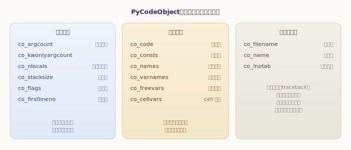
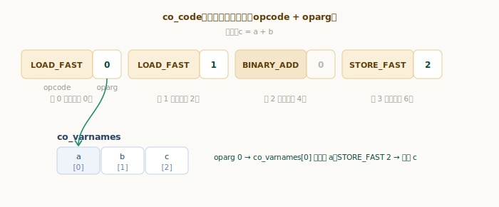
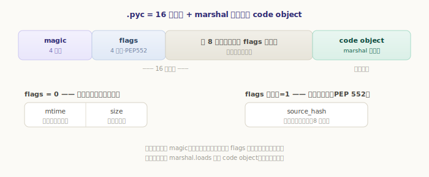

# 编译的产物：code object 与 pyc

上一章我们走完了编译管线，得到了最终产物——一个 **code object**。这一章就把它拆开看：里面的字节码、常量表、名字表分别长什么样，以及它是怎么被存成 `.pyc` 文件、下次导入时直接复用的。

`compile()`、函数的 `__code__`、模块的顶层代码，拿到的都是 code object（C 层的 `PyCodeObject`）。它本质上是**一个把「这段代码运行所需的一切」打包在一起的对象**。

## code object 的字段

先看它的结构。字段不少，但按用途分成三组就清晰了：

`源文件：`[Include/code.h](https://github.com/python/cpython/blob/v3.7.0/Include/code.h#L21)

```c
// Include/code.h —— PyCodeObject（节选）
typedef struct {
    PyObject_HEAD
    int co_argcount;        // 位置参数个数
    int co_nlocals;         // 局部变量个数
    int co_stacksize;       // 求值栈最大深度
    int co_flags;           // 标志位（CO_OPTIMIZED 等）
    int co_firstlineno;     // 起始行号
    PyObject *co_code;      // 字节码（bytes）
    PyObject *co_consts;    // 常量表（tuple）
    PyObject *co_names;     // 全局名/属性名表（tuple）
    PyObject *co_varnames;  // 局部变量名表（tuple）
    PyObject *co_freevars;  // 自由变量名表
    PyObject *co_cellvars;  // cell 变量名表
    PyObject *co_filename;  // 源文件名
    PyObject *co_name;      // 对象名（函数名/模块名）
    PyObject *co_lnotab;    // 字节码偏移 ↔ 源码行号 的映射
    ......
} PyCodeObject;
```



- **基本信息**（`co_argcount`、`co_nlocals`、`co_stacksize`、`co_flags`、`co_firstlineno`）：虚拟机执行这段代码、建立栈帧、绑定参数时要用的元数据。
- **执行素材**（`co_code` 及它引用的 `co_consts`、`co_names`、`co_varnames`……）：字节码本身，以及字节码会按下标引用的几张表。下一节细看。
- **调试与标识**（`co_filename`、`co_name`、`co_lnotab`）：出错时的 traceback、调试器定位「哪一行」靠它们。

这些字段都能在 Python 层直接读到。拿一个简单函数看看：

```python
>>> def add(a, b):
...     c = a + b
...     return c
...
>>> co = add.__code__
>>> co.co_argcount
2
>>> co.co_varnames     # 局部名表：两个参数 + 一个局部变量
('a', 'b', 'c')
>>> co.co_nlocals
3
>>> co.co_consts       # 这个函数没有字面量，只有隐含的 None
(None,)
>>> co.co_name, co.co_firstlineno
('add', 2)
```

`co_varnames` 是 `('a', 'b', 'c')`——参数和局部变量都在里面，**顺序就是它们的编号**。这个编号，正是字节码用来指代它们的下标。

## 字节码：每条指令两字节

`co_code` 是一段 `bytes`，也就是真正的**字节码**。从 Python 3.6 起，字节码采用 **wordcode** 格式：**每条指令固定两字节——前一字节是操作码 `opcode`（干什么），后一字节是参数 `oparg`（对谁干）**。

把上面 `add` 函数体反汇编出来（用标准库 `dis`），就能看到这些指令。下面是它在 **3.7** 下的字节码：

```
  3           0 LOAD_FAST                0 (a)
              2 LOAD_FAST                1 (b)
              4 BINARY_ADD
              6 STORE_FAST               2 (c)

  4           8 LOAD_FAST                2 (c)
             10 RETURN_VALUE
```

> 不同 Python 版本的字节码指令会有出入（3.8+ 还会多出一些指令），这里展示的是 3.7 的形式，用来说明结构即可。

每行从左到右是：源码行号、字节码偏移、操作码、参数、以及参数解析后的含义。偏移是 `0, 2, 4, 6, 8, 10`——每条指令占两字节，所以两两递增。读一遍就是这段代码的执行步骤：

- `LOAD_FAST 0`：把局部变量 0 号（`a`）压上求值栈；
- `LOAD_FAST 1`：把 1 号（`b`）压栈；
- `BINARY_ADD`：弹出栈顶两个值相加，结果压栈（它不需要参数）；
- `STORE_FAST 2`：把栈顶存进 2 号局部变量（`c`）；
- 最后把 `c` 压栈、`RETURN_VALUE` 返回。

这里的关键是：**`oparg` 通常是某张表的下标**。`LOAD_FAST 0` 的 `0` 不是数字 0，而是 `co_varnames[0]`——也就是名字 `a`。



不同指令查不同的表：取局部变量的 `LOAD_FAST` 查 `co_varnames`，取全局名的 `LOAD_GLOBAL` 查 `co_names`，取常量的 `LOAD_CONST` 查 `co_consts`。所以**字节码本身很紧凑（全是小整数下标），真正的名字和常量都集中放在那几张表里**。这些指令具体怎么在虚拟机里执行，是下一部分的主题；这里只要建立「指令 + 下标 → 表里的值」这个印象。

## lnotab：字节码与源码行号的对应

注意上面反汇编里左侧的行号（`3`、`4`）。字节码本身是线性的指令流，并不带行号；「第 6 号字节码属于源码第 3 行」这种对应关系，单独存在 `co_lnotab` 里——一张紧凑编码的「字节码偏移 ↔ 行号」映射表。

它平时不影响执行，只在**需要把字节码位置翻译回源码位置时**才用到：抛异常打印 traceback、调试器单步、`trace`/`profile` 统计行号，背后都是查这张表。所以一个 code object 不光能跑，还随身带着「我从哪行源码来」的信息。

## marshal：把 code object 序列化

code object 是个内存对象。要想把编译结果存到磁盘、下次直接用，就得把它**序列化**成字节序列——这件事由 `marshal` 模块负责。`marshal` 是 CPython 内部专用的序列化格式，能处理 code object 这种内置类型，且与具体 Python 版本绑定：

```python
>>> import marshal
>>> data = marshal.dumps(co)     # code object → bytes
>>> type(data).__name__
'bytes'
>>> co2 = marshal.loads(data)    # bytes → code object
>>> co2.co_varnames              # 还原如初
('a', 'b', 'c')
```

> `marshal` 不同于 `pickle`：它格式更底层、更快，但**不保证跨版本兼容**，也不为通用对象设计——它就是给「保存字节码」这类内部用途准备的。

`marshal.dumps(code)` 正是 `.pyc` 文件主体的来源。

## pyc 文件：编译结果的缓存

现在拼出完整的 `.pyc`。每次 `import` 一个模块，Python 都要编译它；为避免重复编译，编译结果会被缓存成 `__pycache__/xxx.cpython-37.pyc`。一个 `.pyc` 文件 = **16 字节头 + `marshal` 序列化的 code object**。

这 16 字节头的布局（3.7 起遵循 [PEP 552](https://peps.python.org/pep-0552/)），可以在 [Lib/importlib/_bootstrap_external.py](https://github.com/python/cpython/blob/v3.7.0/Lib/importlib/_bootstrap_external.py#L536) 里看到生成代码：

```python
# Lib/importlib/_bootstrap_external.py —— 按时间戳的 pyc
data = bytearray(MAGIC_NUMBER)     # 前 4 字节：magic number
data.extend(_w_long(0))            # 接 4 字节：flags（0 = 按时间戳）
data.extend(_w_long(mtime))        # 接 4 字节：源文件修改时间
data.extend(_w_long(source_size))  # 接 4 字节：源文件大小
data.extend(marshal.dumps(code))   # 其余：序列化的 code object
```



四个部分各司其职：

- **magic number**：标识编译用的 Python 版本，**每个版本都不一样**——导入时一比对就能拒收别的版本生成的 `.pyc`，避免字节码不兼容。
- **flags**：PEP 552 引入的标志位。为 `0` 是默认的「按时间戳」校验；最低位为 `1` 则是「按哈希」校验（后 8 字节改存源文件内容的哈希，适合可重现构建）。
- **mtime + size**（或 hash）：用来判断**源文件有没有改过**——若源文件的修改时间或大小和 `.pyc` 里记的对不上，就说明缓存过期，需要重新编译。

我们可以亲手把一个 `.pyc` 的头读出来看看：

```python
>>> import py_compile, struct, tempfile, os
>>> d = tempfile.mkdtemp()
>>> src = os.path.join(d, "m.py")
>>> open(src, "w").write("x = 1 + 2\n")
10
>>> pyc = py_compile.compile(src)
>>> raw = open(pyc, "rb").read(16)
>>> int.from_bytes(raw[0:2], "little")   # magic 数（本机为 3.12）
3531
>>> struct.unpack("<I", raw[4:8])[0]     # flags：0 = 按时间戳
0
>>> struct.unpack("<I", raw[12:16])[0]   # source_size：源文件 10 字节
10
```

`source_size` 正是 `"x = 1 + 2\n"` 的 10 个字节。至于 magic：本机是 3.12，所以读出 `3531`；**在 3.7.0 上这个数是 `3394`**（`MAGIC_NUMBER` 定义在同一文件里）。magic 随版本变化，恰恰是它存在的意义——保证一个 `.pyc` 只被生成它的那个 Python 版本使用。

导入一个模块时，Python 就按这套规则走：先比 magic（版本对不对），再按 flags 校验源文件有没有变；**全部通过，就直接 `marshal.loads` 还原 code object，跳过整条编译管线**；否则重新编译并刷新 `.pyc`。这就是为什么第二次 `import` 总是更快。

---

小结一下：

- **code object**（`PyCodeObject`）把「运行一段代码所需的一切」打成一个包：基本信息、执行素材（字节码 + 几张表）、调试标识；
- `co_code` 是 **wordcode** 字节码，**每条指令两字节**（opcode + oparg），`oparg` 往往是 `co_consts`/`co_names`/`co_varnames` 等表的**下标**——字节码紧凑，名字常量集中存表；
- `co_lnotab` 记录「字节码偏移 ↔ 源码行号」，供 traceback 和调试器定位；
- **`marshal`** 把 code object 序列化成字节；**`.pyc`** = 16 字节头（magic + PEP 552 标志 + mtime/size 或 hash）+ 序列化的 code object，是编译结果的缓存，靠 magic 防跨版本、靠 mtime/size 防源码变更。

到这里，第三部分「编译」就讲完了：源码经四阶段管线编译成 code object，再缓存为 `.pyc`。下一部分，我们终于要让虚拟机跑起来——看看这些字节码是**怎么被一条条执行**的。
