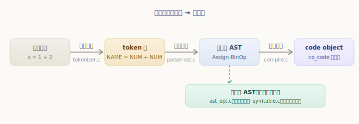
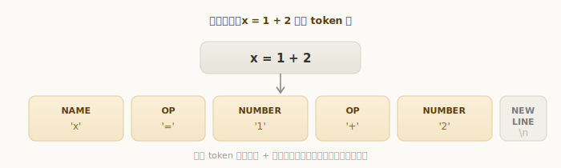
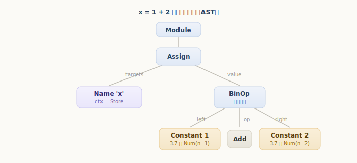
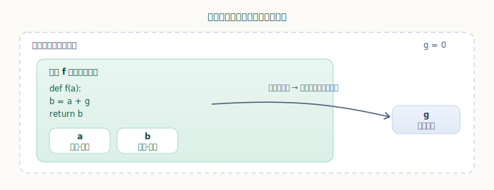

# 从源码到字节码：编译过程

第二部分我们认识了 Python 里各种「对象」。从这一部分开始，话题转向**这些对象是怎么跑起来的**——也就是 Python 虚拟机。

第一个要打破的直觉是：**Python 并不是「一行行直接解释源码」的**。它其实分成清清楚楚的两步——先把源码**编译**成一种叫「字节码」的中间指令，再由虚拟机逐条**执行**这些字节码。这一章讲前半步「编译」，后面几章讲后半步「执行」。

这件事其实你早就见过痕迹：导入一个模块后，旁边会冒出 `__pycache__/xxx.cpython-37.pyc`——那就是编译产物被缓存了下来。本章就来看：一段源码，是怎么一步步变成字节码的。

## 编译管线总览

CPython 把「源码 → 字节码」拆成几个前后衔接的阶段，每个阶段产出一种更结构化的中间形式：

1. **词法分析**：把源码字符串切成一个个 **token**（最小的词法单元）。
2. **语法分析**：把 token 流按语法规则组织成一棵**抽象语法树（AST）**。
3. **符号表分析**：扫一遍 AST，搞清楚每个名字属于哪种作用域（局部、全局、自由变量……）。
4. **代码生成**：遍历 AST、参考符号表，生成字节码，汇编成一个 **code object**。



这条管线的总入口在 `PyAST_CompileObject`，它把 AST 一路加工成 `PyCodeObject`：

`源文件：`[Python/compile.c](https://github.com/python/cpython/blob/v3.7.0/Python/compile.c#L301)

```c
// Python/compile.c —— PyAST_CompileObject（精简）
if (!_PyAST_Optimize(mod, arena, c.c_optimize)) {   // 先在 AST 层做优化（如常量折叠）
    goto finally;
}
c.c_st = PySymtable_BuildObject(mod, filename, c.c_future);   // 构建符号表
......
co = compiler_mod(&c, mod);   // 遍历 AST 生成字节码，汇编成 code object
```

下面逐个阶段拆开看。一路上我们都拿同一行最简单的代码做例子：`x = 1 + 2`。

## 词法分析：源码切成 token 流

源码在内存里只是一串字符。**词法分析（lexing）**做的第一件事，就是把这串字符按词法规则切成一个个有类型的最小单元——**token**。比如把 `x = 1 + 2` 切成「名字 `x`」「运算符 `=`」「数字 `1`」「运算符 `+`」「数字 `2`」「换行」。

这一步由 [Parser/tokenizer.c](https://github.com/python/cpython/blob/v3.7.0/Parser/tokenizer.c#L1347) 里的 `tok_get` 完成，它每被调用一次就吐出一个 token。我们可以用标准库的 `tokenize` 模块亲眼看到这个切分结果：

```python
>>> import tokenize, io
>>> src = "x = 1 + 2\n"
>>> for tok in tokenize.generate_tokens(io.StringIO(src).readline):
...     print(f"{tokenize.tok_name[tok.type]:10} {tok.string!r}")
...
NAME       'x'
OP         '='
NUMBER     '1'
OP         '+'
NUMBER     '2'
NEWLINE    '\n'
ENDMARKER  ''
```



可以看到，token 就是「**类型 + 文本**」的二元组：`x` 的类型是 `NAME`（名字），`=` 和 `+` 是 `OP`（运算符），`1`、`2` 是 `NUMBER`（数字字面量）。末尾的 `NEWLINE`、`ENDMARKER` 是表示「行结束」「文件结束」的特殊 token。词法分析此时还完全不关心这些 token 怎么组合、是否合法，它只负责「切词」。

## 语法分析：token 流组织成 AST

光有一串 token 还不够——`1 + 2` 和 `+ 1 2` 的 token 几乎一样，但只有前者合法。**语法分析（parsing）**就是按 Python 的语法规则，判断 token 流是否合法，并把它组织成一棵能表达「谁包含谁、谁先算」的树。

CPython 在 3.7 里分两小步：先由解析器（[Parser/parsetok.c](https://github.com/python/cpython/blob/v3.7.0/Parser/parsetok.c#L44)）按语法生成一棵**具体语法树（CST）**，再由 [Python/ast.c](https://github.com/python/cpython/blob/v3.7.0/Python/ast.c#L768) 的 `PyAST_FromNodeObject` 把它转成更简洁的**抽象语法树（AST）**。CST 贴着语法规则、节点很啰嗦；AST 则只保留语义上要紧的结构，是后续阶段真正使用的形式。

标准库的 `ast` 模块能把 AST 直接打印出来：

```python
>>> import ast
>>> print(ast.dump(ast.parse("x = 1 + 2")))
Module(body=[Assign(targets=[Name(id='x', ctx=Store())], value=BinOp(left=Constant(value=1), op=Add(), right=Constant(value=2)))], type_ignores=[])
```

> 上面是 Python 3.8+ 的输出形式；在 **3.7** 里，数字字面量显示为 `Num(n=1)` 而非 `Constant(value=1)`（`Constant` 是 3.8 起对 `Num`/`Str` 等的统一），也没有末尾的 `type_ignores`。树的结构是一样的。

把这串文字画成树就一目了然了：



根节点 `Module` 代表整个模块；它的 `body` 里是一条 `Assign`（赋值语句）；`Assign` 的 `targets`（赋值目标）是名字 `x`，`value`（赋的值）是一个 `BinOp`（二元运算）；`BinOp` 又拆成 `left`（左操作数 `1`）、`op`（运算符 `Add`）、`right`（右操作数 `2`）。

注意 `Name` 节点带了个 `ctx=Store()`——它标记这个 `x` 是被**写入**（赋值左边）而不是被读取。同一个名字读还是写，生成的字节码不同，这个信息从 AST 阶段就记下了。**树形结构天然表达了运算的优先级与嵌套**，这正是后续生成字节码所需要的。

## 符号表：分析名字的作用域

有了 AST，编译器还要回答一个关键问题：代码里每个名字，到底是**局部变量、全局变量，还是来自外层函数的自由变量**？这直接决定该用哪条取值指令（局部用 `LOAD_FAST`、全局用 `LOAD_GLOBAL`……，下一章会细讲）。回答这个问题的，就是**符号表（symbol table）**。

它由 [Python/symtable.c](https://github.com/python/cpython/blob/v3.7.0/Python/symtable.c#L249) 的 `PySymtable_BuildObject` 构建：再扫一遍 AST，为每个作用域记录其中出现的名字、以及每个名字的「身份」。判定规则很直白——**在本作用域里被赋值的名字就是局部的，只读不写、本地又没有的名字则到外层去找**。

标准库的 `symtable` 模块能把这套分析结果取出来：

```python
>>> import symtable
>>> code = """
... g = 0
... def f(a):
...     b = a + g
...     return b
... """
>>> top = symtable.symtable(code, "<demo>", "exec")
>>> f = top.lookup("f").get_namespace()   # 取函数 f 的作用域
>>> f.get_parameters()
('a',)
>>> for s in sorted(f.get_symbols(), key=lambda s: s.get_name()):
...     kind = "局部" if s.is_local() else ("全局" if s.is_global() else "其他")
...     print(s.get_name(), "->", kind)
...
a -> 局部
b -> 局部
g -> 全局
```



结果正合直觉：参数 `a` 和在函数里被赋值的 `b` 都是**局部**；而 `g` 在函数里只被读取、没有被赋值，于是判定为**全局**，运行时要到外层模块作用域去找。编译器拿到这张表，才能为 `a`、`b`、`g` 分别生成正确的取值指令。

## 代码生成：AST 变成 code object

最后一步，编译器遍历 AST、参考符号表，把每个节点翻译成对应的字节码指令，再**汇编**成一个 **code object**（`PyCodeObject`）。它由 [Python/compile.c](https://github.com/python/cpython/blob/v3.7.0/Python/compile.c#L1512) 的 `compiler_mod` 驱动，内部对 AST 做深度遍历：遇到 `BinOp` 就先生成「把两个操作数压栈」、再生成「相加」指令，遇到 `Assign` 就生成「把栈顶存进 `x`」……

`compile()` 这个内建函数能让我们直接拿到编译产物：

```python
>>> co = compile("x = 1 + 2", "<demo>", "exec")
>>> type(co).__name__
'code'
>>> co.co_consts      # 用到的常量
(3, None)
>>> co.co_names       # 用到的全局名字
('x',)
```

`compile()` 返回的就是一个 code object，里面 `co_code` 是字节码、`co_consts` 是常量表、`co_names` 是名字表……这些字段下一章会逐个拆解。

这里有个有意思的细节：`co_consts` 是 `(3, None)`——**源码里写的是 `1 + 2`，常量表里却直接是 `3`**。这正是开头管线图里「AST 优化」那一步干的：[Python/ast_opt.c](https://github.com/python/cpython/blob/v3.7.0/Python/ast_opt.c#L802) 的 `_PyAST_Optimize`（3.7 新增）会在编译期就把 `1 + 2` 这种**常量表达式直接折叠成结果**，省得运行时再算一遍。此外汇编完还有一道字节码层的窥孔优化（[Python/peephole.c](https://github.com/python/cpython/blob/v3.7.0/Python/peephole.c#L222)）做些指令级的清理。所以「编译」不只是翻译，还顺带做了优化。

---

小结一下这条编译管线：

- Python 是**先编译成字节码、再执行**的；本章讲的是「编译」这半步，产物是 code object；
- 编译分四个阶段：**词法分析**（源码 → token 流，`tokenizer.c`）→ **语法分析**（token → AST，`parser` + `ast.c`）→ **符号表分析**（定每个名字的作用域，`symtable.c`）→ **代码生成**（AST → 字节码，`compile.c`）；
- 每一步都能用标准库亲手观察：`tokenize` 看 token、`ast` 看语法树、`symtable` 看作用域、`compile` 看产物；
- 编译期还会做优化：AST 层的常量折叠（`ast_opt.c`）把 `1 + 2` 直接折成 `3`，字节码层再做窥孔优化（`peephole.c`）。

下一章，我们就钻进编译的产物——**code object** 的内部结构，看看字节码、常量表、名字表到底长什么样，以及它是怎么被缓存成 `.pyc` 文件的。
