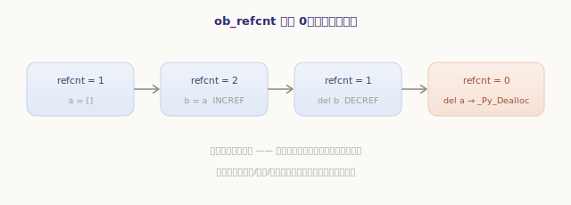
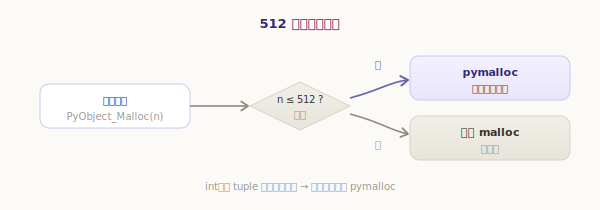
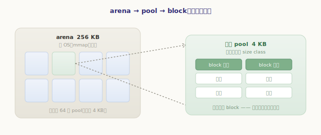
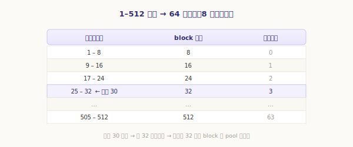
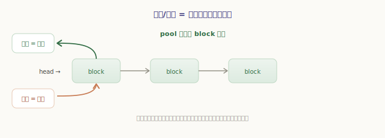
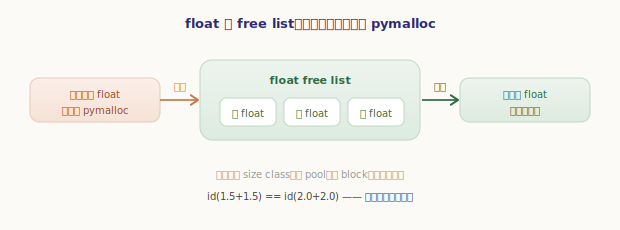

# 内存分配与引用计数（pymalloc）

前面五部分，对象一直是我们的主角——可我们从没认真问过两个最基础的问题：**这些对象的内存从哪来？又在什么时候被回收？** 这正是最后一部分「内存管理」要回答的。

这一章先讲两件事，恰好对应那两个问题：**引用计数**——对象生死的裁决者，决定一个对象**何时死**；**pymalloc**——CPython 为小对象量身定做的分配器，决定对象的内存**从哪来、有多快**。上一章我们说 GIL 之所以存在就是为了保护引用计数，现在就来看它本身。

## 引用计数：对象生死的裁决者

回到第二部分的起点：每个对象的头部都有个 `ob_refcnt`，记录「有多少处引用着我」。这个数字的增减，由两个无处不在的宏掌管：

`源文件：`[Include/object.h](https://github.com/python/cpython/blob/v3.7.0/Include/object.h#L793)

```c
// Include/object.h —— 引用计数的增与减（精简）
#define Py_INCREF(op)  (((PyObject *)(op))->ob_refcnt++)   // 多一处引用：加一

#define Py_DECREF(op)                            \
    do {                                         \
        PyObject *tmp = (PyObject *)(op);        \
        if (--tmp->ob_refcnt != 0)               \
            ;                                    \
        else                                     \
            _Py_Dealloc(tmp);   /* 计数归零 → 立即销毁 */ \
    } while (0)
```

规则朴素得近乎天真：**多一处引用就 `+1`，少一处就 `-1`；一旦减到 `0`，对象当场被销毁**（`_Py_Dealloc` 调用类型的 `tp_dealloc` 释放它）。「当场」二字是引用计数最大的特点——它是**即时、确定性**的回收：对象死在它最后一个引用消失的那一刻，不拖延、不等某个回收器来扫。



我们可以亲眼看着这个数字变动（`sys.getrefcount` 读的就是 `ob_refcnt`）：

```python
>>> import sys
>>> a = []                  # 新对象，一处引用
>>> sys.getrefcount(a)      # 显示 2 = 1（a）+ 1（getrefcount 的参数也算一处）
2
>>> b = a                   # 又一处引用
>>> sys.getrefcount(a)
3
>>> del b                   # 少一处
>>> sys.getrefcount(a)
2
```

> `getrefcount` 的结果总比你以为的多 1——因为把对象作为参数传进去时，参数本身也构成一处临时引用。

引用计数的优点很迷人：**回收及时**（内存不囤积）、**行为确定**（`del` 或离开作用域，对象立即清理，析构时机可预测）、实现也直观。代价是：**每一次赋值、传参、返回都要改计数**，频繁而细碎；而且——它有一个根本性的盲区：**循环引用**。两个对象互相引用，计数永远不为 0，谁也回收不了。这个洞要靠下一章的「循环垃圾回收」来补，本章先按下不表。

## 内存的分层：为什么不直接用 malloc

裁决了「何时死」，再看「内存从哪来」。最朴素的办法是：要对象就 `malloc`、销毁就 `free`。但 Python 程序的特点是**疯狂地创建、销毁大量小对象**——一个循环里造几百万个小整数、小元组是家常便饭。直接用系统 `malloc`/`free` 会有两个问题:**慢**（每次都可能陷入系统调用、走通用分配器的复杂逻辑）和**碎片**（大量小块把堆搞得千疮百孔）。

CPython 的对策是**分层**——在系统 `malloc` 之上叠几层缓存，让绝大多数小对象的分配走快速路径：


从下往上：

- **第 0 层：系统 `malloc`** —— 兜底。大块内存、以及 pymalloc 自己要的大块，都向它要。
- **第 1 层：pymalloc** —— 小对象（≤512 字节）的专用分配器，本章主角。
- **第 2 层：对象级 free list** —— 某些高频类型（`float`、`tuple`、`frame`……）自带的缓存，连 pymalloc 都不必惊动。

下面从中间这层 pymalloc 说起。

## pymalloc：小对象的专用分配器

pymalloc 的分工很清晰，由一个阈值划界：

`源文件：`[Objects/obmalloc.c](https://github.com/python/cpython/blob/v3.7.0/Objects/obmalloc.c#L795)

```c
// Objects/obmalloc.c
#define SMALL_REQUEST_THRESHOLD 512   // 小于等于 512 字节才归 pymalloc 管
```

**请求 ≤ 512 字节，走 pymalloc；大于 512 字节，直接转交系统 `malloc`。** 因为 Python 里绝大多数对象都很小（一个 `int`、一个小 `tuple` 都在百字节内），所以这条快路径覆盖了实际中的大部分分配：



那 pymalloc 凭什么比直接 `malloc` 快？秘密在它的三层内存结构。

## arena / pool / block：三层内存结构

pymalloc 不会零敲碎打地向系统要内存，而是**一次要一大块，再自己切**。这一大块到一个对象的距离，分三级：

`源文件：`[Objects/obmalloc.c](https://github.com/python/cpython/blob/v3.7.0/Objects/obmalloc.c#L833)

```c
// Objects/obmalloc.c
#define ARENA_SIZE  (256 << 10)        // arena：256 KB，向操作系统申请的大块
#define POOL_SIZE   SYSTEM_PAGE_SIZE   // pool：一个内存页，通常 4 KB
```

- **arena（竞技场，256 KB）**：pymalloc 向操作系统（`mmap`）批发的大块内存。要内存时一次拿 256KB，摊薄了系统调用的成本。
- **pool（池，4 KB）**：一个 arena 切成约 64 个 pool，每个 pool 占一个内存页。**一个 pool 只服务一种「大小规格」**。
- **block（块）**：一个 pool 再切成许多等大的 block——这才是**真正交到对象手里的分配单元**。



「一个 pool 只服务一种大小」是关键设计。pymalloc 把 1～512 字节的请求按 **8 字节对齐**归入 **64 个大小规格（size class）**：1~8 字节的请求都给 8 字节的 block、9~16 字节的都给 16 字节的 block……以此类推：

`源文件：`[Objects/obmalloc.c](https://github.com/python/cpython/blob/v3.7.0/Objects/obmalloc.c#L716)

```
// Objects/obmalloc.c —— size class 对照表（节选）
请求字节数        分配的 block 大小       size class 序号
   1- 8                  8                    0
   9-16                 16                    1
  17-24                 24                    2
   ...                 ...                  ...
 505-512                512                   63
```



申请 30 字节，pymalloc 把它归到「32 字节」这一规格（序号 3），从一个专门切成 32 字节 block 的 pool 里取一块给你。同一规格的对象，永远从同规格的 pool 里分配。

## 为什么快：分配/释放只是链表的一推一拉

三层结构带来的好处，在「分配」和「释放」时立刻兑现。每个 pool 内部维护一条**空闲 block 链表**：

- **分配一个 block**：从对应规格 pool 的空闲链表头**取下**一块——几个指针操作，**不碰系统调用**；
- **释放一个 block**：把它**塞回**空闲链表头——同样几个指针操作，内存不还给系统，留着下次同规格的请求复用。



于是「造一个小对象、又销毁」这种最高频的操作，退化成了**链表的一推一拉**，快得很。而且同规格对象共用 pool，碎片被牢牢限制在「规格内」，不会蔓延。这正是 pymalloc 为「海量小对象」场景优化的精髓。

> 当一个 pool 里的 block 全部释放，pool 可被改作其他规格；当一个 arena 里所有 pool 都空了，这 256KB 才可能被还给操作系统。所以 Python 进程的内存有时「居高不下」，是因为内存被留在 pymalloc 的各级空闲链表里待复用，而非泄漏。

## 再上一层：对象级 free list

还有比 pymalloc 更快的——**干脆连分配器都不惊动**。第二部分里我们多次见过：`float`、`tuple`、`list`、`frame` 等高频类型，各自维护一个**对象级 free list**。一个 `float` 被销毁时，它的内存块不还给 pymalloc，而是挂进 float 专属的 free list；下次要新 `float`，直接从这条链表上摘一个来用：



```python
>>> id(1.5 + 1.5)        # 造一个临时 float，用完即弃
4302590512
>>> id(2.0 + 2.0)        # 新 float 很可能复用了刚才那块内存
4302590512               # 同一地址——它来自 float 的 free list
```

这层缓存绕过了「算 size class、找 pool、取 block」的全部步骤，连同类型对象的初始化都省了一半。代价是每个类型要自己实现和维护这份缓存——只有最高频的类型才值得。

## 串起来：一个小对象的内存之旅

把这一章串成一条线，新建一个小对象（比如 `x = 3.5`）的内存从哪来：

1. **先问对象级 free list**：float 的 free list 里有现成的吗？有就直接拿（最快）；
2. **再问 pymalloc**：没有就向 pymalloc 要内存。对象很小（≤512 字节），按 size class 找到对应 pool，从空闲链表摘一个 block；
3. **pool 也没空块**：从 arena 里切一个新 pool；arena 也不够，就向系统 `mmap` 一块新的 256KB arena；
4. 对象用完，`x` 的引用消失 → `Py_DECREF` 把 `ob_refcnt` 减到 0 → `_Py_Dealloc` 销毁它 → 内存块**回到 float 的 free list 或 pool 的空闲链表**，等待下一次复用。

整条链路，绝大多数时候都停在第 1、2 步，既不碰系统调用、也不产生碎片——这就是 Python「小对象满天飞却依然轻快」的底气。

---

小结一下内存分配与引用计数：

- **引用计数**是对象生死的裁决者：`Py_INCREF`/`Py_DECREF` 增减 `ob_refcnt`，**减到 0 立即 `_Py_Dealloc` 销毁**——回收即时、行为确定；代价是每次引用变动都要改计数，且**管不了循环引用**（下一章补）；
- 直接用系统 `malloc` 应付海量小对象既**慢**又**碎**，CPython 用**分层**化解：对象级 free list → pymalloc → 系统 `malloc`；
- **pymalloc** 接管 **≤512 字节**的小请求，用 **arena（256KB）→ pool（4KB，一种规格）→ block（分配单元）** 三层结构管理内存；按 **8 字节对齐**分成 **64 个 size class**；
- 分配/释放一个 block 只是 pool 空闲链表的**一推一拉**，不碰系统调用、碎片受控——这是 pymalloc 快的根本；
- 最上层的**对象级 free list**让 `float`、`tuple` 等高频类型直接复用销毁的对象，连 pymalloc 都省了。

引用计数干净利落，却栽在**循环引用**上：`a` 引用 `b`、`b` 又引用 `a`，哪怕外界再无人引用它们，两者的计数也永远停在 1，成了回收不掉的「孤岛」。CPython 如何揪出并清除这些孤岛？最后一章，我们拆 **循环垃圾回收（分代 GC）**。
