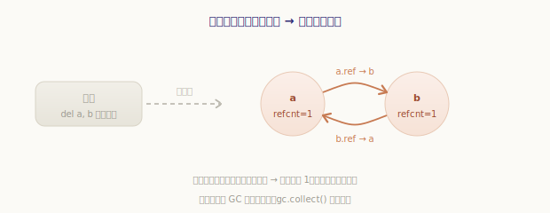
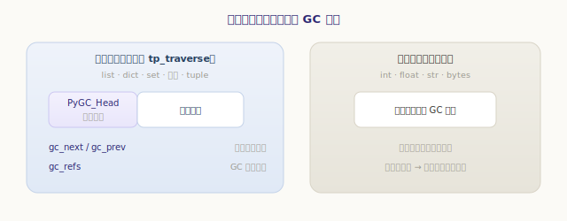
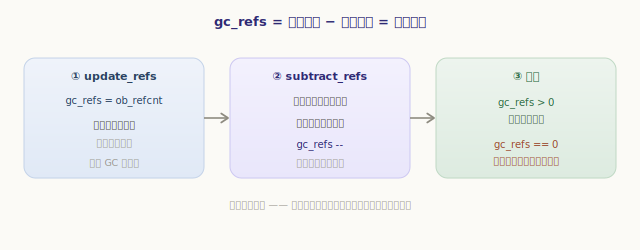
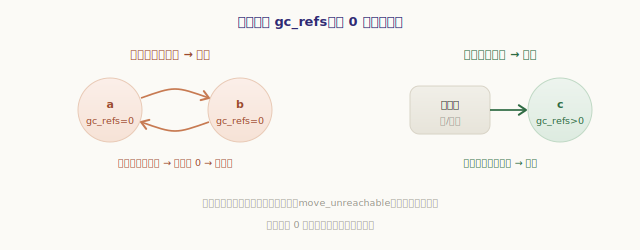
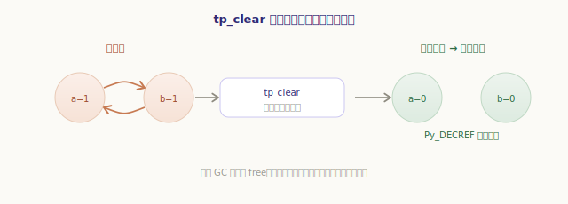
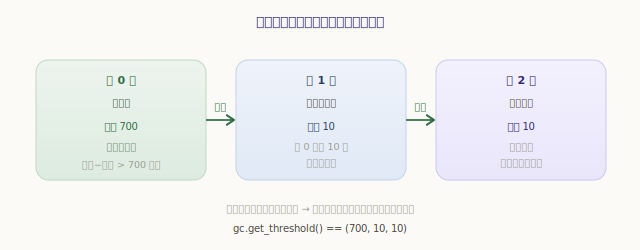

# 循环垃圾回收（分代 GC）

上一章结尾，引用计数留下了一个无解的尴尬：**循环引用**。`a` 引用 `b`、`b` 又引用 `a`，哪怕外界再无人引用它们，两者的计数也永远停在 1，成了回收不掉的「孤岛」。这一章——也是全书的最后一章——就来看 CPython 如何揪出并清除这些孤岛：**循环垃圾回收（分代 GC）**。

## 问题：引用计数管不了的孤岛

先把问题摆到眼前。造一个自我引用的循环，再切断所有外部引用，看看引用计数能不能回收它：

```python
>>> import gc, sys
>>> gc.disable()                 # 先关掉循环 GC，只剩引用计数
>>> class Node: pass
>>> a = Node(); b = Node()
>>> a.ref = b; b.ref = a         # a ↔ b 互相引用，成环
>>> del a, b                     # 切断所有外部引用
```

`del a, b` 之后，外界再也无法访问这两个对象——它们是**垃圾**。但引用计数无能为力：`a` 还被 `b.ref` 指着、`b` 还被 `a.ref` 指着，**两者的计数都是 1，永不归零**，于是永远不会被 `Py_DECREF` 回收。它们就成了内存里一座访问不到、又清不掉的孤岛：



打开 GC 手动收一次，孤岛立刻被清除——这正是循环 GC 的用武之地：

```python
>>> gc.enable()
>>> gc.collect()                 # 手动触发循环回收
2                                # 回收了 2 个不可达对象（a、b）
```

**引用计数负责绝大多数即时回收，循环 GC 专门补上「成环垃圾」这个洞**——两者是互补的搭档，而非替代。

## 只有容器才需要被追踪

循环 GC 并不盯着所有对象。能形成循环的，只有**能引用别的对象的容器**——`list`、`dict`、`set`、实例对象、`tuple` 等。而 `int`、`float`、`str` 这类「原子」对象只装数据、不引用别的对象，**根本不可能成环**，自然无需 GC 操心，它们一生只靠引用计数。

判断标准很明确：一个类型若实现了 `tp_traverse`（能「遍历自己引用了谁」），它的实例就会被 GC 追踪。被追踪的对象，内存里会在对象结构**前面**多挂一个 GC 头 `PyGC_Head`：

`源文件：`[Include/objimpl.h](https://github.com/python/cpython/blob/v3.7.0/Include/objimpl.h#L252)

```c
// Include/objimpl.h —— GC 头，挂在对象结构「前面」
typedef union _gc_head {
    struct {
        union _gc_head *gc_next;   // 把同代对象串成双向链表
        union _gc_head *gc_prev;
        Py_ssize_t gc_refs;        // GC 工作时的私有计数（下面的主角）
    } gc;
    double dummy;
} PyGC_Head;
```



这个 `gc_next`/`gc_prev` 把所有被追踪的对象串成**双向链表**（按「代」分组，见后文），GC 扫描时就沿着链表走。而那个 `gc_refs`，是接下来整个算法的核心道具。

## 核心难题：怎么判断「从外部不可达」

回收成环垃圾的关键，是判断一个对象**是否还能从「垃圾集合之外」访问到**。直觉做法是从根（全局、栈上的变量……）出发遍历，标记所有可达对象，剩下的就是垃圾——但 CPython 用了一个更巧妙、不需要枚举根的办法：**用引用计数做减法**。

思路是这样的：一个对象的 `ob_refcnt`，等于「指向它的所有引用数」。这些引用，一部分来自**垃圾候选集合内部**（比如环里其他对象指向它），一部分来自**集合外部**（真正的根）。**如果我们把「来自集合内部的引用」从计数里减掉，剩下的就是「来自外部的引用数」——它若大于 0，说明外部还够得着它，不是垃圾。**



这套减法分两步，对应两个函数。

**第一步 `update_refs`：把真实计数抄一份到 `gc_refs`。** 不能直接改 `ob_refcnt`（那会破坏正常的引用计数），于是 GC 头里的 `gc_refs` 就派上用场——把每个候选对象的 `ob_refcnt` 复制进去，作为可以随意涂改的工作副本：

`源文件：`[Modules/gcmodule.c](https://github.com/python/cpython/blob/v3.7.0/Modules/gcmodule.c#L237)

```c
// Modules/gcmodule.c —— update_refs（精简）
for (gc = containers->gc.gc_next; gc != containers; gc = gc->gc.gc_next) {
    _PyGCHead_SET_REFS(gc, Py_REFCNT(FROM_GC(gc)));   // gc_refs = 对象的真实 ob_refcnt
}
```

**第二步 `subtract_refs`：减掉所有「内部引用」。** 遍历每个候选对象，让它通过 `tp_traverse`「招出」自己引用了谁；每招出一个（也在候选集里的）对象，就把那个对象的 `gc_refs` 减一：

`源文件：`[Modules/gcmodule.c](https://github.com/python/cpython/blob/v3.7.0/Modules/gcmodule.c#L290)

```c
// Modules/gcmodule.c —— subtract_refs + visit_decref（精简）
static int visit_decref(PyObject *op, void *data) {
    if (PyObject_IS_GC(op)) {
        PyGC_Head *gc = AS_GC(op);
        if (_PyGCHead_REFS(gc) > 0)
            _PyGCHead_DECREF(gc);     // 把「被集合内部引用」的那一次减掉
    }
    return 0;
}
static void subtract_refs(PyGC_Head *containers) {
    for (gc = containers->gc.gc_next; gc != containers; gc = gc->gc.gc_next)
        Py_TYPE(FROM_GC(gc))->tp_traverse(FROM_GC(gc), visit_decref, NULL);  // 招出我引用了谁
}
```

减完之后，每个候选对象的 `gc_refs` 就等于**来自集合外部的引用数**：

- **`gc_refs > 0`**：还有外部引用够得着它——它是「根」或被根牵连，**可达，不能回收**；
- **`gc_refs == 0`**：指向它的引用**全部来自候选集合内部**——很可能是垃圾。

## 找出真正的垃圾：传播可达性

`gc_refs == 0` 只是「疑似垃圾」，还不能直接回收。因为一个本身 `gc_refs == 0` 的对象，可能被另一个**外部可达**的对象引用着——那它其实也是可达的。所以还要做一轮**可达性传播**：从所有 `gc_refs > 0` 的「确定可达」对象出发，把它们能碰到的对象也标记为可达，一层层扩散。

`源文件：`[Modules/gcmodule.c](https://github.com/python/cpython/blob/v3.7.0/Modules/gcmodule.c#L354)

```c
// Modules/gcmodule.c —— move_unreachable（精简思路）
while (gc != young) {
    if (_PyGCHead_REFS(gc)) {                 // gc_refs > 0：确定可达
        _PyGCHead_SET_REFS(gc, GC_REACHABLE);
        traverse(op, visit_reachable, young); // 把它引用到的对象也「救」回可达
    } else {                                  // 暂定不可达，先挪到 unreachable
        gc_list_move(gc, unreachable);
        _PyGCHead_SET_REFS(gc, GC_TENTATIVELY_UNREACHABLE);
    }
    gc = next;
}
```

传播结束，还留在 `unreachable` 链表里的，就是**确确实实从外部无法到达的对象**——成环垃圾。用我们开头 `a ↔ b` 的例子走一遍：两者的真实计数都是 1，且这唯一的引用都来自对方（集合内部），减完后 `gc_refs` 双双归 0；又没有任何外部可达对象引用它们，可达性传播也救不回它们——于是被准确判定为垃圾：



## 清除：tp_clear 打破环，引用计数收尾

找到了垃圾，怎么回收?直接 `free` 会有麻烦——环里对象互相引用，贸然释放一个，另一个手里的指针就悬空了。GC 的办法很巧：调用垃圾对象的 **`tp_clear`**，把它持有的引用**逐个置空**。这一置空，环就被**打破**了——内部互引一旦解除，对象们的真实 `ob_refcnt` 纷纷归零，于是**又回到引用计数的地盘，被正常 `Py_DECREF` 逐个销毁**：



所以循环 GC 并不亲自 `free` 内存，它只负责**打破环**；真正的回收，仍交还给那个干净利落的引用计数。两者的互补在这里收束得很优雅。

## 分代：大多数对象朝生暮死

还有最后一个性能问题：每次都扫描**所有**被追踪的对象，太贵了。GC 的优化基于一个经验观察——**分代假说**：绝大多数对象都「朝生暮死」，刚创建不久就被丢弃；而活得够久的对象，往往会继续活很久。

于是 CPython 把被追踪的对象分成**三代**，新对象在第 0 代，每熬过一次回收就「升一代」。各代有各自的阈值：

`源文件：`[Modules/gcmodule.c](https://github.com/python/cpython/blob/v3.7.0/Modules/gcmodule.c#L65)

```c
// Modules/gcmodule.c —— 三代与阈值（精简）
struct gc_generation generations[NUM_GENERATIONS] = {
    /*  链表头,           阈值,   计数 */
    {   ...,              700,    0 },   // 第 0 代：新对象，最常回收
    {   ...,              10,     0 },   // 第 1 代
    {   ...,              10,     0 },   // 第 2 代：老对象，最少回收
};
```



- **第 0 代**最年轻、回收最频繁：每当「分配数 − 释放数」累积超过 **700**，就触发一次第 0 代回收；
- 熬过第 0 代回收的对象**升入第 1 代**；第 0 代回收满 **10** 次，顺带回收一次第 1 代；
- 同理，第 1 代回收满 **10** 次，触发一次涵盖全部三代的「完整回收」。

这样一来，海量「朝生暮死」的新对象在廉价的第 0 代回收里就被清掉，而少数长寿对象被「请」到高代，越老越少被打扰——把 GC 的开销集中花在最可能产出垃圾的年轻对象上。这套阈值都能查看和调整：

```python
>>> import gc
>>> gc.get_threshold()           # (第0代阈值, 第1代, 第2代)
(700, 10, 10)
>>> gc.get_count()               # 当前各代的计数
(123, 4, 1)
>>> gc.collect()                 # 也可手动触发完整回收
0
```

需要时还能 `gc.disable()` 关掉自动回收（比如某些短生命周期、确定无环的批处理场景，关掉可省去扫描开销），或用 `gc.freeze()` 把当前存活对象移入「永久代」不再扫描。但对绝大多数程序，让它默默工作就好。

---

小结一下循环垃圾回收：

- 引用计数**回收不了循环引用**——成环对象计数永不归零，成为访问不到又清不掉的孤岛；循环 GC 专门补这个洞，与引用计数互补；
- 只有可能成环的**容器对象**（实现了 `tp_traverse` 的）才被 GC 追踪，每个挂一个 `PyGC_Head`；`int`/`str`/`float` 等原子对象永不被追踪；
- 判断「外部不可达」用**引用计数差值**的巧思：`update_refs` 把 `ob_refcnt` 抄进 `gc_refs`，`subtract_refs` 减掉所有内部引用，剩下的 `gc_refs` 即外部引用数——为 0 者疑似垃圾；
- 再从外部可达对象**传播可达性**（`move_unreachable`），救回被牵连者，剩下的才是真垃圾；
- 清除时调 **`tp_clear` 打破环**，对象真实计数随即归零，**交还引用计数完成回收**；
- **分代**（三代，阈值 700/10/10）基于「对象朝生暮死」的假说：年轻代回收勤、老年代回收疏，把开销花在刀刃上。

至此，最后一部分「内存管理」也讲完了——从引用计数的即时回收、pymalloc 的分层分配，到这一章的分代循环 GC，CPython 管理对象生死的全套机制就此拼齐。

回望整本书：我们从**一个对象的内存布局**起步，看它如何被**编译**成字节码，被**虚拟机**逐条执行，在**运行时**被初始化、被 import、被多线程争用，最终又如何在**内存管理**中诞生与消亡。`type`、`int`、帧、求值循环、GIL、引用计数……这些曾经神秘的名字，如今都还原成了 C 源码里一段段具体的逻辑。Python 那些「魔法」背后，从来没有魔法——只有一层层清晰、精巧、彼此咬合的工程设计。愿这趟源码之旅，让你此后写下的每一行 Python，都多一分「我知道它在底下做什么」的笃定。
