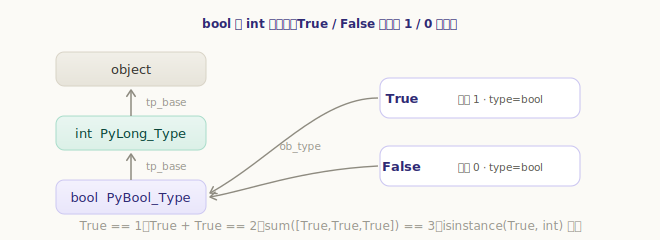
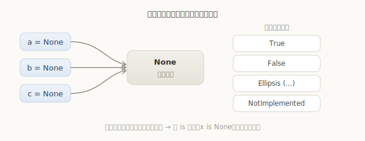
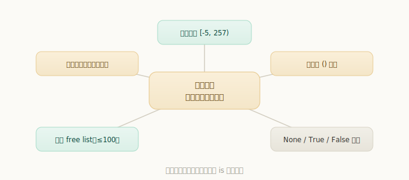

# Python 布尔与 None 对象

`True`、`False`、`None` 是我们每天都在用、却很少深究的几个值。它们有个共同点：都是**单例**——全局只有一个对象。这一章我们就来看它们的实现，并顺势把贯穿全书的「用一个对象代替无数等价对象」这个省内存手法串起来。

```python
>>> True is True, None is None
(True, True)
>>> True == 1, isinstance(True, int)
(True, True)
```

第二行也许让你意外：`True` 居然等于 `1`、还是 `int` 的实例？这正是布尔对象最有意思的地方。

## 布尔对象：是 int 的子类

在 CPython 里，`bool` 不是独立的类型，而是 `int` 的**子类**——它的类型对象 `PyBool_Type` 把 `tp_base` 指向了 `PyLong_Type`：

`源文件：`[Objects/boolobject.c](https://github.com/python/cpython/blob/v3.7.0/Objects/boolobject.c#L134)

```c
// Objects/boolobject.c
PyTypeObject PyBool_Type = {
    ......
    "bool",                                     /* tp_name */
    ......
    &PyLong_Type,                               /* tp_base */  // 父类是 int
    ......
    bool_new,                                   /* tp_new */
};
```

而 `True` 和 `False` 本身，就是两个值为 1 和 0 的**整数对象**（`struct _longobject`），只不过类型被设成了 `bool`：

`源文件：`[Objects/boolobject.c](https://github.com/python/cpython/blob/v3.7.0/Objects/boolobject.c#L177)

```c
// Objects/boolobject.c
struct _longobject _Py_FalseStruct = {
    PyVarObject_HEAD_INIT(&PyBool_Type, 0)   // 类型 bool，值 0
    { 0 }
};
struct _longobject _Py_TrueStruct = {
    PyVarObject_HEAD_INIT(&PyBool_Type, 1)   // 类型 bool，值 1
    { 1 }
};
```



所以布尔值在数值上下文里就是 1 和 0，能直接参与运算：

```python
>>> type(True), bool.__bases__
(<class 'bool'>, (<class 'int'>,))
>>> True + True, True * 3
(2, 3)
>>> sum([True, True, False, True])   # 统计 True 的个数，常用技巧
3
```

`sum([...])` 这个「数 `True` 的个数」是很常见的写法，背后正是因为 `True` 就是整数 1。

## True 与 False 是单例

布尔类型永远只有两个对象。看 `bool(x)` 的实现——它不新建对象，只返回 `Py_True` 或 `Py_False` 这两个现成的单例：

`源文件：`[Objects/boolobject.c](https://github.com/python/cpython/blob/v3.7.0/Objects/boolobject.c#L40)

```c
// Objects/boolobject.c
/* We define bool_new to always return either Py_True or Py_False */
static PyObject *
bool_new(PyTypeObject *type, PyObject *args, PyObject *kwds)
{
    ......
    return PyBool_FromLong(ok);   // 只会返回 Py_True / Py_False
}
```

```python
>>> bool(5) is True, bool(0) is False
(True, True)
>>> bool(5) is bool(42)      # 任何真值 bool() 出来都是同一个 True
True
```

正因为只有两个单例，判断真假时直接写 `if x:` 即可，不必（也不该）写 `if x == True:`。

## None 对象

`None` 是 `NoneType` 类型唯一的实例，同样是一个全局单例：

`源文件：`[Objects/object.c](https://github.com/python/cpython/blob/v3.7.0/Objects/object.c#L1607)

```c
// Objects/object.c
PyObject _Py_NoneStruct = {
    _PyObject_EXTRA_INIT
    1, &_PyNone_Type        // 引用计数 1，类型 NoneType
};
```

`Py_None` 这个宏就指向它，全局只此一个。它甚至**永远不会被销毁**——它的析构函数被设计成直接报致命错误：

`源文件：`[Objects/object.c](https://github.com/python/cpython/blob/v3.7.0/Objects/object.c#L1505)

```c
// Objects/object.c
static void
none_dealloc(PyObject* ignore)
{
    /* This should never get called ... */
    Py_FatalError("deallocating None");   // 万一 None 被销毁，直接致命错误
}
```

```python
>>> None is None
True
>>> type(None)
<class 'NoneType'>
>>> type(None)() is None     # 连 NoneType() 也只返回同一个 None
True
```

正因为 `None` 是单例，判断一个值是不是 `None`，应该用 **`is None`** 而不是 `== None`——`is` 直接比指针，又快又不会被自定义的 `__eq__` 干扰。

## 其它单例：Ellipsis 与 NotImplemented

除了 `None`，CPython 还有两个内建单例：

- **`Ellipsis`**（写作 `...`）：占位用的单例，常见于 numpy 的多维切片、类型注解等。
- **`NotImplemented`**：运算符方法（如 `__eq__`、`__add__`）在「我处理不了这种类型」时返回它，提示解释器去尝试对方的反向方法。



```python
>>> ... is Ellipsis, type(...)
(True, <class 'ellipsis'>)
>>> NotImplemented
NotImplemented
```

> 注意 `NotImplemented`（运算符回退用的单例）和 `NotImplementedError`（一个异常类）是两回事，别混用。

## 单例与缓存：一个贯穿全书的模式

把视野拉开，你会发现 `None`、`True`、`False` 只是一个更大模式的特例——CPython 反复在用同一招：**用一个对象代替无数个等价的对象**。前面各章其实都见过它：

| 机制 | 谁来代替谁 | 出处 |
|---|---|---|
| 小整数对象池 | `[-5, 257)` 内的整数共享同一对象 | 整数对象 |
| 字符串驻留 | 等值的标识符字符串共享同一对象 | 字符串对象 |
| 空元组单例 | 所有 `()` 是同一个对象 | 元组对象 |
| 浮点 free list | 复用最多 100 个已释放的浮点对象 | 浮点数对象 |
| `None` / `True` / `False` | 各自全局唯一的单例 | 本章 |



这套手法的共同好处有两个：**省内存**（不为等价的值重复分配），以及**比较更快**（同一对象可以直接用 `is` 比指针，而不必逐字段比较）。理解了这一点，再看 `a is b` 在不同对象上时而成立、时而不成立，就不会困惑了——成立与否，取决于该值有没有被「单例化/缓存」。

---

小结一下：

- `bool` 是 `int` 的**子类**，`True`/`False` 就是值为 1/0 的整数对象（类型为 `bool`），所以能参与数值运算（`sum(bools)` 数个数）；
- `True`/`False`/`None` 都是**单例**，`bool(x)`、`NoneType()` 都只返回现成的单例对象，判断时用 `if x:` 和 `is None`；
- `None` 永不销毁（`none_dealloc` 会触发致命错误）；另有 `Ellipsis`、`NotImplemented` 两个内建单例；
- 这些单例是 CPython「**用一个对象代替无数等价对象**」这一省内存模式的体现，和小整数池、字符串驻留、空元组、浮点 free list 一脉相承——既省内存，又让 `is` 比较更快。
