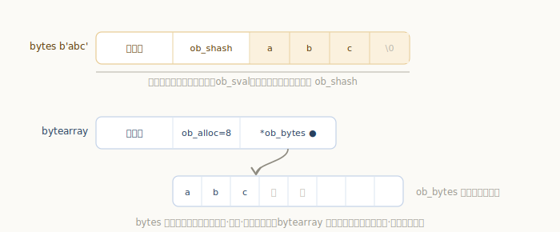
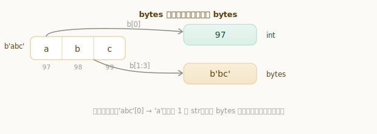
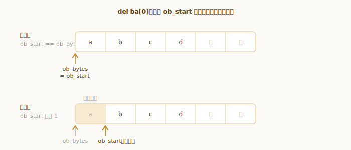

# Python bytes 与 bytearray 对象

字符串处理的是**文本**（Unicode 码点），而 `bytes` 和 `bytearray` 处理的是**原始字节**（0–255 的字节序列）——读写文件、网络收发、图片音视频、二进制协议，到了最底层都是一串字节。所以只要写真实程序，迟早会和这两个对象打交道。

它们俩的关系，正好和「字符串 / 列表」遥相呼应：一个**不可变**、一个**可变**。

```python
>>> b = b"abc"
>>> b[0]              # 注意：索引返回的是整数，不是 b'a'
97
>>> b[1:3]            # 切片才返回 bytes
b'bc'
>>> "café".encode()  # str 编码成 bytes
b'caf\xc3\xa9'
```

第二行的 `97` 是很多人第一次用 `bytes` 都会愣一下的地方——明明 `"abc"[0]` 是 `'a'`，怎么 `b"abc"[0]` 就成了数字？这一章我们就从 `PyBytesObject` 和 `PyByteArrayObject` 的结构出发，把这些行为一个个讲清楚。

## 数据结构：不可变的 bytes 与可变的 bytearray

先看不可变的 `bytes`：

`源文件：`[Include/bytesobject.h](https://github.com/python/cpython/blob/v3.7.0/Include/bytesobject.h#L31)

```c
// Include/bytesobject.h
typedef struct {
    PyObject_VAR_HEAD
    Py_hash_t ob_shash;     // 缓存的哈希值，-1 表示尚未计算
    char ob_sval[1];        // 内联的字节数组（末尾留一个 \0）
} PyBytesObject;
```

逐个字段看：

- `PyObject_VAR_HEAD` 是**变长对象**的头部，里面的 `ob_size` 记录这个 `bytes` 有多少个字节。变长，是因为不同 `bytes` 长度不同，但每个 `bytes` 一旦创建，长度就固定了。
- `ob_shash` 缓存哈希值。`bytes` 不可变，哈希算一次就不会变，于是存下来下次直接用，初始值 `-1` 表示「还没算过」。
- `ob_sval[1]` 才是真正的字节数据。声明成长度 1，是 C 里经典的「结构体尾部变长数组」技巧：实际分配内存时按真实长度多要一截，字节数据就**紧接在对象后面、和对象同属一块内存**。末尾还多留一个 `\0`，这样把它当 C 字符串用时也安全。

所以 `bytes` 的样子是：**对象头 + 哈希 + 一段内联的、连续的、不可变的字节**——和字符串 `str` 的设计如出一辙。

再看可变的 `bytearray`：

`源文件：`[Include/bytearrayobject.h](https://github.com/python/cpython/blob/v3.7.0/Include/bytearrayobject.h#L23)

```c
// Include/bytearrayobject.h
typedef struct {
    PyObject_VAR_HEAD
    Py_ssize_t ob_alloc;    // 缓冲区已分配的字节数
    char *ob_bytes;         // 指向实际字节缓冲（另一块内存）的起点
    char *ob_start;         // 逻辑上的第一个字节
    int ob_exports;         // 当前被导出为 buffer 的次数
} PyByteArrayObject;
```

和 `bytes` 最大的不同：字节数据不再内联，而是放在 `ob_bytes` 指向的**另一块**内存里。这样这块缓冲就能独立地重新分配、增大缩小，`bytearray` 因此可变、可 `append`——像极了列表。其余字段先记个印象，后面各有专门一节展开：

- `ob_alloc`：缓冲实际分配了多少字节（通常 ≥ 当前长度，多出来的是为后续追加预留的空位）。
- `ob_bytes` 和 `ob_start`：**两个**指针。`ob_bytes` 指向 malloc 出来的缓冲块起点（释放时要用它），`ob_start` 指向逻辑上的第 0 个字节。多数时候两者相等，但从头部删除字节时它们会分开——这正是高效头部删除的关键。
- `ob_exports`：这块缓冲被 `memoryview` 等「借走」了几次，借出期间不许改大小。



一句话对照：**`bytes` 像不可变的字符串（一块、内联、哈希缓存），`bytearray` 像可变的列表（独立缓冲、过分配扩容），只不过它们的元素都是字节。**

## 索引出整数，切片出 bytes

这是 `bytes`/`bytearray` 最容易让人意外的地方：**按下标取出的是整数，不是单字节的 bytes**。

```python
>>> b = b"abc"
>>> b[0]        # 整数（该字节的值，0–255）
97
>>> b[-1]       # 同样是整数
99
>>> b[1:3]      # 切片才返回 bytes
b'bc'
```

这和字符串截然不同——`"abc"[0]` 返回的是长度 1 的字符串 `'a'`。原因其实很自然：一个字节本质上就是 0–255 之间的一个数，用整数来表示最直接；而字符串的「一个字符」背后是 Unicode 码点，仍是文本，所以取出来还是 `str`。

连**遍历**也是一样，迭代 `bytes` 得到的是一串整数：

```python
>>> for x in b"AB":
...     print(x)
...
65
66
>>> list(b"AB")
[65, 66]
```

那想从一个字节拿回「单字节的 bytes」怎么办？用切片，或者用整数列表反向构造：

```python
>>> b = b"abc"
>>> b[0:1]          # 切片：长度 1 的 bytes
b'a'
>>> bytes([b[0]])   # 用整数列表构造
b'a'
```



记住这条「**索引出整数、切片出 bytes**」，解析二进制协议时就不会被类型搞晕。

## 创建 bytes 的多种方式

`bytes` 的构造函数很「多面」，传不同类型的参数含义完全不同，值得一次理清：

```python
>>> bytes(3)                  # 传整数 n：得到 n 个零字节
b'\x00\x00\x00'
>>> bytes([97, 98, 99])       # 传可迭代的整数（每个须在 0–255）：逐字节填入
b'abc'
>>> bytes("café", "utf-8")    # 传字符串 + 编码：等价于 "café".encode("utf-8")
b'caf\xc3\xa9'
>>> bytes(b"abc")             # 传另一个 bytes：拷贝一份
b'abc'
```

特别留意第一行：`bytes(3)` **不是** `b'3'`，而是三个 `\x00`。把整数当「长度」来理解——它常用来预先开一段全零的缓冲。

和十六进制的互转也很常用，二进制调试时几乎离不开：

```python
>>> bytes.fromhex("48 65 6c")   # 十六进制字符串 → bytes（空格会被忽略）
b'Hel'
>>> b"Hel".hex()                # bytes → 十六进制字符串
'48656c'
```

## 单字节与空 bytes 的缓存

和小整数池、单字符字符串一样，`bytes` 也用了「缓存小对象」的手法来省内存、省分配。看创建函数 `PyBytes_FromStringAndSize`：**长度 1 的 bytes 会被缓存复用**（256 种字节各留一个），**空 bytes 则是全局单例**：

`源文件：`[Objects/bytesobject.c](https://github.com/python/cpython/blob/v3.7.0/Objects/bytesobject.c#L101)

```c
// Objects/bytesobject.c
static PyBytesObject *characters[UCHAR_MAX + 1];   // 256 个单字节 bytes 缓存
static PyBytesObject *nullstring;                  // 空 bytes 单例

PyObject *
PyBytes_FromStringAndSize(const char *str, Py_ssize_t size)
{
    ......
    if (size == 1 && str != NULL &&
        (op = characters[*str & UCHAR_MAX]) != NULL)   // 命中单字节缓存
    {
        Py_INCREF(op);
        return (PyObject *)op;
    }
    op = (PyBytesObject *)_PyBytes_FromSize(size, 0);
    ......
    if (size == 1) {
        characters[*str & UCHAR_MAX] = op;             // 长度 1 → 存入缓存
        Py_INCREF(op);
    }
    return (PyObject *) op;
}
```

这两个缓存都是**懒加载**：单字节缓存初始全为 `NULL`，某个字节第一次被创建时才填进 `characters` 数组，以后再要同样的单字节就直接复用同一个对象。


```python
>>> bytes() is bytes()              # 空 bytes 是单例
True
>>> bytes([97]) is bytes([97])      # 单字节 bytes 被缓存复用
True
>>> bytes([97, 98]) is bytes([97, 98])   # 长度 ≥ 2 就不缓存了，是不同对象
False
```

最后一行点出了缓存的边界：**只有长度 0 和 1 的 bytes 才共享**，更长的每次都是新对象。这和小整数池「只缓存 -5~256」是同一个权衡——小对象太常见，缓存收益大；大对象种类太多，缓存不划算。

## 不可变、可哈希 vs 可变、不可哈希

`bytes` 不可变，因此**可哈希**——哈希值算一次就缓存在 `ob_shash`（初始 `-1`），下次直接返回，和字符串完全一致：

`源文件：`[Objects/bytesobject.c](https://github.com/python/cpython/blob/v3.7.0/Objects/bytesobject.c#L1644)

```c
// Objects/bytesobject.c —— bytes_hash
if (a->ob_shash != -1)
    return a->ob_shash;     // 已算过，直接返回缓存
......
a->ob_shash = x;            // 算一次，存进 ob_shash
```

所以 `bytes` 能当字典的键、集合的元素。而 `bytearray` 可变，一旦内容能变，哈希值就无从「钉死」，于是**不可哈希**：

```python
>>> b"abc"[0] = 65          # bytes 不可变，不能改单个字节
Traceback (most recent call last):
  ...
TypeError: 'bytes' object does not support item assignment
>>> isinstance(hash(b"abc"), int)   # bytes 可哈希，能算出哈希值
True
>>> hash(bytearray(b"abc")) # bytearray 不可哈希
Traceback (most recent call last):
  ...
TypeError: unhashable type: 'bytearray'
```

这正是贯穿全书的那条老规矩——**可变 ⇒ 不可哈希**（和列表、集合一样）。可变对象如果能进字典/集合，改一下内容它的哈希就变了，之前存进去的位置就再也找不到，所以语言干脆禁止。

## bytearray 的原地修改与扩容

`bytearray` 支持原地改字节、追加、删除。先看最常见的改与加：

```python
>>> ba = bytearray(b"abc")
>>> ba[0] = 65          # 原地把第 0 个字节改成 'A'（65）
>>> ba.append(33)       # 追加一个字节 '!'（33）
>>> ba
bytearray(b'Abc!')
```


追加为什么快？因为缓冲是**过分配**的——`ob_alloc` 通常比当前长度大，留了空位，多数 `append` 只是往空位里填一个字节、把长度加一，不必重新分配内存。只有空位用完了，才调用 `PyByteArray_Resize` 申请更大的缓冲。它的过分配公式和列表**完全一样**，源码注释甚至直接写明「overallocate similar to list_resize()」：

`源文件：`[Objects/bytearrayobject.c](https://github.com/python/cpython/blob/v3.7.0/Objects/bytearrayobject.c#L228)

```c
// Objects/bytearrayobject.c —— PyByteArray_Resize
if (size <= alloc * 1.125) {
    /* Moderate upsize; overallocate similar to list_resize() */
    alloc = size + (size >> 3) + (size < 9 ? 3 : 6);
}
```

`size >> 3` 就是「多留约 1/8」。正因为每次扩容都多备一些，`append` 平均下来是**摊还 O(1)**：偶尔一次扩容较贵，但被后面许多次「填空位」的廉价追加均摊掉了。这套策略我们在[《Python 列表对象》](../list-object/)里已经见过，`bytearray` 原封不动地复用了它。

## 两个指针：bytearray 为何能 O(1) 从头部删除

回到结构里那个伏笔——`bytearray` 为什么要 `ob_bytes` 和 `ob_start` **两个**指针？答案藏在「从头部删除」这个操作里。

设想 `del ba[0]`：朴素做法是把后面所有字节整体往前挪一格（`memmove`），那是 O(n)。CPython 的巧法是：**字节一个都不动，只把 `ob_start` 这个「逻辑起点」向右挪一格**。于是被跳过的那个字节成了缓冲头部的空槽，长度减一，而 `ob_bytes`（真正的 malloc 块起点）保持不变，留着将来释放内存时用。

`源文件：`[Objects/bytearrayobject.c](https://github.com/python/cpython/blob/v3.7.0/Objects/bytearrayobject.c#L463)

```c
// Objects/bytearrayobject.c —— bytearray_setslice_linear（精简）
if (lo == 0) {
    /* Shrink the buffer by advancing its logical start */
    self->ob_start -= growth;   // 从头部删除：只移动逻辑起点，数据不搬动
}
else {
    memmove(buf + lo + bytes_len, buf + hi, ...);   // 从中间删：才需要搬
}
```

（这里 `growth` 是负数，`ob_start -= growth` 即把 `ob_start` 往后移。）



```python
>>> ba = bytearray(b"abcdef")
>>> del ba[0]       # 头部删除：内部只把 ob_start 右移一格
>>> ba
bytearray(b'bcdef')
```

所以这两个指针是一种空间换时间：多记一个 `ob_start`，换来从头部反复删除（比如把 `bytearray` 当队列、不断从前面消费数据）也能高效。等到下次扩容时，`Resize` 会把残留的头部空槽一并整理掉（重新分配并从 `ob_start` 拷贝），缓冲又变回紧凑的样子。

## buffer 协议与 ob_exports：被引用时不能扩容

最后一个字段 `ob_exports` 服务于 **buffer 协议**——一种让 `memoryview`、`numpy` 等直接共享 `bytearray` 底层内存、零拷贝读写的机制。每被 `memoryview` 借走一次，`ob_exports` 加一；释放时减一。

问题来了：别人正拿着指向这块缓冲的指针，你这边却把缓冲 `realloc` 到别处去了，那别人手里就是一个悬空指针。为避免这种灾难，`bytearray` 在改大小前都会检查 `ob_exports`，一旦大于 0 就直接报错，不准 resize：

`源文件：`[Objects/bytearrayobject.c](https://github.com/python/cpython/blob/v3.7.0/Objects/bytearrayobject.c#L86)

```c
// Objects/bytearrayobject.c —— _canresize
if (self->ob_exports > 0) {
    PyErr_SetString(PyExc_BufferError,
            "Existing exports of data: object cannot be re-sized");
    return 0;
}
```

```python
>>> ba = bytearray(b"abc")
>>> mv = memoryview(ba)     # 借出缓冲，ob_exports 变为 1
>>> ba.append(100)          # 此时扩容会改变缓冲地址 → 被拒绝
Traceback (most recent call last):
  ...
BufferError: Existing exports of data: object cannot be re-sized
>>> mv.release()            # 归还，ob_exports 回到 0
>>> ba.append(100)          # 现在可以扩容了
>>> ba
bytearray(b'abcd')
```

值得一提的是：**原地改字节（不改长度）始终允许**，因为缓冲地址不变；被禁止的只是「改大小」这类可能搬动缓冲的操作。

## bytes/bytearray 与 str：文本 vs 二进制

把三者放一起对照收尾。它们都是「序列」，但分处两个世界——文本与二进制：

| 类型 | 内容 | 可变性 | `x[0]` 返回 | 可哈希 |
|---|---|---|---|---|
| `str` | 文本（Unicode 码点） | 不可变 | 长度 1 的 `str` | 是 |
| `bytes` | 二进制（字节 0–255） | 不可变 | `int` | 是 |
| `bytearray` | 二进制（字节 0–255） | 可变 | `int` | 否 |

值得一提的是，`bytes`/`bytearray` 也有一整套和 `str` 同名的方法（`split`、`strip`、`startswith`、`replace`、`find` 等），用起来手感几乎一样，只是参数和返回值都换成了字节：

```python
>>> b"a,b,c".split(b",")        # 和 str.split 一个用法，只是分隔符是 bytes
[b'a', b'b', b'c']
>>> b"  hi  ".strip()
b'hi'
```

`str` 与 `bytes` 之间靠 **`encode` / `decode`** 转换（详见[《Python 字符串对象》](../str-object/)的「编码与解码」）：

```python
>>> "café".encode("utf-8")          # str → bytes
b'caf\xc3\xa9'
>>> b"caf\xc3\xa9".decode("utf-8")  # bytes → str
'café'
```

一条实用经验：**程序内部一律用 `str` 处理文本，只在 I/O 边界（读写文件、收发网络）才转成 `bytes`**；如果需要可变的字节缓冲（比如逐步拼装一段二进制数据、或把它当字节队列从头部消费），就用 `bytearray`。

---

小结一下：

- `bytes` 像**不可变的字符串**：字节数据**内联**在对象里（`ob_sval`），是一块连续内存、哈希缓存在 `ob_shash`、可作字典键；并缓存了空串单例与 256 个单字节对象；
- `bytearray` 像**可变的列表**：`ob_bytes` 指向独立的可增长缓冲，按和列表相同的公式过分配，`append` 摊还 O(1)，但因可变而**不可哈希**；
- `bytearray` 用 `ob_bytes`/`ob_start` **两个指针**，让「从头部删除」只需移动逻辑起点、O(1) 完成；用 `ob_exports` 配合 buffer 协议，在缓冲被 `memoryview` 借出期间禁止扩容；
- 两者**索引都返回整数**（0–255），切片才返回 `bytes`/`bytearray`——这是相对字符串的关键差异；构造函数则按参数类型「多面」行事（整数当长度、可迭代逐字节填、字符串按编码转）；
- `str` 是文本、`bytes`/`bytearray` 是二进制，靠 `encode`/`decode` 在边界处转换。
