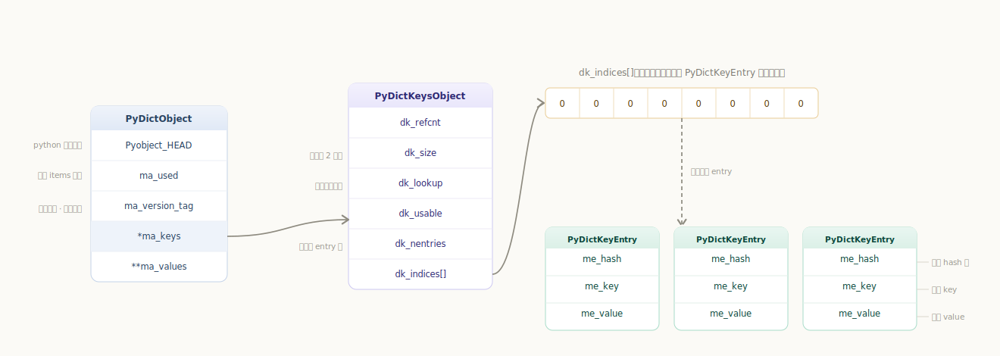
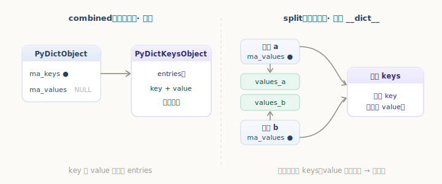
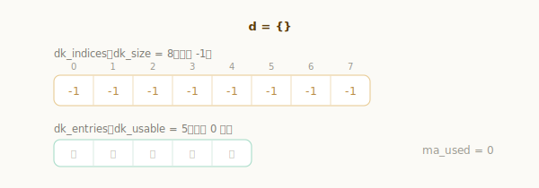
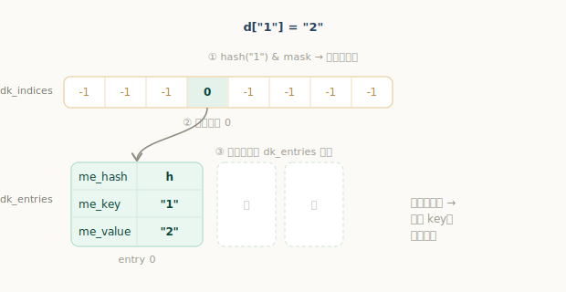
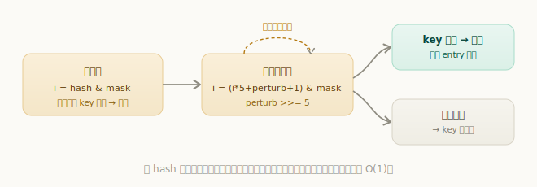

# Python 字典对象

字典是 Python 里最重要的数据结构之一——变量名查找、对象属性、关键字参数、模块命名空间……背后几乎都是字典。我们天天用它，靠的是两个让人放心的特性：

```python
>>> d = {"name": "py", "year": 1991}
>>> d["name"]        # 按 key 取值，平均 O(1)，再大也几乎不变慢
'py'
>>> list(d)          # 从 Python 3.7 起，遍历顺序 == 插入顺序
['name', 'year']
```

按 key 存取近乎常数时间，说明它底层是一张**哈希表**；而「遍历有序」这个 3.7 才正式写进语言规范的特性，则要归功于 3.6 引入的**紧凑字典（compact dict）**设计。这一章我们就来看 CPython 是怎么把这两件事一起做到的。

## 核心设计：稀疏索引 + 紧凑条目

传统哈希表会开一个很大的数组，直接把「键值对」按哈希散落在里面。空间利用率低（数组大半是空槽），而且遍历顺序由哈希决定、杂乱无章。

CPython 3.6 改用了一个巧妙的两段式结构，把「哈希定位」和「数据存储」拆开：

- **`dk_indices`**：一个稀疏的索引数组，大小为 2 的幂。它**不直接存键值对**，只存一个个小整数——指向下面 entries 数组的下标（空槽用 -1 表示）。哈希就散布在这个数组里。
- **`dk_entries`**：一个紧凑的条目数组，**按插入顺序**依次存放真正的记录（哈希、key、value）。

查找一个 key 时：先用哈希在稀疏的 `dk_indices` 里定位，拿到一个下标，再去紧凑的 `dk_entries` 里取出那条记录。

这样设计的两个好处立竿见影：

1. **省内存**：稀疏的大数组只存小整数（按规模可能只占 1 字节），而又大又重的键值记录紧凑排列、不留空洞。
2. **天然有序**：`dk_entries` 按插入顺序追加，遍历它自然就是插入顺序——这正是 dict 有序的由来。

每条记录的类型是 `PyDictKeyEntry`：

`源文件：`[Objects/dict-common.h](https://github.com/python/cpython/blob/v3.7.0/Objects/dict-common.h#L4)

```c
// Objects/dict-common.h
typedef struct {
    Py_hash_t me_hash;   // 缓存的哈希值（避免重复计算）
    PyObject *me_key;    // 键
    PyObject *me_value;  // 值（仅 combined 表用到，见下）
} PyDictKeyEntry;
```

把这套结构画出来，就是下面这张图：稀疏的 `dk_indices` 存的是「位置」，真正的键值记录在右侧紧凑的 `PyDictKeyEntry` 数组里：



## 数据结构

字典对象本体是 `PyDictObject`：

`源文件：`[Include/dictobject.h](https://github.com/python/cpython/blob/v3.7.0/Include/dictobject.h#L17)

```c
// Include/dictobject.h
typedef struct {
    PyObject_HEAD
    Py_ssize_t ma_used;            // 当前键值对个数，即 len(d)
    uint64_t ma_version_tag;       // 版本号：每次修改都变，用于优化与一致性检查
    PyDictKeysObject *ma_keys;     // 指向 keys 对象（哈希表主体）
    PyObject **ma_values;          // combined 表为 NULL；split 表时单独存放 values
} PyDictObject;
```

而哈希表的主体在 `PyDictKeysObject`：

`源文件：`[Objects/dict-common.h](https://github.com/python/cpython/blob/v3.7.0/Objects/dict-common.h#L22)

```c
// Objects/dict-common.h
struct _dictkeysobject {
    Py_ssize_t dk_refcnt;          // 引用计数（keys 可被多个实例共享）
    Py_ssize_t dk_size;            // dk_indices 的大小，必须是 2 的幂
    dict_lookup_func dk_lookup;    // 查找函数（按 key 类型特化，见下）
    Py_ssize_t dk_usable;          // 还能再放多少个 entry
    Py_ssize_t dk_nentries;        // dk_entries 中已用的条目数
    char dk_indices[];             // 稀疏索引数组；其后紧跟 dk_entries 数组
};
```

`dk_indices` 之后紧跟着 `dk_entries` 数组（用 `DK_ENTRIES()` 宏访问），两者连续分配在同一块内存里。索引槽里存的值有两个特殊含义：`DKIX_EMPTY`（-1，空槽）和 `DKIX_DUMMY`（-2，曾用过、现已删除）。

> **entry 的几种状态**：一个槽位会在这几种状态间流转——*Unused*（从未使用，索引为 EMPTY）、*Active*（存着有效键值对）、*Dummy*（键值对被删除后留下的「墓碑」，探测时不能当空槽跳过，否则会漏掉它后面发生过哈希冲突的键）、*Pending*（split 表特有，key 已就位但 value 尚未填入）。

## 两种表：combined 与 split

字典分两种实现（细节见 [PEP 412](https://www.python.org/dev/peps/pep-0412/)）：

- **combined 表（联合表）**：默认形态。`{}`、`dict()`、模块命名空间等绝大多数字典都是它。key 和 value 都存在 `ma_keys` 指向的 entries 里，`ma_values` 为 `NULL`。
- **split 表（分离表）**：专门用于实例的 `__dict__`。同一个类的所有实例属性名（keys）是一样的，于是大家**共享同一份 keys**，各自的 value 单独存到 `ma_values` 数组里，从而省下大量内存。一旦实例属性的结构发生变化（比如删 key、重新调整大小），它会退化成 combined 表以保证正确性。



下面以最常见的 combined 表为例，跟着源码走一遍「创建 → 插入 → 查找」。

## 字典的创建

从一段最简单的脚本入手，看它的字节码：

```python
d = {}
```

```text
BUILD_MAP   0     # 创建一个空字典
STORE_NAME  d
```

`BUILD_MAP` 对应的虚拟机指令最终调用 `_PyDict_NewPresized` 来创建字典：

`源文件：`[Python/ceval.c](https://github.com/python/cpython/blob/v3.7.0/Python/ceval.c#L2358) · [Objects/dictobject.c](https://github.com/python/cpython/blob/v3.7.0/Objects/dictobject.c#L1242)

```c
// Objects/dictobject.c
PyObject *
_PyDict_NewPresized(Py_ssize_t minused)
{
    ......
    Py_ssize_t newsize = PyDict_MINSIZE;       // 起始大小为 8
    while (newsize < minsize) newsize <<= 1;   // 不够则翻倍，始终保持 2 的幂
    ......
    new_keys = new_keys_object(newsize);       // 1. 创建 keys 对象（哈希表主体）
    return new_dict(new_keys, NULL);           // 2. 包装成 PyDictObject 返回
}
```

新字典的初始大小是 `PyDict_MINSIZE`，也就是 **8**。`new_keys_object` 负责申请并初始化 keys 对象——它会根据 `dk_size` 选择索引槽的字节宽度（表小就用 1 字节存索引，省内存），把索引数组全部填成 -1（空），并把查找函数 `dk_lookup` 设为针对字符串 key 优化的 `lookdict_unicode_nodummy`：

`源文件：`[Objects/dictobject.c](https://github.com/python/cpython/blob/v3.7.0/Objects/dictobject.c#L504)

```c
// Objects/dictobject.c
static PyDictKeysObject *new_keys_object(Py_ssize_t size)
{
    ......
    usable = USABLE_FRACTION(size);            // 可用条目数 = size 的 2/3
    if (size <= 0xff)        es = 1;           // 索引槽宽度随表大小而定
    else if (size <= 0xffff) es = 2;
    ......
    dk->dk_size = size;
    dk->dk_usable = usable;
    dk->dk_lookup = lookdict_unicode_nodummy;  // 默认查找函数（字符串优化版）
    dk->dk_nentries = 0;
    memset(&dk->dk_indices[0], 0xff, es * size);   // 索引数组全置 -1（空）
    ......
    return dk;
}
```

`new_dict` 则把 keys 包进一个 `PyDictObject`（同样有对象缓冲池可复用），把 `ma_used` 置 0，于是一个空字典就准备好了。这里出现的 `USABLE_FRACTION(size)` 是个关键数字——它等于 `size × 2 / 3`，意味着**哈希表最多用到 2/3 就会扩容**，留出足够空槽来降低冲突。



## 字典的插入与查找

再看赋值语句的字节码：

```python
d["1"] = "2"
```

```text
STORE_SUBSCR      # d["1"] = "2"
```

`STORE_SUBSCR` 的调用链是：`PyObject_SetItem` → 取出字典类型的 `tp_as_mapping->mp_ass_subscript`（即 `dict_ass_sub`）→ 根据有无 value 分流到删除或设置：

`源文件：`[Objects/abstract.c](https://github.com/python/cpython/blob/v3.7.0/Objects/abstract.c#L188) · [Objects/dictobject.c](https://github.com/python/cpython/blob/v3.7.0/Objects/dictobject.c#L2042)

```c
// Objects/dictobject.c
static int
dict_ass_sub(PyDictObject *mp, PyObject *v, PyObject *w)
{
    if (w == NULL)
        return PyDict_DelItem((PyObject *)mp, v);   // d[k] 被 del → 删除
    else
        return PyDict_SetItem((PyObject *)mp, v, w);// d[k] = w → 设置
}
```

`PyDict_SetItem` 先算出 key 的哈希（字符串 key 直接读缓存好的 hash，否则调用 key 类型的 `tp_hash`），再交给 `insertdict` 真正落库：

`源文件：`[Objects/dictobject.c](https://github.com/python/cpython/blob/v3.7.0/Objects/dictobject.c#L1434)

```c
// Objects/dictobject.c
int
PyDict_SetItem(PyObject *op, PyObject *key, PyObject *value)
{
    ......
    if (!PyUnicode_CheckExact(key) ||
        (hash = ((PyASCIIObject *) key)->hash) == -1)
    {
        hash = PyObject_Hash(key);          // 计算哈希：调用 key 的 tp_hash
        if (hash == -1) return -1;
    }
    return insertdict(mp, key, hash, value);
}
```

`insertdict` 是插入的核心。它先用 `dk_lookup` 查这个 key 在不在表里，再据此决定是「更新已有值」还是「占用一个新槽」：

`源文件：`[Objects/dictobject.c](https://github.com/python/cpython/blob/v3.7.0/Objects/dictobject.c#L994)

```c
// Objects/dictobject.c
static int
insertdict(PyDictObject *mp, PyObject *key, Py_hash_t hash, PyObject *value)
{
    ......
    Py_ssize_t ix = mp->ma_keys->dk_lookup(mp, key, hash, &old_value);  // 先查找
    ......
    if (ix == DKIX_EMPTY) {                  // 没找到 → 这是一个新 key
        if (mp->ma_keys->dk_usable <= 0) {   // 可用槽不足，先扩容
            if (insertion_resize(mp) < 0) goto Fail;
        }
        Py_ssize_t hashpos = find_empty_slot(mp->ma_keys, hash);  // 找一个空索引槽
        ep = &DK_ENTRIES(mp->ma_keys)[mp->ma_keys->dk_nentries];  // 在 entries 末尾追加
        dk_set_index(mp->ma_keys, hashpos, mp->ma_keys->dk_nentries); // 索引槽 → 记录下标
        ep->me_key = key;                    // 写入 key
        ep->me_hash = hash;                  // 写入哈希
        ep->me_value = value;                // 写入 value（combined 表）
        mp->ma_used++;
        mp->ma_keys->dk_usable--;
        mp->ma_keys->dk_nentries++;          // entries 又多了一条
        return 0;
    }
    ......                                    // 找到了 → 更新旧 value
    DK_ENTRIES(mp->ma_keys)[ix].me_value = value;
    ......
}
```

注意新 key 的写入方式，正好印证了前面的设计：记录总是**追加到 `dk_entries` 末尾**（保持插入顺序），同时把它的下标登记进哈希定位到的那个**索引槽**。



那「按哈希定位、处理冲突」具体怎么做？看默认的查找函数 `lookdict_unicode_nodummy`：

`源文件：`[Objects/dictobject.c](https://github.com/python/cpython/blob/v3.7.0/Objects/dictobject.c#L816)

```c
// Objects/dictobject.c
static Py_ssize_t _Py_HOT_FUNCTION
lookdict_unicode_nodummy(PyDictObject *mp, PyObject *key,
                         Py_hash_t hash, PyObject **value_addr)
{
    ......
    size_t mask = DK_MASK(mp->ma_keys);
    size_t perturb = (size_t)hash;
    size_t i = (size_t)hash & mask;          // 初始槽位 = hash & (size-1)

    for (;;) {
        Py_ssize_t ix = dk_get_index(mp->ma_keys, i);   // 取索引槽的值
        if (ix == DKIX_EMPTY) {              // 空槽 → 表里没有这个 key
            *value_addr = NULL;
            return DKIX_EMPTY;
        }
        PyDictKeyEntry *ep = &ep0[ix];
        if (ep->me_key == key ||             // 命中：同一对象，或哈希相同且值相等
            (ep->me_hash == hash && unicode_eq(ep->me_key, key))) {
            *value_addr = ep->me_value;
            return ix;
        }
        perturb >>= PERTURB_SHIFT;           // 没命中，按扰动探测下一个槽
        i = mask & (i*5 + perturb + 1);
    }
}
```

逻辑是经典的**开放寻址**：

1. 用 `hash & (size - 1)` 取初始槽位（因 `size` 是 2 的幂，等价于对 `size` 取模）；
2. 槽位为空 → key 不存在；槽位非空但 key 不匹配 → 发生**哈希冲突**，按 `i = (i*5 + perturb + 1) & mask` 探测下一个槽，并把 `perturb`（初值为完整哈希）逐步右移 `PERTURB_SHIFT`（=5）位混入，让探测序列既能快速跳开、又能逐渐覆盖整张表；
3. 直到命中相同的 key，或撞上空槽为止。



`PyDict_SetItem` 复用了同一套查找：找到就更新 value，没找到（撞空槽）就在那个位置安家。查找和插入共享这套寻址，这正是字典平均 O(1) 的来源。

## 动手观测紧凑字典

光看代码不够直观，我们可以改源码把哈希表的内部状态打印出来。在 `insertdict` 里加几行，打印 `dk_indices`（索引数组）和 `dk_entries`（键值记录），[重新编译](../../preface/unix-linux-build/)后操作一个字典（key 用整数，因为整数的哈希就是它自身，方便心算槽位）：

```python
>>> d = {20000: 2}
 indices : 0  -1  -1  -1  -1  -1  -1  -1          # size 8
 entries : key 20000  value 2
```

`20000 & 7 == 0`，所以 key 20000 落在 0 号索引槽，槽里存的 `0` 表示它是 entries 中的第 0 条。继续插入：

```python
>>> d[2] = 3       # 2 & 7 = 2
 indices : 0  -1  1  -1  -1  -1  -1  -1
>>> d[3] = 4       # 3 & 7 = 3
 indices : 0  -1  1  2  -1  -1  -1  -1
>>> d[5] = 6       # 5 & 7 = 5
 indices : 0  -1  1  2  -1  3  -1  -1
>>> d[7] = 8       # 7 & 7 = 7
 indices : 0  -1  1  2  -1  3  -1  4
```

可以清楚看到：**索引数组是稀疏的**（`-1` 是空槽），里面存的只是「这是第几条记录」；**记录本身则按插入顺序紧凑排在 entries 里**。当装入第 6 个键值对时（此时 size=8，可用上限 `8 × 2/3 ≈ 5`），表超过 2/3 负载，于是自动扩容：

```python
>>> d[9] = 10      # 触发扩容
 indices : 0  -1  1  2  -1  3  -1  4  -1  5  -1  -1  -1  -1  -1  -1   # size 8 → 16
 entries : 20000→2, 2→3, 3→4, 5→6, 7→8, 9→10                        # 顺序保持不变
```

`dk_size` 从 8 变成 16，索引数组随之扩大、所有 key 按新 mask 重新定位，但 **entries 里的插入顺序原封不动**。这就是字典「容量翻倍扩容」和「遍历有序」在内部的真实样子。

---

小结一下字典的实现要点：

- 字典是一张**哈希表**，平均 O(1) 存取；
- 3.6 起采用**紧凑字典**：稀疏的 `dk_indices` 只存「位置」，紧凑的 `dk_entries` 按插入顺序存「哈希 + key + value」——前者带来内存节省，后者带来**遍历有序**；
- 默认是 **combined 表**，实例 `__dict__` 用共享 keys 的 **split 表**省内存；
- 冲突用**开放寻址 + 扰动探测**解决，负载达到 **2/3** 即扩容（容量保持 2 的幂、按需翻倍）。
