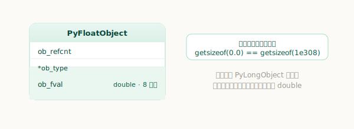
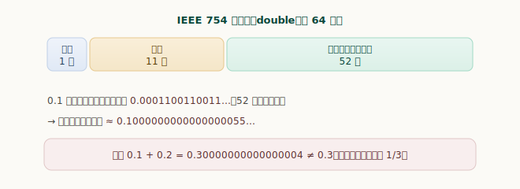
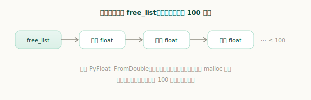
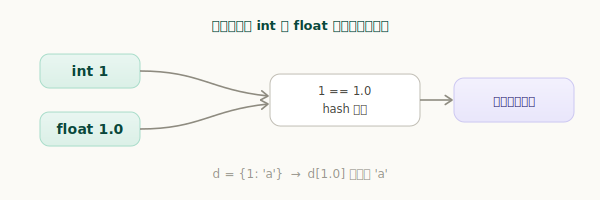

# Python 浮点数对象

浮点数大概是最容易让人「踩坑」的类型——下面这一幕几乎每个 Python 工程师都见过：

```python
>>> 0.1 + 0.2
0.30000000000000004
>>> 0.1 + 0.2 == 0.3
False
```

这不是 Python 的 bug，而是 IEEE 754 浮点数的固有特性。这一章我们就来看 `PyFloatObject` 是怎么实现的，并把「为什么不精确」讲清楚。

## 数据结构

浮点数的结构体简单到了极点：

`源文件：`[Include/floatobject.h](https://github.com/python/cpython/blob/v3.7.0/Include/floatobject.h#L15)

```c
// Include/floatobject.h
typedef struct {
    PyObject_HEAD
    double ob_fval;     // 一个 C 的 double
} PyFloatObject;
```

对象头之后只跟一个 C 的 `double`（`ob_fval`）。注意它用的是 `PyObject_HEAD` 而非 `PyObject_VAR_HEAD`——所以浮点数是**定长对象**：无论值是 `0.0` 还是 `1e308`，占用的内存都一样大。



这一点可以直接验证，也正好和整数（变长、按位段增长）形成对照：

```python
>>> import sys
>>> sys.getsizeof(0.0) == sys.getsizeof(1e308)
True
```

## IEEE 754：浮点数为什么「不精确」

那个 `double` 遵循 IEEE 754 双精度标准：64 个二进制位，分成 **1 位符号 + 11 位指数 + 52 位尾数**。它能表示极大、极小的数，但只有 **52 位尾数**来记录有效数字。

问题就出在这里：很多十进制小数，换成二进制是**无限循环小数**，52 位根本装不下。`0.1` 就是典型——它的二进制是 `0.0001100110011…` 无限循环，就像十进制写不尽 `1/3` 一样。于是计算机只能存一个**最接近的可表示值**：



`0.1` 在内存里实际存的并不是 0.1，而是一个极接近它的值。把它的「真身」打印出来看看：

```python
>>> from decimal import Decimal
>>> Decimal(0.1)
Decimal('0.1000000000000000055511151231257827021181583404541015625')
```

既然 `0.1`、`0.2` 存进去就已经有微小误差，它们相加自然不会正好等于同样有误差的 `0.3`，于是 `0.1 + 0.2` 得到 `0.30000000000000004`。

> 那为什么 `print(0.1)` 显示的是干净的 `0.1`？因为 Python 的 `repr` 会输出「能唯一还原出这个 double 的最短十进制字符串」——`0.1` 足以还原，就不必把后面那串 `…0055` 都显示出来。显示是「最短表示」，存储仍是那个带误差的二进制值。

所以涉及金额等需要精确小数的场景，应改用 `decimal.Decimal` 或整数（以「分」为单位）。

## 浮点数的创建与缓冲池

和整数、元组类似，浮点数也有**缓冲池**复用对象，避免频繁申请释放。它用一条单链表 `free_list`，最多缓存 100 个：

`源文件：`[Objects/floatobject.c](https://github.com/python/cpython/blob/v3.7.0/Objects/floatobject.c#L24)

```c
// Objects/floatobject.c
#define PyFloat_MAXFREELIST    100      // 最多缓存 100 个空闲浮点对象
static PyFloatObject *free_list = NULL; // 空闲对象单链表
```

创建浮点数走 `PyFloat_FromDouble`：链表非空就取链表头复用，否则才向系统申请：

`源文件：`[Objects/floatobject.c](https://github.com/python/cpython/blob/v3.7.0/Objects/floatobject.c#L115)

```c
// Objects/floatobject.c
PyObject *
PyFloat_FromDouble(double fval)
{
    PyFloatObject *op = free_list;
    if (op != NULL) {
        free_list = (PyFloatObject *) Py_TYPE(op);   // 取链表头复用（链表穿过 ob_type 字段）
        numfree--;
    } else {
        op = (PyFloatObject*) PyObject_MALLOC(sizeof(PyFloatObject));   // 池空才新建
        ......
    }
    (void)PyObject_INIT(op, &PyFloat_Type);
    op->ob_fval = fval;     // 填入数值
    return (PyObject *) op;
}
```



浮点数销毁时则挂回链表头；只有当池里已满 100 个，才真正 `free` 掉。

## 浮点数的比较

浮点数之间的比较是直接比 `double`。有意思的是**浮点数和整数比较**——CPython 在这里特别小心，避免精度损失。看 `float_richcompare`：

`源文件：`[Objects/floatobject.c](https://github.com/python/cpython/blob/v3.7.0/Objects/floatobject.c#L348)

```c
// Objects/floatobject.c —— float_richcompare（与 int 比较的分支）
else if (PyLong_Check(w)) {
    int vsign = i == 0.0 ? 0 : i < 0.0 ? -1 : 1;
    int wsign = _PyLong_Sign(w);
    if (vsign != wsign) {
        /* 符号不同，光看符号就能定胜负，无需比较大小 */
        ......
    }
    /* 符号相同：按位数等信息精确比较，而不是粗暴地把 int 转成 double */
    nbits = _PyLong_NumBits(w);
    ......
}
```

它没有简单地「把 int 转成 double 再比」——因为一个很大的整数转成 `double` 会丢失精度，比较结果就可能出错。CPython 先比符号，再按整数的位数等信息**精确**比较。这带来一个微妙但正确的结果：

```python
>>> 2.0 ** 53 == 2 ** 53
True
>>> 2.0 ** 53 == 2 ** 53 + 1     # float 表示不了 2^53+1，但比较仍然精确
False
>>> float(2 ** 53 + 1) == 2 ** 53 + 1   # 一旦把 int 转成 float，就丢了精度
False
```

`2.0 ** 53` 这个 `double` 和整数 `2**53+1` 比较，得到正确的 `False`；而如果先 `float(2**53+1)`，它会被舍入成 `2^53`，精度就丢了。

## 浮点数的哈希

为了让「数值相等的对象哈希也相等」，CPython 精心设计了数值的哈希：**值相等的 `int` 和 `float` 哈希一致**。

```python
>>> 2.0 == 2
True
>>> hash(2.0) == hash(2)
True
```

这条规则很重要：它保证了数值相等的 `int` 与 `float` 在字典、集合里是**同一个键**。



```python
>>> d = {1: 'a'}
>>> d[1.0]          # 1 == 1.0 且哈希相同 → 命中同一项
'a'
```

（浮点数的哈希由 `_Py_HashDouble` 计算，整数与浮点数共用一套规则，使等值者哈希一致。）

## 特殊值：inf 与 nan

IEEE 754 还定义了几个特殊值：正负**无穷大** `inf` 和**非数** `nan`（Not a Number，如 `0.0/0.0` 的结果）。

```python
>>> float('inf'), float('-inf'), float('nan')
(inf, -inf, nan)
```

`nan` 有一个反直觉但符合标准的性质：**它不等于任何值，包括它自己**。

```python
>>> n = float('nan')
>>> n == n
False
```

所以判断一个浮点数是不是 `nan`，不能用 `x == x`（对 `nan` 恒为 `False`），要用 `math.isnan(x)`。这也意味着含 `nan` 的容器在做成员判断时要小心。

---

小结一下浮点数对象的要点：

- `PyFloatObject` 只在对象头后放一个 C 的 `double`，是**定长对象**（对照整数的变长），任何浮点数大小恒定；
- 它遵循 **IEEE 754 双精度**：52 位尾数装不下像 `0.1` 这样的二进制无限循环小数，只能存最接近的值，这就是 `0.1 + 0.2 != 0.3` 的根源；需要精确小数请用 `decimal`；
- 创建时有 **free list 缓冲池**（单链表，≤ 100）复用对象；
- 与整数比较时**精确处理**避免精度损失；数值相等的 `int` 与 `float` **哈希一致**，是同一个字典键；
- 特殊值 `inf`、`nan` 中，`nan` 不等于包括自身在内的任何值，判断用 `math.isnan`。
