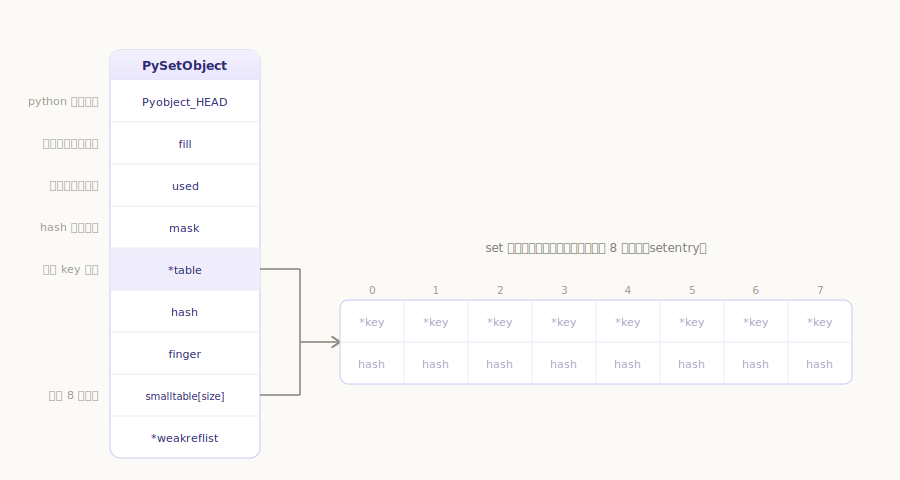
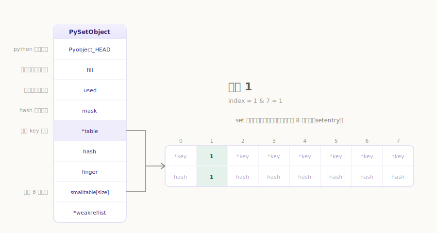
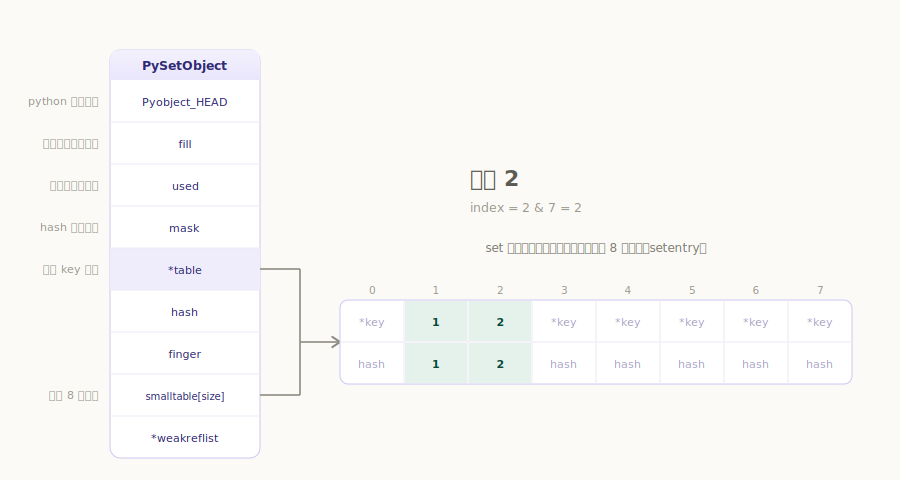
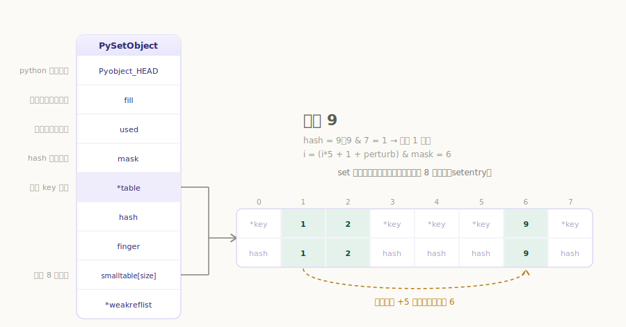
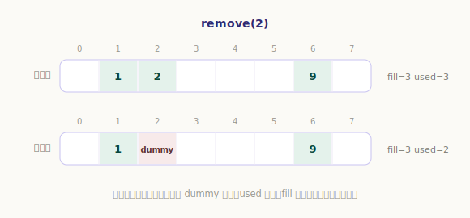
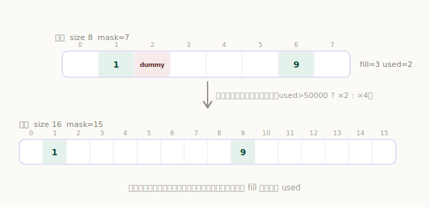

# Python 集合对象

`set` 是无序、不重复的集合。我们用它去重、做成员判断，以及交集、并集、差集这类数学运算：

```python
>>> s = {1, 2, 2, 3}     # 自动去重
>>> s
{1, 2, 3}
>>> 2 in s               # 成员判断，平均 O(1)
True
>>> {1, 2, 3} & {2, 3, 4}   # 交集
{2, 3}
```

「去重」和「O(1) 成员判断」这两件事，都指向同一个底层结构——**哈希表**。`set` 和 `dict` 是近亲：`dict` 存「键 → 值」，`set` 则只存「键」、没有值。理解了上一章的字典，这一章会轻松很多；我们重点看它和 `dict` 不一样的地方。

## 数据结构

`set` 里的每个槽位是一个 `setentry`，只存键和它的哈希：

`源文件：`[Include/setobject.h](https://github.com/python/cpython/blob/v3.7.0/Include/setobject.h#L26)

```c
// Include/setobject.h
typedef struct {
    PyObject *key;
    Py_hash_t hash;             /* Cached hash code of the key */
} setentry;
```

集合对象本体是 `PySetObject`：

`源文件：`[Include/setobject.h](https://github.com/python/cpython/blob/v3.7.0/Include/setobject.h#L42)

```c
// Include/setobject.h
typedef struct {
    PyObject_HEAD
    Py_ssize_t fill;            // 活跃 + 已删除(dummy) 的槽位总数
    Py_ssize_t used;            // 活跃槽位数，即 len(s)
    Py_ssize_t mask;            // 哈希表槽位数 - 1（槽位数是 2 的幂）
    setentry *table;            // 指向存放数据的数组
    Py_hash_t hash;             // 仅 frozenset 使用
    Py_ssize_t finger;          // pop() 的搜索游标
    setentry smalltable[PySet_MINSIZE];  // 内置的小数组，默认 8 个槽位
    PyObject *weakreflist;
} PySetObject;
```

有几个字段值得留意，它们正是 `set` 的设计特点：

- **`smalltable` 与 `table`**：小集合直接用内置的 `smalltable`（8 个槽位），`table` 指针指向它；元素变多、需要更大的表时，才另行 `malloc` 一块内存并让 `table` 改指过去。这样小集合连一次额外内存申请都省了。`table` 永远非空，省去了大量判空。
- **`mask`**：存的是「槽位数 - 1」而非槽位数。因为槽位数是 2 的幂，`hash & mask` 就等于「对槽位数取模」，用得最频繁，所以直接缓存掩码。
- **`fill` 与 `used`**：`used` 是当前真正的元素个数（`len(s)`）；`fill` 还额外算上**已删除但尚未清理的墓碑（dummy）**。为什么删除要留墓碑？下面讲删除时再说。

一个 set 的内存布局如下：



## 集合的创建

从字节码看，`{1, 2}` 这样的字面量由 `BUILD_SET` 指令创建，它调用 `PySet_New`，最终走到 `make_new_set` 完成初始化：

`源文件：`[Python/ceval.c](https://github.com/python/cpython/blob/v3.7.0/Python/ceval.c#L2318) · [Objects/setobject.c](https://github.com/python/cpython/blob/v3.7.0/Objects/setobject.c#L1052)

```c
// Objects/setobject.c
static PyObject *
make_new_set(PyTypeObject *type, PyObject *iterable)
{
    PySetObject *so = (PySetObject *)type->tp_alloc(type, 0);
    ......
    so->fill = 0;
    so->used = 0;
    so->mask = PySet_MINSIZE - 1;   // PySet_MINSIZE = 8，故 mask = 7
    so->table = so->smalltable;     // table 先指向内置的小数组
    so->hash = -1;
    ......
    if (iterable != NULL) {         // {1, 2} 的 1、2 由此逐个加入
        if (set_update_internal(so, iterable)) { ... }
    }
    return (PyObject *)so;
}
```

初始的 `mask = 7`（8 个槽位），`table` 指向内置的 `smalltable`。创建本身只是把这些字段摆好，真正的内容由后续的添加操作填入。

## 集合的插入

`s.add(x)` 走 `PySet_Add` → `set_add_key`（算出 key 的哈希）→ `set_add_entry`（真正插入）。核心在 `set_add_entry`：

`源文件：`[Objects/setobject.c](https://github.com/python/cpython/blob/v3.7.0/Objects/setobject.c#L137)

```c
// Objects/setobject.c
static int
set_add_entry(PySetObject *so, PyObject *key, Py_hash_t hash)
{
    ......
  restart:
    mask = so->mask;
    i = (size_t)hash & mask;          // 初始槽位
    entry = &so->table[i];
    if (entry->key == NULL)           // 槽位空 → 直接占用
        goto found_unused;

    perturb = hash;
    while (1) {
        if (entry->hash == hash) {    // 哈希相同，进一步比较 key 是否真的相等
            ...                       // key 相等 → found_active（已存在，什么都不做）
        }
        else if (entry->hash == -1)
            freeslot = entry;         // 记下一个可复用的墓碑位置

        // 先在邻近的 LINEAR_PROBES 个槽位里线性探测（对 CPU 缓存友好）
        if (i + LINEAR_PROBES <= mask) {
            for (j = 0 ; j < LINEAR_PROBES ; j++) {
                entry++;
                if (entry->hash == 0 && entry->key == NULL)
                    goto found_unused_or_dummy;
                if (entry->hash == hash) { ... }   // 同样比较 key
            }
        }
        // 邻近都没空位，用扰动公式跳到下一处继续找
        perturb >>= PERTURB_SHIFT;
        i = (i * 5 + 1 + perturb) & mask;
        entry = &so->table[i];
        if (entry->key == NULL)
            goto found_unused_or_dummy;
    }

  found_unused:
    so->fill++;
    so->used++;
    entry->key = key;
    entry->hash = hash;
    if ((size_t)so->fill*5 < mask*3)   // 负载未达 3/5，结束
        return 0;
    // 负载达到 3/5，扩容：元素数 > 50000 扩为 2 倍，否则 4 倍
    return set_table_resize(so, so->used>50000 ? so->used*2 : so->used*4);
  ......
}
```

插入逻辑同样是**开放寻址**，但探测策略和 `dict` 有个明显区别——它先做一段**线性探测**：

1. 用 `hash & mask` 取初始槽位，空就直接放；
2. 若发生冲突，先在**紧邻其后的 `LINEAR_PROBES`（= 9）个槽位**里顺序找空位。连续内存上的线性扫描对 CPU 缓存非常友好，多数冲突在这一步就解决了；
3. 这一小段仍没找到，才用扰动公式 `i = (i*5 + 1 + perturb) & mask` 跳到下一处，重复上面的过程，直到找到空槽或墓碑。

来看一个具体过程。设 `s` 为空，依次加入 1、2、9（槽位数 8，`mask = 7`）：

`s.add(1)`：`1 & 7 = 1`，槽位 1 为空，直接放入。



`s.add(2)`：`2 & 7 = 2`，槽位 2 为空，直接放入。



`s.add(9)`：`9 & 7 = 1`，但槽位 1 已被 1 占用——发生**哈希冲突**。这里 `i + LINEAR_PROBES = 1 + 9 > mask`，跳过线性探测，直接走扰动公式：`perturb = 9 >> 5 = 0`，`i = (1×5 + 1 + 0) & 7 = 6`，于是 9 落到槽位 6。



每成功插入一个新元素，就检查负载：当 `fill × 5 >= mask × 3`（约占满 **3/5**）时触发扩容，按当前元素数 `used` 是否超过 50000 决定扩为 **2 倍还是 4 倍**——小集合 4 倍激进扩容以减少后续冲突，大集合 2 倍稳健扩容以控制内存。

## 集合的删除

`s.remove(x)` 走 `set_remove` → `set_discard_key` → `set_discard_entry`：

`源文件：`[Objects/setobject.c](https://github.com/python/cpython/blob/v3.7.0/Objects/setobject.c#L401)

```c
// Objects/setobject.c
static int
set_discard_entry(PySetObject *so, PyObject *key, Py_hash_t hash)
{
    setentry *entry = set_lookkey(so, key, hash);   // 查找（逻辑与插入探测一致）
    ......
    if (entry->key == NULL)
        return DISCARD_NOTFOUND;                    // 没找到
    old_key = entry->key;
    entry->key = dummy;                             // 关键：标记为墓碑，而非清空
    entry->hash = -1;
    so->used--;                                     // used 减 1，fill 不变
    Py_DECREF(old_key);
    return DISCARD_FOUND;
}
```

注意删除并**不是把槽位清空**，而是把它标记成一个特殊的**墓碑 `dummy`**（同时 `used--`，但 `fill` 不变）。

为什么要留墓碑？这是开放寻址哈希表的关键细节：查找一个 key 时，要沿着探测序列一路找，**遇到真正的空槽才能断定「不存在」**。如果删除时直接把槽位清空，就会在探测链中间凿出一个「空洞」，导致原本排在它后面、因冲突才落到更远处的 key 再也找不到。用墓碑占位，探测时把它当作「此处曾有元素，继续往后找」，就保住了探测链的完整。这也是 `fill`（含墓碑）和 `used`（不含墓碑）要分开记的原因。



## 集合的扩容

墓碑会越积越多、拖慢查找，那它们什么时候清理？答案是**扩容时一并清掉**。扩容由 `set_table_resize` 完成：

`源文件：`[Objects/setobject.c](https://github.com/python/cpython/blob/v3.7.0/Objects/setobject.c#L303)

```c
// Objects/setobject.c
static int
set_table_resize(PySetObject *so, Py_ssize_t minused)
{
    ......
    size_t newsize = PySet_MINSIZE;
    while (newsize <= (size_t)minused) {
        newsize <<= 1;                 // 找到大于 minused 的最小 2 的幂
    }
    ......
    newtable = PyMem_NEW(setentry, newsize);   // 申请新表
    memset(newtable, 0, sizeof(setentry) * newsize);
    so->mask = newsize - 1;
    so->table = newtable;

    so->fill = so->used;               // 墓碑被丢弃，fill 重新等于 used
    for (entry = oldtable; entry <= oldtable + oldmask; entry++) {
        if (entry->key != NULL && entry->key != dummy) {   // 只搬运活跃元素
            set_insert_clean(newtable, newmask, entry->key, entry->hash);
        }
    }
    ......
}
```

扩容时申请一张更大的新表，然后**只把活跃的元素重新插入**，墓碑则直接丢弃——于是 `fill` 重新等于 `used`，表也「焕然一新」。重新插入用的是 `set_insert_clean`：因为新表里不可能有重复 key，它省去了所有比较，只需找空槽，所以很快：

`源文件：`[Objects/setobject.c](https://github.com/python/cpython/blob/v3.7.0/Objects/setobject.c#L268)

```c
// Objects/setobject.c
static void
set_insert_clean(setentry *table, size_t mask, PyObject *key, Py_hash_t hash)
{
    size_t perturb = hash;
    size_t i = (size_t)hash & mask;
    ......
    while (1) {
        entry = &table[i];
        if (entry->key == NULL) goto found_null;   // 只找空槽，无需比较
        if (i + LINEAR_PROBES <= mask) {           // 同样先线性探测
            for (j = 0; j < LINEAR_PROBES; j++) {
                entry++;
                if (entry->key == NULL) goto found_null;
            }
        }
        perturb >>= PERTURB_SHIFT;                 // 再用扰动公式
        i = (i * 5 + 1 + perturb) & mask;
    }
  found_null:
    entry->key = key;
    entry->hash = hash;
}
```



---

小结一下 `set` 的实现要点，以及它与 `dict` 的异同：

- `set` 同样是**哈希表**，但每个槽位 `setentry` 只有 key 和 hash、**没有 value**；
- 小集合用内置的 `smalltable`（8 槽）省内存，`mask = 槽位数 - 1` 让取模变成位运算；
- 冲突处理用**线性探测（LINEAR_PROBES = 9，缓存友好）+ 扰动探测**的组合，这是它与 `dict` 寻址方式的主要区别；
- 删除采用**墓碑 dummy** 占位以保持探测链完整，因此用 `fill`（含墓碑）和 `used`（不含）分别计数；
- 负载达 **3/5** 即扩容（元素数以 5 万为界，分别扩 2 倍 / 4 倍），扩容时只搬运活跃元素，**顺带清除所有墓碑**。
