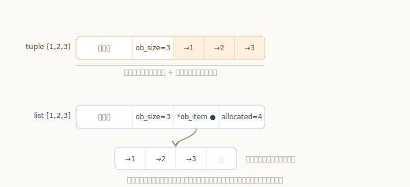
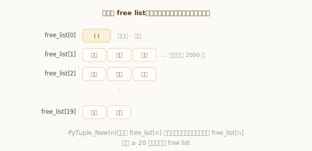
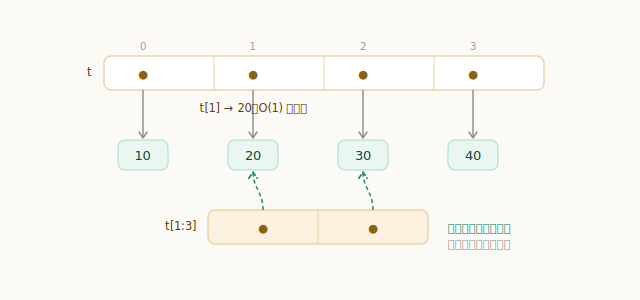
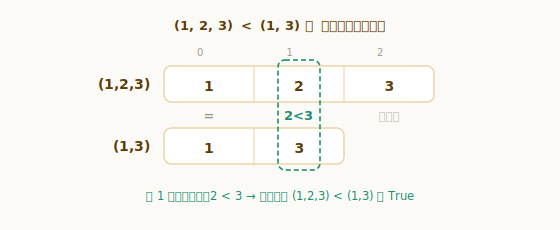
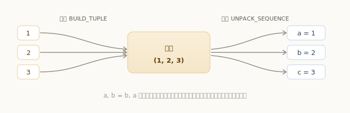
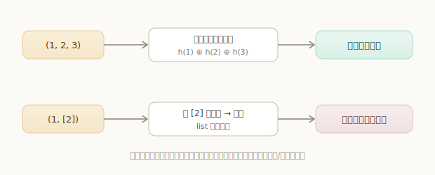

# Python 元组对象

元组和列表很像——都是按顺序存放一串元素、都能下标访问。但元组是**不可变**的：一旦创建，就不能再增删或替换里面的元素。

```python
>>> point = (3, 4)
>>> point[0]            # 下标访问，和列表一样
3
>>> def minmax(xs):     # 函数返回多个值，本质就是返回一个元组
...     return min(xs), max(xs)
...
>>> minmax([3, 1, 2])
(1, 3)
>>> {(0, 0): "原点"}    # 元组能作字典的键，列表不能
{(0, 0): '原点'}
```

「多返回值」「固定的记录」「作字典键」这些场景都在用元组。它和列表共享「序列」的外表，但「不可变」这一条，让它在内部实现上和列表走了两条不同的路。这一章我们就来看 `PyTupleObject`。

## 数据结构

`源文件：`[Include/tupleobject.h](https://github.com/python/cpython/blob/v3.7.0/Include/tupleobject.h#L25)

```c
// Include/tupleobject.h
typedef struct {
    PyObject_VAR_HEAD
    PyObject *ob_item[1];   // 存放元素指针的数组（实际长度按 ob_size 分配）
} PyTupleObject;
```

和列表一样，元组是**变长对象**（`PyObject_VAR_HEAD`，带 `ob_size`），存的也是一排指向元素的 `PyObject *` 指针——所以元组同样能装任意类型。

但请注意 `ob_item` 的写法：它不是「一个指向数组的指针」，而是**直接内联在结构体里的数组**（`ob_item[1]` 是柔性数组占位，创建时按元素个数分配足够空间）。对比一下列表——列表的 `ob_item` 是一个 `PyObject **` 指针，指向**另一块**可增长的数组，外加一个 `allocated` 记录容量。这个差别正是「可变 vs 不可变」在内存布局上的体现：



- **元组**：对象头和元素指针数组**同在一块内存**里，长度在创建时定死，没有 `allocated`、不会扩容——因为它本就不需要增删。
- **列表**：元素指针数组是独立的一块，配合 `allocated` 过分配，才能高效地 `append`。

少了一层间接、也没有为增长预留的空位，元组因此比同样内容的列表更**紧凑**：

```python
>>> import sys
>>> sys.getsizeof((1, 2, 3)) < sys.getsizeof([1, 2, 3])
True
```

## 元组的创建

创建元组的入口是 `PyTuple_New`。它和列表一样有**缓冲池**复用对象，而且做得更细——**按长度分桶**：

`源文件：`[Objects/tupleobject.c](https://github.com/python/cpython/blob/v3.7.0/Objects/tupleobject.c#L16)

```c
// Objects/tupleobject.c
#define PyTuple_MAXSAVESIZE     20    // 只缓存长度 < 20 的元组
#define PyTuple_MAXFREELIST  2000     // 每种长度最多缓存 2000 个

static PyTupleObject *free_list[PyTuple_MAXSAVESIZE];  // 按长度分桶的空闲链表
static int numfree[PyTuple_MAXSAVESIZE];
```

`PyTuple_New` 在创建时，优先从对应长度的桶里取一个复用，没有才向系统申请：

`源文件：`[Objects/tupleobject.c](https://github.com/python/cpython/blob/v3.7.0/Objects/tupleobject.c#L79)

```c
// Objects/tupleobject.c
PyObject *
PyTuple_New(Py_ssize_t size)
{
    PyTupleObject *op;
    ......
    if (size == 0 && free_list[0]) {
        op = free_list[0];
        Py_INCREF(op);
        return (PyObject *) op;          // 空元组是单例，直接复用
    }
    if (size < PyTuple_MAXSAVESIZE && (op = free_list[size]) != NULL) {
        free_list[size] = (PyTupleObject *) op->ob_item[0];   // 从该长度的桶里取一个
        numfree[size]--;
        _Py_NewReference((PyObject *)op);
    }
    else {
        op = PyObject_GC_NewVar(PyTupleObject, &PyTuple_Type, size);  // 桶空，才新申请
        ......
    }
    ......
}
```



特别地，**空元组 `()` 是一个全局单例**——无论你写多少个 `()`，拿到的都是同一个对象：

```python
>>> a = ()
>>> b = ()
>>> a is b
True
```

那我们在代码里写下的元组字面量，是怎么变成 `PyTuple_New` 调用的？看一段「打包」语句的字节码：把几个值聚成一个元组，靠的是 `BUILD_TUPLE` 指令。

```python
x = a, b      # 括号可省；把 a、b 打包成元组
```

```text
LOAD_NAME    a
LOAD_NAME    b
BUILD_TUPLE  2     # 弹出栈顶 2 个值，PyTuple_New 建元组并填入
STORE_NAME   x
```

`源文件：`[Python/ceval.c](https://github.com/python/cpython/blob/v3.7.0/Python/ceval.c#L2251)

```c
// Python/ceval.c
TARGET(BUILD_TUPLE) {
    PyObject *tup = PyTuple_New(oparg);   // 按个数新建元组
    ......
    while (--oparg >= 0) {
        PyObject *item = POP();           // 从栈上弹出各元素
        PyTuple_SET_ITEM(tup, oparg, item);
    }
    PUSH(tup);
    ......
}
```

> 一个小细节：如果元组的元素**全是常量**（如 `(1, 2, 3)`），编译器会在编译期就把整个元组折叠成一个常量，用一条 `LOAD_CONST` 直接加载，连 `BUILD_TUPLE` 都省了。只有像 `a, b` 这种含变量的元组，才会在运行时用 `BUILD_TUPLE` 现场打包。

## 元组的索引与切片

按下标取元素 `t[i]` 走 `tupleitem`，直接定位到内联数组的第 `i` 项，是 **O(1)**：

`源文件：`[Objects/tupleobject.c](https://github.com/python/cpython/blob/v3.7.0/Objects/tupleobject.c#L390)

```c
// Objects/tupleobject.c
static PyObject *
tupleitem(PyTupleObject *a, Py_ssize_t i)
{
    if (i < 0 || i >= Py_SIZE(a)) {
        PyErr_SetString(PyExc_IndexError, "tuple index out of range");
        return NULL;
    }
    Py_INCREF(a->ob_item[i]);
    return a->ob_item[i];      // 直接返回第 i 个指针
}
```

而**切片** `t[i:j]` 走 `tupleslice`——因为元组不可变，切片无法像「视图」那样共享底层，它总是**新建一个元组**，把对应区间的元素指针拷过去：

`源文件：`[Objects/tupleobject.c](https://github.com/python/cpython/blob/v3.7.0/Objects/tupleobject.c#L401)

```c
// Objects/tupleobject.c
static PyObject *
tupleslice(PyTupleObject *a, Py_ssize_t ilow, Py_ssize_t ihigh)
{
    ......
    np = (PyTupleObject *)PyTuple_New(len);   // 新建一个元组
    ......
    for (i = 0; i < len; i++) {
        PyObject *v = src[i];
        Py_INCREF(v);
        dest[i] = v;                          // 拷贝区间内的元素指针
    }
    return (PyObject *)np;
}
```

```python
>>> t = (10, 20, 30, 40)
>>> t[1]            # 索引：O(1)
20
>>> t[1:3]          # 切片：返回一个新元组
(20, 30)
```



## 元组的拼接、重复与比较

由于元组不可变，**拼接 `+` 和重复 `*` 都只能新建一个元组**——没法在原地改。拼接走 `tupleconcat`，新建一个容纳两段的元组，再把两边的元素指针依次拷入：

`源文件：`[Objects/tupleobject.c](https://github.com/python/cpython/blob/v3.7.0/Objects/tupleobject.c#L443)

```c
// Objects/tupleobject.c —— tupleconcat
np = (PyTupleObject *) PyTuple_New(size);     // 新建，长度 = 两段之和
......
// 把 a 的元素、再把 b 的元素，依次拷进 np->ob_item
```

```python
>>> (1, 2) + (3,)     # 拼接 → 新元组
(1, 2, 3)
>>> (0,) * 3          # 重复 → 新元组
(0, 0, 0)
```

**比较**走 `tuplerichcompare`，规则是**字典序**：从头逐个元素比，找到第一个不相等的位置就由它定胜负；若一路相等，则比长度。

`源文件：`[Objects/tupleobject.c](https://github.com/python/cpython/blob/v3.7.0/Objects/tupleobject.c#L631)

```c
// Objects/tupleobject.c —— tuplerichcompare
for (i = 0; i < vlen && i < wlen; i++) {
    int k = PyObject_RichCompareBool(vt->ob_item[i], wt->ob_item[i], Py_EQ);
    if (k < 0) return NULL;
    if (!k) break;                  // 找到第一个不相等的位置就停
}
if (i >= vlen || i >= wlen)         // 前缀都相等 → 比长度
    Py_RETURN_RICHCOMPARE(vlen, wlen, op);
return PyObject_RichCompare(vt->ob_item[i], wt->ob_item[i], op);  // 由第一个差异决定
```

```python
>>> (1, 2, 3) < (1, 3)     # 第 1 位 2 < 3，立即判定
True
>>> (1, 2) == (1, 2)
True
```



## 元组的打包与解包

元组最 Pythonic 的用法是**打包（packing）与解包（unpacking）**。打包前面见过了（`BUILD_TUPLE`）；解包则是反过来——把一个元组拆开，依次赋给多个变量：

```python
a, b, c = t       # 把元组 t 拆成 3 个值，分别赋给 a、b、c
```

它对应字节码 `UNPACK_SEQUENCE`：

```text
LOAD_NAME         t
UNPACK_SEQUENCE   3     # 把元组拆成 3 个值压栈
STORE_NAME        a
STORE_NAME        b
STORE_NAME        c
```

`源文件：`[Python/ceval.c](https://github.com/python/cpython/blob/v3.7.0/Python/ceval.c#L1957)

```c
// Python/ceval.c
TARGET(UNPACK_SEQUENCE) {
    PyObject *seq = POP(), *item, **items;
    if (PyTuple_CheckExact(seq) && PyTuple_GET_SIZE(seq) == oparg) {
        items = ((PyTupleObject *)seq)->ob_item;
        while (oparg--) {
            item = items[oparg];
            Py_INCREF(item);
            PUSH(item);            // 逆序压栈，从而左到右赋值
        }
    }
    ......
}
```



理解了这一点，几个常见写法就都顺理成章了：

```python
>>> a, b = 1, 2
>>> a, b = b, a            # 交换：右边先打包成临时元组，再解包给左边
>>> a, b
(2, 1)
>>> first, *rest = (1, 2, 3, 4)   # 带星号的解包（UNPACK_EX）
>>> first, rest
(1, [2, 3, 4])
```

`a, b = b, a` 这个「无需中间变量的交换」，本质就是「先把 `b, a` 打包成一个临时元组，再解包赋给 `a, b`」。

## 不可变与可哈希

元组的「不可变」体现在：不能替换、增删它的元素。

```python
>>> t = (1, 2, 3)
>>> t[0] = 9
Traceback (most recent call last):
  ...
TypeError: 'tuple' object does not support item assignment
```

不过要分清一层：元组里存的是**指针**，不可变指的是「这些指针不能改」（不能换成指向别的对象），但**指针指向的对象本身仍可能是可变的**。所以一个「装着列表的元组」，元组结构不能动，列表内容却能改。

这就引出元组最实用的特性之一——**可哈希**，从而能作字典键、集合元素。但能不能哈希，取决于它的内容。看元组的哈希函数：

`源文件：`[Objects/tupleobject.c](https://github.com/python/cpython/blob/v3.7.0/Objects/tupleobject.c#L348)

```c
// Objects/tupleobject.c
static Py_hash_t
tuplehash(PyTupleObject *v)
{
    ......
    while (--len >= 0) {
        y = PyObject_Hash(*p++);   // 逐个对元素求哈希
        if (y == -1)
            return -1;             // 任一元素不可哈希 → 整个元组不可哈希
        x = (x ^ y) * mult;        // 把各元素的哈希混合起来
        ......
    }
    ......
}
```

元组的哈希值是由**所有元素的哈希值混合**而成的。这意味着：只要其中有一个元素不可哈希（比如里面装了个列表），`PyObject_Hash` 返回 -1，整个元组就不可哈希。

```python
>>> isinstance(hash((1, 2, 3)), int)   # 元素都可哈希 → 算得出哈希值
True
>>> hash((1, [2]))                     # 里面有个列表 → 不可哈希
Traceback (most recent call last):
  ...
TypeError: unhashable type: 'list'
```



也正因为元组不可变、（内容可哈希时）可哈希，它才能胜任「字典的键」「集合的元素」这些列表干不了的活。

## 元组与列表：该用哪个

两者都是序列，取舍可以归结为一句话：**元素个数固定、不打算改动，就用元组；需要动态增删改，就用列表。**

- 倾向**元组**：固定的记录（如坐标 `(x, y)`、数据库行）、函数返回多个值、需要作字典键或集合元素、希望数据「只读」更安全。它更紧凑、有按长度复用的 free list，常量元组还会被缓存共享。
- 倾向**列表**：内容会增删、需要 `append`/`sort`/原地修改的动态集合。

---

小结一下元组对象的要点，以及它和列表的分野：

- `PyTupleObject` 是**变长对象**，但元素指针数组**内联**在对象自身里——整个元组**一块内存、长度固定**，没有 `allocated`、不会扩容；列表则是「结构体 + 独立可增长数组」两块内存，元组因此更**紧凑**；
- 创建时有**按长度分桶的 free list** 复用（长度 < 20、每桶 ≤ 2000），**空元组是全局单例**；含变量的元组靠 `BUILD_TUPLE` 打包，全常量元组则被折叠成常量；
- 不可变使**索引** O(1)，而**切片、拼接 `+`、重复 `*`** 都只能新建元组；**比较**是逐元素的字典序；
- **打包/解包**（`BUILD_TUPLE` / `UNPACK_SEQUENCE`）支撑了多返回值、`a, b = b, a` 交换、星号解包等惯用法；
- 元组的哈希由**所有元素的哈希混合**而成，**内容都可哈希时元组才可哈希**，从而能作字典键、集合元素。
