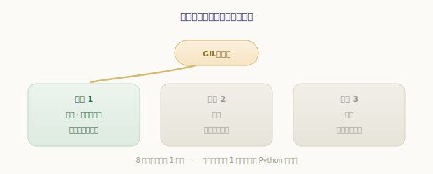
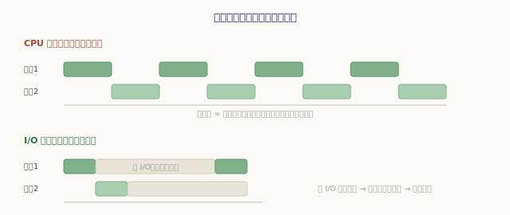
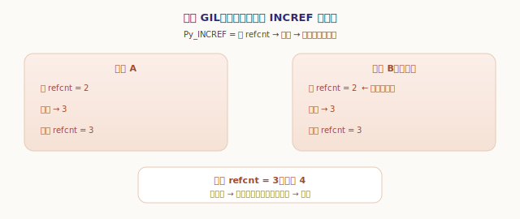
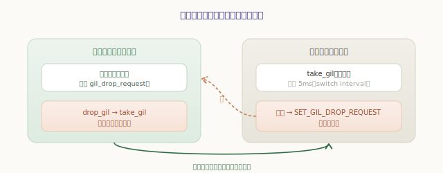
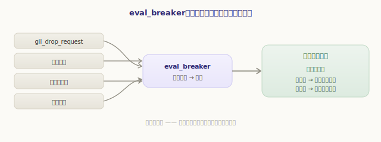
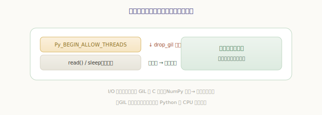
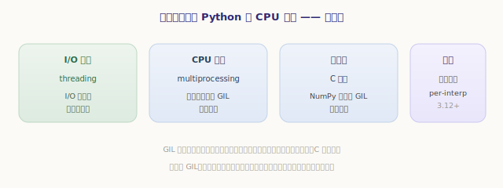

# 多线程与 GIL

`import` 让多个模块协作；而**多线程**让多段代码看似「同时」运行。但 Python 的线程有个声名远扬的脾气——那把 **GIL（Global Interpreter Lock，全局解释器锁）**。它常被骂「让多线程形同虚设」，又被赞「让 CPython 简单又快」。这一章，也是第五部分的收尾，我们就把它看个透彻：GIL **是什么、为什么存在、怎么工作、代价何在**。

## 先看现象：多线程为何不加速 CPU 密集任务

不谈原理，先看一个让很多人困惑的实验。开两个线程各跑一段纯计算，按直觉应该快一倍，结果却和单线程**几乎一样慢**：

```python
>>> import time, threading
>>> def cpu_bound():
...     x = 0
...     for _ in range(30_000_000): x += 1
...
>>> t0 = time.time(); cpu_bound(); cpu_bound(); print("顺序:", time.time()-t0)
顺序: 2.01
>>> t0 = time.time()
>>> ts = [threading.Thread(target=cpu_bound) for _ in range(2)]
>>> [t.start() for t in ts]; [t.join() for t in ts]; print("两线程:", time.time()-t0)
两线程: 2.03      # 没快！两个线程在抢同一把锁，本质还是轮流跑
```

可换成 **I/O 密集**任务（比如 `time.sleep`、网络请求），多线程又确实能重叠、能提速。这个反差正是理解 GIL 的入口：**GIL 让任意时刻只有一个线程在执行 Python 字节码，但线程在等 I/O 时会让出它**。

## GIL 是什么：一根「执行权」的接力棒

GIL 本质上就是一把**互斥锁**——准确说，是一个「锁标志 + 条件变量」的组合。它的状态记在运行时里：

`源文件：`[Include/internal/gil.h](https://github.com/python/cpython/blob/v3.7.0/Include/internal/gil.h#L19)

```c
// Include/internal/gil.h —— GIL 的运行时状态（节选）
struct _gil_runtime_state {
    unsigned long interval;       // 切换间隔，默认 5000 微秒（5ms）
    _Py_atomic_address last_holder;  // 上一个持有者（用于判断有没有发生过切换）
    _Py_atomic_int locked;        // GIL 是否已被持有
    unsigned long switch_number;  // 累计切换次数
    PyCOND_T cond;                // 等待 GIL 释放的条件变量
    PyMUTEX_T mutex;
};
```

规则只有一条，却管住了一切：**一个线程，必须先持有 GIL，才能执行字节码**。于是 GIL 就像一根**接力棒**——谁攥着它，谁才能跑求值循环；其他线程只能在一旁排队等棒。多核机器上你有 8 个线程，但因为只有一根棒，同一时刻**仍只有一个线程在真正执行 Python 代码**：



这就解释了上面的实验：两个 CPU 密集线程，本质是在抢这根棒、轮流跑，加起来的工作量没变，自然不会更快。



## 为什么需要 GIL：保护「不设防」的引用计数

一个自然的问题是：为什么要给自己套上这么一把锁？答案藏在 CPython 的内存管理里——**引用计数**（下一部分的主题）。

回想第二部分：每个对象都有个 `ob_refcnt`，增减引用时用 `Py_INCREF`/`Py_DECREF` 改它，归零就回收。问题是，**这俩操作不是原子的**：`Py_INCREF` 实质是「读出 refcnt → 加一 → 写回」三步。如果两个线程同时对一个对象 `INCREF`，可能双双读到旧值、各自加一、写回——**两次加一只生效了一次**。计数错误的后果是灾难性的：少计数会导致对象被**提前释放**（之后访问就是悬空指针、崩溃），多计数则导致**内存泄漏**。



GIL 用最简单粗暴的方式根除了这个问题：**既然任意时刻只有一个线程在跑字节码，引用计数和所有解释器内部状态就天然安全**，无需给每个对象都加锁。另一条路——给每个对象配一把锁——不仅会让单线程程序也付出沉重的加锁开销，还极易死锁。GIL 是 CPython 在「简单 + 单线程快」和「多线程并行」之间做出的取舍：**牺牲多线程并行，换来实现简单、单线程高效、C 扩展易写**。

## GIL 怎么切换：协作式的让棒

既然只有一根棒，那它是怎么在线程间传递的？这是一套**协作式**机制，由两端配合完成。

**等待端：超时就「催」。** 一个想要 GIL 的线程，在 `take_gil` 里等待持有者释放。它不会无限干等——而是定时等待 `interval`（默认 **5 毫秒**）。若超时了 GIL 仍被同一个线程攥着（期间没发生过切换），它就设置一个标志 `gil_drop_request`，相当于「**催**对方让棒」：

`源文件：`[Python/ceval_gil.h](https://github.com/python/cpython/blob/v3.7.0/Python/ceval_gil.h#L191)

```c
// Python/ceval_gil.h —— take_gil（精简）
while (gil.locked) {
    saved_switchnum = gil.switch_number;
    COND_TIMED_WAIT(gil.cond, gil.mutex, INTERVAL, timed_out);   // 最多等 5ms
    if (timed_out && gil.locked && gil.switch_number == saved_switchnum) {
        SET_GIL_DROP_REQUEST();    // 等太久了：催当前持有者让棒
    }
}
// ……抢到棒：gil.locked = 1，更新 last_holder、switch_number
```

**持有端：到检查点就让。** 正在跑的线程不会被强行打断——它在求值循环里**主动**在检查点查看「有没有谁在催我」。一旦发现 `gil_drop_request`，就老老实实让棒（`drop_gil`）、给别人机会，再重新抢回来（`take_gil`）：

`源文件：`[Python/ceval.c](https://github.com/python/cpython/blob/v3.7.0/Python/ceval.c#L967)

```c
// Python/ceval.c —— 求值循环里的让棒点（精简）
if (_Py_atomic_load_relaxed(&_PyRuntime.ceval.gil_drop_request)) {
    /* Give another thread a chance */
    PyThreadState_Swap(NULL);
    drop_gil(tstate);      // 放下棒
    /* Other threads may run now */
    take_gil(tstate);      // 重新抢棒
    PyThreadState_Swap(tstate);
}
```



合起来就是：**等待线程催（5ms 超时设标志）→ 持有线程在检查点主动让 → 别人抢到棒**。这个 5ms 就是 `sys.getswitchinterval()` 返回的「切换间隔」，可以调：

```python
>>> import sys
>>> sys.getswitchinterval()
0.005
>>> sys.setswitchinterval(0.001)   # 调成 1ms：切换更勤，但切换开销也更多
```

> 这是 3.2 起的「新 GIL」——基于**时间**（5ms）。更早的旧 GIL 是基于**字节码条数**（每跑 100 条检查一次），在某些负载下切换很不公平，遂被时间式取代。

## eval_breaker：一次廉价的检查，管住所有「待办」

这里有个值得玩味的工程细节。「让棒」要在求值循环里频繁检查，可如果每执行一条字节码都去读 `gil_drop_request`、再读有没有信号、再读有没有待处理调用……每条指令都背上一串检查，太亏了。

CPython 的办法是一个聚合标志 **`eval_breaker`**：只要**任何一件待办**发生（有人催让棒、收到信号、有待处理的回调、有异步异常），就把这一个标志置位。求值循环每轮只需做**一次廉价的原子读**——`eval_breaker` 没置位（绝大多数情况），就径直执行下一条指令；只有它置位了，才进去逐项核对到底是哪件事：

`源文件：`[Python/ceval.c](https://github.com/python/cpython/blob/v3.7.0/Python/ceval.c#L943)

```c
// Python/ceval.c —— 求值循环顶部的统一检查点（精简）
if (_Py_atomic_load_relaxed(&_PyRuntime.ceval.eval_breaker)) {   // 一次廉价原子读
    if (...pending.calls_to_do...)  Py_MakePendingCalls();      // 待处理回调
    if (...gil_drop_request...)     { drop_gil(); take_gil(); } // 让棒（上一节）
    if (tstate->async_exc != NULL)  { ...; goto error; }        // 异步异常
}
fast_next_opcode:
    ...                                                          // 取下一条指令
```



这样一来，常态下多线程的「检查成本」几乎可以忽略，只有真有事时才付出代价。这也是为什么让棒是**协作式**的：线程只在这个检查点让棒，所以一条「不可中断」的长字节码（比如某些 C 实现的内建操作）跑起来时，GIL 是不会中途易手的。

## I/O 与 C 扩展：主动放下棒

回到开头那个反差：为什么 I/O 密集任务多线程能提速？因为**线程在做阻塞操作前会主动放下 GIL**。CPython 的惯用法是一对宏 `Py_BEGIN_ALLOW_THREADS` / `Py_END_ALLOW_THREADS`——把可能阻塞的系统调用（读文件、等网络、`time.sleep`）夹在中间，进去前 `drop_gil`、出来后 `take_gil`：



```c
// 典型的阻塞 I/O 写法（示意）
Py_BEGIN_ALLOW_THREADS      // 放下 GIL —— 别的线程现在能跑了
ret = read(fd, buf, len);   // 阻塞在这儿，但没占着棒
Py_END_ALLOW_THREADS        // 重新拿回 GIL
```

于是一个线程等 I/O 时，棒被别的线程拿去跑——I/O 的等待时间被**重叠**掉了。同理，NumPy 这类 C 扩展在做大块纯计算时也会释放 GIL，让多个线程真正并行算数。**所以「GIL 让多线程没用」并不准确**：它只挡住了**纯 Python 的 CPU 密集**并行，对 I/O 密集和「会释放 GIL 的 C 扩展」毫无妨碍。

## 代价与出路

GIL 的代价很明确：**纯 Python 的 CPU 密集任务，无法靠多线程吃满多核**。绕开它的常见办法有几条：



- **I/O 密集**：放心用 `threading`，GIL 在 I/O 时会让出；
- **CPU 密集**：用 `multiprocessing` 开**多进程**——每个进程有自己的解释器和 GIL，真正并行（代价是进程间通信开销）；
- **重计算下沉到 C**：用会释放 GIL 的扩展（NumPy、加密库等）；
- **更远的方向**：3.12 起的**子解释器**与 per-interpreter GIL，正朝着「一个进程内多个互不共享 GIL 的解释器」演进——但那是后话了。

GIL 不是设计缺陷，而是一个**权衡**：它用「牺牲一种并行」换来了实现的简单、单线程的高效，以及与海量 C 扩展的轻松互操作。理不理解 GIL，往往就是「为什么我的多线程没变快」与「我该用线程还是进程」之间的分水岭。

---

小结一下多线程与 GIL：

- **GIL 是一把全局互斥锁**（`locked` 标志 + 条件变量），线程**必须持有它才能执行字节码**——像一根执行权接力棒，任意时刻只有一个线程在跑 Python 代码；
- 它存在的根本原因是**保护非原子的引用计数**（及所有解释器内部状态）：没有 GIL，并发的 `Py_INCREF`/`Py_DECREF` 会算错计数，导致提前释放或泄漏；
- 切换是**协作式**的：等待线程在 `take_gil` 里超时（默认 **5ms**）后设 `gil_drop_request`，持有线程在求值循环的检查点主动 `drop_gil` 让棒、再 `take_gil` 抢回；
- **`eval_breaker`** 把「让棒、信号、待处理调用、异步异常」聚合成一个标志，让求值循环每轮只做一次廉价原子读——常态零负担；
- 线程在**阻塞 I/O**和**会释放 GIL 的 C 扩展**里主动让棒，所以 I/O 密集与重 C 计算能真正并行；纯 Python 的 **CPU 密集**才是 GIL 的受限场景，出路是多进程或下沉到 C。

至此，第五部分「运行时」就完整了：解释器如何初始化、如何 import 模块、多线程下 GIL 如何运转。这一路上，**引用计数**这个词反复出现——它是 GIL 之所以存在的根由，也是对象生死的裁决者。它究竟如何工作、又如何与「循环垃圾回收」配合？最后一部分「内存管理」，就从 **内存分配与引用计数** 讲起。
