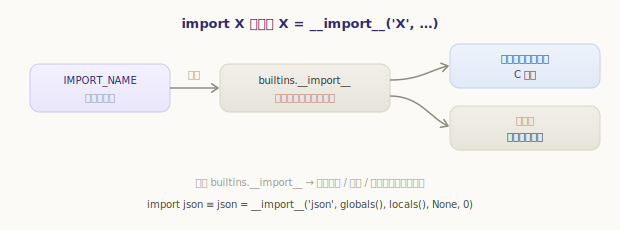
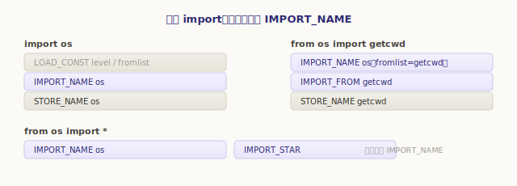
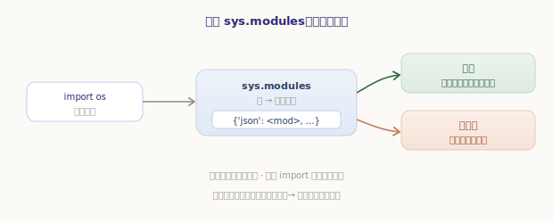
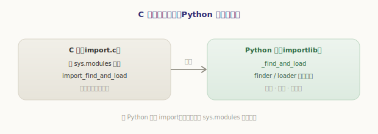
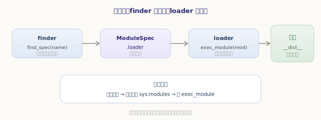
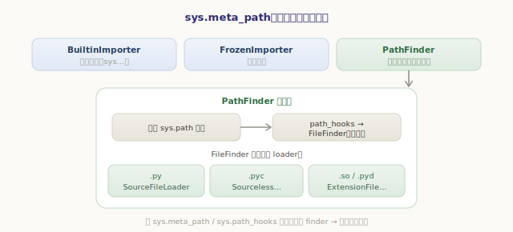
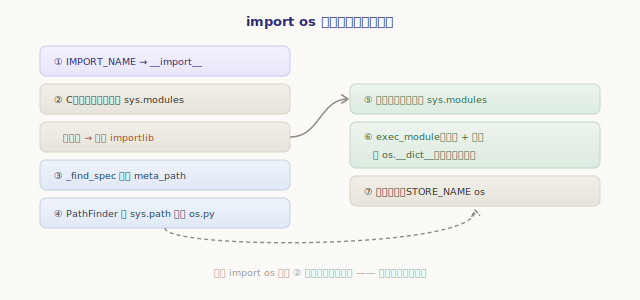

# 模块与 import 机制

上一章我们看到，`importlib` 在初始化时被「自举」了起来——可它**怎么工作**，我们还没碰。这一章就来回答那个每天写无数遍、却很少深究的问题：当你敲下 `import numpy`，从这一刻到 `numpy` 这个名字出现在你的命名空间里，CPython 究竟做了什么？

答案分成清晰的几层：`import` 语句其实是**一次函数调用**；调用先查一道**缓存**（`sys.modules`）；缓存未命中，才真正去**查找并加载**——而查找/加载这套活，交给了用 Python 写的 `importlib`，由一组 **finder** 和 **loader** 按协议完成。我们逐层拆开。

## import 语句的真身：调用 __import__

先看 `import` 编译成了什么。`import os` 的字节码骨架是：

```
      LOAD_CONST   0       # level（相对导入层级，绝对导入为 0）
      LOAD_CONST   None    # fromlist（import os 时为 None）
      IMPORT_NAME  os      # ★ 真正干活的指令
      STORE_NAME   os      # 把得到的模块对象绑定到名字 os
```

核心是 `IMPORT_NAME`。而它做的第一件事出人意料——**去 `builtins` 里取出 `__import__` 函数来调用**：

`源文件：`[Python/ceval.c](https://github.com/python/cpython/blob/v3.7.0/Python/ceval.c#L4722)

```c
// Python/ceval.c —— import_name（IMPORT_NAME 的实现，精简）
import_func = _PyDict_GetItemId(f->f_builtins, &PyId___import__);  // 取 builtins.__import__
if (import_func == NULL) { PyErr_SetString(...); return NULL; }
// 快路径：未被覆盖的 __import__ 直接调底层 C 实现
if (import_func == interp->import_func) {
    return PyImport_ImportModuleLevelObject(name, f->f_globals, f->f_locals, fromlist, ilevel);
}
// 否则当成普通函数调用（支持自定义 __import__）
res = _PyObject_FastCall(import_func, stack, 5);
```

这揭示了一个常被忽视的事实：**`import X` 本质等价于 `X = __import__('X', ...)`**。`__import__` 是个普通的内建函数，因此**可以被替换**——这正是一些导入钩子、沙箱、惰性导入库的工作原理：



```python
>>> import builtins
>>> original = builtins.__import__
>>> def traced(name, *args, **kw):
...     print("正在导入:", name)
...     return original(name, *args, **kw)
...
>>> builtins.__import__ = traced
>>> import json          # 触发我们的钩子
正在导入: json
>>> builtins.__import__ = original   # 还原
```

`from os import getcwd` 则多一步：`IMPORT_NAME` 带上 `fromlist=('getcwd',)` 拿到模块，再用 `IMPORT_FROM` 从模块里取出 `getcwd` 这个属性；`from os import *` 走的是 `IMPORT_STAR`。但它们的起点都是同一个 `IMPORT_NAME`：



## 第一道关卡：sys.modules 缓存

未被覆盖时，`IMPORT_NAME` 落到 C 实现 `PyImport_ImportModuleLevelObject`。它在真正去加载之前，先查一道至关重要的缓存——**`sys.modules`**，一个「模块名 → 模块对象」的字典：

`源文件：`[Python/import.c](https://github.com/python/cpython/blob/v3.7.0/Python/import.c#L1671)

```c
// Python/import.c —— PyImport_ImportModuleLevelObject（精简主干）
abs_name = resolve_name(name, globals, level);   // 解析成绝对模块名
mod = _PyImport_GetModule(abs_name);             // ★ 先查 sys.modules
if (mod != NULL && mod != Py_None) {
    // 命中缓存：直接用，绝不重复加载
}
else {
    mod = import_find_and_load(abs_name);        // 未命中：才去查找并加载
}
```



这道缓存解释了几个日常现象：

- **模块顶层代码只执行一次**。第二次 `import os`，命中缓存直接返回，`os.py` 的顶层代码不会再跑：

```python
>>> import sys
>>> 'json' in sys.modules
False
>>> import json
>>> 'json' in sys.modules        # 加载后进了缓存
True
>>> import json as j
>>> j is sys.modules['json']     # 再次 import 拿到的是缓存里同一个对象
True
```

- **循环导入能「半工作」**。加载一个模块时，CPython 会**先把半成品模块放进 `sys.modules`、再执行它的代码**。于是当 A 导入 B、B 又回头导入 A 时，B 拿到的是那个还没执行完的 A 半成品——不会无限递归，但可能读到尚未定义的名字。这个「先登记后执行」的顺序是循环导入行为的根源，下面加载流程里还会再点到。

## 缓存未命中：C 把活儿交给 importlib

缓存没命中，`import_find_and_load` 出场。它的实现短得惊人——**把活儿原样转交给用 Python 写的 `importlib`**：

`源文件：`[Python/import.c](https://github.com/python/cpython/blob/v3.7.0/Python/import.c#L1615)

```c
// Python/import.c —— import_find_and_load（精简）
PyInterpreterState *interp = PyThreadState_GET()->interp;
mod = _PyObject_CallMethodIdObjArgs(interp->importlib,        // 上一章自举出的 importlib
                                    &PyId__find_and_load,     // 调它的 _find_and_load
                                    abs_name, interp->import_func, NULL);
return mod;
```

这是一处精彩的分工：**C 层只管「查缓存」这种性能敏感的快路径，真正复杂多变的查找/加载逻辑，全用 Python 写在 `importlib._bootstrap` 里**。用 Python 实现 import，让它易读、易改、易扩展——代价（每次加载的开销）由前面的 `sys.modules` 缓存兜住了。



## finder 与 loader：两段式加载协议

进了 `importlib`，`_find_and_load` 把「导入一个模块」拆成**两段**，由两类角色分工：

- **finder（查找器）**：回答「这个模块在哪、该用什么方式加载」，产出一个 **`ModuleSpec`**（导入规格，内含一个 loader）；
- **loader（加载器）**：回答「把模块**真正建出来**」，执行模块代码、填充模块对象。



整个流程是这样（`importlib._bootstrap` 的逻辑，简化）：

```python
# importlib._bootstrap._find_and_load 的骨架（示意）
def _find_and_load(name, import_):
    spec = _find_spec(name, ...)        # ① 遍历 finder 找到 spec
    module = module_from_spec(spec)     # ② 按 spec 造出空模块对象
    sys.modules[name] = module          # ③ ★ 先登记，再执行（循环导入靠这步）
    spec.loader.exec_module(module)     # ④ 在模块的 __dict__ 里执行其代码
    return module
```

第 ④ 步 `exec_module` 把模块源码编译成 code object、在模块自己的名字空间（`module.__dict__`）里跑一遍——这就回到了前面几部分讲的编译与求值：**模块的顶层代码，也是在一个帧里执行的**，只不过那个帧的全局名字空间就是这个模块的 `__dict__`。注意第 ③ 步在 ④ **之前**，这正是上一节「先登记后执行」的落点。

## meta_path：到哪去找 finder

那么 `_find_spec` 是怎么找到合适 finder 的？它依次问 **`sys.meta_path`** 上的每一个 finder：「你认识这个模块吗？」谁先返回非空的 spec，就用谁。默认的 `sys.meta_path` 上有三位：



```python
>>> import sys
>>> sys.meta_path
[<class '_frozen_importlib.BuiltinImporter'>,
 <class '_frozen_importlib.FrozenImporter'>,
 <class '_frozen_importlib_external.PathFinder'>]
```

- **`BuiltinImporter`**——找**内建模块**（编译进解释器的 C 模块，如 `sys`、`builtins`）；
- **`FrozenImporter`**——找**冻结模块**（字节码固化进二进制的，如上一章的 `importlib._bootstrap`）；
- **`PathFinder`**——找**文件系统上的模块**，也就是我们绝大多数 `import` 走的路。

`PathFinder` 是重头。它遍历 **`sys.path`**（那串目录列表），对每个目录借助 `sys.path_hooks` 取得一个 **`FileFinder`**（并缓存在 `sys.path_importer_cache` 里避免重复扫描）；`FileFinder` 在目录里按后缀匹配，再挑选对应的 loader：

- `.py` 源码文件 → `SourceFileLoader`（编译后执行，并写出 `.pyc` 缓存）；
- `.pyc` 字节码文件 → `SourcelessFileLoader`；
- `.so` / `.pyd` 扩展模块 → `ExtensionFileLoader`。

```python
>>> import json
>>> json.__spec__.loader        # json 由源码加载器加载
<_frozen_importlib_external.SourceFileLoader object at 0x...>
>>> json.__file__               # 它来自这个文件
'/usr/lib/python3.7/json/__init__.py'
```

这套「meta_path → PathFinder → sys.path → FileFinder → loader」的链条，就是 `import` 能在你机器上**找到**模块的全部秘密。想自定义导入行为（从 zip、从网络、从加密文件加载），只需往 `sys.meta_path` 或 `sys.path_hooks` 里插入自己的 finder——这就是 import 系统可扩展性的由来。

## 包：带 __init__.py 的目录

模块是单个文件，**包（package）则是一个目录**——准确说，是一个带 `__init__.py` 的目录。导入包时，`__init__.py` 作为包的「模块代码」被执行；它有一个特殊属性 **`__path__`**，是一个目录列表，引导**子模块**的查找：

```python
>>> import json
>>> json.__path__               # 包才有 __path__，子模块到这些目录里找
['/usr/lib/python3.7/json']
>>> import json.decoder         # 到 json.__path__ 指的目录里找 decoder
```

`import json.decoder` 会逐级导入：先导入 `json`（执行其 `__init__.py`），再在 `json.__path__` 指引下找到并导入 `decoder` 子模块。每一级都走前面那套完整流程、也各自进 `sys.modules` 缓存。

## 串起来：加载一个模块的全过程

把整章串成一条线，`import os`（假设首次导入）的完整旅程是：



1. `IMPORT_NAME` 取出 `builtins.__import__` 并调用；
2. 落到 C 的 `PyImport_ImportModuleLevelObject`，解析出绝对名 `os`，查 **`sys.modules`**——未命中；
3. 转交 `importlib._find_and_load`；
4. `_find_spec` 遍历 **`sys.meta_path`**，`PathFinder` 在 `sys.path` 里找到 `os.py`，产出带 `SourceFileLoader` 的 **spec**；
5. 按 spec 造出空的 `os` 模块对象，**先放进 `sys.modules`**；
6. `loader.exec_module` 把 `os.py` 编译成字节码、在 `os.__dict__` 里执行（一个以模块字典为全局名字空间的帧）；
7. 模块对象返回，`STORE_NAME` 把它绑定到当前名字空间的 `os`。

下次再 `import os`，流程在第 2 步就因缓存命中而返回——这就是为什么导入「第一次慢、后来快」。

---

小结一下模块与 import 机制：

- **`import X` 本质是 `X = __import__('X', ...)`**，由 `IMPORT_NAME` 取 `builtins.__import__` 来调用——因此 `__import__` 可被替换以定制导入；`from ... import` 再加 `IMPORT_FROM`；
- 加载前先查 **`sys.modules`** 缓存：命中即返回，这是「顶层代码只跑一次」「循环导入半工作」的根源；
- 未命中时 C 层 `import_find_and_load` 把活儿**交给用 Python 写的 `importlib`**——C 管缓存快路径，复杂逻辑交给易改的 Python；
- `importlib` 用**两段式协议**加载：**finder** 产出 `ModuleSpec`（`find_spec`），**loader** 真正建模块（`exec_module`）；中间「先登记进 `sys.modules`，再执行代码」支撑了循环导入；
- `_find_spec` 遍历 **`sys.meta_path`** 上的 `BuiltinImporter` / `FrozenImporter` / `PathFinder`；`PathFinder` 走 **`sys.path`** → `FileFinder` → 按后缀选 loader（源码/字节码/扩展）；
- **包**是带 `__init__.py` 的目录，靠 `__path__` 引导子模块查找；
- 向 `sys.meta_path` / `sys.path_hooks` 注入自定义 finder，即可扩展导入来源——这是 import 系统灵活性的根基。

import 让多个模块协作，但当多个**线程**同时跑起来，又会怎样？那把传说中既保平安、又遭诟病的 **GIL**，到底是什么、为什么存在？下一章就来拆 **多线程与 GIL**。
