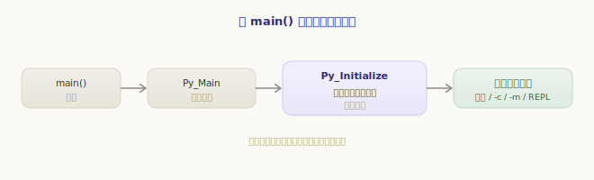
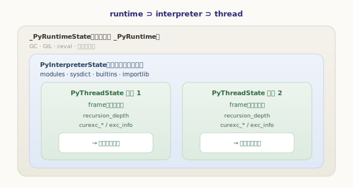
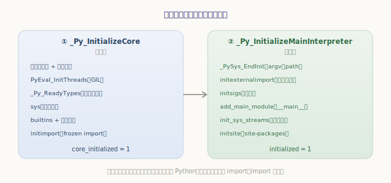
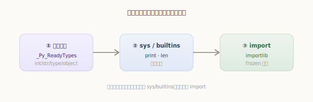
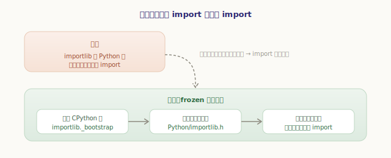
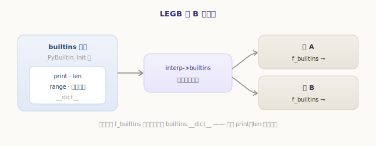
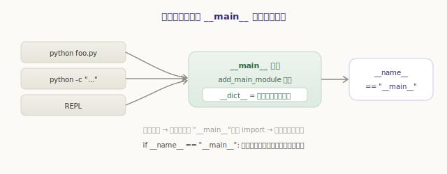

# Python 运行环境初始化

前四部分，我们把对象、编译、虚拟机一路拆了个透：你写的 `foo.py` 怎样被编译成字节码，又怎样被求值循环一条条执行。但有个问题一直被悄悄略过——**在 `foo.py` 的第一行真正运行之前，是谁把舞台搭好的？**

`type`、`int`、`str` 这些内建类型从哪来？`print`、`len` 这些内建函数为什么张口就能用？`import` 凭什么能找到模块？`sys.argv` 又是谁填的？答案是：当你敲下 `python foo.py`，CPython 在执行你的代码前，先默默做了一大套**初始化**工作。这一章就跟着源码，从 `main()` 一路走到「你的第一行代码」。

## 从 main() 到你的代码：全景

启动的主线非常清晰，可以先记住这条流水线：



- **`main()`** —— 可执行文件的入口（`Programs/python.c`），它转手调用 `Py_Main`；
- **`Py_Main`** —— 解析命令行参数（`-c`、`-m`、文件名……），然后做两件大事：先**初始化运行环境**，再**运行你的代码**；
- **`Py_Initialize`**（及其底层的 `_Py_InitializeCore` / `_Py_InitializeMainInterpreter`）—— 把整个 Python 运行环境从无到有搭起来，这是本章的主角；
- **运行代码** —— 视参数不同，跑文件、跑 `-c` 命令、跑 `-m` 模块，或进入交互式 REPL。

初始化做完，舞台就绪，你的代码才登场。下面我们钻进「搭舞台」这一步。

## 三层状态：运行环境的家底放在哪

搭舞台前先得有个「放东西的地方」。CPython 把运行期状态组织成**三个嵌套的层次**，从全局到具体：

`源文件：`[Include/internal/pystate.h](https://github.com/python/cpython/blob/v3.7.0/Include/internal/pystate.h#L78)

```c
// Include/internal/pystate.h —— 顶层运行时状态（全局唯一）
typedef struct pyruntimestate {
    int initialized;
    int core_initialized;            // 两个阶段的完成标志（见下文）
    PyThreadState *finalizing;
    struct pyinterpreters {
        PyInterpreterState *head;    // 所有解释器串成链表
        PyInterpreterState *main;    // 主解释器
    } interpreters;
    struct _gc_runtime_state gc;     // 垃圾回收状态
    struct _ceval_runtime_state ceval;   // 求值循环 / GIL 状态
    struct _gilstate_runtime_state gilstate;
} _PyRuntimeState;
```

这三层是：

- **`_PyRuntimeState`**——进程级、全局唯一的 `_PyRuntime`。装着 GC、GIL 这类「整个进程共享」的东西，以及所有解释器的链表。
- **`PyInterpreterState`**——解释器级。一个进程里可以有多个解释器（子解释器），各自独立，互不共享模块与名字空间：

`源文件：`[Include/pystate.h](https://github.com/python/cpython/blob/v3.7.0/Include/pystate.h#L110)

```c
// Include/pystate.h —— 解释器级状态（节选）
typedef struct _is {
    struct _is *next;            // 链到下一个解释器
    struct _ts *tstate_head;     // 该解释器下的线程链表
    PyObject *modules;           // sys.modules：已加载模块表
    PyObject *sysdict;           // sys 模块的 __dict__
    PyObject *builtins;          // builtins 模块的 __dict__（print、len 都在这）
    PyObject *importlib;         // import 机制的实现
    _PyFrameEvalFunction eval_frame;  // 默认就是 _PyEval_EvalFrameDefault
} PyInterpreterState;
```

- **`PyThreadState`**——线程级。每个 Python 线程一个，装着**当前帧** `frame`、递归深度、以及上一章反复出现的异常状态 `curexc_*` / `exc_info`：

`源文件：`[Include/pystate.h](https://github.com/python/cpython/blob/v3.7.0/Include/pystate.h#L209)

```c
// Include/pystate.h —— 线程级状态（节选）
typedef struct _ts {
    struct _ts *next;
    PyInterpreterState *interp;  // 我属于哪个解释器
    struct _frame *frame;        // 当前正在执行的帧（帧栈的栈顶）
    int recursion_depth;
    ......
} PyThreadState;
```



记住这张图：**一个 `_PyRuntime`，下面挂若干 `PyInterpreterState`，每个解释器下面挂若干 `PyThreadState`，每个线程状态指着它当前的帧**。初始化，本质就是把这三层从零建起来、再填满内容。

## 两阶段初始化：先打地基，再盖房子

`Py_Initialize` 内部分成**两个阶段**，这是 3.7 引入的清晰划分：



**阶段一 `_Py_InitializeCore`**——打地基。建主解释器、第一个线程状态、创建 GIL，把最底层的类型系统和核心模块立起来：

`源文件：`[Python/pylifecycle.c](https://github.com/python/cpython/blob/v3.7.0/Python/pylifecycle.c#L598)

```c
// Python/pylifecycle.c —— _Py_InitializeCore（精简，只留主干）
_PyRuntime_Initialize();                  // 初始化全局 _PyRuntime
interp = PyInterpreterState_New();        // 建主解释器
tstate = PyThreadState_New(interp);       // 建第一个线程状态
PyThreadState_Swap(tstate);
PyEval_InitThreads();                     // 创建 GIL
_Py_ReadyTypes();                         // ★ 把所有内建类型「就绪」
_PyLong_Init(); _PyFloat_Init(); ...      // 小整数池、浮点等
interp->modules = PyDict_New();           // sys.modules
_PySys_BeginInit(&sysmod);                // sys 模块（半成品）
_PyUnicode_Init();                        // 字符串实现
bimod = _PyBuiltin_Init();                // builtins 模块
interp->builtins = PyModule_GetDict(bimod);
_PyExc_Init(bimod);                       // 内建异常
_PyImport_Init(interp);                   // import 子系统
initimport(interp, sysmod);               // ★ 启动 frozen importlib
_PyRuntime.core_initialized = 1;          // 地基完成
```

**阶段二 `_Py_InitializeMainInterpreter`**——盖房子。在地基之上装好「面向用户」的部分：基于文件系统的完整 import、`__main__` 模块、标准输入输出流、信号处理、`site`：

`源文件：`[Python/pylifecycle.c](https://github.com/python/cpython/blob/v3.7.0/Python/pylifecycle.c#L790)

```c
// Python/pylifecycle.c —— _Py_InitializeMainInterpreter（精简）
_PySys_EndInit(interp->sysdict, &interp->config);  // 补全 sys（argv、path 等）
initexternalimport(interp);               // 基于文件系统的 import（importlib._bootstrap_external）
initfsencoding(interp);                   // 文件系统编码
initsigs();                               // 信号处理
add_main_module(interp);                  // ★ 创建 __main__ 模块
init_sys_streams(interp);                 // sys.stdin / stdout / stderr
_PyRuntime.initialized = 1;               // 完全初始化
if (!Py_NoSiteFlag) initsite();           // 加载 site（处理 site-packages）
```

为什么非要分两阶段？关键在阶段一末尾那个 `initimport`——它要启动 `importlib`，可 `importlib` 本身是用 Python 写的，得先有一套能跑 Python 的基础环境（类型、`sys`、`builtins`）才行。于是：**先用阶段一搭出一个「最小可运行的 Python」，再用它去启动 import 系统，最后阶段二才敢去 import 标准库**。

## 自举的核心：先有类型，再有模块，最后有 import

阶段一里那串初始化调用，顺序不是随便排的，而是一条严格的**依赖链**。任何后者都依赖前者已经就绪：



- **类型系统打头**：`_Py_ReadyTypes()` 把 `int`、`str`、`type`、`object` 等所有内建类型「就绪」（填好 `tp_dict`、计算 MRO——第二部分类型对象章讲过）。没有类型，连一个对象都造不出来，后面无从谈起。
- **再立 `sys` 与 `builtins`**：有了类型，才能造出 `sys`、`builtins` 这两个模块对象，把 `print`、`len`、内建异常等填进去。
- **最后启动 import**：前两者就绪，才有底气启动 `importlib`。

这里藏着一个经典的「鸡生蛋」难题：**`importlib` 是用 Python 写的，可启动它本身又需要 `import`**。CPython 的破解办法是 **frozen（冻结）模块**——把 `importlib._bootstrap` 的字节码在**编译 CPython 时**就固化进可执行文件（见 `Python/importlib.h`，那是一个巨大的字节数组）。启动时无需从磁盘读文件、无需走 import 流程，直接把这段冻结的字节码喂给求值循环执行，import 系统就「凭空」启动了：



```python
>>> import importlib._bootstrap as b
>>> b.__spec__.origin           # 来历：frozen，而非某个 .py 文件
'frozen'
>>> import sys
>>> 'importlib' in sys.modules  # 启动期就已就位
True
```

`initimport` 装好的是**最底层的内建/frozen import**（能 import 内建模块）；阶段二的 `initexternalimport` 再装上**基于文件系统的 import**（`importlib._bootstrap_external`，能从磁盘上的 `.py`/`.pyc` 加载）。import 的完整机制，是下一章的主题，这里先知道它是这样被「自举」起来的。

## 内建名字空间：LEGB 里的 B 从哪来

还记得「一般表达式与名字空间」一章里的 LEGB 查找吗？取一个名字时按**局部 → 闭包 → 全局 → 内建**的顺序找。当时我们说最后一层「内建」就是 `builtins`，但没说它从哪来。现在答案揭晓：

正是阶段一的 `_PyBuiltin_Init()` 造出 `builtins` 模块，把它的 `__dict__` 存进 `interp->builtins`。之后**每个帧创建时，`f_builtins` 都指向它**——所以任何代码、任何函数里，`print`、`len`、`range` 总是触手可及：



```python
>>> import builtins
>>> builtins.len is len          # 你用的 len 就来自 builtins 模块
True
>>> import sys
>>> ns = sys._getframe().f_builtins   # 当前帧的内建名字空间
>>> ns is builtins.__dict__      # 正是 builtins 的 __dict__
True
```

LEGB 的 B 不是什么魔法，它就是初始化时挂在解释器上、再分发给每个帧的那一份 `builtins.__dict__`。

## 运行你的代码：__main__ 登场

舞台终于搭好。`Py_Main` 接下来根据命令行参数运行你的代码，而代码运行在哪个名字空间里？答案是 **`__main__` 模块**——阶段二的 `add_main_module` 早已把它建好：

`源文件：`[Python/pylifecycle.c](https://github.com/python/cpython/blob/v3.7.0/Python/pylifecycle.c#L1455)

```c
// Python/pylifecycle.c —— add_main_module（精简）
m = PyImport_AddModule("__main__");       // 创建名为 __main__ 的模块
d = PyModule_GetDict(m);                   // 它的 __dict__ 就是顶层代码的全局名字空间
if (PyDict_GetItemString(d, "__builtins__") == NULL) {
    PyObject *bimod = PyImport_ImportModule("builtins");
    PyDict_SetItemString(d, "__builtins__", bimod);  // 把内建塞进去
}
```

无论你是 `python foo.py`、`python -c "..."` 还是直接进 REPL，顶层代码都在 `__main__` 模块的 `__dict__` 里执行——它就是顶层那层「全局名字空间」。这也解开了那句无处不在的惯用法：



```python
# foo.py
print(__name__)                  # 直接运行：打印 __main__
if __name__ == "__main__":       # “我是被直接运行的，不是被 import 的”
    main()
```

直接运行的脚本，其模块名被设成 `"__main__"`；而被 `import` 时，模块名是它的文件名。`if __name__ == "__main__"` 这个判断，本质就是在问「我是不是那个 `add_main_module` 建出来的顶层模块」。

代码跑完（或抛出未捕获的异常），`Py_Main` 调用 `Py_FinalizeEx` 收尾：执行注册的退出函数、清理模块、回收对象、销毁线程状态与解释器——把初始化建起来的一切，反向拆掉。

---

小结一下运行环境的初始化：

- 启动主线是 `main() → Py_Main →`（**初始化** `Py_Initialize` + **运行代码**）；
- 运行期状态分**三层**：全局唯一的 **`_PyRuntimeState`**（GC、GIL、解释器链表）、解释器级的 **`PyInterpreterState`**（modules、sys、builtins、importlib）、线程级的 **`PyThreadState`**（当前帧、异常状态）；
- 初始化分**两阶段**：`_Py_InitializeCore` 打地基（解释器/线程状态、GIL、类型系统、sys/builtins、frozen import），`_Py_InitializeMainInterpreter` 盖房子（文件系统 import、`__main__`、标准流、signals、site）；
- 顺序是一条**自举依赖链**：类型 → sys/builtins → import；其中 `importlib` 用 **frozen 字节码**打破「启动 import 又需要 import」的鸡生蛋难题；
- **LEGB 的 B** 就是 `_PyBuiltin_Init` 造出、挂在 `interp->builtins`、再分发给每个帧 `f_builtins` 的那份字典；
- 你的代码运行在 **`__main__`** 模块的名字空间里，`if __name__ == "__main__"` 即由此而来。

初始化时我们反复碰到 `import`——它被自举起来，却还没细看它**怎么工作**：`import numpy` 时，CPython 如何找到、加载、缓存这个模块？下一章就深入 **模块与 import 机制**。
