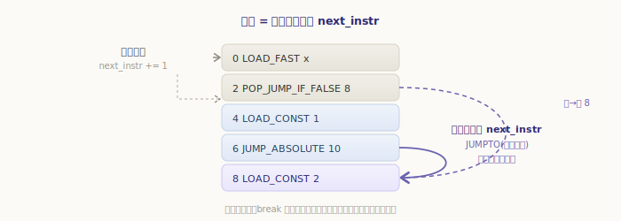
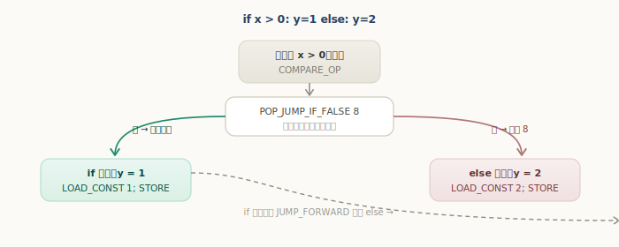
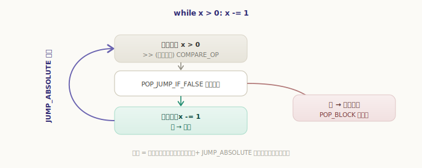
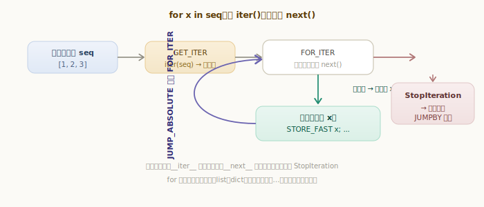
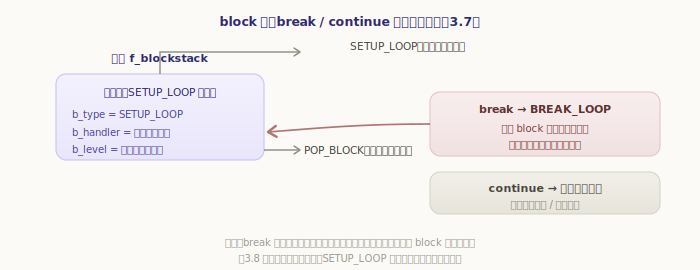

# 控制流：跳转、循环与迭代器

上一章的直线代码，执行起来一条接一条、一往无前。但真实程序有 `if`、`while`、`for`——执行顺序会拐弯、会折返。这一章看虚拟机如何做到这点。

答案出奇地简单：**改写「下一条取哪条」**。求值循环里有个指令指针 `next_instr`，正常每执行一条就自动指向下一条；而所有控制流，归根结底都是一类特殊指令——**跳转**——它们直接改写 `next_instr`，让循环下一轮从别处取指令。

## 跳转：改写指令指针

先看这个核心动作。ceval.c 里取指令靠 `next_instr`，跳转则由两个宏改写它：

`源文件：`[Python/ceval.c](https://github.com/python/cpython/blob/v3.7.0/Python/ceval.c#L705)

```c
// Python/ceval.c —— 跳转宏
#define JUMPTO(x)  (next_instr = first_instr + (x) / sizeof(_Py_CODEUNIT))  // 跳到绝对偏移 x
#define JUMPBY(x)  (next_instr += (x) / sizeof(_Py_CODEUNIT))               // 相对当前位置跳 x
```

`JUMPTO` 把 `next_instr` 设成某个绝对位置，`JUMPBY` 则在当前位置上偏移——前者叫绝对跳转，后者叫相对跳转。无论哪种，效果都是**让下一轮取指令从新位置开始**：



记住这一点，下面的 `if`、`while`、`for` 就都只是「在合适的时机改写 `next_instr`」的不同套路而已。

## if / else：条件跳转

`if/else` 用的是**条件跳转**——按栈顶的真假，决定要不要跳。最常见的是 `POP_JUMP_IF_FALSE`：弹出栈顶条件，**为假就跳走，为真就顺序往下**：

`源文件：`[Python/ceval.c](https://github.com/python/cpython/blob/v3.7.0/Python/ceval.c#L2642)

```c
// Python/ceval.c —— TARGET(POP_JUMP_IF_FALSE)（精简）
PyObject *cond = POP();              // 弹出条件
if (cond == Py_True)  { ...; FAST_DISPATCH(); }   // 真：顺序往下（落入 if 分支）
if (cond == Py_False) { ...; JUMPTO(oparg); FAST_DISPATCH(); }  // 假：跳到 oparg（else 分支）
err = PyObject_IsTrue(cond);         // 一般对象：算真值再决定
if (err == 0) JUMPTO(oparg);
```

把 `if x > 0: y = 1` `else: y = 2` 编译出来，骨架是这样：

```
      LOAD x; LOAD 0; COMPARE_OP >    # 算条件，结果压栈
      POP_JUMP_IF_FALSE  →8           # 假 → 跳到偏移 8（else）
      LOAD_CONST 1; STORE y           # if 分支
      JUMP_FORWARD       →10          # 跳过 else
  >>8 LOAD_CONST 2; STORE y           # else 分支
  >>10 ...                            # 汇合
```



条件为真时，`POP_JUMP_IF_FALSE` 不跳，自然落入 `if` 分支；执行完用 `JUMP_FORWARD` **跳过** `else`，避免两段都跑。条件为假时，直接跳到偏移 8 的 `else`。一个条件跳转 + 一个无条件跳转，`if/else` 就成了。

## while：往回跳形成循环

`if` 是往**前**跳（跳过一段）。把跳转方向调转——往**回**跳，就得到了循环。`while x > 0: x -= 1` 的骨架：

```
      SETUP_LOOP         →(循环外)     # 进入循环（下一节讲）
  >>  LOAD x; LOAD 0; COMPARE_OP >     # 循环顶部：判断条件
      POP_JUMP_IF_FALSE  →(跳出)       # 假 → 跳出循环
      LOAD x; LOAD 1; ...; STORE x     # 循环体：x -= 1
      JUMP_ABSOLUTE      →>>           # 往回跳，回到顶部重新判断
      POP_BLOCK
```



关键就是末尾那条 `JUMP_ABSOLUTE`——它用 `JUMPTO` 把 `next_instr` 改回循环顶部，于是又重新判断条件、再跑一轮。什么时候停？顶部的 `POP_JUMP_IF_FALSE` 一旦发现条件为假，就跳到循环外。**循环 = 条件跳转（决定要不要继续）+ 往回跳（重来一轮）**，再没别的玄机。

## for 与迭代器协议

`for` 比 `while` 多一层意思：它不靠条件，而是「把一个序列**逐个取完**」。CPython 用**迭代器协议**实现这件事，核心是两条指令 `GET_ITER` 和 `FOR_ITER`。

`GET_ITER` 先把可迭代对象变成一个**迭代器**——相当于调用 `iter()`：

`源文件：`[Python/ceval.c](https://github.com/python/cpython/blob/v3.7.0/Python/ceval.c#L2756)

```c
// Python/ceval.c —— TARGET(GET_ITER)
PyObject *iterable = TOP();
PyObject *iter = PyObject_GetIter(iterable);   // iter(iterable)
SET_TOP(iter);                                 // 用迭代器替换栈顶
```

然后 `FOR_ITER` 反复对这个迭代器调用 `next()`——拿到值就压栈交给循环体，**抛 `StopIteration` 就跳出循环**：

`源文件：`[Python/ceval.c](https://github.com/python/cpython/blob/v3.7.0/Python/ceval.c#L2799)

```c
// Python/ceval.c —— TARGET(FOR_ITER)（精简）
PyObject *iter = TOP();
PyObject *next = (*iter->ob_type->tp_iternext)(iter);   // 调用迭代器的 __next__
if (next != NULL) {
    PUSH(next);                 // 取到值 → 压栈（接着 STORE_FAST 给循环变量）
    DISPATCH();
}
if (PyErr_Occurred()) {         // 没取到：是 StopIteration 吗
    if (!PyErr_ExceptionMatches(PyExc_StopIteration)) goto error;
    PyErr_Clear();
}
STACKADJ(-1); Py_DECREF(iter);  // 迭代正常结束：丢弃迭代器
JUMPBY(oparg);                  // 跳到循环出口
```



所以 `for x in seq` 的骨架是：`GET_ITER` 拿到迭代器，`FOR_ITER` 每轮取一个值给 `x`、跑一遍循环体、`JUMP_ABSOLUTE` 跳回 `FOR_ITER` 再取下一个；直到某次 `next()` 抛 `StopIteration`，`FOR_ITER` 就 `JUMPBY` 到循环外。

这套协议我们可以在 Python 层完全手动复现——`for` 不过是它的语法糖：

```python
>>> it = iter([10, 20])      # 对应 GET_ITER
>>> type(it).__name__
'list_iterator'
>>> next(it), next(it)       # 对应 FOR_ITER 每轮取值
(10, 20)
>>> next(it)                 # 取尽 → StopIteration（FOR_ITER 据此跳出）
Traceback (most recent call last):
  ...
StopIteration
```

正因为 `for` 只认「迭代器协议」，任何实现了 `__iter__` / `__next__` 的对象都能被 `for` 遍历——list、dict、文件、生成器，乃至自定义类型，都走这同一套机制：

```python
>>> class Count:
...     def __init__(self, n): self.n = n; self.i = 0
...     def __iter__(self): return self
...     def __next__(self):
...         if self.i >= self.n: raise StopIteration
...         self.i += 1
...         return self.i
...
>>> list(Count(3))           # list() 内部也是 iter + 不断 next
[1, 2, 3]
```

## block 栈：break 与 continue 怎么找到出口

还剩一个问题：循环体里的 `break` 怎么知道该跳到哪？它要跳到「循环结束之后」，但那个位置在循环体里并不直观可知。3.7 的办法是给帧配一个 **block 栈**（`f_blockstack`）记账。

进入循环时，`SETUP_LOOP` 压入一个块，记下**循环结束的偏移**和当前**栈深度**：

`源文件：`[Python/ceval.c](https://github.com/python/cpython/blob/v3.7.0/Python/ceval.c#L2837)

```c
// Python/ceval.c —— TARGET(SETUP_LOOP)
PyFrame_BlockSetup(f, opcode, INSTR_OFFSET() + oparg, STACK_LEVEL());
//                            ↑ 循环结束的偏移         ↑ 入栈时的栈深度
```



有了这个块，`break`（编译成 `BREAK_LOOP`）就不必自己算出口地址——它顺着 block 栈找到循环块，跳到块里记录的「结束偏移」即可；`continue` 则跳回循环顶部。循环正常结束时，`POP_BLOCK` 把这个块弹掉、并把栈深度还原到入栈时的水平（`UNWIND_BLOCK`）。这套 block 栈机制不止服务于循环，下一章的 `try`/`except`/`finally` 也靠它来记录异常处理的落点——所以这里先建立印象。

> 这是 3.7 的实现。3.8 起循环不再用 `SETUP_LOOP` 和 block 栈，改用「零开销异常表」管理出口，`SETUP_LOOP` 被移除；但「记下出口、跳过去」的思路是一脉相承的。

---

小结一下控制流：

- 一切控制流都归结到一个动作：跳转指令用 `JUMPTO`/`JUMPBY` **改写 `next_instr`**，决定下一条取哪条；
- **`if/else`**：`POP_JUMP_IF_FALSE` 按条件真假决定跳不跳，配合 `JUMP_FORWARD` 跳过另一分支；
- **`while`**：循环顶部条件跳转 + 循环体末尾 `JUMP_ABSOLUTE` **往回跳**；
- **`for`**：走**迭代器协议**——`GET_ITER` 取得迭代器，`FOR_ITER` 反复 `next()` 取值，`StopIteration` 时跳出；任何实现 `__iter__`/`__next__` 的对象都能被遍历；
- **`break`/`continue`**：靠帧的 **block 栈**（`SETUP_LOOP` 压入、`POP_BLOCK` 弹出）记下循环出口，运行期顺着它找到落点。

控制流清楚了。但还有一种「跳法」更剧烈——**异常**：它能从深处的函数体，一路炸回到外层的 `try`。下一章就看虚拟机如何用 block 栈处理 `try`/`except`/`finally` 与异常的栈展开。
