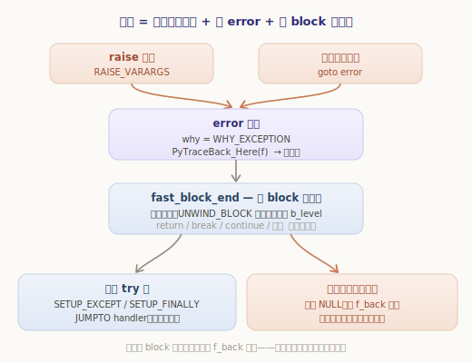
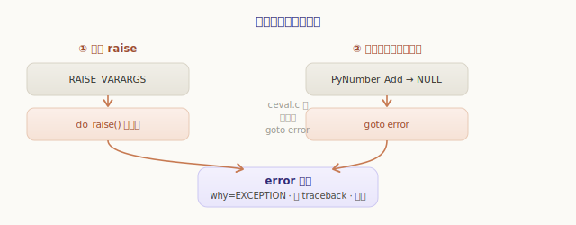
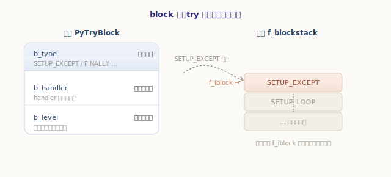
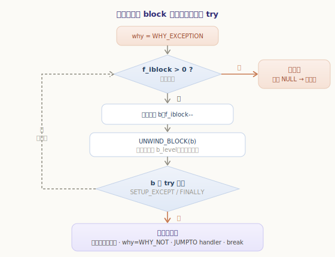
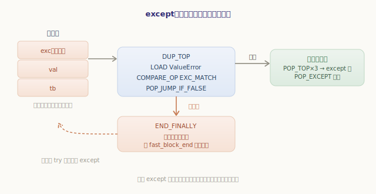
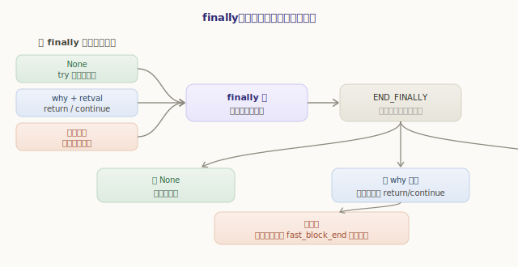
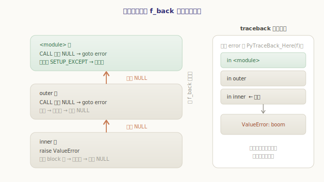

# 异常机制：block 栈与栈展开

上一章的控制流，无论 `if`、`while` 还是 `for`，跳转的落点都在**同一段字节码**里——跳来跳去，终究没出这一帧。可异常不一样：一个 `raise` 能从某个深埋的函数体里发动，**穿过一层层调用**，一路炸回到外层某个 `try`。这是一种更剧烈的「跳法」。

这一章就看虚拟机如何驾驭这种剧烈的跳转。会发现它复用了上一章末尾埋下的伏笔——帧里的 **block 栈**——再配上一套叫 **`why_code`** 的「未竟之事」记账法，把 `raise`、`return`、`break`、`continue` 统统纳入了同一套**栈展开**逻辑。

## 先从 Python 的视角看异常

动手前先用纯 Python 建立直觉。异常机制在语言层面就四件事：`raise` 抛出、`try`/`except` 捕获、`finally` 善后、`traceback` 记录「这一路是从哪炸过来的」。

```python
>>> def inner():
...     raise ValueError("boom")     # 在最深处抛出
...
>>> def outer():
...     inner()                      # 自己不捕获，异常会穿过这一层
...
>>> try:
...     outer()                      # 在最外层接住
... except ValueError as e:
...     print("caught:", e)
...
caught: boom
```

异常在 `inner` 里抛出，`inner` 和 `outer` 都没有 `try`，于是它**逐层向外穿透**，直到最外层的 `except` 才被接住。如果一路都没人接，它会一直炸到顶层，打印出我们再熟悉不过的 traceback：

```python
>>> outer()
Traceback (most recent call last):
  File "<stdin>", line 1, in <module>
  File "<stdin>", line 2, in outer      # 经过 outer
  File "<stdin>", line 2, in inner      # 起点 inner
ValueError: boom
```

注意这份 traceback 是**逐帧累积**出来的——它如实记下了异常穿过的每一层 `inner ← outer ← <module>`。记住这个「逐层穿透 + 逐帧记账」的画面，本章要做的就是把它落到 C 源码上。整套机制的全景如下：



一句话概括：**异常 = 设置「当前错误」+ 跳到求值循环的 `error` 标签 + 沿 block 栈展开**。下面逐块拆开。

## 异常是怎么「发生」的

先问一个基础问题：虚拟机怎么知道「出异常了」？答案藏在线程状态里。每个线程状态 `PyThreadState` 都有一组字段，专门记录**正在抛出途中的异常**：

`源文件：`[Include/pystate.h](https://github.com/python/cpython/blob/v3.7.0/Include/pystate.h#L235)

```c
// Include/pystate.h —— PyThreadState（节选）
/* The exception currently being raised */
PyObject *curexc_type;        // 正在抛出的异常：类型
PyObject *curexc_value;       // 值（异常实例）
PyObject *curexc_traceback;   // traceback
```

所谓「抛出一个异常」，本质就是把这三个字段填上——这正是 `PyErr_SetString`、`PyErr_SetObject` 这些 C API 在做的事。填好之后，怎么让求值循环注意到？靠两条路汇到同一个落点——求值循环里的 **`error` 标签**：



**第一条：显式 `raise`。** 源码里的 `raise` 语句编译成 `RAISE_VARARGS` 指令，它调用 `do_raise` 设置好「当前异常」，然后跳到 `error`：

`源文件：`[Python/ceval.c](https://github.com/python/cpython/blob/v3.7.0/Python/ceval.c#L1611)

```c
// Python/ceval.c —— TARGET(RAISE_VARARGS)（精简）
case 0:
    if (do_raise(exc, cause)) {     // 设置 curexc_*，区分 raise / raise X / raise X from Y
        why = WHY_EXCEPTION;
        goto fast_block_end;        // 直接进入栈展开
    }
```

**第二条：隐式出错。** 这条更常见——任何指令执行失败，都会 `goto error`。回想上一章的 `BINARY_ADD`：相加失败（比如 `1 + "x"`）时 `PyNumber_Add` 返回 `NULL`，分支里就 `goto error`。整个 ceval.c 里这样的 `goto error` 有几百处，它们是异常最主要的来源——绝大多数异常并非你手写 `raise`，而是某个底层操作失败后自动冒出来的。

```c
// Python/ceval.c —— 任何指令失败都走这条路（以 BINARY_ADD 为例）
sum = PyNumber_Add(left, right);
SET_TOP(sum);
if (sum == NULL)
    goto error;                     // 操作失败 → 跳到 error 标签
```

两条路最终都汇到 `error` 标签。它做两件事，然后落入真正的主角 `fast_block_end`：

`源文件：`[Python/ceval.c](https://github.com/python/cpython/blob/v3.7.0/Python/ceval.c#L3330)

```c
// Python/ceval.c —— error 标签（精简）
error:
    why = WHY_EXCEPTION;            // ① 标记：本次展开是因为「异常」
    PyTraceBack_Here(f);           // ② 把当前帧记进 traceback（逐帧累积就靠这句）
    /* 落入下面的 fast_block_end */
```

第 ② 句 `PyTraceBack_Here(f)` 正是开头那份 traceback「逐帧累积」的来历：异常每穿过一帧，就在这里把那一帧添进链条。而第 ① 句把 `why` 设成 `WHY_EXCEPTION`——这个 `why` 是理解整章的钥匙。

## why_code：把四种「非正常结束」记成一个理由

`why` 的类型是个枚举 `why_code`，它回答一个问题：「为什么要中断正常的顺序执行、去展开 block 栈？」

`源文件：`[Python/ceval.c](https://github.com/python/cpython/blob/v3.7.0/Python/ceval.c#L505)

```c
// Python/ceval.c —— why_code
enum why_code {
    WHY_NOT =       0x0001,   // 没事，正常执行
    WHY_EXCEPTION = 0x0002,   // 出了异常
    WHY_RETURN =    0x0008,   // 执行了 return
    WHY_BREAK =     0x0010,   // 执行了 break
    WHY_CONTINUE =  0x0020,   // 执行了 continue
    WHY_YIELD =     0x0040,   // 执行了 yield
    WHY_SILENCED =  0x0080    // 异常被 with 吞掉了
};
```

这是 CPython 异常机制最精妙的设计：**`return`、`break`、`continue` 和异常，本质是同一类事**——它们都要「中断当前的顺序执行，跳到别处」，途中都可能要跨过若干 `try`/`finally`，都得把求值栈清理干净。CPython 没有为它们各写一套逻辑，而是用一个 `why` 把「中断的理由」记下来，再交给**同一段**栈展开代码统一处理。所以下面讲异常展开时，你看到的其实是一套通吃四种情况的机制。

## block 栈：try 在哪、栈该清到哪

栈展开要回答两个问题：**异常该交给哪个 `try`？清理时求值栈该退到什么深度？** 这两个答案，在进入 `try` 时就已经记在了帧的 **block 栈**上——也就是上一章循环用过的那个 `f_blockstack`。

每个块是一个 `PyTryBlock`，只有三个字段，却刚好回答上面两个问题：

`源文件：`[Include/frameobject.h](https://github.com/python/cpython/blob/v3.7.0/Include/frameobject.h#L11)

```c
// Include/frameobject.h
typedef struct {
    int b_type;       // 块的种类：SETUP_EXCEPT / SETUP_FINALLY / SETUP_LOOP / EXCEPT_HANDLER
    int b_handler;    // 出事了跳哪去（handler 的字节码偏移）
    int b_level;      // 入块时的求值栈深度——清理时退回到这里
} PyTryBlock;
```

进入 `try` 时，编译器埋下的 `SETUP_EXCEPT`（带 `except`）或 `SETUP_FINALLY`（带 `finally`）会压入一个这样的块，记下 handler 的位置和当前栈深：

`源文件：`[Python/ceval.c](https://github.com/python/cpython/blob/v3.7.0/Python/ceval.c#L2838)

```c
// Python/ceval.c —— TARGET(SETUP_EXCEPT) / TARGET(SETUP_FINALLY)
PyFrame_BlockSetup(f, opcode, INSTR_OFFSET() + oparg, STACK_LEVEL());
//                   ↑ b_type  ↑ b_handler=handler 偏移   ↑ b_level=当前栈深
```



`b_level` 这个字段格外重要。设想 `try: x = a + b + c` 在算 `b + c` 时抛了异常——此刻求值栈上还压着半截没算完的中间值。展开时若不把它们清掉，栈就乱了。`b_level` 记下的正是「进 `try` 那一刻干净的栈深」，清理时退回这里即可。

## 栈展开：fast_block_end 这段 while 循环

现在到全章的心脏。`why` 已置位、当前异常已设好，控制流落到 `fast_block_end`——一段 `while` 循环，**顺着 block 栈从栈顶往下逐个弹块**，看谁能接住这次「中断」：

`源文件：`[Python/ceval.c](https://github.com/python/cpython/blob/v3.7.0/Python/ceval.c#L3351)

```c
// Python/ceval.c —— fast_block_end（精简，只留异常相关分支）
fast_block_end:
    while (why != WHY_NOT && f->f_iblock > 0) {
        PyTryBlock *b = &f->f_blockstack[f->f_iblock - 1];   // 看栈顶的块
        f->f_iblock--;                                       // 弹掉它

        UNWIND_BLOCK(b);   // ① 把求值栈退回 b->b_level，多余的中间值全部丢弃

        // ② 是 try 块、且这次是异常 → 由它接住
        if (why == WHY_EXCEPTION && (b->b_type == SETUP_EXCEPT
                                  || b->b_type == SETUP_FINALLY)) {
            // 保存「上一个正在处理的异常」，压入 EXCEPT_HANDLER 块（POP_EXCEPT 时还原）
            PyFrame_BlockSetup(f, EXCEPT_HANDLER, -1, STACK_LEVEL());
            PUSH(...旧 exc_info 三件套...);
            PyErr_Fetch(&exc, &val, &tb);     // 取出当前异常
            PyErr_NormalizeException(&exc, &val, &tb);
            ...更新 tstate->exc_info 为本次异常...
            PUSH(tb); PUSH(val); PUSH(exc);   // ③ 把异常三件套压上求值栈，交给 handler
            why = WHY_NOT;                    // ④ 异常「接住了」，中断到此为止
            JUMPTO(handler);                  // ⑤ 跳到 except/finally 体
            break;
        }
        ...（SETUP_FINALLY 处理 return/break，见下一节）...
    }
    if (why != WHY_NOT)    // 块栈走完仍没人接 → 跳出主循环，把异常甩给调用者（跨帧）
        break;
```



逐步看这段循环对一次异常做了什么：

- **① `UNWIND_BLOCK(b)`**：把求值栈退回 `b_level`，丢掉那些半算完的中间值——这就是 `b_level` 的用处。
- **② 判断**：弹出的块若是 `SETUP_EXCEPT`/`SETUP_FINALLY`，且 `why == WHY_EXCEPTION`，说明这个 `try` 能接住异常。
- **③ 交接**：把异常的 `(type, value, traceback)` 三件套压上求值栈，`except` 子句待会儿就从栈上拿它来匹配；同时压入一个 **`EXCEPT_HANDLER`** 块，记住「进入异常处理前的状态」，等 `POP_EXCEPT` 时还原。
- **④ `why = WHY_NOT`**：异常被接住了，中断结束，循环就此 `break`。
- **⑤ `JUMPTO(handler)`**：跳到 `b_handler` 记下的 handler 偏移，开始执行 `except` 或 `finally` 体。

如果弹到底（`f_iblock` 归零）`why` 仍是 `WHY_EXCEPTION`，说明**这一帧没人能接**——循环退出后那句 `if (why != WHY_NOT) break` 会跳出整个求值主循环，把异常甩给调用者。这就是跨帧穿透，稍后细说。

> 顺带一提那两个被压上栈的「异常状态」概念：`curexc_*` 是**正在抛出途中**的异常（`raise` 刚发动、还没被接住）；而 `tstate->exc_info` 是**正在被处理**的异常（已经进了某个 `except` 体）——`sys.exc_info()` 读的就是后者。展开时把旧的 `exc_info` 压栈保存、`POP_EXCEPT` 时还原，是为了支持 `except` 里又嵌 `try` 的层层嵌套。

## except：在求值栈上匹配异常

被 `JUMPTO` 跳到的 handler，是编译器为 `except` 子句生成的一段字节码。它要做的是：拿栈顶的异常类型，去和 `except ValueError` 里写的类比一比，**匹配就处理，不匹配就重新抛出、继续往外找**。

把 `try: ... except ValueError: ...` 编出来，骨架是这样（跳转目标用符号表示）：

```
      SETUP_EXCEPT     →H        # 压入异常块，记下 handler 位置 H
      <try 体>
      POP_BLOCK                  # try 体顺利跑完：弹掉异常块
      JUMP_FORWARD     →E        # 跳过 except，到汇合点 E
  >>H DUP_TOP                    # 入口：栈顶是异常类型，复制一份来比
      LOAD_GLOBAL      ValueError
      COMPARE_OP       (exception match)   # 类型匹配吗？
      POP_JUMP_IF_FALSE →N       # 不匹配 → 跳到 N
      POP_TOP; POP_TOP; POP_TOP  # 匹配：弹掉 type/value/traceback 三件套
      <except 体>
      POP_EXCEPT                 # 清理 EXCEPT_HANDLER 块、还原上一个异常状态
      JUMP_FORWARD     →E
  >>N END_FINALLY                # 没有任何 except 匹配 → 重新抛出，继续展开
  >>E ...                        # 汇合
```



关键是 `>>H` 入口处栈顶那个异常类型——它正是上一节展开循环 `PUSH(exc)` 压上去的。`DUP_TOP` + `COMPARE_OP (exception match)` 做一次「是不是这个异常类（或其子类）」的判断：

- **匹配**：`POP_TOP` 三次弹掉异常三件套，执行 `except` 体；完事 `POP_EXCEPT` 把 `EXCEPT_HANDLER` 块和异常状态收拾干净。异常到此真正被消化。
- **不匹配**：落到 `>>N` 的 `END_FINALLY`。它发现栈上是个异常（而非正常标记），就把它**重新抛出**——于是 `why` 又变回 `WHY_EXCEPTION`、`goto fast_block_end`，展开循环继续往外层 block 找下一个 `try`。多个 `except ValueError: ... except KeyError: ...` 也是靠这条「不匹配就重抛、再比下一个」串起来的。

## finally：why_code 如何「记住未竟之事」

`finally` 的语义是「无论如何都执行」——无论 `try` 体正常结束、抛了异常，还是中途 `return`/`break`。这个「无论如何」用 `why_code` 实现得异常优雅。

看展开循环里专门处理 `SETUP_FINALLY` 的另一个分支：

`源文件：`[Python/ceval.c](https://github.com/python/cpython/blob/v3.7.0/Python/ceval.c#L3421)

```c
// Python/ceval.c —— fast_block_end 中处理 finally 的分支
if (b->b_type == SETUP_FINALLY) {
    if (why & (WHY_RETURN | WHY_CONTINUE))
        PUSH(retval);                  // 若是 return/continue，连同返回值一起寄存到栈上
    PUSH(PyLong_FromLong((long)why));  // 把「中断的理由」why 压栈，先记着
    why = WHY_NOT;                     // 理由暂存好了，先去执行 finally 体
    JUMPTO(b->b_handler);              // 跳到 finally
    break;
}
```

精髓在 `PUSH(why)`：展开经过一个 `finally` 块时，它把**中断的理由**（以及 `return` 的返回值）压到栈上「寄存」，然后把 `why` 清成 `WHY_NOT`、先去执行 `finally` 体。等 `finally` 体跑完，末尾的 `END_FINALLY` 再把寄存的理由取回来，**接着干被打断的事**：

`源文件：`[Python/ceval.c](https://github.com/python/cpython/blob/v3.7.0/Python/ceval.c#L1847)

```c
// Python/ceval.c —— TARGET(END_FINALLY)（精简）
PyObject *status = POP();              // 取回 finally 入口寄存的「标记」
if (PyLong_Check(status)) {            // 是个 why 整数 → 之前是 return/break/continue
    why = (enum why_code) PyLong_AS_LONG(status);
    if (why == WHY_RETURN || why == WHY_CONTINUE)
        retval = POP();
    goto fast_block_end;               // 接着完成原来的 return/break/continue
}
else if (PyExceptionClass_Check(status)) {   // 是个异常类 → 之前在抛异常
    PyErr_Restore(status, POP(), POP());
    why = WHY_EXCEPTION;
    goto fast_block_end;               // 接着把异常往外抛
}
// status 是 None → try 体本是正常结束，finally 跑完照常往下走
```



于是 `finally` 的三种情形被统一成一句话——**进 `finally` 前把「本来要干什么」压栈寄存，`finally` 跑完再取回来接着干**：

- `try` 体**正常结束**：编译器在落入 `finally` 前压了个 `None`，`END_FINALLY` 见 `None`，跑完照常往下；
- `try` 体里 **`return`/`break`/`continue`**：寄存的是对应的 `why`（和返回值），`finally` 跑完接着完成那个 `return`；
- `try` 体里**抛了异常**：寄存的是异常本身，`finally` 跑完把异常重新抛出、继续向外展开。

这下就明白 `finally` 为什么「拦得住 `return`」了——`return` 不过是 `why == WHY_RETURN` 的一次展开，途经 `finally` 块时同样会被寄存、暂缓，等 `finally` 执行完才放行。`finally` 里若又写了 `return`，则会覆盖掉寄存的理由，原来的 `return`/异常就被「顶掉」了。一个 `why_code`，把这些边角语义全收进了同一套机制。

## 跨帧展开：traceback 是怎么一层层长出来的

回到最初那个问题：异常如何穿过 `inner ← outer ← <module>`？

答案前面已经露头：当一帧的 block 栈**走到底仍没人接**，`fast_block_end` 后那句 `if (why != WHY_NOT) break` 会跳出求值主循环，让 `_PyEval_EvalFrameDefault` **带着 `NULL` 返回**。而调用它的，是调用方帧里的 `CALL_FUNCTION` 之类指令——它拿到 `NULL`，立刻 `goto error`，于是在**调用方这一帧**里，同样的 `error → fast_block_end` 展开又重演一遍：



```
inner 帧：raise → error → 展开 block 栈 → 没人接 → 返回 NULL
                              │ error 处 PyTraceBack_Here(inner) 记一笔
                              ▼
outer 帧：CALL 拿到 NULL → goto error → 展开 → 没人接 → 返回 NULL
                              │ error 处 PyTraceBack_Here(outer) 记一笔
                              ▼
<module> 帧：CALL 拿到 NULL → goto error → 展开 → SETUP_EXCEPT 接住！
```

每经过一帧，那帧的 `error` 标签都会执行一次 `PyTraceBack_Here(f)`，把自己**添进 traceback 链**。所以最终打印出来的 traceback，正是异常穿过的帧序列——`inner`、`outer`、`<module>` 一层不落。**栈展开在帧内沿 block 栈进行，在帧间沿 `f_back` 调用链进行**，两者接力，异常就这样从最深处一路炸到最外层。若连最外层 `<module>` 帧也没有 `try`，异常返回给最顶层的运行环境，由它打印 traceback 并结束程序——这就是我们见惯的那一幕。

## 异常链：`__context__` 与 `__cause__`

最后补一个 Python 3 引入的细节。在处理一个异常时**又抛出**另一个异常，Python 会把它们「串」起来，traceback 里会出现那句熟悉的「During handling of the above exception, another exception occurred」：

```python
>>> try:
...     1 / 0
... except ZeroDivisionError:
...     raise ValueError("wrapped")    # 处理 ZeroDivisionError 时又抛了 ValueError
...
Traceback (most recent call last):
  ...
ZeroDivisionError: division by zero
During handling of the above exception, another exception occurred:
  ...
ValueError: wrapped
```

这种**隐式**串联记在新异常的 `__context__` 上，源头就是前面反复出现的 `tstate->exc_info`——「当前正在处理的异常」。新异常抛出时，CPython 把 `exc_info` 挂到它的 `__context__`，于是两者连成一串。

如果想**显式**表达因果，用 `raise ... from ...`，它落到 `do_raise` 的 `cause` 参数，记在 `__cause__` 上，traceback 改用「The above exception was the direct cause of the following exception」措辞：

`源文件：`[Python/ceval.c](https://github.com/python/cpython/blob/v3.7.0/Python/ceval.c#L4036)

```c
// Python/ceval.c —— do_raise 处理 raise X from Y（精简）
if (cause) {                          // raise X from Y 里的 Y
    ...
    PyException_SetCause(value, fixed_cause);   // 挂到 X.__cause__
}
```

`__context__` 是「处理旧异常时碰巧又出错」，`__cause__` 是「我明确地因为它才抛这个」——前者自动、后者手动，但都只是给异常对象**多挂一个指针**，并不影响前面那套展开逻辑。

---

小结一下异常机制：

- **异常 = 设置「当前异常」（`curexc_*`）+ 跳到 `error` 标签 + 沿 block 栈展开**；进入 `error` 有两条路：显式 `RAISE_VARARGS`，和任何指令失败后的 `goto error`（后者才是大多数异常的来源）；
- **`why_code`** 是核心抽象：`return`/`break`/`continue`/异常被统一记成一个「中断的理由」`why`，交给**同一段**栈展开代码处理；
- **block 栈**（`PyTryBlock` 的 `b_type`/`b_handler`/`b_level`）在进 `try` 时由 `SETUP_EXCEPT`/`SETUP_FINALLY` 压入，记下 handler 落点与该清理到的栈深；
- **栈展开**（`fast_block_end`）沿 block 栈逐块弹出：`UNWIND_BLOCK` 还原求值栈，命中 `try` 块就把异常三件套压栈、`JUMPTO` 到 handler；`except` 用 `COMPARE_OP (exception match)` 匹配，不中就 `END_FINALLY` 重抛；
- **`finally`** 借 `why_code`「寄存—续做」：进 `finally` 前把未竟之事压栈，跑完由 `END_FINALLY` 取回接着干——这正是它「无论如何都执行」、还拦得住 `return` 的原因；
- **跨帧穿透**：帧内沿 block 栈展开，帧间沿 `f_back` 返回 `NULL` 接力；每帧 `PyTraceBack_Here` 记一笔，traceback 就此逐层长出。

异常这种「剧烈跳转」搞清楚了。但我们一直在说「调用一个函数就新建一帧」，这「新建一帧」本身又是怎么回事？参数怎么传进去、默认值和闭包怎么安排？下一章就来拆**函数机制：调用、参数与闭包**。
