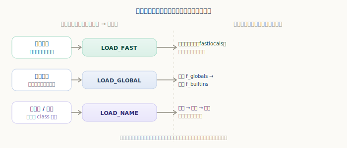
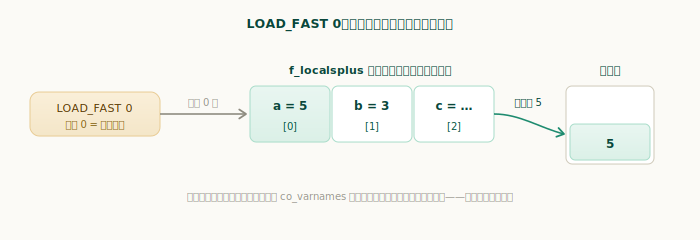
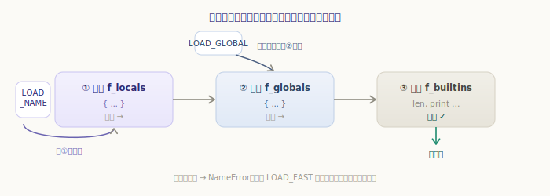
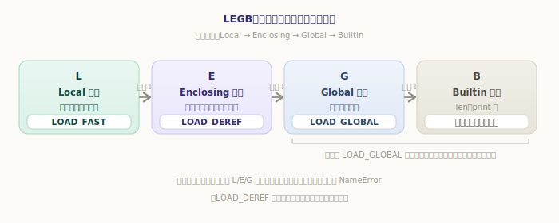
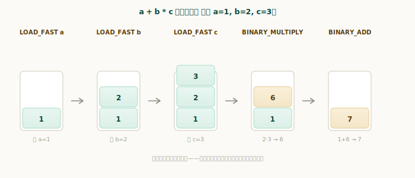
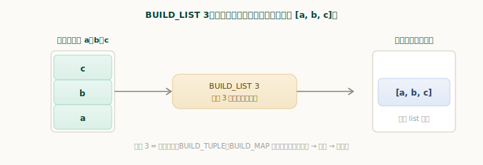

# 一般表达式与名字空间

上一章我们立起了虚拟机的骨架——求值循环照着字节码一条条执行，操作的是帧里的求值栈。这一章就钻进最常见的那批指令：**取名字**和**算表达式**。一段直线代码（没有分支、没有调用）的执行，基本就是这两件事来回交织。

而其中真正有讲头的是「取名字」。`x` 这个名字，运行时到底去哪儿找它的值？答案牵出 Python 著名的 **LEGB** 规则，以及一个容易被忽略的事实：**「去哪找」这件事，一半在编译期就定好了。**

## 取名字：编译期定指令，运行期做查找

回想第三部分讲的符号表——编译时它已经分析出每个名字属于哪类作用域。这个分析结果不会浪费：**编译器据此为每个名字选定一条专门的取值指令**。于是取名字的工作被劈成两半：

- **编译期**：符号表定作用域 → 选指令。局部变量用 `LOAD_FAST`，函数里引用的全局名用 `LOAD_GLOBAL`，模块顶层和类体里的名字用 `LOAD_NAME`。
- **运行期**：选定的指令各查各的名字空间。



亲眼看一下编译器的选择。同一个表达式 `a + g` 里，`a` 是参数（局部）、`g` 是全局变量，编译器给它们配了不同的指令：

```python
>>> import dis
>>> g = 10
>>> def f(a):
...     return a + g
...
>>> for ins in dis.get_instructions(f):
...     if ins.opname.startswith("LOAD"):
...         print(f"{ins.opname:14} {ins.argrepr}")
...
LOAD_FAST      a
LOAD_GLOBAL    g
```

`a` 配了 `LOAD_FAST`、`g` 配了 `LOAD_GLOBAL`——**这个区分在编译期就完成了**，运行期不再去猜「`a` 是局部还是全局」。下面逐条看这三种指令在运行期怎么干活。

## LOAD_FAST：局部变量按下标取，最快

函数里的局部变量，存在帧的 `f_localsplus` 那块数组里（上一章提过，局部变量和求值栈共用它）。`LOAD_FAST` 的参数就是变量在这块数组里的**下标**——直接按下标取，连字典都不用查：

`源文件：`[Python/ceval.c](https://github.com/python/cpython/blob/v3.7.0/Python/ceval.c#L1067)

```c
// Python/ceval.c —— TARGET(LOAD_FAST)
PyObject *value = GETLOCAL(oparg);      // 按下标直接取
if (value == NULL) {                    // 槽位还没被赋值
    format_exc_check_arg(PyExc_UnboundLocalError, ...);
    goto error;
}
Py_INCREF(value);
PUSH(value);                            // 压入求值栈
```



这是 Python 里取值最快的路径——一次数组索引而已。这也解释了一个常见报错的由来：如果这个槽位还没被赋值就被读取，`GETLOCAL` 取到 `NULL`，于是抛 **`UnboundLocalError`**：

```python
>>> def bad():
...     print(x)     # x 在下面被赋值，所以整个函数里 x 是局部 → LOAD_FAST
...     x = 1        # 但执行到 print 时这个槽位还是空的
...
>>> bad()
Traceback (most recent call last):
  ...
UnboundLocalError: local variable 'x' referenced before assignment
```

> 上面是 3.7 的报错文字；新版本措辞略有调整（如「cannot access local variable ...」），含义一致。关键是：**只要函数里某处给 `x` 赋了值，`x` 在整个函数里就是局部的**，读取它走的就是 `LOAD_FAST`——哪怕赋值写在读取之后。

## LOAD_GLOBAL：全局 → 内建

函数里**只读不写**的外部名（比如调用 `len`、引用模块级变量 `g`），编译器选 `LOAD_GLOBAL`。它先查全局名字空间 `f_globals`，没有再查内建 `f_builtins`：

`源文件：`[Python/ceval.c](https://github.com/python/cpython/blob/v3.7.0/Python/ceval.c#L2101)

```c
// Python/ceval.c —— TARGET(LOAD_GLOBAL)（快路径）
v = _PyDict_LoadGlobal((PyDictObject *)f->f_globals,    // 先全局
                       (PyDictObject *)f->f_builtins,    // 再内建
                       name);
if (v == NULL) { ...                                    // 两处都没有
    format_exc_check_arg(PyExc_NameError, NAME_ERROR_MSG, name);
    goto error;
}
```

`_PyDict_LoadGlobal` 把「先全局后内建」两步合成一次调用。所以我们能直接用 `len`、`print` 这些**内建函数**而无需导入——它们不在全局里，但 `LOAD_GLOBAL` 会自动回退到内建名字空间找到它们：

```python
>>> def show():
...     return len       # 全局里没有 len，回退到内建找到
...
>>> show()
<built-in function len>
```

要是全局和内建都没有这个名字，就抛 **`NameError`**：

```python
>>> undefined_name
Traceback (most recent call last):
  ...
NameError: name 'undefined_name' is not defined
```

注意 `LOAD_GLOBAL` 和 `LOAD_FAST` 的报错不同：前者是 `NameError`（名字根本不存在），后者是 `UnboundLocalError`（是局部、但还没赋值）。报错类型直接反映了编译器当初选了哪条指令。

## LOAD_NAME：模块层与类体的运行期查找

还有第三条：`LOAD_NAME`。它用在**模块顶层代码**和 **`class` 体**里——这些地方的名字，编译期没法像函数那样把局部变量固定成下标（class 体要支持动态、模块层的局部就是全局），于是只能运行期动态查。它依次查**局部 → 全局 → 内建**三个名字空间：

`源文件：`[Python/ceval.c](https://github.com/python/cpython/blob/v3.7.0/Python/ceval.c#L2050)

```c
// Python/ceval.c —— TARGET(LOAD_NAME)（精简）
v = PyObject_GetItem(f->f_locals, name);   // ① 局部
if (v == NULL) {
    v = PyDict_GetItem(f->f_globals, name);    // ② 全局
    if (v == NULL) {
        v = PyDict_GetItem(f->f_builtins, name);   // ③ 内建
        if (v == NULL) { ...NameError... }
    }
}
```



可以看到 `LOAD_NAME` 比 `LOAD_GLOBAL` 多查一层局部、比 `LOAD_FAST` 多了字典查找——它最灵活，但也最慢。这正是为什么**函数内部要尽量用局部变量**：函数体里的名字能走 `LOAD_FAST` 的快路径，而模块顶层只能用 `LOAD_NAME`。

## LEGB：四类作用域与四条指令

把三条指令和大家熟悉的 **LEGB** 规则对起来，整幅图就完整了。LEGB 是取名字的查找顺序——**L**ocal（局部）→ **E**nclosing（外层函数）→ **G**lobal（全局）→ **B**uiltin（内建）：



| 作用域 | 指令 | 运行期行为 |
|---|---|---|
| **L** 局部 | `LOAD_FAST` | 按下标取，不查字典 |
| **E** 外层（闭包） | `LOAD_DEREF` | 从 cell 取外层函数的变量 |
| **G** 全局 / **B** 内建 | `LOAD_GLOBAL` | 先全局、再内建 |
| 模块层 / 类体 | `LOAD_NAME` | 局部 → 全局 → 内建 |

关键在于：**LEGB 这条「链」并不是运行期一节节去试出来的，而是编译期就按符号表把每个名字归好类、配好指令**。运行期各指令只查自己该查的那一两处，查不到才报 `NameError`。其中 `LOAD_DEREF`（E 层，闭包）牵涉 cell 变量，留到「函数机制」一章再展开；这里只要知道它在 LEGB 里占了「外层」这一格。

## 表达式求值：运算符在栈上接力

名字取到栈上之后，剩下的就是**算**。运算符指令的套路高度一致——上一章的 `BINARY_ADD` 已经示范过：弹出操作数、计算、把结果压回栈顶。乘法 `BINARY_MULTIPLY` 一模一样，只是换成 `PyNumber_Multiply`：

`源文件：`[Python/ceval.c](https://github.com/python/cpython/blob/v3.7.0/Python/ceval.c#L1197)

```c
// Python/ceval.c —— TARGET(BINARY_MULTIPLY)
PyObject *right = POP();
PyObject *left = TOP();
PyObject *res = PyNumber_Multiply(left, right);
......
SET_TOP(res);          // 结果写回栈顶
```

有意思的是**运算优先级是怎么体现的**。看 `a + b * c`（设 `a=1, b=2, c=3`）——上一章讲过，编译器按语法树生成字节码，而 `*` 在树里比 `+` 更深，于是它的指令排得更靠前：

```
  0 LOAD_FAST       a
  2 LOAD_FAST       b
  4 LOAD_FAST       c
  6 BINARY_MULTIPLY        # 先算 b * c
  8 BINARY_ADD            # 再算 a + (b*c)
```

在栈上跑一遍就一目了然：



三个值依次压栈后，`BINARY_MULTIPLY` 先弹出 `b`、`c` 相乘得 `6` 压回，`BINARY_ADD` 再把 `a` 和 `6` 相加得 `7`。**乘法先于加法发生，纯粹是因为它的指令排在前面**——优先级在编译期就固化进了字节码顺序，运行期的栈只是忠实地按顺序执行，根本不需要懂什么叫优先级。

构建容器也是同一个套路。比如 `[a, b, c]` 编译成「依次压入 a、b、c，再用 `BUILD_LIST 3` 把栈顶三个值打包成列表」：

`源文件：`[Python/ceval.c](https://github.com/python/cpython/blob/v3.7.0/Python/ceval.c#L2263)

```c
// Python/ceval.c —— TARGET(BUILD_LIST)
PyObject *list = PyList_New(oparg);     // oparg = 元素个数
while (--oparg >= 0) {
    PyObject *item = POP();             // 从栈顶逐个弹出
    PyList_SET_ITEM(list, oparg, item); // 填进列表（倒着填，顺序正好对）
}
PUSH(list);                             // 列表压回栈顶
```



`BUILD_TUPLE`、`BUILD_MAP`（字典）、`COMPARE_OP`（比较）……全是这个模式：操作数已经在栈上备好，指令弹出它们、算出结果、压回栈顶。理解了「**压操作数 → 指令计算 → 压回结果**」这一条，绝大多数表达式字节码都能照着读下来。

---

小结一下：

- 取名字分两半：**编译期**由符号表定作用域、选指令；**运行期**指令各查各的名字空间；
- 三条取值指令：**`LOAD_FAST`**（局部，按下标，最快，未赋值则 `UnboundLocalError`）、**`LOAD_GLOBAL`**（全局→内建，缺失则 `NameError`）、**`LOAD_NAME`**（模块层/类体，局部→全局→内建，最灵活也最慢）；
- 它们对应 **LEGB** 规则的各层（外层 E 由 `LOAD_DEREF` 负责，留待函数机制章）；LEGB 的归类在编译期完成，不是运行期逐层试；
- **表达式求值**统一是栈式接力：压操作数 → 运算符指令弹出计算 → 压回结果；**运算优先级**靠编译期排好的字节码顺序体现，`BUILD_LIST` 等构建指令也是同一套路。

直线代码到此清楚了。但真实程序还有 `if`、`while`、`for`——执行不再是一条道走到底。下一章看**控制流**：虚拟机如何靠「跳转」指令改变执行顺序。
