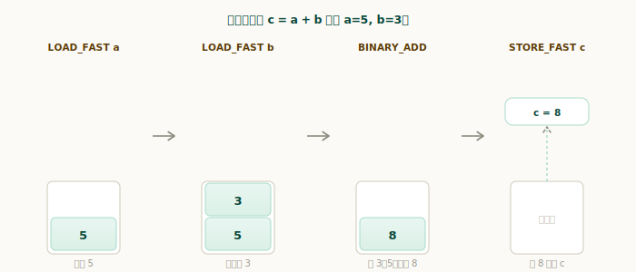
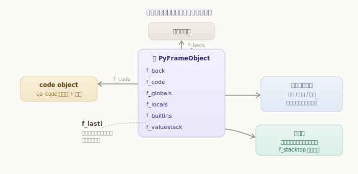
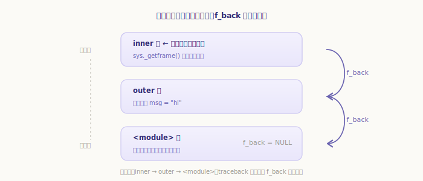
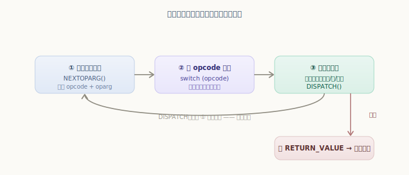

# Python 虚拟机框架：帧对象与求值循环

第三部分我们把源码编译成了 code object，里面装着字节码。可字节码只是一串静态的指令，谁来执行它？答案就是 **Python 虚拟机**——而虚拟机的核心，是本章的两个主角：**帧对象**和**求值循环**。

打个比方：code object 是一张乐谱（写死的音符），帧对象是某次演奏的现场（这次用哪架钢琴、弹到第几小节、手边的临时记号），求值循环则是演奏者本人——照着乐谱一个音一个音地弹下去。

## 栈式虚拟机：先建立直觉

动手之前先建立一个总印象：**CPython 是一台「基于栈」的虚拟机**。它执行指令时，操作数不放在寄存器里，而是放在一个**求值栈**上——指令从栈顶取操作数、把结果压回栈顶。

以 `c = a + b` 为例（设 `a=5`、`b=3`），上一章我们见过它的字节码：`LOAD_FAST a`、`LOAD_FAST b`、`BINARY_ADD`、`STORE_FAST c`。它们在求值栈上是这样接力的：



- `LOAD_FAST a`：把 `a` 的值 `5` 压栈；
- `LOAD_FAST b`：把 `b` 的值 `3` 压栈；
- `BINARY_ADD`：弹出栈顶两个值相加，把结果 `8` 压回栈顶；
- `STORE_FAST c`：弹出 `8`，存进变量 `c`。栈又空了。

每条指令只和栈顶打交道，谁也不必写明「操作数在哪个寄存器」。这就是栈式虚拟机的简洁之处。而这个求值栈，连同执行所需的一切，都装在**帧对象**里。

## 帧对象：执行一段字节码的现场

执行一段字节码，光有字节码不够——还要知道：局部变量放哪、全局名去哪查、求值栈在哪、执行到第几条了。把这些「执行现场」打包起来的，就是**帧对象**（`PyFrameObject`）：

`源文件：`[Include/frameobject.h](https://github.com/python/cpython/blob/v3.7.0/Include/frameobject.h#L17)

```c
// Include/frameobject.h —— PyFrameObject（节选）
typedef struct _frame {
    PyObject_VAR_HEAD
    struct _frame *f_back;      // 上一个帧（调用者），串成调用链
    PyCodeObject *f_code;       // 要执行的 code object（字节码在此）
    PyObject *f_builtins;       // 内建名字空间
    PyObject *f_globals;        // 全局名字空间
    PyObject *f_locals;         // 局部名字空间
    PyObject **f_valuestack;    // 求值栈的起点
    PyObject **f_stacktop;      // 求值栈的栈顶（下一个空位）
    int f_lasti;                // 上一条执行的指令位置（执行进度）
    ......
    PyObject *f_localsplus[1];  // 局部变量 + 求值栈，动态分配
} PyFrameObject;
```



逐一对应到「执行需要什么」：

- **执行什么**：`f_code` 指向 code object——字节码和那几张表都在里面。
- **名字去哪查**：`f_locals`、`f_globals`、`f_builtins` 三个名字空间。取一个名字时按「局部 → 全局 → 内建」的顺序查这三处（细节是下一章的主题）。
- **临时数据放哪**：`f_valuestack` 是求值栈起点，`f_stacktop` 指向当前栈顶。上一节那些压栈弹栈，操作的就是这里。
- **执行到哪了**：`f_lasti` 记录刚执行到第几条指令，循环据此知道下一条该取哪条。
- **谁调用了我**：`f_back` 指向调用者的帧——这把所有帧串了起来。

最后那个 `f_localsplus` 值得一提：**局部变量和求值栈其实共用同一块连续内存**（局部变量在前、求值栈在后），一次分配、紧凑高效。这也是为什么 `LOAD_FAST`（取局部变量）特别快——直接按下标访问这块数组。

## 帧栈：函数调用串成的链

`f_back` 串起来的，正是我们熟悉的**调用栈**。每调用一个函数，就**新建一个帧**压到栈顶；函数返回，帧就弹掉。当前正在执行的，永远是栈顶那个帧。

用 `sys._getframe()` 可以拿到当前帧，顺着 `f_back` 往回走就能看到整条调用链：

```python
>>> import sys
>>> def inner():
...     f = sys._getframe()
...     chain = f.f_code.co_name + " <- " + f.f_back.f_code.co_name \
...             + " <- " + f.f_back.f_back.f_code.co_name
...     print("当前帧 co_name :", f.f_code.co_name)
...     print("调用链         :", chain)
...     print("调用者 outer 的局部变量:", f.f_back.f_locals)
...
>>> def outer():
...     msg = "hi"
...     inner()
...
>>> outer()
当前帧 co_name : inner
调用链         : inner <- outer <- <module>
调用者 outer 的局部变量: {'msg': 'hi'}
```



看最后一行——通过 `inner` 帧的 `f_back`，我们直接读到了 `outer` 帧里的局部变量 `msg`。每个帧都保存着自己那一层的现场，互不干扰；而 `f_back` 让它们连成一条可回溯的链。**程序出错时打印的 traceback，正是顺着 `f_back` 一层层回溯出来的**——「谁调用了谁」全写在这条链上。

## 求值循环：虚拟机的心脏

有了帧（现场），就该有人照着它把字节码一条条执行下去了。这个执行者，就是 [Python/ceval.c](https://github.com/python/cpython/blob/v3.7.0/Python/ceval.c#L551) 里的 **`_PyEval_EvalFrameDefault`**——整个 CPython 跑得最频繁、最核心的一段代码。它拿到一个帧，就进入一个**循环**，周而复始地做三件事：



1. **取指令**：从字节码里取出下一条，解出操作码 `opcode` 和参数 `oparg`；
2. **派发**：用一个**巨大的 `switch`** 按 `opcode` 跳到对应分支；
3. **执行**：分支里执行这条指令（多半是操作求值栈），然后回到第 1 步取下一条。

源码里这个结构清晰可见（精简后）：

```c
// Python/ceval.c —— _PyEval_EvalFrameDefault 主循环（精简）
for (;;) {
    ......
    NEXTOPARG();             // ① 取出 opcode 和 oparg
    switch (opcode) {        // ② 按 opcode 派发
    TARGET(LOAD_FAST): ...   // 各条指令各一个分支
    TARGET(BINARY_ADD): ...
    ......
    }
    DISPATCH();              // ③ 回到循环开头，取下一条
}
```

这就是虚拟机的全部骨架：**一个大循环 + 一个大 switch**，每种字节码指令在 switch 里有一个分支。把上一节的 `BINARY_ADD` 分支翻出来看，正是栈式操作的真身：

`源文件：`[Python/ceval.c](https://github.com/python/cpython/blob/v3.7.0/Python/ceval.c#L1265)

```c
// Python/ceval.c —— TARGET(BINARY_ADD)
TARGET(BINARY_ADD) {
    PyObject *right = POP();           // 弹出右操作数
    PyObject *left = TOP();            // 取栈顶的左操作数
    ......
    sum = PyNumber_Add(left, right);   // 相加
    ......
    SET_TOP(sum);                      // 结果写回栈顶
    if (sum == NULL)
        goto error;
    DISPATCH();                        // 取下一条
}
```

`POP`、`TOP`、`SET_TOP` 操作的就是当前帧的求值栈；`DISPATCH()` 则回到循环开头。一条指令做完，循环就转一圈；如此一圈圈转下去，直到遇到 `RETURN_VALUE`——它把栈顶的值作为返回值、退出循环，这个帧的使命就结束了，控制权交还给 `f_back` 指向的调用者帧。

> 实际源码为了快，用了「计算跳转（computed goto）」等技巧让派发更高效，`DISPATCH`/`FAST_DISPATCH` 就是它的封装。但骨架仍是「取指令 → 派发 → 执行 → 再取指令」这个循环，理解到这一层就够了。

---

小结一下虚拟机的框架：

- CPython 是**基于栈**的虚拟机：指令从**求值栈**栈顶取操作数、把结果压回栈顶；
- **帧对象**（`PyFrameObject`）是执行一段字节码的「现场」：`f_code`（执行什么）、三个名字空间（名字去哪查）、求值栈（临时数据）、`f_lasti`（执行进度）、`f_back`（谁调用了我）；局部变量与求值栈共用 `f_localsplus` 一块内存；
- `f_back` 把帧串成**调用栈**，traceback 就是顺着它回溯的；
- **求值循环**（`_PyEval_EvalFrameDefault`）是虚拟机的心脏：**一个大循环 + 一个大 switch**，反复「取指令 → 按 opcode 派发 → 执行（操作求值栈）→ 取下一条」，直到 `RETURN_VALUE`。

骨架立起来了。但我们还没细看那些指令具体怎么取名字、怎么算表达式、怎么跳转。下一章就从最常见的**一般表达式与名字空间**入手，看看 `LOAD_FAST`、`LOAD_GLOBAL` 这些指令到底如何工作。
