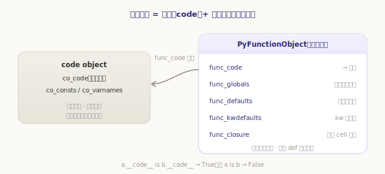
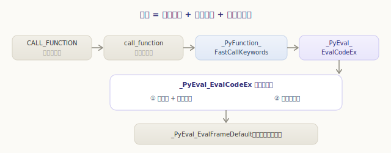
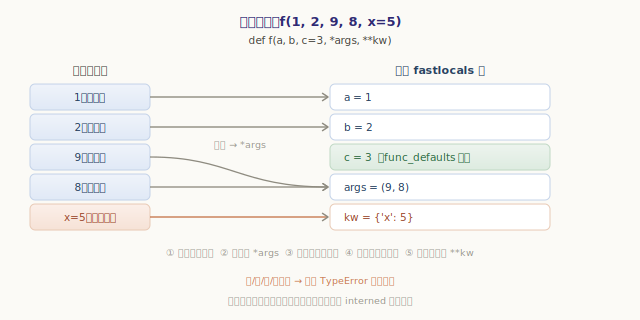
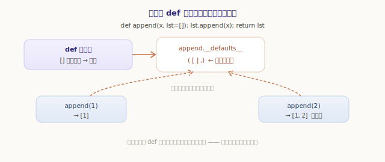
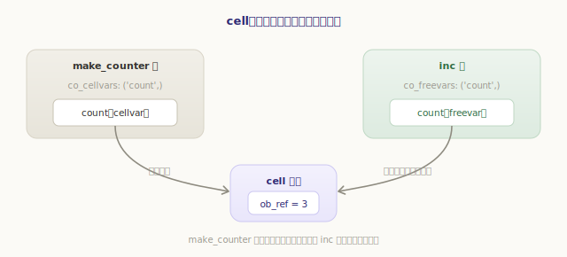
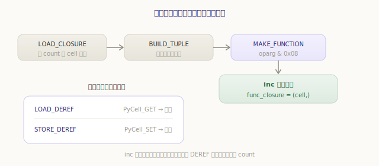

# 函数机制：调用、参数与闭包

前面几章我们一直在说一句话：「调用一个函数，就**新建一个帧**」。可这「新建一帧」到底是怎么发生的？参数怎么从调用处传进帧里？默认值、`*args`、`**kwargs` 在哪一步安排？嵌套函数里的闭包又是怎么记住外层变量的？这一章把这些一次讲清。

先建立一个总印象：**一个 Python 函数其实是「两样东西」的组合**——一份静态的 **code object**（编译好的字节码，第三部分讲过），加一个运行期的 **函数对象**（`PyFunctionObject`，记着它的全局名字空间、默认值、闭包）。沿用之前的比喻：code object 是乐谱，函数对象是「拿着这份乐谱、还配好了随身道具的演奏者」。调用，则是为这次演奏**新建一个现场（帧）**。



## def 做了什么：MAKE_FUNCTION 造出函数对象

`def` 不是「定义」那么玄，它是一条**会执行的语句**：运行到它时，虚拟机现场**造一个函数对象**出来。负责这件事的指令是 `MAKE_FUNCTION`：

`源文件：`[Python/ceval.c](https://github.com/python/cpython/blob/v3.7.0/Python/ceval.c#L3196)

```c
// Python/ceval.c —— TARGET(MAKE_FUNCTION)（精简）
PyObject *qualname = POP();
PyObject *codeobj = POP();
PyFunctionObject *func = (PyFunctionObject *)
    PyFunction_NewWithQualName(codeobj, f->f_globals, qualname);  // 绑定 code + 当前全局名字空间
if (oparg & 0x08) func->func_closure     = POP();   // 有闭包
if (oparg & 0x04) func->func_annotations = POP();   // 有注解
if (oparg & 0x02) func->func_kwdefaults  = POP();   // 有关键字默认值
if (oparg & 0x01) func->func_defaults    = POP();   // 有默认值
PUSH((PyObject *)func);
```

可以看到，`MAKE_FUNCTION` 把一堆「随身道具」挂到函数对象上——而这些道具，编译器早已用前几条指令在栈上备好（默认值打包成元组、闭包打包成 cell 元组……）。`oparg` 的四个标志位说明这次 `def` 带了哪些。装好的 `PyFunctionObject` 长这样：

`源文件：`[Include/funcobject.h](https://github.com/python/cpython/blob/v3.7.0/Include/funcobject.h#L21)

```c
// Include/funcobject.h —— PyFunctionObject（节选）
typedef struct {
    PyObject_HEAD
    PyObject *func_code;        // __code__：那份静态的字节码乐谱
    PyObject *func_globals;     // __globals__：到哪查全局名（def 所在模块的全局）
    PyObject *func_defaults;    // __defaults__：位置参数默认值（一个元组）
    PyObject *func_kwdefaults;  // __kwdefaults__：keyword-only 参数默认值（一个 dict）
    PyObject *func_closure;     // __closure__：闭包（一个 cell 元组）
    ......
} PyFunctionObject;
```

**关键区别在这里**：字节码（`func_code`）是静态、可共享的；而默认值、全局名字空间、闭包这些**随上下文而变**的东西，全挂在函数对象上。同一份 code object 可以被多个函数对象引用——比如在循环里反复 `def`，每轮造的是**新的函数对象**，但它们底下的 code object 是同一个：

```python
>>> def make():
...     def f(): pass
...     return f
...
>>> a, b = make(), make()
>>> a is b                    # 两个不同的函数对象
False
>>> a.__code__ is b.__code__  # 但共享同一份 code object（乐谱只编译一次）
True
>>> a.__globals__ is a.__code__   # 函数对象额外背着全局名字空间等运行期信息
False
```

## 调用：从 CALL_FUNCTION 到新建一帧

有了函数对象，`f(1, 2)` 这样的调用编译成 `CALL_FUNCTION`。它在求值栈上的布局很简单：**函数对象在下、参数在上**，`oparg` 就是参数个数。它把活儿交给 `call_function`：

`源文件：`[Python/ceval.c](https://github.com/python/cpython/blob/v3.7.0/Python/ceval.c#L3114)

```c
// Python/ceval.c —— TARGET(CALL_FUNCTION)
PyObject **sp = stack_pointer;
res = call_function(&sp, oparg, NULL);   // oparg 个位置参数
stack_pointer = sp;
PUSH(res);
```

`call_function` 会按被调对象的类型分派：C 函数走 C 的快速通道，而我们关心的 Python 函数走 `_PyFunction_FastCallKeywords`，它最终落到**整个函数调用的核心** `_PyEval_EvalCodeEx`——上一章见过的求值循环 `_PyEval_EvalFrameDefault`，正是由它建好帧之后调起的。这条链路就是「调用 = 新建一帧 + 绑定参数 + 跑求值循环」的全貌：



`源文件：`[Objects/call.c](https://github.com/python/cpython/blob/v3.7.0/Objects/call.c#L386)

```c
// Objects/call.c —— _PyFunction_FastCallKeywords（精简）
PyCodeObject *co = PyFunction_GET_CODE(func);
PyObject *globals = PyFunction_GET_GLOBALS(func);   // 函数对象背着的全局名字空间
PyObject *argdefs = PyFunction_GET_DEFAULTS(func);  // 默认值
// 简单情形（无 kwargs、参数刚好对上）走 function_code_fastcall 抄近路；
// 否则交给通用的 _PyEval_EvalCodeEx 做完整的参数绑定
return _PyEval_EvalCodeEx(co, globals, ..., argdefs, ..., closure, ...);
```

注意 `globals`、`argdefs`、`closure` 都是从**函数对象**里取出来的——这正是上一节强调「随身道具挂在函数对象上」的用处：真正调用时，它们被一并喂给帧。

## 参数绑定：实参如何落进 fastlocals

`_PyEval_EvalCodeEx` 建好帧后，第一件大事就是把调用处传来的实参，按规则填进帧的**局部变量区**（还记得上一章的 `f_localsplus` 吗？局部变量就排在它最前面，`LOAD_FAST` 按下标直取）。这套绑定规则，正是 Python 函数签名所有花样的实现：



按源码的顺序，绑定分几步走：

**① 位置参数对号入座。** 前 `co_argcount` 个形参槽，依次填入传来的位置实参：

`源文件：`[Python/ceval.c](https://github.com/python/cpython/blob/v3.7.0/Python/ceval.c#L3706)

```c
// Python/ceval.c —— _PyEval_EvalCodeEx：位置参数（精简）
n = (argcount > co->co_argcount) ? co->co_argcount : argcount;
for (i = 0; i < n; i++) {
    Py_INCREF(args[i]);
    SETLOCAL(i, args[i]);    // 第 i 个实参 → 第 i 个局部槽
}
```

**② 多余的位置参数打进 `*args`。** 若形参里有 `*args`（`CO_VARARGS` 标志），把超出 `co_argcount` 的实参打包成一个元组，放进对应槽：

```c
// Python/ceval.c —— 多余位置参数 → *args 元组（精简）
if (co->co_flags & CO_VARARGS) {
    u = PyTuple_New(argcount - n);
    for (i = n; i < argcount; i++) { Py_INCREF(args[i]); PyTuple_SET_ITEM(u, i-n, args[i]); }
    SETLOCAL(total_args, u);
}
```

**③ 关键字参数按名匹配。** 每个 `key=value`，拿 `key` 去和形参名表 `co_varnames` 比对，命中就填进那个槽。源码这里有个小优化——形参名通常是 interned 字符串，先做**裸指针比较**，几乎总能命中，省下字符串比较：

```c
// Python/ceval.c —— 关键字参数匹配（精简）
for (j = 0; j < total_args; j++)
    if (co_varnames[j] == keyword) goto kw_found;   // 裸指针比较，快
// ……没匹配上：若有 **kwargs 就塞进去，否则报 unexpected keyword argument
```

没有任何形参接得住的关键字参数，若函数声明了 `**kwargs`（`CO_VARKEYWORDS`）就塞进那个 dict；否则就是我们熟悉的 `got an unexpected keyword argument`。

**④ 缺的位置参数用默认值补。** 走到这一步还空着的位置槽，从函数对象的 `func_defaults` 里取默认值填上；仍填不满，就是 `missing N required positional argument`：

```c
// Python/ceval.c —— 用默认值补缺（精简）
if (argcount < co->co_argcount) {
    Py_ssize_t m = co->co_argcount - defcount;   // 没有默认值的形参个数
    ......
    for (; i < defcount; i++)
        if (GETLOCAL(m+i) == NULL) { Py_INCREF(defs[i]); SETLOCAL(m+i, defs[i]); }
}
```

**⑤ keyword-only 参数**则类似地用 `func_kwdefaults`（一个 dict）补缺。绑定全部做完，`fastlocals` 就备齐了，求值循环可以开跑。我们平时报的那些 `TypeError`——参数多了、少了、重了、名字不认识——全都诞生在这一段：

```python
>>> def f(a, b, c=3): pass
>>> f(1)
TypeError: f() missing 1 required positional argument: 'b'
>>> f(1, 2, 3, 4)
TypeError: f() takes from 2 to 3 positional arguments but 4 were given
>>> f(1, 2, a=9)
TypeError: f() got multiple values for argument 'a'
```

## 默认值的真相：def 时求值一次

第 ④ 步藏着一个 Python 老手都该懂的细节：**默认值是在 `def` 执行时求值一次、存进 `func_defaults`**，之后每次调用只是「从这个元组里取来填缺」。也就是说，所有调用**共享同一份默认值对象**。



如果默认值是个可变对象（比如 `[]`），这个「共享」就会显形——著名的可变默认值陷阱：

```python
>>> def append(x, lst=[]):     # [] 只在 def 时创建这一个
...     lst.append(x)
...     return lst
...
>>> append(1)
[1]
>>> append(2)                  # 还是同一个 lst！
[1, 2]
>>> append.__defaults__        # 默认值就存在这里，被反复修改
([1, 2],)
```

看最后一行——`__defaults__` 这个元组从头到尾就是 `def` 时创建的那一个，两次调用改的是同一个列表。理解了「默认值 def 时求值一次、挂在函数对象上」，这个陷阱就不再神秘。

## 闭包：用 cell 把外层变量「装进盒子」

最后是函数机制里最精巧的一块——**闭包**。嵌套函数能记住外层函数的局部变量，哪怕外层早已返回：

```python
>>> def make_counter():
...     count = 0
...     def inc():
...         nonlocal count
...         count += 1
...         return count
...     return inc
...
>>> c = make_counter()
>>> c(); c(); c()
1
2
3
```

`make_counter` 早返回了，它的帧本该销毁，可 `inc` 还在不断读写 `count`。秘密在于：这种被内层引用的变量，不会作为普通局部变量存放，而是被装进一个 **cell 对象**——一个只有一个字段的「盒子」：

`源文件：`[Include/cellobject.h](https://github.com/python/cpython/blob/v3.7.0/Include/cellobject.h#L9)

```c
// Include/cellobject.h
typedef struct {
    PyObject_HEAD
    PyObject *ob_ref;       // 盒子里装的东西（cell 为空时为 NULL）
} PyCellObject;
```

编译器在分析作用域时就分好了类：被内层函数引用的外层变量，记进外层 code 的 **`co_cellvars`**；内层函数从外层捕获来的变量，记进内层 code 的 **`co_freevars`**。建帧时，`_PyEval_EvalCodeEx` 为每个 cellvar 造一个 cell，并把闭包传来的 cell 拷进 freevars 区：

`源文件：`[Python/ceval.c](https://github.com/python/cpython/blob/v3.7.0/Python/ceval.c#L3852)

```c
// Python/ceval.c —— 建帧时安排 cell 与 free 变量（精简）
for (i = 0; i < PyTuple_GET_SIZE(co->co_cellvars); ++i) {
    // 若该 cell 变量同时是个参数，就把已绑定的实参装进盒子，否则建空盒子
    c = (co->co_cell2arg && ...) ? PyCell_New(GETLOCAL(arg)) : PyCell_New(NULL);
    SETLOCAL(co->co_nlocals + i, c);
}
for (i = 0; i < PyTuple_GET_SIZE(co->co_freevars); ++i) {
    PyObject *o = PyTuple_GET_ITEM(closure, i);   // 从函数对象的 func_closure 取来的 cell
    Py_INCREF(o);
    freevars[PyTuple_GET_SIZE(co->co_cellvars) + i] = o;
}
```

关键在于：**外层的 cellvar 和内层的 freevar 指向同一个 cell 盒子**。外层把 `count` 装进盒子，内层通过闭包拿到的是**同一个盒子的引用**——于是双方读写的是同一处。这就是闭包「记得住、还能改」的物理基础：



对 cell 的读写，是专门的两条指令 `LOAD_DEREF`（透过盒子取值）和 `STORE_DEREF`（透过盒子存值）：

`源文件：`[Python/ceval.c](https://github.com/python/cpython/blob/v3.7.0/Python/ceval.c#L2212)

```c
// Python/ceval.c —— 透过 cell 读写
TARGET(LOAD_DEREF) {
    PyObject *cell = freevars[oparg];
    PyObject *value = PyCell_GET(cell);    // 取盒子里的东西
    ......
    PUSH(value);
}
TARGET(STORE_DEREF) {
    PyObject *v = POP();
    PyObject *cell = freevars[oparg];
    PyCell_SET(cell, v);                   // 把东西放进盒子
}
```

而那个盒子是怎么从外层传到内层函数手里的？靠 `LOAD_CLOSURE` + `MAKE_FUNCTION`：外层在 `def inc` 之前，用 `LOAD_CLOSURE` 把 `count` 的 cell 压栈、打包成 `func_closure` 元组，`MAKE_FUNCTION`（`oparg & 0x08`）把它装进 `inc` 函数对象。于是 `inc` 一出生就带着外层那个盒子：



```python
>>> c.__closure__                 # inc 带着的闭包：一个 cell 元组
(<cell at 0x...: int object at 0x...>,)
>>> c.__closure__[0].cell_contents  # 盒子里现在装着 count 的当前值
3
>>> c.__code__.co_freevars         # inc 从外层捕获的自由变量名
('count',)
```

这也顺带解开另一个经典困惑——循环里建闭包，捕获的是**盒子**而非当时的值，所以循环结束后大家看到的是同一个最终值：

```python
>>> fns = [lambda: i for i in range(3)]
>>> [fn() for fn in fns]
[2, 2, 2]                          # 三个 lambda 共享捕获 i 的同一个盒子，最终都是 2
```

---

小结一下函数机制：

- 一个函数 = 静态的 **code object**（共享的字节码乐谱）+ 运行期的 **`PyFunctionObject`**（背着 `func_globals`、`func_defaults`、`func_closure` 等随身道具）；`def` 由 **`MAKE_FUNCTION`** 现场造出后者；
- **调用**走 `CALL_FUNCTION → call_function → _PyFunction_FastCallKeywords → _PyEval_EvalCodeEx`，归结为「**新建一帧 + 绑定参数 + 跑求值循环**」；
- **参数绑定**在 `_PyEval_EvalCodeEx` 里把实参填进 `fastlocals`：位置参数对号入座、多余的进 `*args`、关键字按名匹配（裸指针比较加速）、没接住的进 `**kwargs`、缺的用 `func_defaults`/`func_kwdefaults` 补；各种参数 `TypeError` 都生于此；
- **默认值**在 `def` 时求值一次、存于 `func_defaults`，调用间共享——这是可变默认值陷阱的根源；
- **闭包**用 **cell** 盒子实现：外层 `co_cellvars` 与内层 `co_freevars` 指向同一个 cell，`LOAD_DEREF`/`STORE_DEREF` 透过盒子读写，`LOAD_CLOSURE`/`MAKE_FUNCTION` 负责把盒子传给内层函数。

函数调用「建帧—绑参—执行—返回」的闭环到此完整。但有一种函数很特别：它执行到一半 `yield` 一下就「暂停」，把帧**原地冻住**、控制权交还给调用者，下次再从断点继续。这种「可暂停的函数」是怎么做到的？下一章就拆**生成器与协程**。
