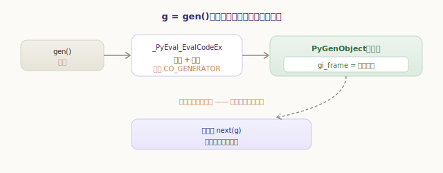
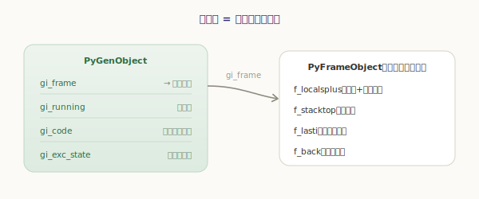
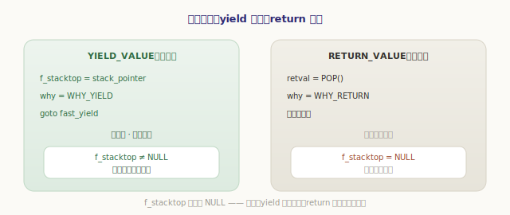
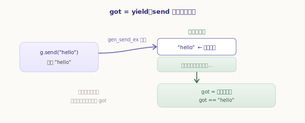
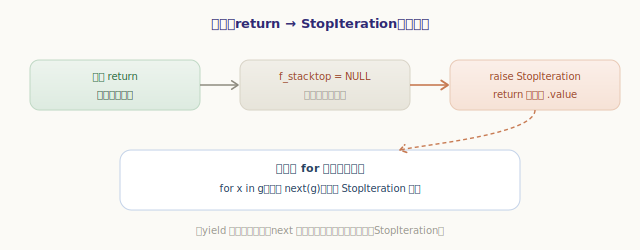
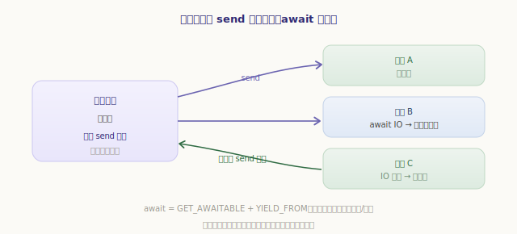

# 生成器与协程

上一章我们看清了普通函数调用的闭环：**建帧 → 绑参 → 执行 → 返回，帧随即销毁**。一次调用从头跑到尾，帧用完即弃。

可有一种函数偏偏不守这个规矩——它执行到 `yield` 就「暂停」，把现场**原地冻住**、控制权交还给调用者；下次再从断点继续，局部变量、执行位置全都还在。这就是**生成器**。它是怎么做到「暂停」的？答案出人意料地简单：**调用结束时，不把帧扔掉，而是把它揣进一个对象里留着**。这一章就拆开这件事，再看它如何顺势支撑起**协程**与 `async`/`await`。

## 生成器函数被调用时：不执行，只建帧

第一个反直觉的事实：**调用一个生成器函数，函数体一行都不会执行**。

```python
>>> def gen():
...     print("开始执行")
...     yield 1
...     yield 2
...
>>> g = gen()        # 注意：没有打印「开始执行」！
>>> g
<generator object gen at 0x...>
>>> next(g)          # 直到第一次 next，函数体才真正开跑
开始执行
1
```

只要函数体里出现 `yield`，编译器就给它的 code object 打上 `CO_GENERATOR` 标志。还记得上一章函数调用的核心 `_PyEval_EvalCodeEx` 吗？它建好帧、绑好参数后，会先检查这个标志——若是生成器，就**不跑求值循环**，而是把这个「准备就绪却尚未执行」的帧包进一个生成器对象，直接返回：

`源文件：`[Python/ceval.c](https://github.com/python/cpython/blob/v3.7.0/Python/ceval.c#L3878)

```c
// Python/ceval.c —— _PyEval_EvalCodeEx 末尾（精简）
if (co->co_flags & (CO_GENERATOR | CO_COROUTINE | CO_ASYNC_GENERATOR)) {
    Py_CLEAR(f->f_back);                       // 调用者关系待恢复时再接
    // 把这个就绪的帧包进生成器对象，直接返回——函数体一行都没跑
    gen = PyGen_NewWithQualName(f, name, qualname);
    return gen;
}
```



所以 `g = gen()` 做的全部事情，就是「建一个帧 + 包个壳」。函数体的执行被推迟到了第一次 `next(g)`。

## 生成器对象：一个揣着帧的壳

那个「壳」就是 `PyGenObject`。它的字段出奇地少，核心只有一个——**它保管着的那个帧 `gi_frame`**：

`源文件：`[Include/genobject.h](https://github.com/python/cpython/blob/v3.7.0/Include/genobject.h#L15)

```c
// Include/genobject.h —— 生成器对象的核心字段（来自 _PyGenObject_HEAD 宏）
struct _frame *gi_frame;     // 保管的帧（生成器「冻住的现场」）；耗尽后为 NULL
char gi_running;             // 是否正在执行（防重入）
PyObject *gi_code;           // 背后的 code object
PyObject *gi_name, *gi_qualname;
_PyErr_StackItem gi_exc_state;  // 挂起期间保存自己的异常状态
```

这个 `gi_frame`，正是第一章讲的那个 `PyFrameObject`——同样的局部变量区、同样的求值栈、同样的 `f_lasti`（执行进度）。区别只在于：普通调用结束就把帧丢了，而生成器**把帧攥在手里不放**。整个生成器机制，本质就是「一个能被反复进入、退出的帧」：

```python
>>> g = gen()
>>> g.gi_frame                 # 壳里揣着一个帧
<frame at 0x...>
>>> g.gi_frame.f_lasti         # 执行进度：还没开始
-1
>>> g.gi_code is gen.__code__  # 背后还是那份字节码
True
```



## yield：把帧原地冻住

`next(g)` 让帧跑起来，一路执行到 `yield`。处理 `yield` 的指令是 `YIELD_VALUE`，它做的事和「暂停」二字严丝合缝：

`源文件：`[Python/ceval.c](https://github.com/python/cpython/blob/v3.7.0/Python/ceval.c#L1810)

```c
// Python/ceval.c —— TARGET(YIELD_VALUE)（精简）
retval = POP();                  // yield 出去的值
f->f_stacktop = stack_pointer;   // ★ 保存求值栈的栈顶——把现场冻住
why = WHY_YIELD;
goto fast_yield;                 // 退出求值循环，但不清栈、不销毁帧
```

对比上一章普通函数的 `RETURN_VALUE`：它走的是正常退出路径，会把求值栈清空、`f_stacktop` 置为 `NULL`，帧的使命就此终结。而 `YIELD_VALUE` 偏偏**保存** `f_stacktop`、跳到 `fast_yield` 这条特殊出口——它绕过了清栈，于是**求值栈上的中间值原封不动地留着**。再加上 `f_lasti` 此刻已经指向 `yield` 的**下一条**指令，这个帧就被完整地「定格」在了 yield 这一刻：



`f_stacktop` 是不是 `NULL`，成了区分两种退出的**标志位**：非 `NULL` 说明是 yield 挂起（帧还能续跑），`NULL` 说明是 return 终结（帧已结束）。这个区别下面恢复和耗尽时都要用到。

## send 与恢复：把值塞回冻住的帧

控制权回到调用者后，下一次 `next(g)` 或 `g.send(v)` 要让帧从断点续跑。这件事由 `gen_send_ex` 完成，它的逻辑把「恢复一个挂起的帧」讲得明明白白：

`源文件：`[Objects/genobject.c](https://github.com/python/cpython/blob/v3.7.0/Objects/genobject.c#L152)

```c
// Objects/genobject.c —— gen_send_ex（精简）
PyFrameObject *f = gen->gi_frame;
......
if (f->f_lasti != -1) {              // 不是「刚启动」
    result = arg ? arg : Py_None;
    Py_INCREF(result);
    *(f->f_stacktop++) = result;     // ★ 把 send 进来的值压回帧的求值栈
}
f->f_back = tstate->frame;           // 生成器返回给「当前调用者」，而非创建者
gen->gi_running = 1;
result = PyEval_EvalFrameEx(f, exc); // ★ 从断点续跑这个保存的帧
gen->gi_running = 0;
```

两个 `★` 是全章的关键。第二个好理解：`PyEval_EvalFrameEx(f)` 拿着保存的帧重新进入求值循环，而 `f_lasti` 指向 yield 之后，于是**自然地从断点继续**。

第一个 `★` 则解释了 `send` 的魔法。`x = yield` 这个表达式，挂起前 `yield` 把值送了出去；恢复时 `gen_send_ex` 把 `send(v)` 的实参 `v` **压回帧的求值栈顶**——而求值循环一恢复，正等着从栈上取一个值赋给 `x`。于是 `x` 拿到的就是 `v`：



```python
>>> def echo():
...     while True:
...         got = yield        # 恢复时，send 进来的值成为 got
...         print("收到", got)
...
>>> e = echo()
>>> next(e)                    # 先启动到第一个 yield
>>> e.send("hello")            # 把 "hello" 塞进去，成为 got
收到 hello
```

还有一个细节藏在 `f->f_back = tstate->frame` 里：生成器恢复时，把帧的 `f_back` 接到**当前**调用者，而非最初创建它的地方。所以「谁 `next` 我，我就返回给谁」——这让同一个生成器能在不同地方被驱动，traceback 也总反映当下的调用链。

## 耗尽：return 变成 StopIteration

生成器函数执行到结尾（或显式 `return`）时，帧走正常退出路径——`f_stacktop` 被置成 `NULL`。`gen_send_ex` 拿到结果后一看 `f_stacktop == NULL`，就知道「这次是返回、不是 yield」，于是把它转换成 `StopIteration`，并释放帧：

`源文件：`[Objects/genobject.c](https://github.com/python/cpython/blob/v3.7.0/Objects/genobject.c#L234)

```c
// Objects/genobject.c —— gen_send_ex 收尾（精简）
if (result && f->f_stacktop == NULL) {       // 返回了（不是 yield）
    if (result == Py_None)
        PyErr_SetNone(PyExc_StopIteration);
    else
        _PyGen_SetStopIterationValue(result); // return 的值挂到 StopIteration 上
    Py_CLEAR(result);
}
if (!result || f->f_stacktop == NULL) {
    gen->gi_frame = NULL;                     // 帧不能再跑，释放掉
    Py_DECREF(f);
}
```



这下就和控制流章里的 `for` 接上了——`for x in g` 的本质，是不断对 `g` 调 `next()`（即 `send(None)`），`FOR_ITER` 每轮取一个 yield 出来的值；直到某次 `next()` 抛出 `StopIteration`，循环就结束。生成器和 `for` 协议天生咬合，正因为「yield 一个值」对应「`next()` 返回」、「函数返回」对应「`StopIteration`」：

```python
>>> def count(n):
...     for i in range(n):
...         yield i
...     return "done"            # 返回值挂在 StopIteration 上
...
>>> list(count(3))               # for/list 不断 next 到 StopIteration
[0, 1, 2]
>>> g = count(0)
>>> try: next(g)
... except StopIteration as e: print("返回值:", e.value)
返回值: done
```

## yield from：把驱动权委托出去

`yield from sub` 让当前生成器把驱动权**委托**给另一个子迭代器：子每 yield 一个值，就透传给外层的调用者；外层 `send` 进来的值，也透传给子。它由 `YIELD_FROM` 实现：

`源文件：`[Python/ceval.c](https://github.com/python/cpython/blob/v3.7.0/Python/ceval.c#L1775)

```c
// Python/ceval.c —— TARGET(YIELD_FROM)（精简）
PyObject *v = POP();
PyObject *receiver = TOP();          // 被委托的子迭代器，留在栈上
retval = _PyGen_Send((PyGenObject *)receiver, v);   // 把值转发给子
if (retval == NULL) {                // 子耗尽（StopIteration）
    _PyGen_FetchStopIterationValue(&val);  // 取子的返回值
    SET_TOP(val);                    // 作为 yield from 表达式的值
    DISPATCH();                      // 继续往下执行
}
f->f_stacktop = stack_pointer;       // 子 yield 了值 → 外层也跟着挂起
why = WHY_YIELD;
f->f_lasti -= sizeof(_Py_CODEUNIT);  // 回退一条：恢复时重新执行 YIELD_FROM
goto fast_yield;
```

注意那句 `f_lasti -= ...`：它让帧恢复时**重新执行** `YIELD_FROM`，于是外层会一直「卡」在这条指令上反复转发，直到子迭代器耗尽——这正是「委托」的实现。子的 `return` 值，则通过 `StopIteration` 被取出，成为 `yield from` 表达式的结果。

## 协程：把同一套机制用于「等待」

理解了生成器，**协程几乎是免费的**。`async def` 定义的协程，编译出的 code object 带 `CO_COROUTINE` 标志，走的是和生成器**完全相同**的挂起/恢复机制——对应的 `PyCoroObject` 与 `PyGenObject` 共享同一个对象头（`_PyGenObject_HEAD`），字段一模一样：

`源文件：`[Include/genobject.h](https://github.com/python/cpython/blob/v3.7.0/Include/genobject.h#L52)

```c
// Include/genobject.h —— 协程对象，与生成器同构
typedef struct {
    _PyGenObject_HEAD(cr)        // 和 PyGenObject 一样：揣着一个帧 cr_frame
    PyObject *cr_origin;
} PyCoroObject;
```

区别只在「暂停的含义」：生成器的 `yield` 是**为了产出数据**——「我算出一个值，先交出去」；协程的 `await` 是**为了等待**——「这件事还没好，我先让出控制权，等好了再叫我」。而 `await x` 在字节码层面正是 `GET_AWAITABLE` + `YIELD_FROM`：把自己挂起、委托给被等待对象，等它有结果了再恢复。

谁来「等好了再叫我」？**事件循环**。它手握一棵协程构成的调用树，靠 `send` 一次次驱动它们前进；某个协程 `await` 一个 IO 时挂起、交出控制权，事件循环转去推进别的协程；IO 就绪后再 `send` 回去唤醒它。成千上万个协程就这样在**单线程**里轮流推进，互不阻塞：



```python
>>> async def coro():
...     return 42
...
>>> c = coro()
>>> c                          # 和生成器一样，调用不执行，只得到对象
<coroutine object coro at 0x...>
>>> try: c.send(None)          # 事件循环就是这样驱动它的
... except StopIteration as e: print("结果:", e.value)
结果: 42
```

可以看到，协程被 `send(None)` 驱动、以 `StopIteration` 携带返回值结束——和生成器如出一辙。`asyncio` 那套看似复杂的异步，根基就是这个「可暂停的帧」。

---

小结一下生成器与协程：

- 普通调用「建帧—执行—弃帧」，生成器打破最后一步：**把帧留下来，反复进入、退出**；
- 调用生成器函数**不执行函数体**，`_PyEval_EvalCodeEx` 检测到 `CO_GENERATOR` 就把就绪的帧包进 `PyGenObject` 返回；
- **`yield`**（`YIELD_VALUE`）保存 `f_stacktop`、走 `fast_yield` 特殊出口——不清栈、不销毁帧，把现场连同 `f_lasti` 冻住；`f_stacktop` 是否为 `NULL` 区分「yield 挂起」与「return 终结」；
- **`send`/恢复**（`gen_send_ex`）把传入值压回帧的求值栈（这是 `x = yield` 取到 send 值的原因），重连 `f_back`，再 `PyEval_EvalFrameEx` 从断点续跑；
- 函数**返回**时 `f_stacktop` 置 `NULL`，被转换成 **`StopIteration`**（return 值挂在其上）并释放帧——这让生成器与 `for` 协议天然咬合；
- **`yield from`** 把驱动权委托给子迭代器（靠 `f_lasti` 回退反复转发）；
- **协程**复用同一套挂起/恢复机制（`PyCoroObject` 与 `PyGenObject` 同构），`await` = `GET_AWAITABLE` + `YIELD_FROM`，由**事件循环**用 `send` 驱动——这就是 `asyncio` 单线程并发的根基。

至此，第四部分「虚拟机」就完整了：从帧与求值循环，到表达式、控制流、异常、函数，再到这一章可暂停的生成器与协程，我们已经看清虚拟机如何执行字节码。但虚拟机不会凭空运转——解释器是怎么启动的？`import` 一个模块时发生了什么？多线程下那把著名的 GIL 又是如何工作的？下一部分「运行时」，就从 **Python 运行环境的初始化** 讲起。
