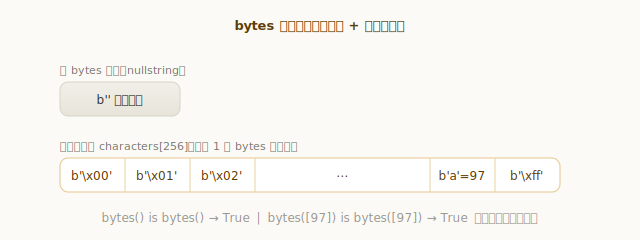
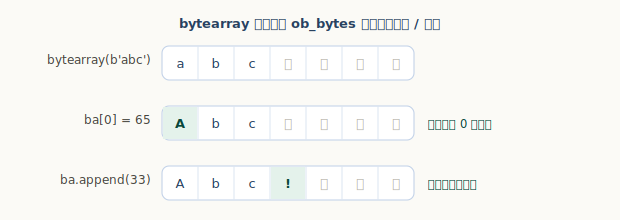

# Python bytes 与 bytearray 对象

字符串处理的是**文本**（Unicode 码点），而 `bytes` 和 `bytearray` 处理的是**原始字节**（0–255 的字节序列）——读写文件、网络收发、二进制协议，打交道的都是它们。这两者一不可变、一可变，正好和「字符串 / 列表」遥相呼应。

```python
>>> b = b"abc"
>>> b[0]              # 注意：索引返回的是整数，不是 b'a'
97
>>> b[1:3]            # 切片才返回 bytes
b'bc'
>>> "café".encode()  # str 编码成 bytes
b'caf\xc3\xa9'
```

第二行的 `97` 是很多人踩过的坑。这一章我们就来看 `PyBytesObject` 和 `PyByteArrayObject`。

## 数据结构：不可变的 bytes 与可变的 bytearray

先看不可变的 `bytes`：

`源文件：`[Include/bytesobject.h](https://github.com/python/cpython/blob/v3.7.0/Include/bytesobject.h#L31)

```c
// Include/bytesobject.h
typedef struct {
    PyObject_VAR_HEAD
    Py_hash_t ob_shash;     // 缓存的哈希值，-1 表示尚未计算
    char ob_sval[1];        // 内联的字节数组（末尾留一个 \0）
} PyBytesObject;
```

它和字符串的结构如出一辙：字节数据**内联**在对象自身里（`ob_sval`），整个 `bytes` 是**一块连续内存、不可变**，还把哈希缓存在 `ob_shash`。

再看可变的 `bytearray`：

`源文件：`[Include/bytearrayobject.h](https://github.com/python/cpython/blob/v3.7.0/Include/bytearrayobject.h#L23)

```c
// Include/bytearrayobject.h
typedef struct {
    PyObject_VAR_HEAD
    Py_ssize_t ob_alloc;    // 缓冲区已分配的字节数
    char *ob_bytes;         // 指向实际的字节缓冲（另一块内存）
    char *ob_start;         // 逻辑起点
    int ob_exports;         // 被导出为 buffer 的次数
} PyByteArrayObject;
```

它则像列表：`ob_bytes` 指向**另一块**可增长的缓冲，配合 `ob_alloc` 过分配，所以可变、可 `append`。


一句话对照：**`bytes` 像不可变的字符串，`bytearray` 像可变的列表（只不过元素是字节）。**

## 索引出整数，切片出 bytes

这是 `bytes`/`bytearray` 最容易让人意外的地方：**按下标取出的是整数，不是单字节的 bytes**。

```python
>>> b = b"abc"
>>> b[0]        # 整数（该字节的值，0–255）
97
>>> b[1:3]      # 切片才是 bytes
b'bc'
```


这和字符串不同——`"abc"[0]` 返回的是长度 1 的字符串 `'a'`。原因也好理解：字节本质就是 0–255 的数，用整数表示最自然。要把单个字节当 bytes，用切片 `b[0:1]` 或 `bytes([b[0]])`。

## bytes 的创建与缓存

`bytes` 也用了和小整数池同样的「缓存小对象」手法。看创建函数 `PyBytes_FromStringAndSize`：**长度 1 的 bytes 会被缓存复用**（共 256 种），空 bytes 则是单例：

`源文件：`[Objects/bytesobject.c](https://github.com/python/cpython/blob/v3.7.0/Objects/bytesobject.c#L101)

```c
// Objects/bytesobject.c
static PyBytesObject *characters[UCHAR_MAX + 1];   // 256 个单字节 bytes 缓存
static PyBytesObject *nullstring;                  // 空 bytes 单例

PyObject *
PyBytes_FromStringAndSize(const char *str, Py_ssize_t size)
{
    ......
    if (size == 1 && str != NULL &&
        (op = characters[*str & UCHAR_MAX]) != NULL)   // 命中单字节缓存
    {
        Py_INCREF(op);
        return (PyObject *)op;
    }
    op = (PyBytesObject *)_PyBytes_FromSize(size, 0);
    ......
    if (size == 1) {
        characters[*str & UCHAR_MAX] = op;             // 长度 1 → 存入缓存
        Py_INCREF(op);
    }
    return (PyObject *) op;
}
```



```python
>>> bytes() is bytes()              # 空 bytes 是单例
True
>>> bytes([97]) is bytes([97])      # 单字节 bytes 被缓存复用
True
```

## 不可变、可哈希 vs 可变、不可哈希

`bytes` 不可变，因此**可哈希**——哈希值算一次就缓存在 `ob_shash`（初始 -1），和字符串如出一辙：

`源文件：`[Objects/bytesobject.c](https://github.com/python/cpython/blob/v3.7.0/Objects/bytesobject.c#L1644)

```c
// Objects/bytesobject.c —— bytes_hash
if (a->ob_shash != -1)
    return a->ob_shash;     // 已算过，直接返回缓存
......
a->ob_shash = x;            // 算一次，存进 ob_shash
```

所以 `bytes` 能作字典键、集合元素。而 `bytearray` 可变，**不可哈希**：

```python
>>> b"abc"[0] = 65          # bytes 不可变
Traceback (most recent call last):
  ...
TypeError: 'bytes' object does not support item assignment
>>> hash(bytearray(b"abc")) # bytearray 不可哈希
Traceback (most recent call last):
  ...
TypeError: unhashable type: 'bytearray'
```

这又是「可变 ⇒ 不可哈希」的老规矩（和列表一样）。

## bytearray 的可变性与扩容

`bytearray` 支持原地修改和追加。看它在 `ob_bytes` 缓冲里改字节、往预留空位追加：

```python
>>> ba = bytearray(b"abc")
>>> ba[0] = 65          # 原地把第 0 个字节改成 'A'（65）
>>> ba.append(33)       # 追加一个字节 '!'（33）
>>> ba
bytearray(b'Abc!')
```



扩容由 `PyByteArray_Resize` 负责，它的过分配策略和列表**完全一样**——源码注释甚至直接写明「overallocate similar to list_resize()」：

`源文件：`[Objects/bytearrayobject.c](https://github.com/python/cpython/blob/v3.7.0/Objects/bytearrayobject.c#L228)

```c
// Objects/bytearrayobject.c —— PyByteArray_Resize
if (size <= alloc * 1.125) {
    /* Moderate upsize; overallocate similar to list_resize() */
    alloc = size + (size >> 3) + (size < 9 ? 3 : 6);
}
```

所以 `bytearray` 的 `append` 和列表一样是摊还 O(1)——预留的空位让大多数追加不必重新分配内存。

## bytes/bytearray 与 str：文本 vs 二进制

最后把三者放一起对照。它们都是「序列」，但分处两个世界：

| 类型 | 内容 | 可变性 | `x[0]` 返回 | 可哈希 |
|---|---|---|---|---|
| `str` | 文本（Unicode 码点） | 不可变 | 长度 1 的 `str` | 是 |
| `bytes` | 二进制（字节 0–255） | 不可变 | `int` | 是 |
| `bytearray` | 二进制（字节 0–255） | 可变 | `int` | 否 |

`str` 与 `bytes` 之间靠 **`encode` / `decode`** 转换（详见[《Python 字符串对象》](../str-object/)的「编码与解码」）：

```python
>>> "café".encode("utf-8")          # str → bytes
b'caf\xc3\xa9'
>>> b"caf\xc3\xa9".decode("utf-8")  # bytes → str
'café'
```

一个实用经验：**程序内部用 `str` 处理文本，只在 I/O 边界（文件、网络）转成 `bytes`**；需要可变的字节缓冲（如逐步拼接二进制数据）时用 `bytearray`。

---

小结一下：

- `bytes` 像**不可变的字符串**：字节数据**内联**在对象里（`ob_sval`），一块内存、哈希缓存在 `ob_shash`、可作字典键；并缓存了空串单例与 256 个单字节对象；
- `bytearray` 像**可变的列表**：`ob_bytes` 指向独立的可增长缓冲，按和列表相同的公式过分配，`append` 摊还 O(1)，但因可变而**不可哈希**；
- 两者**索引都返回整数**（0–255），切片才返回 `bytes`/`bytearray`——这是相对字符串的关键差异；
- `str` 是文本、`bytes`/`bytearray` 是二进制，靠 `encode`/`decode` 在边界处转换。
