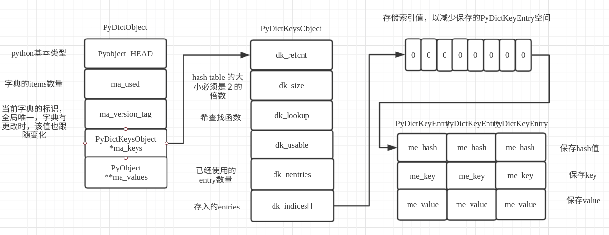

# Python字典

Dictionary object implementation using a hash table ，通过描述可知，python的字典就是实现了一个hash表。

## Python字典概述
在python的字典中，一个键值对的对应保存就是PyDictEntry类型来保存；

`源文件：`[Include/dict-common.h](https://github.com/python/cpython/blob/v3.7.0/Objects/dict-common.h#L1)

```c
// Objects/dict-common.h
typedef struct {
    /* Cached hash code of me_key. */
    Py_hash_t me_hash;
    PyObject *me_key;
    PyObject *me_value; /* This field is only meaningful for combined tables */
} PyDictKeyEntry;　
```

其中，me_hash就是哈希生成的值，me_key就是对应的key值，me_value就是对应的值。
在python中，在一个PyDictObject对象的变化过程中，entry的状态会在不同的状态间转换。基本上在如下四种状态中转换：Unused、Active、Dummy和Pending。

1. Unused:没有插入任何一个获取的key与value，并且在次之前也没有存储任何的key,value，每一个entry在初始化的时候都会处于这种状态，并且Unused会被里面切换到Active态，当有key插入，这是就是entry初始化的状态。
2. Active:当index>=0时，me_key不为空并且me_value不为空，保存了一个键值对，Active可以转变为Dummy或者Pending状态，当一个健被删除的时候，这只会在me_value不为空的时候出现。
3. Dummy:先前保存了一个Active的键值对，但是这个键值对被删除了并且一个活跃的键值对还没有填入该位置，Dummy可以转变为Active当删除的时候，Dummy的位置不能被重新使用，一旦发生碰撞，探针序列就无法知道这对键值对曾是活跃的键值对。
4. Pending:索引>=0，键！=空，值=空（仅拆分），尚未插入到拆分表中。


## 字典的两种类型

python的字典类型中包含了两种联合字典（split-table dictionaries)与分离字典(combined-table dictonaries)。详细的信息可查看有关dict的描述[pep-0412](<https://www.python.org/dev/peps/pep-0412/>)。

### split-table dictionaries

当被创建的字典是用来保存object的\_\_dict\_\_属性时，该字典才会创建为一个split-table，它们的健表都被缓存在类型属性中，并且允许所有该类型的实例都可以共享该keys。当出现一个事件讲字典的属性值进行改变的时候，个别字典讲慢慢的转化成组合表的形式。这就保证了在大部分的应用场景下很高的内存利用效率，并保证了在各个场景下的正确性。当split-dict重新改变大小，它会立马改变为一个combined-table，如果重置大小作为保存实例属性的结果，并且只有一个该object的实例，字典会立马再变为一个split-table。如果从split-table中删除一个key, value，它不会删除keys tables中对应的该值，而只是将values数值中移除了该value。

### combined-table dictionaries

直接通过dict內建函数与{}生成的字典，模块和大部分其他字典都会创建为combined-table字典，一个combined-table不会改变为一个split-table字典，该字典的行为方式与最初的字典的行为方式大致相同。


## 容器的相关数据结构

字典对象是通过PyDictObject来实现数据的，详情如下；

`源文件：`[Include/dictobject.h](https://github.com/python/cpython/blob/v3.7.0/Include/dictobject.h#L17)

```c
// Include/dictobject.h
typedef struct _dictkeysobject PyDictKeysObject;

/* The ma_values pointer is NULL for a combined table
 * or points to an array of PyObject* for a split table
 */
typedef struct {
    PyObject_HEAD

    /* Number of items in the dictionary */
    Py_ssize_t ma_used;　				// 使用的ｋｅｙｓ个数

    /* Dictionary version: globally unique, value change each time
       the dictionary is modified */
    uint64_t ma_version_tag;

    PyDictKeysObject *ma_keys;　　　　　// 如果有则是保存的keys数据

    /* If ma_values is NULL, the table is "combined": keys and values
       are stored in ma_keys.

       If ma_values is not NULL, the table is splitted:
       keys are stored in ma_keys and values are stored in ma_values */
    PyObject **ma_values;　			 // 如果不为空则保存的是values
} PyDictObject;
```

其中，PyDictKeysObject的定义如下；

`源文件：`[Include/dict-common.h](https://github.com/python/cpython/blob/v3.7.0/Objects/dict-common.h#L20)

```c
// Objects/dict-common.h
/* See dictobject.c for actual layout of DictKeysObject */
struct _dictkeysobject {
    Py_ssize_t dk_refcnt;　　　　　　　　　　　　　　　　　　// 引用计数

    /* Size of the hash table (dk_indices). It must be a power of 2. */
    Py_ssize_t dk_size;　　　　　　　　　　　　　　　　　　　// hash table 的大小必须是２的倍数

    /* Function to lookup in the hash table (dk_indices):

       - lookdict(): general-purpose, and may return DKIX_ERROR if (and
         only if) a comparison raises an exception.

       - lookdict_unicode(): specialized to Unicode string keys, comparison of
         which can never raise an exception; that function can never return
         DKIX_ERROR.

       - lookdict_unicode_nodummy(): similar to lookdict_unicode() but further
         specialized for Unicode string keys that cannot be the <dummy> value.

       - lookdict_split(): Version of lookdict() for split tables. */
    dict_lookup_func dk_lookup;                       // 哈希查找函数

    /* Number of usable entries in dk_entries. */
    Py_ssize_t dk_usable;                             // 可用的entry数量

    /* Number of used entries in dk_entries. */　
    Py_ssize_t dk_nentries;　　　　　　　　　            // 已经使用的entry数量

    /* Actual hash table of dk_size entries. It holds indices in dk_entries,
       or DKIX_EMPTY(-1) or DKIX_DUMMY(-2).

       Indices must be: 0 <= indice < USABLE_FRACTION(dk_size).

       The size in bytes of an indice depends on dk_size:

       - 1 byte if dk_size <= 0xff (char*)
       - 2 bytes if dk_size <= 0xffff (int16_t*)
       - 4 bytes if dk_size <= 0xffffffff (int32_t*)
       - 8 bytes otherwise (int64_t*)

       Dynamically sized, SIZEOF_VOID_P is minimum. */
    char dk_indices[];  /* char is required to avoid strict aliasing. */　　　// 存入的entries

    /* "PyDictKeyEntry dk_entries[dk_usable];" array follows:
       see the DK_ENTRIES() macro */
};
```

相关数据结构的内存布局为；


## Python字典示例

本次示例脚本如下：

```python
d = {}
d['1']='2'
d['1']='e'
d.pop('1')

```

通过Python的反汇编工具获取字节码；

```shell
python -m dis dict_test.py
```

输出的字节码如下；

```shell
  2           0 BUILD_MAP                0
              2 STORE_NAME               0 (d)

  3           4 LOAD_CONST               0 ('2')
              6 LOAD_NAME                0 (d)
              8 LOAD_CONST               1 ('1')
             10 STORE_SUBSCR

  4          12 LOAD_CONST               2 ('e')
             14 LOAD_NAME                0 (d)
             16 LOAD_CONST               1 ('1')
             18 STORE_SUBSCR

  5          20 LOAD_NAME                0 (d)
             22 LOAD_METHOD              1 (pop)
             24 LOAD_CONST               1 ('1')
             26 CALL_METHOD              1
             28 POP_TOP
             30 LOAD_CONST               3 (None)
             32 RETURN_VALUE
```

通过字节码指令可知，首先调用了BUILD_MAP来创建一个新的字典，接着就对新建的字典d进行了赋值操作与更新操作，最后调用了pop方法删除一个key。接下来就详细分析一下相关流程。

## 字典的初始化流程

通过查找BUILD_MAP的虚拟机执行函数；

`源文件：`[Python/ceval.c](https://github.com/python/cpython/blob/v3.7.0/Python/ceval.c#L2357)

```c
// Python/ceval.c
switch (opcode) {
    ...

    TARGET(BUILD_MAP) {
        Py_ssize_t i;
        PyObject *map = _PyDict_NewPresized((Py_ssize_t)oparg);    // 新建并初始化一个字典
        if (map == NULL)
            goto error;　                                          // 如果新建失败则报错
        for (i = oparg; i > 0; i--) {　                          　// 检查在新建的过程中是否通过参数传值
            int err;
            PyObject *key = PEEK(2*i);
            PyObject *value = PEEK(2*i - 1);
            err = PyDict_SetItem(map, key, value);　　        　　　// 找到对应的值并讲该值设置到map中
            if (err != 0) {　　　　　　　　　　　　　　　　　　　　　　　　// 检查是否报错
                Py_DECREF(map);
                goto error;　　　　　　　　　　　　　　　　　　　　　　　　// 如果错误就报错处理
            }
        }

        while (oparg--) {
            Py_DECREF(POP());　　　　　　　　　　　　　　　　　　　　　　　// 弹出栈上输入参数的引用
            Py_DECREF(POP());
        }
        PUSH(map);　　　　　　　　　　　　　　　　　　　　　　　　　　　　　　// 讲生成的map压栈
        DISPATCH();　　　　　　　　　　　　　　　　　　　　　　　　　　　　　// 检查是否需要执行下一条字节码指令
    }
}
```

从该函数的执行可知，初始化的函数是从_PyDict_NewPresized开始，该函数就是生成并初始化一个字典；

`源文件：`[Objects/dictobject.c](https://github.com/python/cpython/blob/v3.7.0/Objects/dictobject.c#L1240)

```c
// Objects/dictobject.c

PyObject *
_PyDict_NewPresized(Py_ssize_t minused)
{
    const Py_ssize_t max_presize = 128 * 1024;　         // 字典最大的容量
    Py_ssize_t newsize;
    PyDictKeysObject *new_keys;                         

    /* There are no strict guarantee that returned dict can contain minused
     * items without resize.  So we create medium size dict instead of very
     * large dict or MemoryError.
     */
    if (minused > USABLE_FRACTION(max_presize)) {       // 检查传入的数量是否超过最大值
        newsize = max_presize;
    }
    else {
        Py_ssize_t minsize = ESTIMATE_SIZE(minused);    // 获取最小的值,在新建一个空的字典的时候该值为０
        newsize = PyDict_MINSIZE;                       // 设置字典的最小值　为８
        while (newsize < minsize) {                     // 如果传入的值大于最小值则调整newsize 大小
            newsize <<= 1;
        }
    }
    assert(IS_POWER_OF_2(newsize));

    new_keys = new_keys_object(newsize);                // 生成并初始化一个PyDictKeysObject对象
    if (new_keys == NULL)
        return NULL;
    return new_dict(new_keys, NULL);                    // 生成一个新的对象并返回
}
```

首先，先计算出需要生成的字典的大小，然后再初始化一个PyDictKeysObject，最后就生成一个PyDictObject返回。继续查看new_keys_object的执行流程；

`源文件：`[Objects/dictobject.c](https://github.com/python/cpython/blob/v3.7.0/Objects/dictobject.c#L503)

```c
// Objects/dictobject.c

static PyDictKeysObject *new_keys_object(Py_ssize_t size)
{
    PyDictKeysObject *dk;
    Py_ssize_t es, usable;

    assert(size >= PyDict_MINSIZE);           // 检查size是否大于最小size
    assert(IS_POWER_OF_2(size));              // 检查是否是２的倍数

    usable = USABLE_FRACTION(size);           // 检查是否可用　　根据经验在１/2和２/3之间效果最好
    if (size <= 0xff) {
        es = 1;
    }
    else if (size <= 0xffff) {
        es = 2;
    }
#if SIZEOF_VOID_P > 4
    else if (size <= 0xffffffff) {
        es = 4;
    }
#endif
    else {
        es = sizeof(Py_ssize_t);
    }

    if (size == PyDict_MINSIZE && numfreekeys > 0) {　　　　　　// 是否有缓存，如果有缓存就选择缓存中的dk
        dk = keys_free_list[--numfreekeys];
    }
    else {
        dk = PyObject_MALLOC(sizeof(PyDictKeysObject)
                             + es * size
                             + sizeof(PyDictKeyEntry) * usable);    // 没有缓存可使用的字典则申请内存生成一个
        if (dk == NULL) {
            PyErr_NoMemory();
            return NULL;
        }
    }
    DK_DEBUG_INCREF dk->dk_refcnt = 1;                              // 设置引用计数
    dk->dk_size = size;                                             // 设置大小
    dk->dk_usable = usable;                                        // 设置是否可用
    dk->dk_lookup = lookdict_unicode_nodummy;                       // 设置查找函数
    dk->dk_nentries = 0;
    memset(&dk->dk_indices[0], 0xff, es * size);                    // 将申请的内存置空
    memset(DK_ENTRIES(dk), 0, sizeof(PyDictKeyEntry) * usable);     
    return dk;
}
```

主要就是通过传入的size，检查是否超过设置的大小，检查是否有缓存的字典数据可用，如果没有则申请内存重新生成一个dk，最后进行申请到的内存讲内容清空。接着就会进行new_dict初始化数据；

`源文件：`[Objects/dictobject.c](https://github.com/python/cpython/blob/v3.7.0/Objects/dictobject.c#L568)

```c
// Objects/dictobject.c

/* Consumes a reference to the keys object */
static PyObject *
new_dict(PyDictKeysObject *keys, PyObject **values)
{
    PyDictObject *mp;
    assert(keys != NULL);
    if (numfree) {　　　　　　　　　　　　　　　　　　　　　　　　　　　　// 判断缓冲池是否有
        mp = free_list[--numfree];
        assert (mp != NULL);
        assert (Py_TYPE(mp) == &PyDict_Type);　
        _Py_NewReference((PyObject *)mp);　　　　　　　　　　　　　　// 使用缓冲池对象　　　　
    }
    else {
        mp = PyObject_GC_New(PyDictObject, &PyDict_Type);　　　　// 缓冲池没有则申请新的对象并初始化
        if (mp == NULL) {
            DK_DECREF(keys);
            free_values(values);
            return NULL;
        }
    }
    mp->ma_keys = keys;
    mp->ma_values = values;
    mp->ma_used = 0;　　　　　　　　　　　　　　　　　　　　　　　　　　　// 设置ma_used为0
    mp->ma_version_tag = DICT_NEXT_VERSION();
    assert(_PyDict_CheckConsistency(mp));
    return (PyObject *)mp;
}
```

new_dict就是根据keys，values设置到从缓冲池或者新生成一个dict对象，最后返回。至此，dict的创建工作已经完成。

## 字典的插入与查找

通过字节码的指令STORE_SUBSCR可知，该命令就是讲'1'作为key, '2'作为value插入到d中，此时查看该执行函数；

`源文件：`[Python/ceval.c](https://github.com/python/cpython/blob/v3.7.0/Python/ceval.c#L1561)

```c
// Python/ceval.c
switch (opcode) {
    ...

    TARGET(STORE_SUBSCR) {
        PyObject *sub = TOP();                 // 第一个值为key
        PyObject *container = SECOND();        // 该为字典对象 
        PyObject *v = THIRD();                 // 该为value
        int err;
        STACKADJ(-3);
        /* container[sub] = v */
        err = PyObject_SetItem(container, sub, v);  // 调用该方法设置值
        Py_DECREF(v);
        Py_DECREF(container);
        Py_DECREF(sub);
        if (err != 0)
            goto error;
        DISPATCH();
    }
}
```

此时，从栈中取出相关参数，并将这些值传入PyObject_SetItem函数进行处理设置值；

`源文件：`[Objects/abstract.c](https://github.com/python/cpython/blob/v3.7.0/Objects/abstract.c#L186)

```c
// Objects/abstract.c
int
PyObject_SetItem(PyObject *o, PyObject *key, PyObject *value)
{
    PyMappingMethods *m;

    if (o == NULL || key == NULL || value == NULL) {　　　　　　　　　　　// 检查是否为空如果任一为空则报错
        null_error();
        return -1;
    }
    m = o->ob_type->tp_as_mapping;　　　　　　　　　　　　　　　　　　　　　　// 获取类型的tp_as_mapping方法集　　　　　            
    if (m && m->mp_ass_subscript)　　　　　　　　　　　　　　　　　　　　　　　// 如果有设置该类型
        return m->mp_ass_subscript(o, key, value);                    // 调用该mp_ass_subscript方法

    if (o->ob_type->tp_as_sequence) {                                 // 获取作为队列的操作集
        if (PyIndex_Check(key)) {　　　　　　　　　　　　　　　　　　　　　　　// 检查key是否是索引
            Py_ssize_t key_value;
            key_value = PyNumber_AsSsize_t(key, PyExc_IndexError);　
            if (key_value == -1 && PyErr_Occurred())
                return -1;
            return PySequence_SetItem(o, key_value, value);　　　　　　　// 调用索引插入
        }
        else if (o->ob_type->tp_as_sequence->sq_ass_item) {
            type_error("sequence index must be "
                       "integer, not '%.200s'", key);
            return -1;
        }
    }

    type_error("'%.200s' object does not support item assignment", o);　　　// 则该类型对象不支持设置
    return -1;
}
```

其中就调用了字典的tp_as_mapping的方法集，并调用了该方法集的mp_ass_subscript方法；此时我们分析一下，dict的tp_as_mapping的方法集。此时就调用了tp_as_mapping的mp_ass_subscript方法，此时就是调用dict的dict_ass_sub方法；

`源文件：`[Objects/dictobject.c](https://github.com/python/cpython/blob/v3.7.0/Objects/dictobject.c#L2040)

```c
// Objects/dictobject.c
static int
dict_ass_sub(PyDictObject *mp, PyObject *v, PyObject *w)
{
    if (w == NULL)
        return PyDict_DelItem((PyObject *)mp, v);
    else
        return PyDict_SetItem((PyObject *)mp, v, w);
}
```

可知，删除一个key就是PyDict_DelItem,设置一个key就是PyDict_SetItem；

`源文件：`[Objects/dictobject.c](https://github.com/python/cpython/blob/v3.7.0/Objects/dictobject.c#L1433)

```c
// Objects/dictobject.c
int
PyDict_SetItem(PyObject *op, PyObject *key, PyObject *value)
{
    PyDictObject *mp;
    Py_hash_t hash;
    if (!PyDict_Check(op)) {　　　　　　　　　　　 // 检查是否是字典类型
        PyErr_BadInternalCall();
        return -1;
    }
    assert(key);
    assert(value);
    mp = (PyDictObject *)op;
    if (!PyUnicode_CheckExact(key) ||
        (hash = ((PyASCIIObject *) key)->hash) == -1)　　// 检查传入的key是否hash为-1
    {
        hash = PyObject_Hash(key);                      // 生成hash调用key对应的tp_hash方法，在本例中传入的是str类型，则调用str类型的tp_hash方法
        if (hash == -1)
            return -1;
    }

    /* insertdict() handles any resizing that might be necessary */
    return insertdict(mp, key, hash, value);          // 生成hash调用key对应的tp_hash方法
}

```

insertdict方法就是将生成的方法，插入到字典中去；

`源文件：`[Objects/dictobject.c](https://github.com/python/cpython/blob/v3.7.0/Objects/dictobject.c#L987)

```c
// Objects/dictobject.c
static int
insertdict(PyDictObject *mp, PyObject *key, Py_hash_t hash, PyObject *value)
{
    PyObject *old_value;
    PyDictKeyEntry *ep;

    Py_INCREF(key);
    Py_INCREF(value);
    if (mp->ma_values != NULL && !PyUnicode_CheckExact(key)) {  
        if (insertion_resize(mp) < 0)                     // 重新设置mp的大小  如果ma_values有值
            goto Fail;
    }

    Py_ssize_t ix = mp->ma_keys->dk_lookup(mp, key, hash, &old_value);　　　　 // 调用查找方法
    if (ix == DKIX_ERROR)
        goto Fail;

    assert(PyUnicode_CheckExact(key) || mp->ma_keys->dk_lookup == lookdict);
    MAINTAIN_TRACKING(mp, key, value);                                        // 检查mp key values是否需要加入垃圾回收

    /* When insertion order is different from shared key, we can't share
     * the key anymore.  Convert this instance to combine table.
     */
    if (_PyDict_HasSplitTable(mp) &&
        ((ix >= 0 && old_value == NULL && mp->ma_used != ix) ||
         (ix == DKIX_EMPTY && mp->ma_used != mp->ma_keys->dk_nentries))) {　　// 检查是否是分离表，如果没查找到旧值并且
        if (insertion_resize(mp) < 0)　　　　　　　　　　　　　　　　　　　　　　　　　// 重新设置该字典大小
            goto Fail;
        ix = DKIX_EMPTY;
    }

    if (ix == DKIX_EMPTY) {
        /* Insert into new slot. */
        assert(old_value == NULL);
        if (mp->ma_keys->dk_usable <= 0) {　　　　　　　　　　　　　　　　　　　　　　// 如果可用的值小于０
            /* Need to resize. */
            if (insertion_resize(mp) < 0)　　　　　　　　　　　　　　　　　　　　　　　// 需要重新扩展字典大小
                goto Fail;
        }
        Py_ssize_t hashpos = find_empty_slot(mp->ma_keys, hash);　　　　　　　　　// 查找一个可用的hash位置
        ep = &DK_ENTRIES(mp->ma_keys)[mp->ma_keys->dk_nentries];　　　　　　　　　// 获取存取的地址
        dk_set_index(mp->ma_keys, hashpos, mp->ma_keys->dk_nentries);　　　　　　// 设置该值
        ep->me_key = key;　　　　　　　　　　　　　　　　　　　　　　　　　　　　　　　　　// 保存key
        ep->me_hash = hash;                                                   // 保存计算得出的hash值
        if (mp->ma_values) {　　　　　　　　　　　　　　　　　　　　　　　　　　　　　　　// 如果mp的ma_values有值
            assert (mp->ma_values[mp->ma_keys->dk_nentries] == NULL);
            mp->ma_values[mp->ma_keys->dk_nentries] = value;　　　　　　　　　　　// 设置该key对应的value
        }
        else {
            ep->me_value = value;                                             // 直接讲value设置到entry上面
        }
        mp->ma_used++;　　　　　　　　　　　　　　　　　　　　　　　　　　　　　　　　　　 // 使用个数加１
        mp->ma_version_tag = DICT_NEXT_VERSION();　　
        mp->ma_keys->dk_usable--;　　　　　　　　　　　　　　　　　　　　　　　　　　　　// 可用减１
        mp->ma_keys->dk_nentries++;
        assert(mp->ma_keys->dk_usable >= 0);
        assert(_PyDict_CheckConsistency(mp));
        return 0;
    }

    if (_PyDict_HasSplitTable(mp)) {                                         // 如果是分离的
        mp->ma_values[ix] = value;                                           // 直接设置ma_values对应的ix到values中
        if (old_value == NULL) {
            /* pending state */
            assert(ix == mp->ma_used);
            mp->ma_used++;　　　　　　　　　　　　　　　　　　　　　　　　　　　　　　　// 使用加１
        }
    }
    else {
        assert(old_value != NULL);
        DK_ENTRIES(mp->ma_keys)[ix].me_value = value;
    }

    mp->ma_version_tag = DICT_NEXT_VERSION();
    Py_XDECREF(old_value); /* which **CAN** re-enter (see issue #22653) */
    assert(_PyDict_CheckConsistency(mp));
    Py_DECREF(key);
    return 0;

Fail:
    Py_DECREF(value);
    Py_DECREF(key);
    return -1;
}
```

首先会调用相关的查找方法，去查找待搜索的值是否已经存在字典中，如果当前字典数据已经满了则会按照增长大小的函数生成一个新的字典，并把旧数据设置到新的字典中，当找到的字典匹配时则返回。

其中dk_lookup对应的方法，在初始化之后对应的是lookdict_unicode_nodummy；

`源文件：`[Objects/dictobject.c](https://github.com/python/cpython/blob/v3.7.0/Objects/dictobject.c#L813)

```c
// Objects/dictobject.c

/* Faster version of lookdict_unicode when it is known that no <dummy> keys
 * will be present. */
static Py_ssize_t _Py_HOT_FUNCTION
lookdict_unicode_nodummy(PyDictObject *mp, PyObject *key,
                         Py_hash_t hash, PyObject **value_addr)
{
    assert(mp->ma_values == NULL);
    /* Make sure this function doesn't have to handle non-unicode keys,
       including subclasses of str; e.g., one reason to subclass
       unicodes is to override __eq__, and for speed we don't cater to
       that here. */
    if (!PyUnicode_CheckExact(key)) {　　　　　　　　　　　　　　　　　　　　　// 检查如果不是ｕｎicode则直接调用lookdict方法查找
        mp->ma_keys->dk_lookup = lookdict;
        return lookdict(mp, key, hash, value_addr);
    }

    PyDictKeyEntry *ep0 = DK_ENTRIES(mp->ma_keys);　　　　　　　　　　　　　// 获取keys的首个元素地址
    size_t mask = DK_MASK(mp->ma_keys);　　　　　　　　　　　　　　　　　　　　// 获取大小
    size_t perturb = (size_t)hash;
    size_t i = (size_t)hash & mask;　　　　　　　　　　　　　　　　　　　　　　　// 获取生成的最终的值　　　　　　　　　　　　　　　　　

    for (;;) {
        Py_ssize_t ix = dk_get_index(mp->ma_keys, i);                // 便利ma_keys　ｋey列表
        assert (ix != DKIX_DUMMY);　　　　　　　　　　　　　　　　　　　　　// 判断不能为空
        if (ix == DKIX_EMPTY) {                                     // 如果为空则证明找到一个可以使用的
            *value_addr = NULL;　　　　　　　　　　　　　　　　　　　　　　　// 讲key对应的value设置为空
            return DKIX_EMPTY;　　　　　　　　　　　　　　　　　　　　　　　 // 返回
        }
        PyDictKeyEntry *ep = &ep0[ix];           　　　　　　　　　　　　// 获取该位置元素值                  
        assert(ep->me_key != NULL);
        assert(PyUnicode_CheckExact(ep->me_key));
        if (ep->me_key == key ||
            (ep->me_hash == hash && unicode_eq(ep->me_key, key))) {　　// 如果key相同 ｈａｓｈ值也相同
            *value_addr = ep->me_value;　　　　　　　　　　　　　　　　　　　 // 将该值赋值
            return ix;
        }
        perturb >>= PERTURB_SHIFT;　　　　　　　　　　　　　　　　　　　　　　// 偏移
        i = mask & (i*5 + perturb + 1);　　　　　　　　　　　　　　　　　　　// 获取下一个位置
    }
    Py_UNREACHABLE();
}
```

该函数的主要工作就是查找，字典中是否有空余的值，或者如果找到了满足hash值与key相同的就将value设置为找到的值（这也是字典查找的核心逻辑）。至此，字典的插入的大致流程已经分析完毕。


## Python字典的操作测试

现在我们动手观看一下具体的操作实例，首先声明，该例子仅供调试使用，目前调试的字典的key与value都是float类型并且不能del或者pop其中的key。操作字典如下所示；

```python
ｄ = {20000:2}
d[1] = 2
d[3] = 2
```

首先，讲如下代码插入到dictobject.c的1060行；

```c
// 测试代码
PyObject* key1 = PyLong_FromLong(20000);
Py_hash_t hash1 = PyObject_Hash(key1);
PyObject* old_value1;
Py_ssize_t ix1 = mp->ma_keys->dk_lookup(mp, key1, hash1, &old_value1);
if (ix1 == 0){
    PyLongObject* give;
    give = (PyLongObject* )key1;
    printf("found value : %ld\n", give->ob_digit[0]);
    PyDictKeyEntry *ep01 = DK_ENTRIES(mp->ma_keys);
    int i, count;
    count = mp->ma_used;
    int size_count, j;
    size_count = mp->ma_keys->dk_size;
    printf("%s ", mp->ma_keys->dk_indices);
    int8_t *indices = (int8_t*)(mp->ma_keys->dk_indices);
    printf("indices index values :");
    for (j=0; j<size_count;j++){
        printf("%d  ",(char) indices[j]);
    }
    printf("\n");
    for (i=0; i<count;i++){
        give = (PyLongObject* )ep01->me_key;
        printf("size : %d ", mp->ma_keys->dk_size);
        printf("found value while 　key : %ld   ", give->ob_digit[0]);
        give = (PyLongObject* )ep01->me_value;
        printf("value  : %ld\n", give->ob_digit[0]);
        ep01++;
    }
}
```

然后编译运行；

```python
Python 3.7.3 (default, May 22 2019, 16:17:57) 
[GCC 7.3.0] on linux
Type "help", "copyright", "credits" or "license" for more information.
>>> d = {20000:2}
found value : 20000
 indices index values :0  -1  -1  -1  -1  -1  -1  -1  
size : 8 found value while 　key : 20000   value  : 2
```

其中为什么初始化的时候输入20000，是根据代码找到相关的key值，因为字典也被python自身实现的结构中引用了多次，所以我们就设置了一个特殊值来跟踪我们想要的字典；当d初始化的时候，就输出如上所示内容；我们接下来继续操作；

```python
>>> d = {20000:2}
found value : 20000
 indices index values :0  -1  -1  -1  -1  -1  -1  -1  
size : 8 found value while 　key : 20000   value  : 2
>>> d[2] = 3
found value : 20000
 indices index values :0  -1  1  -1  -1  -1  -1  -1  
size : 8 found value while 　key : 20000   value  : 2
size : 8 found value while 　key : 2   value  : 3
>>> d[3] = 4
found value : 20000
 indices index values :0  -1  1  2  -1  -1  -1  -1  
size : 8 found value while 　key : 20000   value  : 2
size : 8 found value while 　key : 2   value  : 3
size : 8 found value while 　key : 3   value  : 4
>>> d[5] = 6
found value : 20000
 indices index values :0  -1  1  2  -1  3  -1  -1  
size : 8 found value while 　key : 20000   value  : 2
size : 8 found value while 　key : 2   value  : 3
size : 8 found value while 　key : 3   value  : 4
size : 8 found value while 　key : 5   value  : 6
>>> d[7] = 8
found value : 20000
 indices index values :0  -1  1  2  -1  3  -1  4  
size : 8 found value while 　key : 20000   value  : 2
size : 8 found value while 　key : 2   value  : 3
size : 8 found value while 　key : 3   value  : 4
size : 8 found value while 　key : 5   value  : 6
size : 8 found value while 　key : 7   value  : 8
```

此后我们一直添加值进d，从输出信息可知，index就是记录了PyDictKeyEntry的索引值，-1就表示该处未使用。
当我们继续向d中添加内容时；

```python
>>> d[9] = 10
found value : 20000
 indices index values :0  -1  1  2  -1  3  -1  4  -1  5  -1  -1  -1  -1  -1  -1  
size : 16 found value while 　key : 20000   value  : 2
size : 16 found value while 　key : 2   value  : 3
size : 16 found value while 　key : 3   value  : 4
size : 16 found value while 　key : 5   value  : 6
size : 16 found value while 　key : 7   value  : 8
size : 16 found value while 　key : 9   value  : 10
>>> d[10] = 11
found value : 20000
 indices index values :0  -1  1  2  -1  3  -1  4  -1  5  6  -1  -1  -1  -1  -1  
size : 16 found value while 　key : 20000   value  : 2
size : 16 found value while 　key : 2   value  : 3
size : 16 found value while 　key : 3   value  : 4
size : 16 found value while 　key : 5   value  : 6
size : 16 found value while 　key : 7   value  : 8
size : 16 found value while 　key : 9   value  : 10
size : 16 found value while 　key : 10   value  : 11
```

从输出内容可知，字典的大小随之改变了，这也说明了python字典的最佳大小容量限定在1/2到2/3之间，如果超过这个阈值则字典就会自动扩容，扩容的策略大家可详细查看源码。
