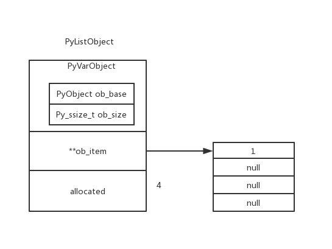

# Python List 对象

在Python中的list可以存放任何类型的数据，查看`PyListObject`可以发现，list实际存放的是PyObject* 指针

## PyListObject

`源文件：`[Include/listobject.h](https://github.com/python/cpython/blob/v3.7.0/Include/listobject.h#L23)

```c
// listobject.h

typedef struct {
    PyObject_VAR_HEAD
    /* Vector of pointers to list elements.  list[0] is ob_item[0], etc. */
    PyObject **ob_item;

    /* ob_item contains space for 'allocated' elements.  The number
     * currently in use is ob_size.
     * Invariants:
     *     0 <= ob_size <= allocated
     *     len(list) == ob_size
     *     ob_item == NULL implies ob_size == allocated == 0
     * list.sort() temporarily sets allocated to -1 to detect mutations.
     *
     * Items must normally not be NULL, except during construction when
     * the list is not yet visible outside the function that builds it.
     */

    // 可容纳元素的总数
    Py_ssize_t allocated;
} PyListObject;
```

示例
```python
lst = []
lst.append(1)
```

其存储结构如下图




## PyListObject对象的一些操作

- 创建PyListObject PyList_New
- 对象赋值 PyList_SetItem
- 获取元素 PyList_GetItem
- 插入元素 PyList_Insert
- 追加元素 PyList_Append
- 移除元素 list_remove
- 调整list大小 list_resize

### PyList_New 创建对象

为了避免频繁的申请内存空间，创建PyListObject的时候会先检查缓冲池是否有可用空间

`源文件：`[Objects/listobject.c](https://github.com/python/cpython/blob/v3.7.0/Objects/listobject.c#L136)

```c
// listobject.c

PyObject *
PyList_New(Py_ssize_t size)
{
    PyListObject *op;
#ifdef SHOW_ALLOC_COUNT
    static int initialized = 0;
    if (!initialized) {
        Py_AtExit(show_alloc);
        initialized = 1;
    }
#endif

    // size 合法性检查
    if (size < 0) {
        PyErr_BadInternalCall();
        return NULL;
    }

    // PyListObject对象缓冲池是否有可用空间
    if (numfree) {
        numfree--;
        op = free_list[numfree];
        _Py_NewReference((PyObject *)op);
#ifdef SHOW_ALLOC_COUNT
        count_reuse++;
#endif
    } else {
        // 缓冲池满只能向系统申请内存
        op = PyObject_GC_New(PyListObject, &PyList_Type);
        if (op == NULL)
            return NULL;
#ifdef SHOW_ALLOC_COUNT
        count_alloc++;
#endif
    }
    if (size <= 0)
        op->ob_item = NULL;
    else {
        op->ob_item = (PyObject **) PyMem_Calloc(size, sizeof(PyObject *));
        if (op->ob_item == NULL) {
            Py_DECREF(op);
            return PyErr_NoMemory();
        }
    }
    Py_SIZE(op) = size;
    op->allocated = size;
    _PyObject_GC_TRACK(op);
    return (PyObject *) op;
}
```

PyListObject缓冲池默认大小为80 `源文件：`[Include/listobject.c](https://github.com/python/cpython/blob/v3.7.0/Objects/listobject.c#L101)

```c
// listobject.c

/* Empty list reuse scheme to save calls to malloc and free */
#ifndef PyList_MAXFREELIST
#define PyList_MAXFREELIST 80
#endif
static PyListObject *free_list[PyList_MAXFREELIST];
static int numfree = 0;
```

### PyList_SetItem 元素赋值

`源文件：`[Objects/listobject.c](https://github.com/python/cpython/blob/v3.7.0/Objects/listobject.c#L215)

```c
// listobject.c

int
PyList_SetItem(PyObject *op, Py_ssize_t i,
               PyObject *newitem)
{
    PyObject **p;
    if (!PyList_Check(op)) {
        Py_XDECREF(newitem);
        PyErr_BadInternalCall();
        return -1;
    }
    if (i < 0 || i >= Py_SIZE(op)) {
        Py_XDECREF(newitem);
        PyErr_SetString(PyExc_IndexError,
                        "list assignment index out of range");
        return -1;
    }
    p = ((PyListObject *)op) -> ob_item + i;
    Py_XSETREF(*p, newitem);
    return 0;
}
```

元素赋值的示例

```python
lst = [0, 1, 2]
lst[0] = 3
# 这里 lst[0] = 3 会调用 PyList_SetItem 函数
```


### PyList_GetItem 获取元素

`源文件：`[Objects/listobject.c](https://github.com/python/cpython/blob/v3.7.0/Objects/listobject.c#L195)

```c
// Objects/listobject.c

PyObject *
PyList_GetItem(PyObject *op, Py_ssize_t i)
{
    if (!PyList_Check(op)) {
        PyErr_BadInternalCall();
        return NULL;
    }
    if (i < 0 || i >= Py_SIZE(op)) {
        if (indexerr == NULL) {
            indexerr = PyUnicode_FromString(
                "list index out of range");
            if (indexerr == NULL)
                return NULL;
        }
        PyErr_SetObject(PyExc_IndexError, indexerr);
        return NULL;
    }
    return ((PyListObject *)op) -> ob_item[i];
}
```

获取元素的示例

```python
lst = [1, 2, 3, 4]
print(lst[3])
# lst[3] 实际调用的就是 PyList_GetItem
# 根据索引返回对应的元素
```


### PyList_Append 追加元素

PyList_Append 调用 app1

```c
int
PyList_Append(PyObject *op, PyObject *newitem)
{
    if (PyList_Check(op) && (newitem != NULL))
        return app1((PyListObject *)op, newitem);
    PyErr_BadInternalCall();
    return -1;
}
```

`源文件：`[Objects/listobject.c](https://github.com/python/cpython/blob/v3.7.0/Objects/listobject.c#L279)

```c
// Objects/listobject.c

static int
app1(PyListObject *self, PyObject *v)
{
    Py_ssize_t n = PyList_GET_SIZE(self);

    assert (v != NULL);
    if (n == PY_SSIZE_T_MAX) {
        PyErr_SetString(PyExc_OverflowError,
            "cannot add more objects to list");
        return -1;
    }

    if (list_resize(self, n+1) < 0)
        return -1;

    Py_INCREF(v);
    PyList_SET_ITEM(self, n, v);
    return 0;
}
```

从`app1`代码可以看出追加元素操作大致流程如下
- 调用list_resize，将list大小加一
- 将元素插入list尾部

### PyList_Insert 插入元素

PyList_Insert 调用 ins1

```c
int
PyList_Insert(PyObject *op, Py_ssize_t where, PyObject *newitem)
{
    if (!PyList_Check(op)) {
        PyErr_BadInternalCall();
        return -1;
    }
    return ins1((PyListObject *)op, where, newitem);
}
```

`源文件：`[Objects/listobject.c](https://github.com/python/cpython/blob/v3.7.0/Objects/listobject.c#L236)

```c
// Objects/listobject.c

static int
ins1(PyListObject *self, Py_ssize_t where, PyObject *v)
{
    Py_ssize_t i, n = Py_SIZE(self);
    PyObject **items;
    if (v == NULL) {
        PyErr_BadInternalCall();
        return -1;
    }
    if (n == PY_SSIZE_T_MAX) {
        PyErr_SetString(PyExc_OverflowError,
            "cannot add more objects to list");
        return -1;
    }

    if (list_resize(self, n+1) < 0)
        return -1;

    if (where < 0) {
        where += n;
        if (where < 0)
            where = 0;
    }
    if (where > n)
        where = n;
    items = self->ob_item;
    for (i = n; --i >= where; )
        items[i+1] = items[i];
    Py_INCREF(v);
    items[where] = v;
    return 0;
}
```

从`ins1`代码可以看出插入元素操作大致流程如下
- 调用list_resize，将list大小加一
- 将要插入的位置的元素都往后移一个位置
- 将元素插入指定位置

### list_remove 移除元素

`源文件：`[Objects/listobject.c](https://github.com/python/cpython/blob/v3.7.0/Objects/listobject.c#L2546)

```c
// listobject.c

static PyObject *
list_remove(PyListObject *self, PyObject *value)
/*[clinic end generated code: output=f087e1951a5e30d1 input=2dc2ba5bb2fb1f82]*/
{
    Py_ssize_t i;

    for (i = 0; i < Py_SIZE(self); i++) {
        int cmp = PyObject_RichCompareBool(self->ob_item[i], value, Py_EQ);
        if (cmp > 0) {
            if (list_ass_slice(self, i, i+1,
                               (PyObject *)NULL) == 0)
                Py_RETURN_NONE;
            return NULL;
        }
        else if (cmp < 0)
            return NULL;
    }
    PyErr_SetString(PyExc_ValueError, "list.remove(x): x not in list");
    return NULL;
}
```

移除元素示例

```python
lst = [0, 2, 4, 3]
lst.remove(3)
"""
lst.remove(3) 会调用 list_remove函数，
list_remove函数会遍历列表，使用PyObject_RichCompareBool与目标值进行比较，
相同则调用list_ass_slice进行移除，当遍历完列表还未找到则报错
"""
```

### list_resize 调整list存储空间

随着list元素的增加，list的存储空间可能会不够用，这个时候就需要扩大list的存储空间。
随着list元素的减少，list的存储空间可能存在冗余，这个时候就需要缩小list的存储空间。
函数`list_resize`就是用于调节list存储空间大小的

`源文件：`[Objects/listobject.c](https://github.com/python/cpython/blob/v3.7.0/Objects/listobject.c#L19)

```c
// listobject.c

static int
list_resize(PyListObject *self, Py_ssize_t newsize)
{
    PyObject **items;
    size_t new_allocated, num_allocated_bytes;
    Py_ssize_t allocated = self->allocated;

    /* Bypass realloc() when a previous overallocation is large enough
       to accommodate the newsize.  If the newsize falls lower than half
       the allocated size, then proceed with the realloc() to shrink the list.
    */
    if (allocated >= newsize && newsize >= (allocated >> 1)) {
        assert(self->ob_item != NULL || newsize == 0);
        Py_SIZE(self) = newsize;
        return 0;
    }

    /* This over-allocates proportional to the list size, making room
     * for additional growth.  The over-allocation is mild, but is
     * enough to give linear-time amortized behavior over a long
     * sequence of appends() in the presence of a poorly-performing
     * system realloc().
     * The growth pattern is:  0, 4, 8, 16, 25, 35, 46, 58, 72, 88, ...
     * Note: new_allocated won't overflow because the largest possible value
     *       is PY_SSIZE_T_MAX * (9 / 8) + 6 which always fits in a size_t.
     */
    new_allocated = (size_t)newsize + (newsize >> 3) + (newsize < 9 ? 3 : 6);
    if (new_allocated > (size_t)PY_SSIZE_T_MAX / sizeof(PyObject *)) {
        PyErr_NoMemory();
        return -1;
    }

    if (newsize == 0)
        new_allocated = 0;
    num_allocated_bytes = new_allocated * sizeof(PyObject *);
    items = (PyObject **)PyMem_Realloc(self->ob_item, num_allocated_bytes);
    if (items == NULL) {
        PyErr_NoMemory();
        return -1;
    }
    self->ob_item = items;
    Py_SIZE(self) = newsize;
    self->allocated = new_allocated;
    return 0;
}
```

当 `allocated/2 <= newsize <= allocated` 时，list_resize只会改变 ob_size不会改变allocated。
其他情况则需要调用`PyMem_Realloc`函数分配新的空间存储列表元素。

列表allocated的增长模式是 0, 4, 8, 16, 25, 35, 46, 58, 72, 88, ...

其公式为 `new_allocated = (size_t)newsize + (newsize >> 3) + (newsize < 9 ? 3 : 6)`
