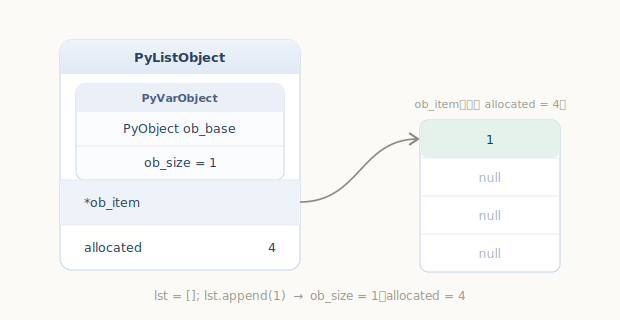
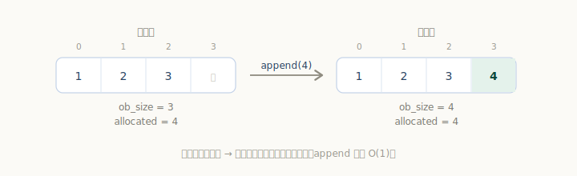
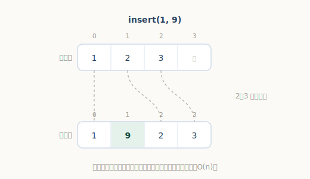
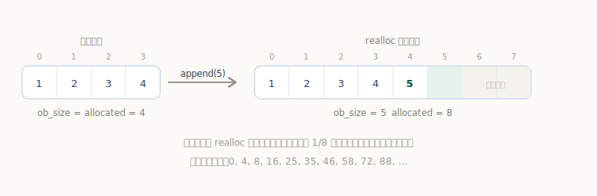
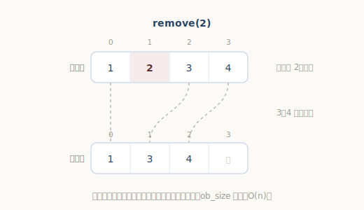

# Python 列表对象

`list` 大概是 Python 里用得最顺手的容器：能装任意类型、随便混搭，下标访问飞快，`append` 起来也不心疼。

```python
>>> lst = [1, "hello", 3.14, [2, 3]]   # 什么类型都能往里放
>>> lst[0]                             # 下标访问，瞬间返回
1
>>> lst.append("new")                  # 追加，几乎不花时间
```

它凭什么能「什么都装」又「下标飞快」？答案藏在一个关键设计里：**`list` 存的不是元素本身，而是一排指向元素的指针**。这一章我们就来看 `PyListObject` 是怎么实现这个「动态指针数组」的。

## PyListObject：一排指针 + 容量账本

`源文件：`[Include/listobject.h](https://github.com/python/cpython/blob/v3.7.0/Include/listobject.h#L23)

```c
// Include/listobject.h
typedef struct {
    PyObject_VAR_HEAD          // 变长对象头，含 ob_size = 当前元素个数
    PyObject **ob_item;        // 指向「元素指针数组」的指针
    Py_ssize_t allocated;      // 已申请的容量（可容纳多少个元素）
} PyListObject;
```

短短三部分，却把 `list` 的两个特性都解释清楚了：

- **`ob_item`** 是一个 `PyObject **`——指向一段连续内存，里面存的是一个个 `PyObject *` 指针，`list[i]` 就是 `ob_item[i]`。因为存的是「指针」而非对象本体，所以列表能混装任意类型；因为指针数组连续排列，所以按下标取值是一次地址计算，**O(1)**。
- **`ob_size` 与 `allocated`** 是一对「容量账本」：`ob_size`（来自对象头）是**当前实际元素个数**（就是 `len(lst)`），`allocated` 是**已经申请好的容量**。两者满足 `0 <= ob_size <= allocated`——也就是说，列表往往会**预留一些空位**，不会每加一个元素就重新申请内存。这个细节正是 `append` 高效的关键，后面会细讲。

来看个最简单的例子：

```python
lst = []
lst.append(1)
```

执行后，列表里有 1 个元素（`ob_size == 1`），但底层一次就申请了 4 个空位（`allocated == 4`），`ob_item[0]` 指向整数对象 `1`，其余空位待填：



## 列表的创建

频繁创建、销毁列表（比如循环里不断生成临时列表）开销不小。CPython 为此准备了一个**空闲列表对象缓冲池** `free_list`，销毁的列表对象先回收到池里，下次创建时优先复用：

`源文件：`[Objects/listobject.c](https://github.com/python/cpython/blob/v3.7.0/Objects/listobject.c#L104)

```c
// Objects/listobject.c
/* Empty list reuse scheme to save calls to malloc and free */
#ifndef PyList_MAXFREELIST
#define PyList_MAXFREELIST 80               // 缓冲池最多缓存 80 个列表对象
#endif
static PyListObject *free_list[PyList_MAXFREELIST];
static int numfree = 0;
```

创建函数 `PyList_New` 的逻辑就是「**池里有就复用，没有才向系统申请**」：

`源文件：`[Objects/listobject.c](https://github.com/python/cpython/blob/v3.7.0/Objects/listobject.c#L138)

```c
// Objects/listobject.c
PyObject *
PyList_New(Py_ssize_t size)
{
    PyListObject *op;
    ......
    if (numfree) {                          // 缓冲池有可用对象
        numfree--;
        op = free_list[numfree];            // 直接复用
        _Py_NewReference((PyObject *)op);
    } else {                                // 池空，才真正申请内存
        op = PyObject_GC_New(PyListObject, &PyList_Type);
        ......
    }
    if (size <= 0)
        op->ob_item = NULL;
    else {                                  // 为元素指针数组申请空间
        op->ob_item = (PyObject **) PyMem_Calloc(size, sizeof(PyObject *));
        ......
    }
    Py_SIZE(op) = size;
    op->allocated = size;
    _PyObject_GC_TRACK(op);
    return (PyObject *) op;
}
```

注意这里复用的只是 `PyListObject` 这个「壳」（对象头那部分），存放元素的 `ob_item` 数组仍按需另行申请。

## 列表的下标存取

下标访问之所以快，是因为它直接落到 `ob_item[i]`，没有任何查找：

`源文件：`[Objects/listobject.c](https://github.com/python/cpython/blob/v3.7.0/Objects/listobject.c#L197)

```c
// Objects/listobject.c
PyObject *
PyList_GetItem(PyObject *op, Py_ssize_t i)
{
    ......
    if (i < 0 || i >= Py_SIZE(op)) {        // 越界检查
        ......
        PyErr_SetObject(PyExc_IndexError, indexerr);
        return NULL;
    }
    return ((PyListObject *)op) -> ob_item[i];   // 直接返回第 i 个指针
}
```

赋值 `list[i] = x` 走 `PyList_SetItem`，同样是定位到 `ob_item + i` 后替换指针（并用 `Py_XSETREF` 妥善处理新旧元素的引用计数）：

`源文件：`[Objects/listobject.c](https://github.com/python/cpython/blob/v3.7.0/Objects/listobject.c#L217)

```c
// Objects/listobject.c
int
PyList_SetItem(PyObject *op, Py_ssize_t i, PyObject *newitem)
{
    PyObject **p;
    ......
    p = ((PyListObject *)op) -> ob_item + i;
    Py_XSETREF(*p, newitem);                // 用 newitem 替换旧指针，处理好引用计数
    return 0;
}
```

## 列表的追加与插入

`append` 对应 `PyList_Append`，它转交给内部的 `app1`：

`源文件：`[Objects/listobject.c](https://github.com/python/cpython/blob/v3.7.0/Objects/listobject.c#L281)

```c
// Objects/listobject.c
static int
app1(PyListObject *self, PyObject *v)
{
    Py_ssize_t n = PyList_GET_SIZE(self);
    ......
    if (list_resize(self, n+1) < 0)         // 1. 把容量调整到能放下 n+1 个
        return -1;
    Py_INCREF(v);
    PyList_SET_ITEM(self, n, v);            // 2. 放到末尾
    return 0;
}
```

流程很直白：先把大小调到 `n+1`，再把新元素放到末尾。由于通常有预留空位，多数 `append` 连内存都不用重新申请（详见下一节），所以很快。



`insert` 对应 `ins1`，比 `append` 多一步——**要把插入点之后的元素整体后移**：

`源文件：`[Objects/listobject.c](https://github.com/python/cpython/blob/v3.7.0/Objects/listobject.c#L238)

```c
// Objects/listobject.c
static int
ins1(PyListObject *self, Py_ssize_t where, PyObject *v)
{
    Py_ssize_t i, n = Py_SIZE(self);
    PyObject **items;
    ......
    if (list_resize(self, n+1) < 0)         // 1. 扩到 n+1
        return -1;
    ......
    items = self->ob_item;
    for (i = n; --i >= where; )             // 2. where 之后的元素逐个后移一格
        items[i+1] = items[i];
    Py_INCREF(v);
    items[where] = v;                       // 3. 空出来的位置放新元素
    return 0;
}
```



这解释了一个常见的性能直觉：`lst.append(x)` 摊还下来是 O(1)，而 `lst.insert(0, x)`（在头部插入）要搬移全部元素，是 O(n)。需要频繁头部插入时，应改用 `collections.deque`。

## 列表的扩容

追加和插入都要先调用 `list_resize`。它是列表性能的核心，做了一个关键优化：**容量不是一次加一，而是「过分配」一批，留作后续增长**。

`源文件：`[Objects/listobject.c](https://github.com/python/cpython/blob/v3.7.0/Objects/listobject.c#L34)

```c
// Objects/listobject.c
static int
list_resize(PyListObject *self, Py_ssize_t newsize)
{
    ......
    Py_ssize_t allocated = self->allocated;

    /* 容量够用、且没缩水到一半以下：只改 ob_size，不动内存 */
    if (allocated >= newsize && newsize >= (allocated >> 1)) {
        Py_SIZE(self) = newsize;
        return 0;
    }

    /* 否则按比例过分配，预留增长空间。
       增长序列为：0, 4, 8, 16, 25, 35, 46, 58, 72, 88, ... */
    new_allocated = (size_t)newsize + (newsize >> 3) + (newsize < 9 ? 3 : 6);
    ......
    items = (PyObject **)PyMem_Realloc(self->ob_item, num_allocated_bytes);
    ......
    self->ob_item = items;
    Py_SIZE(self) = newsize;
    self->allocated = new_allocated;
    return 0;
}
```

理解这段的关键是分清两种情况：

- **容量够用**（`allocated/2 <= newsize <= allocated`）：直接改 `ob_size` 就返回，**不申请内存**。这就是为什么连续 `append` 大多数时候几乎零成本。
- **容量不足或严重冗余**：才调用 `PyMem_Realloc` 重新分配，并按 `new_allocated = newsize + (newsize >> 3) + (newsize < 9 ? 3 : 6)` **多要一些**（约 1/8），于是容量按 `0, 4, 8, 16, 25, 35, 46, 58, 72, 88, …` 的节奏增长。



正因为每次扩容都「多要一点」，n 次 `append` 触发的 `realloc` 次数是 O(log n) 级别、搬移的总元素数是 O(n) 级别，平摊到每次 `append` 就是 **O(1)**。反过来，当列表大幅缩短（`newsize` 小于 `allocated` 的一半）时，也会触发一次 `realloc` 把多余空间还回去。

## 列表的删除

`lst.remove(x)` 对应 `list_remove`：从头**线性查找**第一个等于 `x` 的元素，找到就删除：

`源文件：`[Objects/listobject.c](https://github.com/python/cpython/blob/v3.7.0/Objects/listobject.c#L2548)

```c
// Objects/listobject.c
static PyObject *
list_remove(PyListObject *self, PyObject *value)
{
    Py_ssize_t i;
    for (i = 0; i < Py_SIZE(self); i++) {
        int cmp = PyObject_RichCompareBool(self->ob_item[i], value, Py_EQ);
        if (cmp > 0) {                       // 找到相等的元素
            if (list_ass_slice(self, i, i+1, (PyObject *)NULL) == 0)
                Py_RETURN_NONE;              // 用切片赋值删除该位置
            return NULL;
        }
        else if (cmp < 0)
            return NULL;                     // 比较过程中出错
    }
    PyErr_SetString(PyExc_ValueError, "list.remove(x): x not in list");
    return NULL;
}
```

它用 `PyObject_RichCompareBool(..., Py_EQ)` 逐个做「值相等」比较（注意是 `==` 而非 `is`），命中后交给 `list_ass_slice` 完成实际删除；遍历到底都没找到就抛 `ValueError`。



---

小结一下 `list` 的实现要点：

- `PyListObject` 本质是一个**指针动态数组**：`ob_item` 存一排 `PyObject *`，因此能混装任意类型，且下标存取是 O(1)；
- `ob_size`（实际元素数）与 `allocated`（已分配容量）分离，配合 `list_resize` 的**过分配**策略，使 `append` 摊还为 O(1)；
- 头部插入/删除要搬移元素（O(n)），有此需求应选 `deque`；
- 创建时还有 `free_list` 缓冲池复用对象，减少内存申请。
