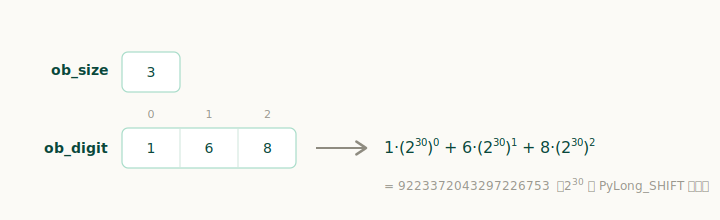
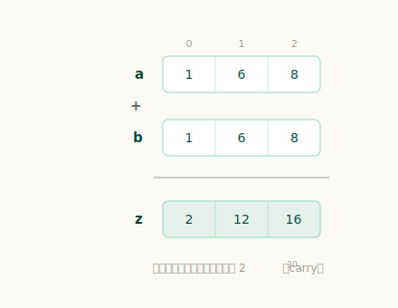
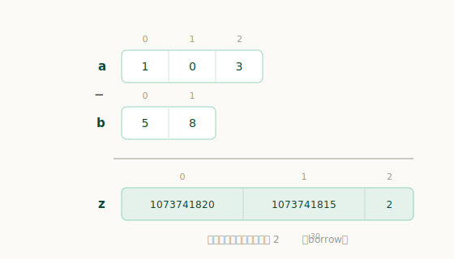

# Python 整数对象

写其它语言时，整数有 `int`、`long`、`int64` 之分，还要时刻提防溢出。Python 却不一样——它的整数想多大就多大：

```python
>>> 2 ** 1000                  # 一个 302 位的大整数，精确无误
10715086071862673209484250490600018105614048117055336074437503883703510511249361224931983788156958581275946729175531468251871452856923140435984577574698574803934567774824230985421074605062371141877954182153046474983581941267398767559165543946077062914571196477686542167660429831652624386837205668069376
>>> import math
>>> math.factorial(100)        # 100 的阶乘，158 位
93326215443944152681699238856266700490715968264381621468592963895217599993229915608941463976156518286253697920827223758251185210916864000000000000000000000000
```

这种「任意精度、永不溢出」的整数，到底是怎么实现的？这一章我们就钻进 CPython 的整数对象一探究竟。

> 一点历史：CPython 2 里整数有 `PyIntObject`（机器字长的小整数）和 `PyLongObject`（任意精度的大整数）两套实现；到了 CPython 3，两者合并，只保留了 `PyLongObject`。这个统一过程并不轻松——[Objects/longobject.c](https://github.com/python/cpython/blob/v3.7.0/Objects/longobject.c#L3) 第 3 行至今还留着一句自嘲：`/* XXX The functional organization of this file is terrible */`。

## PyLongObject：把大整数拆成「位段」

要支持任意大的整数，固定字长（如 64 位）肯定不够。CPython 的思路是：**把一个大整数拆成若干段，存进一个变长数组里**。先看类型定义：

`源文件：`[Include/longobject.h](https://github.com/python/cpython/blob/v3.7.0/Include/longobject.h#L10)

```c
// Include/longobject.h
typedef struct _longobject PyLongObject; /* Revealed in longintrepr.h */
```

真正的结构体藏在另一个头文件里：

`源文件：`[Include/longintrepr.h](https://github.com/python/cpython/blob/v3.7.0/Include/longintrepr.h#L85)

```c
// Include/longintrepr.h
struct _longobject {
    PyObject_VAR_HEAD       // 变长对象头：含 ob_refcnt、ob_type、ob_size
    digit ob_digit[1];      // 存放各「位段」的数组（实际长度按需分配）
};
```

回顾上一章：`PyObject_VAR_HEAD` 说明 `PyLongObject` 是个**变长对象**，带有记录长度的 `ob_size`。而 `ob_digit` 是一个「柔性数组」——声明时写 `[1]` 只是占位，创建对象时会按实际需要分配足够的空间，让 `ob_digit[0] ... ob_digit[abs(ob_size)-1]` 都可用。

那这些「位段」是怎么拼成一个整数的？源码注释把规则讲得很清楚：

`源文件：`[Include/longintrepr.h](https://github.com/python/cpython/blob/v3.7.0/Include/longintrepr.h#L72)

```
一个数的绝对值 = SUM(for i = 0 .. abs(ob_size)-1)  ob_digit[i] * 2**(SHIFT * i)

- 负数：用 ob_size < 0 表示（即 ob_size 的符号位兼任整数的正负号）
- 零  ：用 ob_size == 0 表示
- 规范化：最高位 ob_digit[abs(ob_size)-1] 不为 0
```

换句话说，整数被当成一个 **2^SHIFT 进制的大数**：每个 `ob_digit` 是这个进制下的一「位」，`ob_size` 记录用了多少位、同时用正负号表示整数的正负。

这里的 `SHIFT` 就是 `PyLong_SHIFT`：64 位平台上是 **30**，32 位平台上是 15。也就是说，64 位下每个 `ob_digit` 装 30 个二进制位。

### 亲眼看看整数怎么存

光看注释不过瘾，我们可以改源码来「实地观测」。整数转成十进制字符串时会经过 `long_to_decimal_string_internal`，在它开头插几行打印：

`源文件：`[Objects/longobject.c](https://github.com/python/cpython/blob/v3.7.0/Objects/longobject.c#L1582)

```c
// Objects/longobject.c
static int
long_to_decimal_string_internal(PyObject *aa, ...)
{
    PyLongObject *a;
    ...
    a = (PyLongObject *)aa;

    // 临时加入的打印代码
    printf("ob_size     = %d\n", Py_SIZE(a));
    for (int i = 0; i < Py_SIZE(a); ++i) {
        printf("ob_digit[%d] = %d\n", i, a->ob_digit[i]);
    }
    ...
}
```

[重新编译安装](../../preface/unix-linux-build/)后，打印一个大整数：

```python
>>> num = 9223372043297226753
>>> print(num)
ob_size     = 3
ob_digit[0] = 1
ob_digit[1] = 6
ob_digit[2] = 8
9223372043297226753
```

`ob_size == 3` 说明用了 3 个位段，`ob_digit` 依次是 1、6、8。代入上面的公式（`SHIFT = 30`）验证一下：



`1·(2³⁰)⁰ + 6·(2³⁰)¹ + 8·(2³⁰)²` 正好等于 `9223372043297226753`。整数的存储结构，就是这么回事。

## 类型对象 PyLong_Type

整数实例的 `ob_type` 指向类型对象 `PyLong_Type`，它就是 Python 里的 `int`。上一章讲过类型对象是对象的「说明书」，这里挑几个和整数密切相关的槽位看看：

`源文件：`[Objects/longobject.c](https://github.com/python/cpython/blob/v3.7.0/Objects/longobject.c#L5379)

```c
// Objects/longobject.c
PyTypeObject PyLong_Type = {
    PyVarObject_HEAD_INIT(&PyType_Type, 0)
    "int",                                      /* tp_name */
    offsetof(PyLongObject, ob_digit),           /* tp_basicsize */
    sizeof(digit),                              /* tp_itemsize */
    long_dealloc,                               /* tp_dealloc */
    ......
    long_to_decimal_string,                     /* tp_repr */
    &long_as_number,                            /* tp_as_number */  // 数值操作族
    ......
    (hashfunc)long_hash,                        /* tp_hash */
    ......
    long_new,                                   /* tp_new */        // 创建整数的入口
    PyObject_Del,                               /* tp_free */
};
```

注意 `tp_basicsize` 和 `tp_itemsize` 这一对：变长对象的内存大小 = `tp_basicsize + 元素个数 × tp_itemsize`。这里基础大小是「对象头到 `ob_digit` 之前」的偏移，每多一个位段就多 `sizeof(digit)` 字节——这正是「数值越大越占内存」的根源。`tp_as_number` 指向整数的数值操作族（稍后细看），`tp_new` 指向创建整数的入口 `long_new`。

## 小整数对象池

先看一个让很多人困惑的现象：

```python
>>> a = 256
>>> a is int("256")   # 256 与「新建的 256」竟是同一个对象
True
>>> n = 257
>>> n is int("257")   # 257 与「新建的 257」却不是
False
```

`int("256")` 会在运行时新建一个值为 256 的整数。照理说它和字面量 `256` 应是两个不同对象，可 `is` 却判定它们是同一个；换成 257 就不是了。为什么 256 能共享同一对象、257 却不能？答案是**小整数对象池**。

像 0、1、-1 这些小整数在程序里出现得极其频繁，如果每次都新建、销毁，开销很大。于是 CPython 在解释器启动时就**预先创建好一批小整数并一直留着**，用到时直接取来共享，免去反复申请内存。

预分配的范围由两个宏决定：

`源文件：`[Objects/longobject.c](https://github.com/python/cpython/blob/v3.7.0/Objects/longobject.c#L18)

```c
// Objects/longobject.c
#ifndef NSMALLPOSINTS
#define NSMALLPOSINTS           257   // 正向：0 .. 256
#endif
#ifndef NSMALLNEGINTS
#define NSMALLNEGINTS           5     // 负向：-1 .. -5
#endif

/* 预分配的小整数都存在这个数组里，供共享 */
static PyLongObject small_ints[NSMALLNEGINTS + NSMALLPOSINTS];
```

所以默认的小整数范围是 **[-5, 257)**，也就是 -5 到 256。256 落在池内，于是 `a` 和 `b` 拿到的是同一个对象；257 在池外，每次都是新建，自然就不是同一个了。

需要时如何从池中取？看 `get_small_int` 和配套的宏 `CHECK_SMALL_INT`：

`源文件：`[Objects/longobject.c](https://github.com/python/cpython/blob/v3.7.0/Objects/longobject.c#L49)

```c
// Objects/longobject.c
static PyObject *
get_small_int(sdigit ival)
{
    PyObject *v;
    assert(-NSMALLNEGINTS <= ival && ival < NSMALLPOSINTS);
    v = (PyObject *)&small_ints[ival + NSMALLNEGINTS];  // 按值定位到池中元素
    Py_INCREF(v);                                       // 复用，引用计数+1
    return v;
}

#define CHECK_SMALL_INT(ival) \
    do if (-NSMALLNEGINTS <= ival && ival < NSMALLPOSINTS) { \
        return get_small_int((sdigit)ival); \
    } while(0)
```

`CHECK_SMALL_INT` 会先判断目标值是否落在小整数范围，是的话直接返回池中对象。各种创建整数的函数开头都嵌了它，以最常用的 `PyLong_FromLong` 为例：

`源文件：`[Objects/longobject.c](https://github.com/python/cpython/blob/v3.7.0/Objects/longobject.c#L243)

```c
// Objects/longobject.c
PyObject *
PyLong_FromLong(long ival)
{
    ......
    CHECK_SMALL_INT(ival);   // 命中小整数池就直接返回，不再走下面的新建逻辑
    ......
}
```

这批小整数则是在解释器初始化时由 `_PyLong_Init` 一次性填好的：

`源文件：`[Objects/longobject.c](https://github.com/python/cpython/blob/v3.7.0/Objects/longobject.c#L5462)

```c
// Objects/longobject.c
int
_PyLong_Init(void)
{
    int ival, size;
    PyLongObject *v = small_ints;

    for (ival = -NSMALLNEGINTS; ival < NSMALLPOSINTS; ival++, v++) {
        size = (ival < 0) ? -1 : ((ival == 0) ? 0 : 1);   // 负/零/正
        ......
        (void)PyObject_INIT(v, &PyLong_Type);
        Py_SIZE(v) = size;
        v->ob_digit[0] = (digit)abs(ival);                // 填入数值
    }
    ......
}
```

> 这里特意用 `int("257")` 在运行时构造整数，是为了绕开**编译期常量折叠**。如果直接写 `a = 257; b = 257`，编译器可能把同一个字面量 `257` 折叠成同一个对象，让 `a is b` 也变成 `True`——但那是常量缓存，和小整数池是两码事。用 `int(...)` 从字符串构造，才能稳定地观察到小整数池本身的效果。

## 整数的创建

从 `PyLong_Type` 的 `tp_new` 可知，创建整数的入口是 `long_new`。它（由 Argument Clinic 生成的样板代码）只是解析参数，真正的逻辑在 `long_new_impl`：

`源文件：`[Objects/longobject.c](https://github.com/python/cpython/blob/v3.7.0/Objects/longobject.c#L4795)

```c
// Objects/longobject.c
static PyObject *
long_new_impl(PyTypeObject *type, PyObject *x, PyObject *obase)
{
    ......
    if (x == NULL) {                       // int() —— 无参数
        ......
        return PyLong_FromLong(0L);        // 返回 0
    }
    if (obase == NULL)                     // int(x) —— 未指定进制
        return PyNumber_Long(x);           // 按 x 的类型转换

    // int(x, base) —— 指定了进制，x 必须是字符串/字节串
    base = PyNumber_AsSsize_t(obase, NULL);
    ......
    if (PyUnicode_Check(x))                // int("ff", 16) 这类
        return PyLong_FromUnicodeObject(x, (int)base);
    else if (PyByteArray_Check(x) || PyBytes_Check(x))
        return _PyLong_FromBytes(......);
    ......
}
```

对应到 Python 里就是 `int()`、`int(x)`、`int("10", 8)` 这几种用法：无参返回 0；只给一个对象就按其类型转换；再给一个进制，就把字符串/字节串按该进制解析。

## 整数的数值操作

整数「能做哪些运算」，记录在它类型对象的 `tp_as_number` 所指向的 `long_as_number` 里——这张表的每个槽位对应一种运算，填的是具体的实现函数：

`源文件：`[Objects/longobject.c](https://github.com/python/cpython/blob/v3.7.0/Objects/longobject.c#L5342)

```c
// Objects/longobject.c
static PyNumberMethods long_as_number = {
    (binaryfunc)long_add,       /* nb_add      加法 + */
    (binaryfunc)long_sub,       /* nb_subtract 减法 - */
    (binaryfunc)long_mul,       /* nb_multiply 乘法 * */
    long_mod,                   /* nb_remainder 取余 % */
    long_divmod,                /* nb_divmod   divmod() */
    long_pow,                   /* nb_power    乘方 ** */
    (unaryfunc)long_neg,        /* nb_negative 取负 */
    ......
};
```

于是 `a + b`（`a` 为整数）最终会走到 `a->ob_type->tp_as_number->nb_add`，也就是 `long_add`。下面挑加法和乘法看看大整数运算是怎么做的。

### 整数相加

`源文件：`[Objects/longobject.c](https://github.com/python/cpython/blob/v3.7.0/Objects/longobject.c#L3082)

```c
// Objects/longobject.c
static PyObject *
long_add(PyLongObject *a, PyLongObject *b)
{
    PyLongObject *z;
    CHECK_BINOP(a, b);

    // 快路径：a、b 都只有一位（小整数），直接用机器运算
    if (Py_ABS(Py_SIZE(a)) <= 1 && Py_ABS(Py_SIZE(b)) <= 1) {
        return PyLong_FromLong(MEDIUM_VALUE(a) + MEDIUM_VALUE(b));
    }
    // 慢路径：按符号转化为绝对值的加/减
    if (Py_SIZE(a) < 0) {
        if (Py_SIZE(b) < 0) {
            z = x_add(a, b);                 // (-a) + (-b) = -(a+b)
            if (z != NULL) Py_SIZE(z) = -(Py_SIZE(z));
        }
        else
            z = x_sub(b, a);                 // (-a) + b = b - a
    }
    else {
        if (Py_SIZE(b) < 0)
            z = x_sub(a, b);                 // a + (-b) = a - b
        else
            z = x_add(a, b);                 // a + b
    }
    return (PyObject *)z;
}
```

`long_add` 先用一个**快路径**处理「两个都是单位段小整数」的常见情况，直接交给机器做加法。否则就根据 `a`、`b` 的正负号，把运算归约为对**绝对值**的相加（`x_add`）或相减（`x_sub`）——本质上就是小学竖式运算，只不过「逢十进一」换成了「逢 2³⁰ 进一」。

先看绝对值相加 `x_add`：

`源文件：`[Objects/longobject.c](https://github.com/python/cpython/blob/v3.7.0/Objects/longobject.c#L2992)

```c
// Objects/longobject.c
/* Add the absolute values of two integers. */
static PyLongObject *
x_add(PyLongObject *a, PyLongObject *b)
{
    Py_ssize_t size_a = Py_ABS(Py_SIZE(a)), size_b = Py_ABS(Py_SIZE(b));
    PyLongObject *z;
    Py_ssize_t i;
    digit carry = 0;                         // 进位

    if (size_a < size_b) { /* 确保 a 是较长的那个，交换 a、b */ ... }

    z = _PyLong_New(size_a + 1);             // 结果最多比 a 多一位
    for (i = 0; i < size_b; ++i) {           // 低位到高位，逐位相加
        carry += a->ob_digit[i] + b->ob_digit[i];
        z->ob_digit[i] = carry & PyLong_MASK; // 保留低 SHIFT 位
        carry >>= PyLong_SHIFT;              // 高位作为进位带入下一轮
    }
    for (; i < size_a; ++i) {                // 处理 a 剩下的高位
        carry += a->ob_digit[i];
        z->ob_digit[i] = carry & PyLong_MASK;
        carry >>= PyLong_SHIFT;
    }
    z->ob_digit[i] = carry;
    return long_normalize(z);                // 去掉高位多余的 0
}
```

从最低位的 `ob_digit[0]` 开始逐位相加，超出 `PyLong_SHIFT` 位的部分作为 `carry`（进位）带到下一位；算完再用 `long_normalize` 修剪掉高位多余的 0（保证最高位非零）。和竖式加法一模一样：



绝对值相减 `x_sub` 同理，只是把进位换成借位：

`源文件：`[Objects/longobject.c](https://github.com/python/cpython/blob/v3.7.0/Objects/longobject.c#L3026)

```c
// Objects/longobject.c
/* Subtract the absolute values of two integers. */
static PyLongObject *
x_sub(PyLongObject *a, PyLongObject *b)
{
    ......
    digit borrow = 0;                        // 借位

    if (size_a < size_b) { sign = -1; /* 交换，保证 a >= b */ ... }
    else if (size_a == size_b) {
        /* 位数相同，从高位找到第一个不同的位，决定大小与符号 */
        ......
    }

    z = _PyLong_New(size_a);
    for (i = 0; i < size_b; ++i) {           // 逐位相减
        borrow = a->ob_digit[i] - b->ob_digit[i] - borrow;
        z->ob_digit[i] = borrow & PyLong_MASK;
        borrow >>= PyLong_SHIFT;
        borrow &= 1;                         // 只保留一个符号位作借位
    }
    for (; i < size_a; ++i) { ... }          // 处理 a 剩下的高位
    if (sign < 0) Py_SIZE(z) = -Py_SIZE(z);  // 按之前判定的符号定正负
    return long_normalize(z);
}
```

不够减时就向高一位借位（借的是一个 `2³⁰`）：



### 整数相乘

`源文件：`[Objects/longobject.c](https://github.com/python/cpython/blob/v3.7.0/Objects/longobject.c#L3548)

```c
// Objects/longobject.c
static PyObject *
long_mul(PyLongObject *a, PyLongObject *b)
{
    PyLongObject *z;
    CHECK_BINOP(a, b);

    // 快路径：都是单位段，直接用机器乘法
    if (Py_ABS(Py_SIZE(a)) <= 1 && Py_ABS(Py_SIZE(b)) <= 1) {
        stwodigits v = (stwodigits)(MEDIUM_VALUE(a)) * MEDIUM_VALUE(b);
        return PyLong_FromLongLong((long long)v);
    }

    z = k_mul(a, b);                         // 大数乘法
    /* 两数符号不同则结果为负 */
    if (((Py_SIZE(a) ^ Py_SIZE(b)) < 0) && z) {
        _PyLong_Negate(&z);
        ......
    }
    return (PyObject *)z;
}
```

同样是「小数走快路径、大数走专门算法」。大数乘法 `k_mul`（[L3274](https://github.com/python/cpython/blob/v3.7.0/Objects/longobject.c#L3274)）用的是 **Karatsuba 算法**：

> Karatsuba 算法专门用于两个大数相乘。它把位数很多的两个大数各拆成高、低两半，原本需要 4 次子乘法的运算，通过巧妙的代数变形只需 **3 次**乘法（外加少量加法和移位），并递归地施加这一手法，从而把复杂度从 O(n²) 降到约 O(n^1.585)，在大数下显著提速。

算法细节可参考维基百科的 [Karatsuba 算法](https://zh.wikipedia.org/wiki/Karatsuba算法)。取余、乘方等其余运算的实现都能在 `long_as_number` 里按图索骥找到对应函数，这里不再一一展开。

---

小结一下整数对象的要点：

- `PyLongObject` 是**变长对象**，把大整数按 `2^SHIFT` 进制（64 位下 SHIFT=30）拆成若干位段存进 `ob_digit` 数组，用 `ob_size` 记录位段数并以其符号表示正负，这正是「任意精度」的来源；
- 常用的小整数 **[-5, 257)** 在启动时预分配成对象池并共享，这解释了 `a is b` 在小整数上为何成立；
- 加减乘等运算本质是「`2³⁰` 进制下的竖式计算」，并对单位段小整数和大数分别走快路径与专门算法（如乘法的 Karatsuba）。
