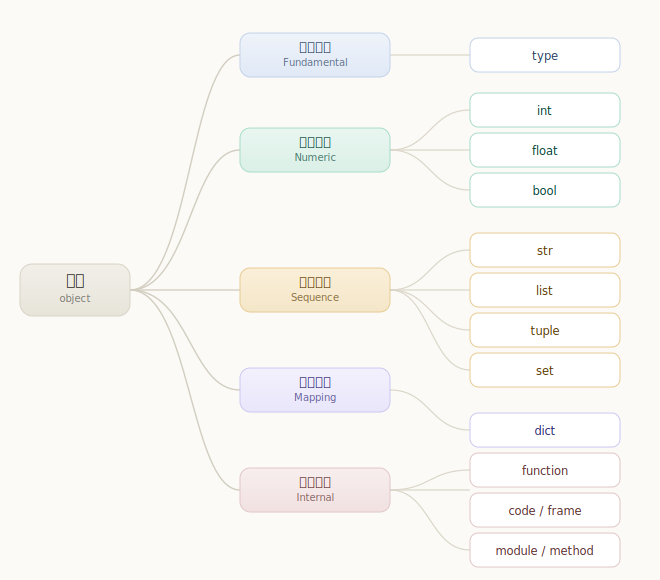
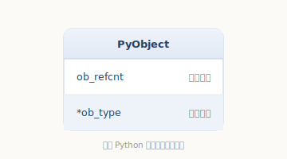
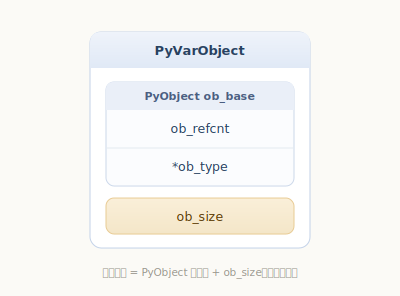
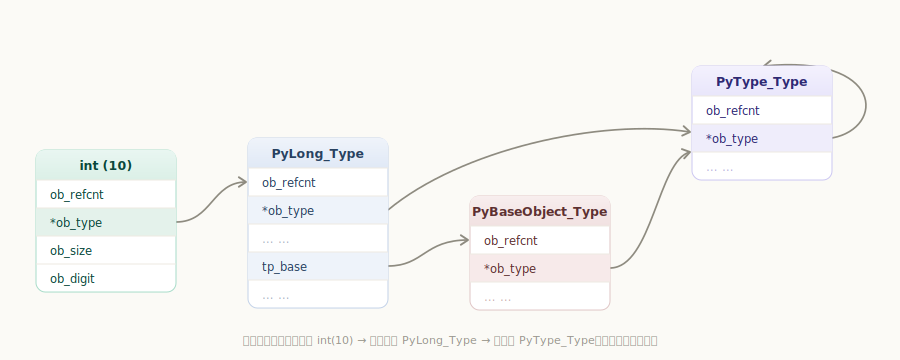

# Python 对象初探

写 Python 时我们整天和「对象」打交道：`1` 是对象，`"hello"` 是对象，列表、字典是对象。可你有没有想过——`int`、`list` 这些**类型**本身是不是对象？函数呢？模块呢？

在 Python 里答案出奇地一致：**一切皆对象**。不论是整数、字符串，还是类型、函数、模块，统统都是对象。这一章我们就从这句口号出发，钻进 CPython 的 C 源码，看看「对象」到底是怎么被实现出来的。

> 本书分析的是 [CPython 3.7.0](https://github.com/python/cpython/tree/v3.7.0) 的源码。CPython 是用 C 写成的，所以一个 Python 对象，落到底层其实就是**一块按特定结构体布局的堆内存**。

## 先从 Python 的视角看「对象」

在深入 C 代码之前，先用纯 Python 建立一点直觉。在解释器里随手敲几行：

```python
>>> type(1)            # 整数的类型是 int
<class 'int'>
>>> type(int)          # int 这个类型的类型是 type
<class 'type'>
>>> type(type)         # type 的类型……还是 type
<class 'type'>
>>> isinstance(int, object)   # int 也是一个对象
True
```

可以看到，**每个对象都「属于某个类型」**，连类型自己也不例外。Python 之父把这套机制设计得非常统一，而这份统一性，正源于所有对象在 C 层面共享同一个「开头」。

进一步说，Python 里的每个对象都同时具备三个要素：

- **身份（identity）**：对象在内存中的唯一标识，用 `id(obj)` 查看（CPython 里就是它的内存地址）；
- **类型（type）**：决定这个对象「是什么」、能干什么，用 `type(obj)` 查看；
- **值（value）**：对象具体存了什么。

记住这三个要素，因为接下来你会发现，前两个——身份和类型——被「焊死」在了每一个对象的内存开头。

## 对象的分类

CPython 内建了形形色色的对象。借用《Python 源码剖析》的归纳，可以大致分成五类：

- **基础对象（Fundamental）**：类型对象（比如 `int`、`str` 背后的 `type`）
- **数值对象（Numeric）**：整数、浮点数、布尔值等
- **序列对象（Sequence）**：容纳其他对象的序列集合（字符串、列表、元组等）
- **映射对象（Mapping）**：类似 C++ 中 `map` 的关联对象（字典）
- **内部对象（Internal）**：Python 虚拟机运行时内部使用的对象（函数、frame、code 等）



这只是帮助建立全局观的「软」分类。下面我们要看的是所有这些对象在 C 层面共享的「硬」基础。

## 对象机制的基石：PyObject

CPython 用 C 结构体来表示对象。所有对象，无论多复杂，开头都嵌着同一个结构体 **`PyObject`**——可以说整个对象机制都是从它扩展出来的。先看它长什么样：

`源文件：`[Include/object.h](https://github.com/python/cpython/blob/v3.7.0/Include/object.h#L106)

```c
// Include/object.h
typedef struct _object {
    _PyObject_HEAD_EXTRA            // 仅调试构建启用，正式构建为空（见下）
    Py_ssize_t ob_refcnt;          // 引用计数
    struct _typeobject *ob_type;   // 指向类型对象的指针，决定该对象「是什么类型」
} PyObject;
```

去掉那个一般为空的 `_PyObject_HEAD_EXTRA` 后，`PyObject` 其实只有两个字段，却撑起了整个对象模型：

- **`ob_refcnt`**——引用计数。记录「有多少处引用着这个对象」，是 CPython 内存管理的核心，决定对象何时被销毁（本章末会展开）。
- **`ob_type`**——类型指针。指向一个**类型对象**，回答了「我是谁」。`type(obj)` 读的就是这个字段。

回想上一节的三要素：对象的**身份**就是这个结构体的地址（`id(obj)`），**类型**就是 `ob_type`。它们对每个对象都成立，因为每个对象的内存都以 `PyObject` 开头。

```python
>>> import sys
>>> a = object()
>>> id(a)                 # 身份：CPython 中即内存地址，对应 PyObject 的地址
4388610168
>>> sys.getrefcount(a)    # 读取 ob_refcnt（返回值比真实值多 1，见“引用计数”一节）
2
```



为了方便、安全地访问这两个字段（以及变长对象的长度），CPython 提供了几个常用宏，源码里随处可见：

`源文件：`[Include/object.h](https://github.com/python/cpython/blob/v3.7.0/Include/object.h#L117)

```c
// Include/object.h
#define Py_REFCNT(ob)  (((PyObject*)(ob))->ob_refcnt)   // 取引用计数
#define Py_TYPE(ob)    (((PyObject*)(ob))->ob_type)     // 取类型指针
#define Py_SIZE(ob)    (((PyVarObject*)(ob))->ob_size)  // 取元素个数（变长对象）
```

### `_PyObject_HEAD_EXTRA` 是做什么的

`PyObject` 开头那行 `_PyObject_HEAD_EXTRA` 我们一笔带过，这里补充一下它的来历。它其实是个宏，而且只在**调试构建**下才会展开出内容：

`源文件：`[Include/object.h](https://github.com/python/cpython/blob/v3.7.0/Include/object.h#L69)

```c
// Include/object.h
#ifdef Py_TRACE_REFS
/* Define pointers to support a doubly-linked list of all live heap objects. */
#define _PyObject_HEAD_EXTRA            \
    struct _object *_ob_next;           \
    struct _object *_ob_prev;
#else
#define _PyObject_HEAD_EXTRA            // 正式构建：什么都不展开，为空
#endif
```

只有在开启 `Py_TRACE_REFS`（调试构建 `Py_DEBUG` 会自动带上）时，每个对象才会多出 `_ob_next`/`_ob_prev` 两个指针，把**所有存活对象**串成一条双向链表，方便调试时遍历、统计全部对象、排查内存泄漏。而在你日常使用的正式发行版里，这个宏为空——对象头就是干干净净的 `ob_refcnt` + `ob_type` 两个字段。

所以平时完全可以把对象头理解为「引用计数 + 类型指针」。（注意：这条调试用的链表和 Python 处理循环引用的垃圾回收不是一回事，后者另有机制，我们留到「内存管理」章节再讲。）

## 定长对象与变长对象

除了按用途分类，对象还能按「大小是否固定」分为两类：

- **定长对象**：内存大小固定。比如浮点数 `PyFloatObject`，无论值是多少都占同样大小。
- **变长对象**：元素个数不定，内存大小随之变化。比如列表、字符串，以及——可能出乎意料——**整数**。

变长对象的开头不再是 `PyObject`，而是 **`PyVarObject`**。它在 `PyObject` 的基础上，只多加了一个字段 `ob_size`：

`源文件：`[Include/object.h](https://github.com/python/cpython/blob/v3.7.0/Include/object.h#L112)

```c
// Include/object.h
typedef struct {
    PyObject ob_base;    // 内嵌一个 PyObject，复用 ob_refcnt 与 ob_type
    Py_ssize_t ob_size;  /* Number of items in variable part */  // 元素个数
} PyVarObject;
```

注意 `ob_size` 是**元素个数**，不是字节数。比如一个有 3 个元素的列表，`ob_size` 就是 3。



整数是变长对象这一点，可以直接观测到：数值越大、需要的「位」越多，对象占用的内存就越大。

```python
>>> import sys
>>> sys.getsizeof(0)         # 较小的整数
>>> sys.getsizeof(2**30)     # 大一些，占用更多
>>> sys.getsizeof(2**1000)   # 更大，占用进一步增加
```

（具体字节数因平台和 Python 版本而异，但「越大越占内存」的趋势是一致的。）这正是因为整数把数值按若干「位段」存进了一段变长数组里，`ob_size` 记录用了多少段——具体实现我们会在[《Python 整数对象》](../long-object/)里展开。

## 类型对象 PyTypeObject

前面反复提到 `ob_type` 指向一个「类型对象」。这个类型对象到底是什么？它就是 **`PyTypeObject`**——你在 Python 里写的 `int`、`str`、`list`，在 C 层面都对应着一个 `PyTypeObject` 实例。

类型对象远不止「一个名字」那么简单。它是该类型所有对象的「说明书」，保存着大量**元信息**：创建这种对象要分配多少内存、它支持哪些操作、怎么比较、怎么算哈希……可以粗略分成几类：

- **类型名** `tp_name`，如 `"int"`，主要用于打印和调试；
- **创建对象时的内存大小** `tp_basicsize` 和 `tp_itemsize`；
- **大量操作的函数指针**，如析构 `tp_dealloc`、哈希 `tp_hash`、字符串表示 `tp_repr` 等；
- **几组标准操作族**，如数值运算 `tp_as_number`、序列操作 `tp_as_sequence`、映射操作 `tp_as_mapping`。

`源文件：`[Include/object.h](https://github.com/python/cpython/blob/v3.7.0/Include/object.h#L346)

```c
// Include/object.h
typedef struct _typeobject {
    PyObject_VAR_HEAD                 // 注意：类型对象本身是个「变长对象」
    const char *tp_name;             /* For printing, in format "<module>.<name>" */
    Py_ssize_t tp_basicsize, tp_itemsize; /* For allocation */  // 创建对象时分配的内存大小

    /* Methods to implement standard operations */   // 一组标准操作的函数指针
    destructor tp_dealloc;
    printfunc tp_print;
    getattrfunc tp_getattr;
    setattrfunc tp_setattr;
    PyAsyncMethods *tp_as_async;
    reprfunc tp_repr;

    /* Method suites for standard classes */         // 三大操作族
    PyNumberMethods *tp_as_number;      // 数值型操作
    PySequenceMethods *tp_as_sequence;  // 序列型操作
    PyMappingMethods *tp_as_mapping;    // 映射型操作

    /* More standard operations */
    hashfunc tp_hash;        // 如何计算 hash
    ternaryfunc tp_call;     // 像函数一样被调用时怎么做
    reprfunc tp_str;
    getattrofunc tp_getattro;
    setattrofunc tp_setattro;

    ......

} PyTypeObject;
```

换句话说，「一个对象能做什么」并不写在对象自己身上，而是写在它的**类型对象**里。运行时只要顺着 `ob_type` 找到类型对象，再查对应的函数指针，就知道该怎么操作了。这个思路会贯穿全书。

## 类型的类型：元类 type

注意上面 `PyTypeObject` 的第一行是宏 `PyObject_VAR_HEAD`，展开看看：

`源文件：`[Include/object.h](https://github.com/python/cpython/blob/v3.7.0/Include/object.h#L98)

```c
// Include/object.h
#define PyObject_VAR_HEAD      PyVarObject ob_base;
```

这说明**类型对象本身也是一个变长对象**——它开头嵌着 `PyVarObject`，因而也嵌着 `PyObject`，因而它也有 `ob_refcnt` 和 `ob_type`。结论很有意思：**类型对象自己也是对象**，它也有自己的类型。

那「类型的类型」是谁？我们在开头其实已经见过：

```python
>>> type(int)     # 普通类型的类型
<class 'type'>
>>> type(str)
<class 'type'>
>>> type(type)    # type 的类型，还是 type 自己
<class 'type'>
```

答案就是 `type`，它在 C 层对应 **`PyType_Type`**。所有类型对象的 `ob_type` 最终都指向它，因此 `type` 被称为「元类」（metaclass）。

`源文件：`[Objects/typeobject.c](https://github.com/python/cpython/blob/v3.7.0/Objects/typeobject.c#L3540)

```c
// Objects/typeobject.c
PyTypeObject PyType_Type = {
    PyVarObject_HEAD_INIT(&PyType_Type, 0)
    "type",                                     /* tp_name */
    sizeof(PyHeapTypeObject),                   /* tp_basicsize */
    sizeof(PyMemberDef),                        /* tp_itemsize */

    ......
};
```

注意第一行 `PyVarObject_HEAD_INIT(&PyType_Type, 0)`——`PyType_Type` 把自己的 `ob_type` 指向了**它自己**，这正对应 `type(type) is type`。所有用户自定义的 `class`，其对应的 `PyTypeObject` 也都是由 `PyType_Type` 创建出来的。

那么这个初始化宏做了什么？为了方便填充每个对象开头的引用计数和类型指针，CPython 提供了一对宏：

`源文件：`[Include/object.h](https://github.com/python/cpython/blob/v3.7.0/Include/object.h#L85)

```c
// Include/object.h
#define PyObject_HEAD_INIT(type)        \
    { _PyObject_EXTRA_INIT              \
    1, type },                          // 初始引用计数为 1，类型指针为 type

#define PyVarObject_HEAD_INIT(type, size)       \
    { PyObject_HEAD_INIT(type) size },          // 在上面的基础上再补一个 ob_size
```

可以看到，`PyVarObject_HEAD_INIT(&PyType_Type, 0)` 的效果就是：把 `ob_refcnt` 设为 1、`ob_type` 设为 `&PyType_Type`、`ob_size` 设为 0。

有了这个宏，我们就能看清一个普通类型对象（如整数的 `PyLong_Type`）是怎样与 `PyType_Type` 建立联系的：

`源文件：`[Objects/longobject.c](https://github.com/python/cpython/blob/v3.7.0/Objects/longobject.c#L5379)

```c
// Objects/longobject.c
PyTypeObject PyLong_Type = {
    PyVarObject_HEAD_INIT(&PyType_Type, 0)      // ob_type 指向 PyType_Type
    "int",                                      /* tp_name */
    offsetof(PyLongObject, ob_digit),           /* tp_basicsize */
    sizeof(digit),                              /* tp_itemsize */

    ......
};
```

把这层层关系串起来，就得到了对象在运行时的全貌：一个整数实例 `int(10)`，其 `ob_type` 指向类型对象 `PyLong_Type`；而 `PyLong_Type` 的 `ob_type` 指向元类 `PyType_Type`；`PyType_Type` 的 `ob_type` 则指向它自己。



## 对象的创建

CPython 在 C 层创建对象，大体有两类 API。

### 范型 API（AOL，Abstract Object Layer）

这类 API 形如 `PyObject_XXX`，可作用于任意对象。例如用 `PyObject_New` 按某个类型分配一个对象：

```c
PyObject *obj = PyObject_New(PyObject, &PyLong_Type);
```

### 类型相关 API（COL，Concrete Object Layer）

这类 API 只针对某一种具体类型，每种内建对象都提供了一组。例如创建整数对象：

```c
PyObject *longObj = PyLong_FromLong(10);
```

两者的区别，本质上就是「通用但笼统」与「专用但精确」的取舍，后续各对象章节会大量见到 COL 形式的 API。

## 对象的行为

回到 `PyTypeObject` 里那三个指针：`tp_as_number`、`tp_as_sequence`、`tp_as_mapping`。它们分别指向一组「操作族」，定义了对象作为「数值 / 序列 / 映射」时分别支持哪些操作。这就是 CPython 版本的「协议」。

以数值协议 **`PyNumberMethods`** 为例，它的字段是一串函数指针，每个对应一种数值运算：

`源文件：`[Include/object.h](https://github.com/python/cpython/blob/v3.7.0/Include/object.h#L240)

```c
// Include/object.h
typedef struct {
    binaryfunc nb_add;         // 加法 +
    binaryfunc nb_subtract;    // 减法 -
    binaryfunc nb_multiply;    // 乘法 *
    binaryfunc nb_remainder;   // 取余 %
    binaryfunc nb_divmod;      // divmod()
    ternaryfunc nb_power;      // 乘方 **

    ......

    binaryfunc nb_matrix_multiply;          // 矩阵乘 @（位于结构体末尾）
    binaryfunc nb_inplace_matrix_multiply;  // 原地矩阵乘 @=
} PyNumberMethods;
```

那么「整数能做加法」是怎么实现的？看整数类型对象的填表：它的 `tp_as_number` 指向 `long_as_number`，而 `long_as_number` 的 `nb_add` 槽位填的是 `long_add`。

`源文件：`[Objects/longobject.c](https://github.com/python/cpython/blob/v3.7.0/Objects/longobject.c#L5342)

```c
// Objects/longobject.c
static PyNumberMethods long_as_number = {
    (binaryfunc)long_add,       /*nb_add*/
    (binaryfunc)long_sub,       /*nb_subtract*/
    (binaryfunc)long_mul,       /*nb_multiply*/

    ......
};

PyTypeObject PyLong_Type = {
    PyVarObject_HEAD_INIT(&PyType_Type, 0)
    "int",                                      /* tp_name */
    offsetof(PyLongObject, ob_digit),           /* tp_basicsize */
    sizeof(digit),                              /* tp_itemsize */
    long_dealloc,                               /* tp_dealloc */
    0,                                          /* tp_print */
    0,                                          /* tp_getattr */
    0,                                          /* tp_setattr */
    0,                                          /* tp_reserved */
    long_to_decimal_string,                     /* tp_repr */
    &long_as_number,                            /* tp_as_number */
    0,                                          /* tp_as_sequence */
    0,                                          /* tp_as_mapping */

    ......
};
```

于是，当你写下 `a + b` 且 `a` 是整数时，解释器最终会顺着 `a->ob_type->tp_as_number->nb_add` 找到 `long_add` 并调用它。`tp_as_sequence`、`tp_as_mapping` 的套路完全一样，分别对应序列和映射的操作，这里不再展开。

## 对象的多态

把上面的机制再抽象一层，就能理解 CPython 是怎样实现**多态**的。

CPython 创建一个对象（比如整数 `PyLongObject`）后，内部一律用 `PyObject*` 这种**范型指针**来传递它。函数拿到一个 `PyObject*`，并不知道它具体指向什么类型——只能通过 `ob_type` 在运行时动态判断、并取出对应的操作。换句话说，**多态就藏在 `ob_type` 里**。

看一个计算哈希的例子：

```c
Py_hash_t
calc_hash(PyObject *object)
{
    Py_hash_t hash = object->ob_type->tp_hash(object);
    return hash;
}
```

这个函数完全不关心 `object` 到底是什么类型。它只是顺着 `ob_type` 找到类型对象，调用其中的 `tp_hash`。

- 如果传进来的实际是整数对象，`ob_type` 指向 `PyLong_Type`，其 `tp_hash` 绑定的是 `long_hash`：

`源文件：`[Objects/longobject.c](https://github.com/python/cpython/blob/v3.7.0/Objects/longobject.c#L5379)

```c
// Objects/longobject.c
PyTypeObject PyLong_Type = {
    ......
    (hashfunc)long_hash,                        /* tp_hash */
    ......
};
```

- 如果传进来的是字符串对象，`ob_type` 指向 `PyUnicode_Type`，其 `tp_hash` 绑定的则是 `unicode_hash`：

`源文件：`[Objects/unicodeobject.c](https://github.com/python/cpython/blob/v3.7.0/Objects/unicodeobject.c#L15066)

```c
// Objects/unicodeobject.c
PyTypeObject PyUnicode_Type = {
    PyVarObject_HEAD_INIT(&PyType_Type, 0)
    "str",                          /* tp_name */
    ......
    (hashfunc) unicode_hash,        /* tp_hash */
    ......
};
```

同一行 `object->ob_type->tp_hash(object)`，对整数和字符串却走进了不同的实现——这就是 CPython 用 C 语言「手工」实现的多态。

## 引用计数

最后回到对象头里的另一个字段 `ob_refcnt`。CPython 用**引用计数**来决定一个对象在内存中的生死：每个对象都记录着「当前有多少处引用着我」，当这个数归零，对象就可以被回收。

操作引用计数主要靠两个宏：`Py_INCREF`（加一）和 `Py_DECREF`（减一）。

`源文件：`[Include/object.h](https://github.com/python/cpython/blob/v3.7.0/Include/object.h#L777)

```c
// Include/object.h
// 引用计数 +1
#define Py_INCREF(op) (                         \
    _Py_INC_REFTOTAL  _Py_REF_DEBUG_COMMA       \
    ((PyObject *)(op))->ob_refcnt++)

// 引用计数 -1；减到 0 则调用 _Py_Dealloc 触发回收
#define Py_DECREF(op)                                   \
    do {                                                \
        PyObject *_py_decref_tmp = (PyObject *)(op);    \
        if (_Py_DEC_REFTOTAL  _Py_REF_DEBUG_COMMA       \
        --(_py_decref_tmp)->ob_refcnt != 0)             \
            _Py_CHECK_REFCNT(_py_decref_tmp)            \
        else                                            \
            _Py_Dealloc(_py_decref_tmp);                \
    } while (0)
```

`Py_DECREF` 把 `ob_refcnt` 减 1 后，一旦发现归零，就调用 `_Py_Dealloc`。而 `_Py_Dealloc` 会顺着对象的类型去调用它的析构槽 `tp_dealloc`（又是「顺着 `ob_type` 找操作」的套路）：

`源文件：`[Include/object.h](https://github.com/python/cpython/blob/v3.7.0/Include/object.h#L787)

```c
// Include/object.h
#define _Py_Dealloc(op) (                               \
    _Py_INC_TPFREES(op) _Py_COUNT_ALLOCS_COMMA          \
    (*Py_TYPE(op)->tp_dealloc)((PyObject *)(op)))       // 调用该类型的 tp_dealloc
```

你可以在 Python 层观测引用计数：

```python
>>> import sys
>>> a = object()
>>> sys.getrefcount(a)    # 返回值会比真实计数多 1
2
>>> b = a                 # 多了一处引用
>>> sys.getrefcount(a)
3
```

`sys.getrefcount` 的返回值总比「真实」引用数多 1，因为把对象作为参数传进函数这一动作本身，就临时多产生了一次引用。

需要强调的是：引用计数归零，**不一定**马上 `free` 掉内存。频繁向操作系统申请、释放内存会显著拖慢 Python，因此 CPython 大量使用**内存对象池**技术——对象「销毁」时，其占用的空间往往被归还给对象池而非真正释放，下次创建同类对象时可以直接复用。小整数、短字符串等都受益于这类优化，具体策略我们会在各对象章节里逐一剖析。

---

至此，我们已经摸清了 Python 对象机制的骨架：

- 每个对象的内存都以 `PyObject` 开头，携带**引用计数** `ob_refcnt` 和**类型指针** `ob_type`；
- 变长对象在此基础上多一个 `ob_size`；
- 对象「能做什么」记录在它的**类型对象** `PyTypeObject` 里，运行时顺着 `ob_type` 查表调用，从而实现多态；
- 类型对象自己也是对象，其类型是元类 `type`（`PyType_Type`）；
- 对象的生死由引用计数驱动，并辅以内存池优化。

这套「对象头 + 类型对象 + 函数指针表」的设计，是后续所有具体对象（整数、字符串、列表、字典、集合……）的共同底座。理解了它，再去看各类对象的实现，就会清晰许多。
