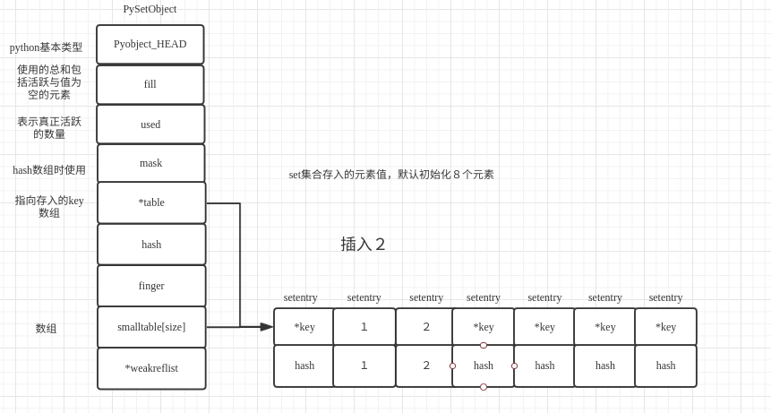
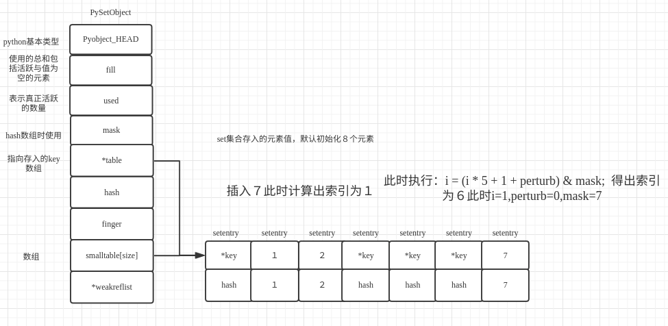

# python集合

set是无序且不重复的集合，是可变的，通常用来从列表中删除重复项以及计算数学运算，如交集、并集、差分和对称差分等集合操作。set 支持 x in set, len(set),和 for x in set。作为一个无序的集合，set不记录元素位置或者插入点。因此，sets不支持 indexing, 或其它类序列的操作。

## python集合概述

在set中，对应的set的值的存储是通过结构setentry来保存数据值的；

`源文件：`[include/setobject.h](https://github.com/python/cpython/blob/1bf9cc509326bc42cd8cb1650eb9bf64550d817e/Include/setobject.h#L26)

```
typedef struct {
    PyObject *key;
    Py_hash_t hash;             /* Cached hash code of the key */
} setentry;
```

key就是保存的数据，hash就是保存的数据的hash，便于查找，set也是基于hash表来实现。对应的setentry所对应的set的数据结构如下；

`源文件：`[include/setobject.h](https://github.com/python/cpython/blob/1bf9cc509326bc42cd8cb1650eb9bf64550d817e/Include/setobject.h#L42)

```

typedef struct {
    PyObject_HEAD

    Py_ssize_t fill;            /* Number active and dummy entries*/     // 包括已经使用的entry与空entry值的总和
    Py_ssize_t used;            /* Number active entries */              // 已经使用可用的总量

    /* The table contains mask + 1 slots, and that's a power of 2.
     * We store the mask instead of the size because the mask is more
     * frequently needed.
     */
    Py_ssize_t mask;　　　　　　　　　　　　　　　　　　　　　　　　　　　　　　　　// 与hash求和的mask

    /* The table points to a fixed-size smalltable for small tables
     * or to additional malloc'ed memory for bigger tables.
     * The table pointer is never NULL which saves us from repeated
     * runtime null-tests.
     */
    setentry *table;                                                    // 保存数据的数组数组指针
    Py_hash_t hash;             /* Only used by frozenset objects */    
    Py_ssize_t finger;          /* Search finger for pop() */

    setentry smalltable[PySet_MINSIZE];                                 // 保存数据的数组　默认初始化为8个元素，通过table指向
    PyObject *weakreflist;      /* List of weak references */
} PySetObject;
```

一个set就对应一个PySetObject类型数据，set会根据保存的元素自动调整大小。相关的内存布局如下；


## python集合(set)示例

示例脚本如下：

```
set_a = {1,2}　
set_a.add(3)
set_a.add(4)
set_a.remove(1)
set_a.update({3,})
set_a.union({1,5})

```

通过python反汇编获取该脚本的字节码；

```
python -m dis set_test.py
```

输出的字节码如下所示；

```
  1           0 LOAD_CONST               0 (1)
              3 LOAD_CONST               1 (2)
              6 BUILD_SET                2
              9 STORE_NAME               0 (set_a)

  2          12 LOAD_NAME                0 (set_a)
             15 LOAD_ATTR                1 (add)
             18 LOAD_CONST               2 (3)
             21 CALL_FUNCTION            1
             24 POP_TOP             

  3          25 LOAD_NAME                0 (set_a)
             28 LOAD_ATTR                1 (add)
             31 LOAD_CONST               3 (4)
             34 CALL_FUNCTION            1
             37 POP_TOP             

  4          38 LOAD_NAME                0 (set_a)
             41 LOAD_ATTR                2 (remove)
             44 LOAD_CONST               0 (1)
             47 CALL_FUNCTION            1
             50 POP_TOP             

  5          51 LOAD_NAME                0 (set_a)
             54 LOAD_ATTR                3 (update)
             57 LOAD_CONST               2 (3)
             60 BUILD_SET                1
             63 CALL_FUNCTION            1
             66 POP_TOP             

  6          67 LOAD_NAME                0 (set_a)
             70 LOAD_ATTR                4 (union)
             73 LOAD_CONST               0 (1)
             76 LOAD_CONST               4 (5)
             79 BUILD_SET                2
             82 CALL_FUNCTION            1
             85 POP_TOP             
             86 LOAD_CONST               5 (None)
             89 RETURN_VALUE
```


通过该字节码指令可知，创建set调用了BUILD_SET指令，初始化完成之后，就调用set的add方法添加元素，调用remove删除元素,调用update来更新集合，通过union来合并集合。接下来就详细分析一下相关的操作流程。

## set的创建与初始化

查找BUILD_SET的虚拟机执行函数如下；

`源文件：`[Python/ceval.c](https://github.com/python/cpython/blob/1bf9cc509326bc42cd8cb1650eb9bf64550d817e/Python/ceval.c#L2318)

```
// Python/ceval.c

        TARGET(BUILD_SET) {
            PyObject *set = PySet_New(NULL);             // 新建并初始化一个set
            int err = 0;
            int i;
            if (set == NULL)
                goto error;
            for (i = oparg; i > 0; i--) {                // 将传入初始化的参数传入
                PyObject *item = PEEK(i);
                if (err == 0)
                    err = PySet_Add(set, item);          // 并依次对set进行添加操作
                Py_DECREF(item);
            }
            STACKADJ(-oparg);　　　　　　　　　　　　　　　   // 移动弹栈
            if (err != 0) {
                Py_DECREF(set);
                goto error;
            }
            PUSH(set);　　　　　　　　　　　　　　　　　　　　　// 讲set压栈
            DISPATCH();　　　　　　　　　　　　　　　　　　　　// 执行下一条指令
        }

```

此时继续查看PySet_New函数的执行流程；

`源文件：`[Objects/setobject.c](https://github.com/python/cpython/blob/1bf9cc509326bc42cd8cb1650eb9bf64550d817e/Objects/setobject.c#L2286)


```
PyObject *
PySet_New(PyObject *iterable)
{
    return make_new_set(&PySet_Type, iterable);
}

...


static PyObject *
make_new_set(PyTypeObject *type, PyObject *iterable)
{
    PySetObject *so;

    so = (PySetObject *)type->tp_alloc(type, 0);            // 申请该元素的内存
    if (so == NULL)                                        // 内存申请失败则返回为空
        return NULL;

    so->fill = 0;                                           // 初始化的时候都为０
    so->used = 0;
    so->mask = PySet_MINSIZE - 1;                           // PySet_MINSIZE默认我８，mask为７
    so->table = so->smalltable;                             // 将保存数据的头指针指向table
    so->hash = -1;                                          // 设置hash值为-1
    so->finger = 0;
    so->weakreflist = NULL;

    if (iterable != NULL) {                                 // 如果有迭代器
        if (set_update_internal(so, iterable)) {            // 将内容更新到so中
            Py_DECREF(so);
            return NULL;
        }
    }

    return (PyObject *)so;                                  // 返回初始化完成的set
}
```

从PySet_New的执行流程可知，字典的初始化过程就是初始化相关数据结构。

## set的插入

在本例的初始化过程中，由于传入了初始值1,2，所以会在执行字节码指令的时候，执行PySet_Add，该函数的本质与set_a.add(3)本质都调用了更底层set_add_key函数；

`源文件：`[Objects/setobject.c](https://github.com/python/cpython/blob/1bf9cc509326bc42cd8cb1650eb9bf64550d817e/Objects/setobject.c#L2338)

```

int
PySet_Add(PyObject *anyset, PyObject *key)
{
    if (!PySet_Check(anyset) &&
        (!PyFrozenSet_Check(anyset) || Py_REFCNT(anyset) != 1)) {
        PyErr_BadInternalCall();
        return -1;
    }
    return set_add_key((PySetObject *)anyset, key);  // 向字典中添加key;
}
```

继续查看set_add_key函数的执行过程；

`源文件：`[Objects/setobject.c](https://github.com/python/cpython/blob/1bf9cc509326bc42cd8cb1650eb9bf64550d817e/Objects/setobject.c#L419)

```
static int
set_add_key(PySetObject *so, PyObject *key)
{
    Py_hash_t hash;

    if (!PyUnicode_CheckExact(key) ||
        (hash = ((PyASCIIObject *) key)->hash) == -1) {
        hash = PyObject_Hash(key);                  // 获取传入值的hash值 
        if (hash == -1)                             // 如果不能hash则返回-1
            return -1;
    }
    return set_add_entry(so, key, hash);            // 计算完成后添加值
}
```

该函数主要就是检查传入的key是否能够被hash，如果能够被hash则直接返回，如果能被hash则继续调用set_add_entry函数将值加入到set中；

`源文件：`[Objects/setobject.c](https://github.com/python/cpython/blob/1bf9cc509326bc42cd8cb1650eb9bf64550d817e/Objects/setobject.c#L136)

```

static int
set_add_entry(PySetObject *so, PyObject *key, Py_hash_t hash)
{
    setentry *table;
    setentry *freeslot;
    setentry *entry;
    size_t perturb;
    size_t mask;
    size_t i;                       /* Unsigned for defined overflow behavior */
    size_t j;
    int cmp;

    /* Pre-increment is necessary to prevent arbitrary code in the rich
       comparison from deallocating the key just before the insertion. */
    Py_INCREF(key);                                                             // 提高key的引用计数

  restart:

    mask = so->mask;　                                                          // 获取so->mask
    i = (size_t)hash & mask;　                                                  // 通过传入的hash与mask求索引下标

    entry = &so->table[i];　                                                 　　// 获取索引对应的值
    if (entry->key == NULL)                                                     // 如果获取索引的值没有被使用则直接跳转到found_unused处执行
        goto found_unused;

    freeslot = NULL;
    perturb = hash;　　　                                                        // perturb设置为当前hash值
　
    while (1) {
        if (entry->hash == hash) {                                              // 如果当前hash值相等
            PyObject *startkey = entry->key;　　　　　　　　　　　　　　　　　　　　　　// 获取当前key
            /* startkey cannot be a dummy because the dummy hash field is -1 */
            assert(startkey != dummy);                                          // 检查key是否为dummy
            if (startkey == key)                                                // 如果找到的值与传入需要设置的值相同则跳转到found_active处执行
                goto found_active;
            if (PyUnicode_CheckExact(startkey)
                && PyUnicode_CheckExact(key)
                && _PyUnicode_EQ(startkey, key))                                // 如果是unicode,通过类型转换检查两个key的内容是否相同，如果不相同则跳转到found_active处
                goto found_active;
            table = so->table;                                                  // 如果没有找到，则获取当前table的头部节点
            Py_INCREF(startkey);
            cmp = PyObject_RichCompareBool(startkey, key, Py_EQ);　　　　　　　　　 // 如果是其他类型的对象则调用比较方法去比较两个key是否相同
            Py_DECREF(startkey);
            if (cmp > 0)                                          /* likely */   // 如果找到则跳转到found_active
                goto found_active;
            if (cmp < 0)
                goto comparison_error;                                          // 如果小于０，则是两个类型对比失败
            /* Continuing the search from the current entry only makes
               sense if the table and entry are unchanged; otherwise,
               we have to restart from the beginning */
            if (table != so->table || entry->key != startkey)                     // 如果set改变了则重新开始查找
                goto restart;
            mask = so->mask;                 /* help avoid a register spill */　　　
        }
        else if (entry->hash == -1)
            freeslot = entry;　　　                                                // 如果不能hash 则设置freeslot

        if (i + LINEAR_PROBES <= mask) {　　　　　　　　　　　　　　                   // 检查当前索引值加上 ９小于当前mask
            for (j = 0 ; j < LINEAR_PROBES ; j++) {                               // 循环９次
                entry++;                                                    　　　 // 向下一个位置
                if (entry->hash == 0 && entry->key == NULL)　　　　　　　　　　　　　　// 如果找到当前hash为空或者key为空的则跳转到found_unused_or_dummy处执行 
                    goto found_unused_or_dummy;
                if (entry->hash == hash) {　　                                     // 如果找到的hash值相同
                    PyObject *startkey = entry->key;                              // 获取该值
                    assert(startkey != dummy);                                    // 检查是否为dummy
                    if (startkey == key)                                          // 如果key相同则跳转到found_active处执行
                        goto found_active;
                    if (PyUnicode_CheckExact(startkey)
                        && PyUnicode_CheckExact(key)
                        && _PyUnicode_EQ(startkey, key))                          // 检查是否为unicode，并比较如果不相同则跳转到found_active
                        goto found_active;
                    table = so->table;                                            // 调用key本身的方法比较
                    Py_INCREF(startkey);
                    cmp = PyObject_RichCompareBool(startkey, key, Py_EQ);
                    Py_DECREF(startkey);
                    if (cmp > 0)
                        goto found_active;
                    if (cmp < 0)
                        goto comparison_error;
                    if (table != so->table || entry->key != startkey)
                        goto restart;
                    mask = so->mask;
                }
                else if (entry->hash == -1)
                    freeslot = entry;
            }
        }

        perturb >>= PERTURB_SHIFT;                                               // 如果没有找到则获取下一个索引值
        i = (i * 5 + 1 + perturb) & mask;                                        // 右移５位　加上　索引值*5 加１与mask求余获取下一个索引值

        entry = &so->table[i];                                                   // 获取下一个元素
        if (entry->key == NULL)　　　　　　　　　　　　　　                           // 如果找到为空则直接跳转到found_unused_or_dummy处
            goto found_unused_or_dummy;
    }

  found_unused_or_dummy:
    if (freeslot == NULL)　　　　　　　　　　　　　　　　　　　　　　　　　　　　　　　　　　// 检查freeslot是否为空如果为空则跳转到found_unused处执行即找到了dummy位置
        goto found_unused;
    so->used++;　　　　　　　　　　　　　　　　　　　　　　                             // 使用数加１
    freeslot->key = key;　　　　　　　　　　　　　　　　　　　　　　　　　　　　　　　　　　 // 设置key与hash值
    freeslot->hash = hash;
    return 0;

  found_unused:
    so->fill++;　　　　　　　　　　　　　　　　　　　　　　　　　　　　　　　　　　　　　　　　// 使用总数加１
    so->used++;　　　　　　　　　　　　　　　　　　　　　　　　　　　　　　　　　　　　　　　　// 使用总数加１　
    entry->key = key;　　　　　　　　　　　　　　　　　　　　　　　　　　　　　　　　　　　　 // 设置key与hash值
    entry->hash = hash;
    if ((size_t)so->fill*5 < mask*3)　　　　　　　　　　　　　　　　　　　　　　　　　　　// 检查已经使用的值是否是总数的3/5
        return 0;
    return set_table_resize(so, so->used>50000 ? so->used*2 : so->used*4);　　　 // 如果已使用的总数大于3/5则重新调整table，如果set使用的总数超过了50000则扩展为以前的２倍否则就是四倍

  found_active:
    Py_DECREF(key);　　　　　　　　　　　　　　　　　　　　　　　　　　　　　　　　　　　　　　// 如果找到了该值　则什么也不做
    return 0;

  comparison_error:
    Py_DECREF(key);　　　　　　　　　　　　　　　　　　　　　　　　　　　　　　　　　　　　　　// 如果比较失败则返回-1
    return -1;
}
```

此时基本的流程就是通过传入的hash值，如果计算出的索引值，没有值，则直接将该值存入对应的entry中，如果相同则不插入，如果索引对应的值且值不同，则遍历从该索引往后９个位置的值，依次找到有空余位置的值，并将该值设置进去。如果设置该值之后使用的数量占总的申请数量超过了3/5则重新扩充set，扩充的原则就是如果当前的set->used>50000就进行两倍扩充否则就进行四倍扩充。

插入的概述如下,默认s初始化为空；

```
s.add(1)   // index = 1 & 7 = 1
```


```
s.add(2) // index = 2 & 7 = 2
```



```
s.add(7)  // index = 9 & 7 = 1
```



大致的set的插入过程执行完毕。

## set的删除

set的删除操作主要集中在set_remove()函数上，如下示例；

`源文件：`[Objects/setobject.c](https://github.com/python/cpython/blob/1bf9cc509326bc42cd8cb1650eb9bf64550d817e/Objects/setobject.c#L1921)

```

static PyObject *
set_remove(PySetObject *so, PyObject *key)
{
    PyObject *tmpkey;
    int rv;

    rv = set_discard_key(so, key);                              // 将该key设置为dummy
    if (rv < 0) {
        if (!PySet_Check(key) || !PyErr_ExceptionMatches(PyExc_TypeError))  // 检查是否为set类型
            return NULL;
        PyErr_Clear();
        tmpkey = make_new_set(&PyFrozenSet_Type, key);　　　　　　　　　　　　　// 对该值重新初始化为forzenset
        if (tmpkey == NULL)
            return NULL;
        rv = set_discard_key(so, tmpkey);　　　　　　　　　　　　　　　　　　　　　// 设置该key为空
        Py_DECREF(tmpkey);
        if (rv < 0)
            return NULL;
    }

    if (rv == DISCARD_NOTFOUND) {                               // 如果没有找到则报错
        _PyErr_SetKeyError(key);
        return NULL;
    }
    Py_RETURN_NONE;
}
```

此时就会调用set_discard_key方法来讲对应的entry设置为dummy；set_discard_key方法如下；

`源文件：`[Objects/setobject.c](https://github.com/python/cpython/blob/1bf9cc509326bc42cd8cb1650eb9bf64550d817e/Objects/setobject.c#L447)

```

static int
set_discard_key(PySetObject *so, PyObject *key)
{
    Py_hash_t hash;

    if (!PyUnicode_CheckExact(key) ||
        (hash = ((PyASCIIObject *) key)->hash) == -1) {
        hash = PyObject_Hash(key);                        　// 检查是否可用hash如果可用则调用set_discard_entry方法
        if (hash == -1)
            return -1;
    }
    return set_discard_entry(so, key, hash);
}
```

该函数主要就是做了检查key是否可用hash的检查，此时如果可用hash则调用set_discard_entry方法；

`源文件：`[Objects/setobject.c](https://github.com/python/cpython/blob/1bf9cc509326bc42cd8cb1650eb9bf64550d817e/Objects/setobject.c#L400)

```

static int
set_discard_entry(PySetObject *so, PyObject *key, Py_hash_t hash)
{
    setentry *entry;
    PyObject *old_key;

    entry = set_lookkey(so, key, hash);　　　　　　// 查找该值 set_lookkey该方法与插入的逻辑类似大家可自行查看
    if (entry == NULL)　　　　　　　　　　　　　　　　 // 如果没有找到则返回－１
        return -1;
    if (entry->key == NULL)
        return DISCARD_NOTFOUND;　　　　　　　　　　　// 找到entry而key为空则返回notfound
    old_key = entry->key;                        // 找到正常值则讲该值对应的entry设置为dummy
    entry->key = dummy;
    entry->hash = -1;                             // hash值为-1
    so->used--;                                   // 使用数量减１　但是fill数量未变
    Py_DECREF(old_key);　　　　　　　　　　　　　　　　　// 减少该对象引用
    return DISCARD_FOUND;　　　　　　　　　　　　　　　　// 返回返现
}
```

此时就是查找该值，如果找到该值并将该值设置为dummy，并且将used值减１，此处没有减去fill的数量，从此处可知，fill包括所有曾经申请过的数量。

## set的resize

set的resize主要依靠set_table_reseize函数来实现；

`源文件：`[Objects/setobject.c](https://github.com/python/cpython/blob/1bf9cc509326bc42cd8cb1650eb9bf64550d817e/Objects/setobject.c#L302)

```
static int
set_table_resize(PySetObject *so, Py_ssize_t minused)
{
    setentry *oldtable, *newtable, *entry;
    Py_ssize_t oldmask = so->mask;                                            // 设置旧的mask
    size_t newmask;
    int is_oldtable_malloced;
    setentry small_copy[PySet_MINSIZE];                                       // 最小的拷贝数组

    assert(minused >= 0);

    /* Find the smallest table size > minused. */
    /* XXX speed-up with intrinsics */
    size_t newsize = PySet_MINSIZE;
    while (newsize <= (size_t)minused) {
        newsize <<= 1; // The largest possible value is PY_SSIZE_T_MAX + 1.　　// 查找位于minused最大的PySet_MINSIZE的n次方的值
    }

    /* Get space for a new table. */
    oldtable = so->table;　　　　　　　　　　　　　　　　　　          // 先获取旧的table
    assert(oldtable != NULL);
    is_oldtable_malloced = oldtable != so->smalltable;          

    if (newsize == PySet_MINSIZE) {　　　　　　　　　　　　　　　　　　// 如果获取的新大小与PySet_MINSIZE的大小相同
        /* A large table is shrinking, or we can't get any smaller. */
        newtable = so->smalltable;　　　　　　　　　　　　　　　　　　// 获取新table的地址
        if (newtable == oldtable) {　　　　　　　　　　　　　　　　　// 如果相同
            if (so->fill == so->used) {　　　　　　　　　　　　　　// 如果使用的相同则什么都不做
                /* No dummies, so no point doing anything. */
                return 0;
            }
            /* We're not going to resize it, but rebuild the
               table anyway to purge old dummy entries.
               Subtle:  This is *necessary* if fill==size,
               as set_lookkey needs at least one virgin slot to
               terminate failing searches.  If fill < size, it's
               merely desirable, as dummies slow searches. */
            assert(so->fill > so->used);
            memcpy(small_copy, oldtable, sizeof(small_copy));　// 将数据拷贝到set_lookkey中
            oldtable = small_copy;　　　　　　　　　　　　　　　　　　
        }
    }
    else {
        newtable = PyMem_NEW(setentry, newsize);                 // 新申请内存
        if (newtable == NULL) {　　　　　　　　　　　　　　　　　　　　　// 如果为空则申请内存失败报错
            PyErr_NoMemory();
            return -1;
        }
    }

    /* Make the set empty, using the new table. */
    assert(newtable != oldtable);                                // 检查新申请的与就table不同
    memset(newtable, 0, sizeof(setentry) * newsize);　　　　　　　　//　新申请的内存置空
    so->mask = newsize - 1;                                     // 设置新的size
    so->table = newtable;                                       // 重置table指向新table

    /* Copy the data over; this is refcount-neutral for active entries;
       dummy entries aren't copied over, of course */
    newmask = (size_t)so->mask;                                  // 获取新的mask
    if (so->fill == so->used) {                                  // 如果使用的与曾经使用的数量相同
        for (entry = oldtable; entry <= oldtable + oldmask; entry++) {
            if (entry->key != NULL) {
                set_insert_clean(newtable, newmask, entry->key, entry->hash);　　// 如果值不为空则插入到新的table中
            }
        }
    } else {
        so->fill = so->used;　　　　　　　　　　　　　　　　　　　　　　　　// 如果不相同则重置fill为used的值
        for (entry = oldtable; entry <= oldtable + oldmask; entry++) {
            if (entry->key != NULL && entry->key != dummy) {　　　　　// 检查如果不为dummy并且key不为空的情况下
                set_insert_clean(newtable, newmask, entry->key, entry->hash);　　// 重新插入该列表该值
            }
        }
    }

    if (is_oldtable_malloced)　　　　　　　　　　　　　　　　　　　　　　　// 如果两个表相同则删除旧table
        PyMem_DEL(oldtable);
    return 0;                                                      // 返回０
}

```

主要是检查是否table相同并且需要重新resize的值，然后判断是否fill与used相同，如果相同则全部插入，如果不同，则遍历旧table讲不为空并且不为dummy的值插入到新表中；

`源文件：`[Objects/setobject.c](https://github.com/python/cpython/blob/1bf9cc509326bc42cd8cb1650eb9bf64550d817e/Objects/setobject.c#L267)

```
static void
set_insert_clean(setentry *table, size_t mask, PyObject *key, Py_hash_t hash)
{
    setentry *entry;
    size_t perturb = hash;
    size_t i = (size_t)hash & mask;　　　　　　　　        // 计算索引
    size_t j;

    while (1) {
        entry = &table[i];                              // 获取当前entry
        if (entry->key == NULL)                         // 如果为空则跳转值found_null设置key与hash
            goto found_null; 
        if (i + LINEAR_PROBES <= mask) {                // 如果没有找到空值则通过该索引偏移9位去查找空余位置
            for (j = 0; j < LINEAR_PROBES; j++) {
                entry++;
                if (entry->key == NULL)                 // 如果为空则跳转到found_null
                    goto found_null;
            }
        }
        perturb >>= PERTURB_SHIFT;                      // 计算下一个索引值继续寻找
        i = (i * 5 + 1 + perturb) & mask;
    }
  found_null:
    entry->key = key;
    entry->hash = hash;
}
```

set的resize的操作基本如上所述。

