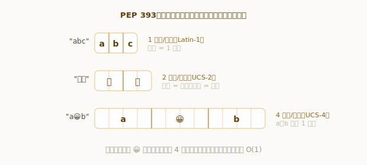
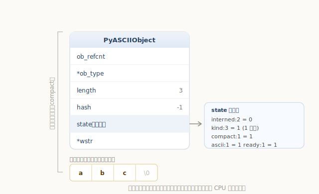
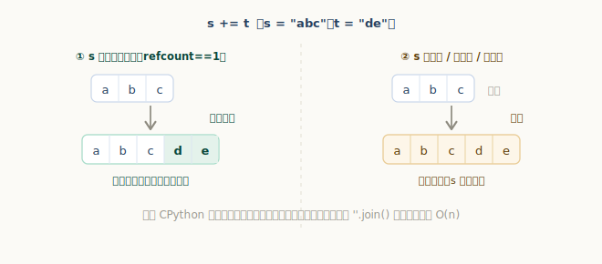
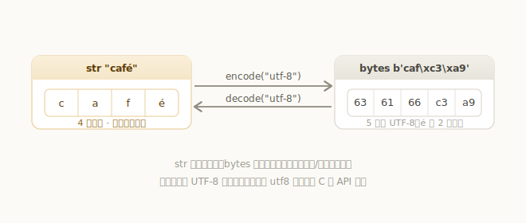
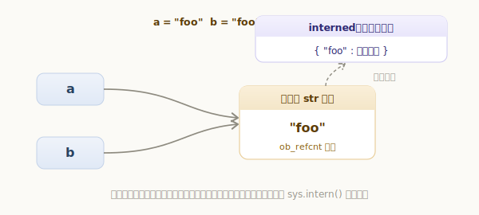

# Python 字符串对象

字符串是日常用得最多的类型之一。Python 3 的 `str` 有两个鲜明特点：它是**不可变**的，而且是**完整的 Unicode 序列**——能装下从英文字母到中文、再到 emoji 的任何字符。

```python
>>> s = "abc中文😀"
>>> len(s)        # 6 个「字符」（码点），而不是字节数
6
>>> s[3]          # 按下标取第 3 个字符，瞬间返回
'中'
```

这里藏着一个设计难题：Unicode 码点的范围是 U+0000 到 U+10FFFF。如果每个字符都用固定的 4 字节存，纯英文文本会浪费 3/4 的内存；如果用变长的 UTF-8 存，按下标取第 n 个字符又会退化成 O(n)（得从头数）。Python 3 的解法是 PEP 393 提出的**灵活字符串表示**。这一章我们就来看 `PyUnicodeObject` 是怎么实现的。

## 灵活的内部表示：PEP 393

PEP 393 的核心思想是：**看字符串里最宽的那个字符，整串统一用 1、2 或 4 字节来存每个字符**。

- 全是 ASCII / Latin-1 字符（U+0000–U+00FF）→ 每字符 **1 字节**；
- 含有 BMP 字符（最大到 U+FFFF，如多数汉字）→ 每字符 **2 字节**；
- 含有星位字符（U+10000 以上，如 emoji）→ 每字符 **4 字节**。

这套规则就写在创建字符串的 `PyUnicode_New` 里——它根据传入的 `maxchar`（串中最大码点）选择存储宽度：

`源文件：`[Objects/unicodeobject.c](https://github.com/python/cpython/blob/v3.7.0/Objects/unicodeobject.c#L1252)

```c
// Objects/unicodeobject.c —— PyUnicode_New
if (maxchar < 128) {
    kind = PyUnicode_1BYTE_KIND;  char_size = 1;  is_ascii = 1;   // 纯 ASCII
}
else if (maxchar < 256) {
    kind = PyUnicode_1BYTE_KIND;  char_size = 1;                  // Latin-1
}
else if (maxchar < 65536) {
    kind = PyUnicode_2BYTE_KIND;  char_size = 2;                  // BMP（UCS-2）
}
else {
    // maxchar <= 0x10FFFF
    kind = PyUnicode_4BYTE_KIND;  char_size = 4;                  // 全 Unicode（UCS-4）
}
```

这个 `kind`（1 / 2 / 4）是字符串表示的灵魂。它带来一个直接可观测的现象——同一个字符，放在不同的串里可能占不同的字节数：



我们可以用「每多一个字符增加多少字节」来反推 `char_size`：

```python
>>> import sys
>>> def per_char(s):
...     return sys.getsizeof(s * 2) - sys.getsizeof(s)
...
>>> per_char("a")     # 纯 ASCII
1
>>> per_char("中")    # BMP 汉字
2
>>> per_char("😀")    # 星位 emoji
4
```

注意 `kind` 由**最宽的字符**决定：哪怕只夹了一个 emoji，整串都会升到 4 字节。所以 `"a😀b"` 里本可用 1 字节存的 `a`、`b`，也按 4 字节存。

这套「定宽」存储的好处是，**按下标取字符是 O(1)**：第 `i` 个字符就在 `数据起始 + i × char_size` 处，一步算出地址。而且这里的「下标」是按**码点**算的，不是 UTF-8 字节、也不是 UTF-16 码元：

```python
>>> s = "a😀b"
>>> len(s)        # 3 个码点（UTF-16 下 😀 会算成 2，这里不会）
3
>>> s[1]          # 直接定位到第 1 个码点
'😀'
```

## 数据结构

字符串对象有三层结构，一层比一层多。最基础的是 `PyASCIIObject`：

`源文件：`[Include/unicodeobject.h](https://github.com/python/cpython/blob/v3.7.0/Include/unicodeobject.h#L271)

```c
// Include/unicodeobject.h
typedef struct {
    PyObject_HEAD
    Py_ssize_t length;     // 码点个数，即 len(s)
    Py_hash_t hash;        // 缓存的哈希值，-1 表示尚未计算
    struct {
        unsigned int interned:2;  // 驻留状态（见下）
        unsigned int kind:3;      // 字符宽度：1 / 2 / 4 字节
        unsigned int compact:1;   // 结构体与数据是否同在一块内存
        unsigned int ascii:1;     // 是否全为 ASCII
        unsigned int ready:1;     // 布局是否就绪
    } state;
    wchar_t *wstr;         // 兼容旧 wchar_t API 的表示
} PyASCIIObject;
```

短短几个字段里，`state` 这个**位域**最关键——它用几个比特就记下了字符串的全部「身份信息」：是否驻留、每字符几字节（`kind`）、是否 compact、是否纯 ASCII、布局是否就绪。

另外两层是在它基础上的扩展（非 ASCII 串会多出 UTF-8 缓存等字段）：

`源文件：`[Include/unicodeobject.h](https://github.com/python/cpython/blob/v3.7.0/Include/unicodeobject.h#L336)

```c
// Include/unicodeobject.h
typedef struct {
    PyASCIIObject _base;
    Py_ssize_t utf8_length;   // utf8 表示的字节数
    char *utf8;               // 按需缓存的 UTF-8 表示
    Py_ssize_t wstr_length;
} PyCompactUnicodeObject;

typedef struct {
    PyCompactUnicodeObject _base;
    union { void *any; Py_UCS1 *latin1; Py_UCS2 *ucs2; Py_UCS4 *ucs4; } data;
} PyUnicodeObject;
```

这里还有一个省内存的关键设计：**compact**。对于常见的字符串，CPython 把**对象头和字符数据放在同一块连续内存里**——`PyUnicode_New` 一次就申请 `结构体大小 + (字符数 + 1) × char_size` 的空间，字符数据紧跟在结构体后面（末尾留一个 `\0`）：

`源文件：`[Objects/unicodeobject.c](https://github.com/python/cpython/blob/v3.7.0/Objects/unicodeobject.c#L1293)

```c
// Objects/unicodeobject.c —— PyUnicode_New
obj = (PyObject *) PyObject_MALLOC(struct_size + (size + 1) * char_size);
```

这样只需一次内存分配（而不是「结构体一块、数据另一块」），而且数据紧挨着对象头，对 CPU 缓存更友好。以纯 ASCII 字符串 `"abc"` 为例，它的内存布局是这样的：



## 字符串的创建

我们在源码里写下的字符串字面量、或在 C 层从一个 C 字符串构造 `str`，最终都殊途同归——**解码**。看从 C 字符串创建字符串的入口：

`源文件：`[Objects/unicodeobject.c](https://github.com/python/cpython/blob/v3.7.0/Objects/unicodeobject.c#L2084)

```c
// Objects/unicodeobject.c
PyObject *
PyUnicode_FromStringAndSize(const char *u, Py_ssize_t size)
{
    ......
    if (u != NULL)
        return PyUnicode_DecodeUTF8Stateful(u, size, NULL, NULL);  // 把 UTF-8 字节解码成码点
    else
        return (PyObject *)_PyUnicode_New(size);
}
```

也就是说，「创建一个字符串」本质上是**把 UTF-8 字节解码成码点序列**，再由 `PyUnicode_New` 按 PEP 393 选好 `kind`、分配 compact 内存存进去。Python 源文件默认就是 UTF-8 编码，里面的字符串字面量也是这样被解码、构造出来的。

## 字符串的拼接

用 `+` 拼接两个字符串（`PyUnicode_Concat`）总是**新建**一个字符串。但 `s += t` 这种写法，CPython 藏了一个优化。

回想字符串是不可变的——可一旦某个字符串**只被唯一引用**（没人会察觉它被改动），原地修改就是安全的。`s += t` 正是利用了这点。先看 `s += t` 在虚拟机里的处理：

`源文件：`[Python/ceval.c](https://github.com/python/cpython/blob/v3.7.0/Python/ceval.c#L4977)

```c
// Python/ceval.c —— unicode_concatenate
if (Py_REFCNT(v) == 2) {
    /* 通常 += 时，这个字符串有 2 个引用：求值栈上一个、变量里一个。
       这里先把变量删掉，让引用计数降到 1。 */
    ......
    SETLOCAL(oparg, NULL);   // 删掉变量的引用
    ......
}
```

引用计数降到 1 后，`PyUnicode_Append` 就能走**原地追加**：

`源文件：`[Objects/unicodeobject.c](https://github.com/python/cpython/blob/v3.7.0/Objects/unicodeobject.c#L11262)

```c
// Objects/unicodeobject.c —— PyUnicode_Append
if (unicode_modifiable(left)            // 可原地修改吗？
    && PyUnicode_CheckExact(right)
    && PyUnicode_KIND(right) <= PyUnicode_KIND(left)
    && !(PyUnicode_IS_ASCII(left) && !PyUnicode_IS_ASCII(right)))
{
    /* append inplace —— 原地扩展，把 right 拷到 left 末尾 */
    if (unicode_resize(p_left, new_len) != 0) goto error;
    _PyUnicode_FastCopyCharacters(*p_left, left_len, right, 0, right_len);
}
else {
    ......                              // 否则：新建一个字符串
}
```

什么叫「可原地修改」？看 `unicode_modifiable` 的判断——必须**引用计数为 1、尚未算过哈希、未被驻留、是精确的 str 类型**：

`源文件：`[Objects/unicodeobject.c](https://github.com/python/cpython/blob/v3.7.0/Objects/unicodeobject.c#L1827)

```c
// Objects/unicodeobject.c
static int
unicode_modifiable(PyObject *unicode)
{
    if (Py_REFCNT(unicode) != 1)            return 0;  // 还有别人引用
    if (_PyUnicode_HASH(unicode) != -1)     return 0;  // 哈希已被缓存，改了会失效
    if (PyUnicode_CHECK_INTERNED(unicode))  return 0;  // 已驻留，是共享的
    if (!PyUnicode_CheckExact(unicode))     return 0;  // 子类，行为未知
    return 1;
}
```



**但请注意：这只是 CPython 的实现细节，并不保证触发**——只要字符串被多处引用、已经算过哈希、或被驻留，就会回退到新建。所以在循环里反复 `s += ...` 仍可能退化成 O(n²)。可靠的做法是把片段收集起来，最后用 `''.join()` 一次拼好：它会**先算出总长度、一次性分配**，再把各片段依次拷入，稳定 O(n)。

```python
>>> "-".join(["a", "b", "c"])
'a-b-c'
```

## 字符串的查找

`s.find(sub)`、`sub in s`、`s.replace(...)` 这些都依赖同一套子串查找。它们最终调用到 stringlib 的 **`FASTSEARCH`**：

`源文件：`[Objects/stringlib/fastsearch.h](https://github.com/python/cpython/blob/v3.7.0/Objects/stringlib/fastsearch.h#L5)

```c
// Objects/stringlib/fastsearch.h
/* fast search/count implementation, based on a mix between boyer-
   moore and horspool, with a few more bells and whistles on the top. */
```

它是 **Boyer-Moore / Horspool 的混合算法**：预处理模式串，匹配失败时根据「坏字符」一次性**跳过**一大段、而不是逐位回退；并用一个 **Bloom 过滤器**（位掩码）快速判断某个字符是否出现在模式串里，进一步加速跳跃。单字符查找则直接走 `memchr` 快路径。平均下来，查找远快于「逐位比对」的朴素做法。

```python
>>> "hello world".find("world")
6
>>> "world" in "hello world"
True
>>> "hello world".find("xyz")     # 找不到返回 -1
-1
```

## 编码与解码

`str` 存的是**码点**（内部按 PEP 393 定宽存储），而 `bytes` 存的是**字节**。两者之间靠 `encode` / `decode` 转换：



```python
>>> "café".encode("utf-8")          # str → bytes
b'caf\xc3\xa9'
>>> b"caf\xc3\xa9".decode("utf-8")  # bytes → str
'café'
>>> len("café"), len("café".encode("utf-8"))   # 码点数 vs 字节数
(4, 5)
```

`"café"` 有 4 个码点，编码成 UTF-8 是 5 个字节（`é` 占 2 字节）。前面 `PyUnicode_FromString` 创建字符串走的就是 `decode` 的反向。

C 层经常需要一个字符串的 UTF-8 表示（比如把字符串当文件名、传给操作系统）。为避免重复编码，CPython 会把 UTF-8 结果**缓存**到对象的 `utf8` 字段里，下次直接复用：

`源文件：`[Objects/unicodeobject.c](https://github.com/python/cpython/blob/v3.7.0/Objects/unicodeobject.c#L3781)

```c
// Objects/unicodeobject.c —— PyUnicode_AsUTF8AndSize
if (PyUnicode_UTF8(unicode) == NULL) {      // 尚未缓存
    ......                                   // 编码成 UTF-8
    _PyUnicode_UTF8(unicode) = ...;          // 存进 utf8 字段
}
return PyUnicode_UTF8(unicode);              // 返回缓存
```

对于纯 ASCII 字符串，ASCII 本身就是合法的 UTF-8，所以它的 `utf8` 直接和字符数据共享、无需另存——这也是 ASCII 字符串用最省的 `PyASCIIObject` 结构的原因之一。

## 字符串的驻留

先看一个常见现象：

```python
>>> a = "foo"
>>> b = "foo"
>>> a is b          # 两个 "foo" 竟是同一个对象
True
```

明明是两次写 `"foo"`，为什么 `a` 和 `b` 是同一个对象？这就是**字符串驻留（interning）**：CPython 维护一个全局的 `interned` 字典，把驻留过的字符串去重，等值的字符串只保留**一个**对象。

`源文件：`[Objects/unicodeobject.c](https://github.com/python/cpython/blob/v3.7.0/Objects/unicodeobject.c#L15174)

```c
// Objects/unicodeobject.c —— PyUnicode_InternInPlace
if (interned == NULL) {
    interned = PyDict_New();          // 全局唯一的驻留字典
    ......
}
t = PyDict_SetDefault(interned, s, s);  // 字典里已有等值串就返回它，否则存入 s
......
if (t != s) {
    Py_INCREF(t);
    Py_SETREF(*p, t);                 // 已存在 → 改用已有对象，丢弃 s
    return;
}
_PyUnicode_STATE(s).interned = SSTATE_INTERNED_MORTAL;  // 标记为已驻留
```

逻辑很直白：拿字符串去 `interned` 字典里查，已有等值的就复用那一个、丢弃新的；没有就存进去并打上驻留标记。



驻留的好处是**比较变快**：变量名、属性名、字典的字符串键……这些标识符在程序里反复出现，驻留后它们的相等比较可以直接比指针（同一对象），不必逐字符对比。所以 CPython 会**自动驻留**那些「长得像标识符」的字符串常量（只含字母、数字、下划线），上面的 `"foo"` 正是如此。

对于不会自动驻留的字符串（比如带空格、标点的），可以用 `sys.intern()` 手动驻留：

```python
>>> import sys
>>> sys.intern("hi there!") is sys.intern("hi there!")
True
```

> 和小整数池类似，`a = "foo"; b = "foo"` 这种演示也要留意**编译期常量折叠**：同一个代码块里相同的字面量可能本就被折叠成一个对象。要稳定地验证「驻留」本身，用 `sys.intern()` 最可靠。

## 不可变与哈希缓存

`str` 是**不可变**的——一旦创建，内容就不会变。这不是个限制，而是很多便利的前提：正因为不可变，等值的字符串才能放心地共享同一对象（驻留），字符串才能作为字典的键。

不可变还带来一个优化：**哈希只需算一次**。回看结构体里的 `hash` 字段，它初始为 -1；第一次求哈希时算出来并缓存进去，以后直接返回缓存值：

`源文件：`[Objects/unicodeobject.c](https://github.com/python/cpython/blob/v3.7.0/Objects/unicodeobject.c#L11572)

```c
// Objects/unicodeobject.c —— unicode_hash
if (_PyUnicode_HASH(self) != -1)
    return _PyUnicode_HASH(self);          // 已算过，直接返回缓存
......
x = _Py_HashBytes(PyUnicode_DATA(self),
                  PyUnicode_GET_LENGTH(self) * PyUnicode_KIND(self));
_PyUnicode_HASH(self) = x;                 // 算一次，存进 hash 字段
return x;
```

字符串频繁用作字典键、集合元素，哈希被反复用到，这个缓存省下了大量重复计算。

---

小结一下字符串对象的要点：

- `str` 是不可变的 Unicode 序列，内部采用 PEP 393 的**灵活表示**：按串中最宽的字符，统一用 **1 / 2 / 4 字节**存每个字符，既省内存又让按下标取字符保持 **O(1)**；
- 结构上以 `PyASCIIObject` 为基础逐层扩展，`state` 位域记录 `kind`、`ascii`、`compact`、`interned` 等身份信息；常见字符串采用 **compact** 布局，对象头与字符数据共用一块内存；
- **创建**字符串本质是把 UTF-8 字节**解码**成码点；**编码/解码**在 `str`（码点）与 `bytes`（字节）间转换，UTF-8 结果会缓存到 `utf8` 字段；
- **拼接**：`+` 总是新建；`s += t` 在唯一引用时可原地扩展（CPython 实现细节，不保证），循环拼接应用 `''.join()` 获得稳定 O(n)；
- **查找**用 stringlib 的 `FASTSEARCH`（Boyer-Moore / Horspool 混合 + Bloom 过滤器），靠跳跃式匹配远快于逐位比对；
- **驻留**机制让等值字符串（尤其是标识符）共享同一对象，使比较可走指针相等；
- 不可变性使字符串可被驻留、可作字典键，并让**哈希得以缓存**（`hash` 字段，初始 -1）。
