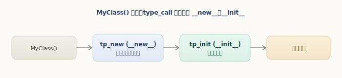
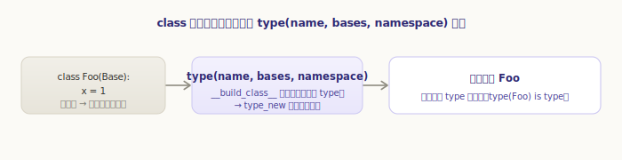
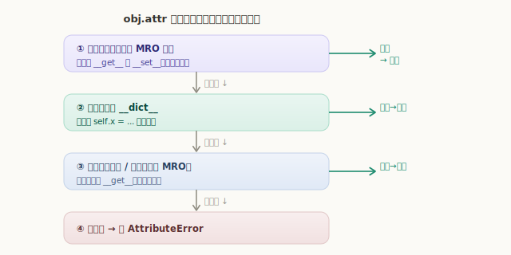
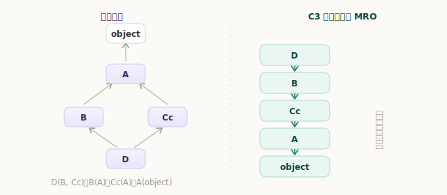
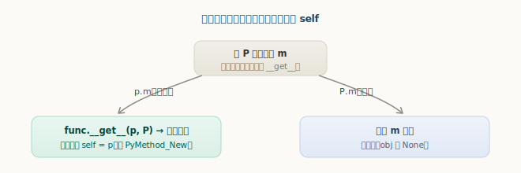

# Python 类型对象与自定义类

[《Python 对象初探》](../object/)里我们认识了类型对象 `PyTypeObject`，也知道了「类型的类型」是元类 `type`。这一章我们深入到日常最常打交道、却也最多困惑的地方：**`class` 和实例到底是怎么工作的**——实例怎么创建、类怎么创建、`obj.attr` 是怎么找到的、`self` 从哪来、`@property` 凭什么生效、`super()` 怎么找到方法。这些问题的答案，都藏在类型对象的机制里。

## 实例的创建：`MyClass()` 背后

当你写下 `MyClass()`，调用的其实是类型对象的 `tp_call`（即 `type_call`）。它分两步：先 `tp_new` 分配出一个新对象，再 `tp_init` 初始化它——正对应 Python 里的 `__new__` 和 `__init__`：

`源文件：`[Objects/typeobject.c](https://github.com/python/cpython/blob/v3.7.0/Objects/typeobject.c#L911)

```c
// Objects/typeobject.c —— type_call
obj = type->tp_new(type, args, kwds);    // ① __new__：分配并返回新对象
......
type = Py_TYPE(obj);
if (type->tp_init != NULL) {
    int res = type->tp_init(obj, args, kwds);   // ② __init__：初始化
    ......
}
return obj;
```



```python
>>> class T:
...     def __new__(cls):  print("__new__ 分配");  return super().__new__(cls)
...     def __init__(self): print("__init__ 初始化")
...
>>> T()
__new__ 分配
__init__ 初始化
```

`__new__` 负责「造出对象」（少见地需要重写，比如不可变类型、单例），`__init__` 负责「填好属性」（最常重写的那个）。

## 类的创建：`class` 语句背后

那「类」本身又是怎么来的？`class` 语句会被编译器翻译成对内建函数 `__build_class__` 的调用：先执行类体得到一个命名空间字典，再调用**元类**（默认就是 `type`），以 `type(名字, 基类元组, 命名空间)` 创建出类型对象。

`源文件：`[Python/bltinmodule.c](https://github.com/python/cpython/blob/v3.7.0/Python/bltinmodule.c#L128) · [Objects/typeobject.c](https://github.com/python/cpython/blob/v3.7.0/Objects/typeobject.c#L2346)（`type_new`）



这意味着：**类就是 `type` 的实例**。你甚至可以绕过 `class` 语句，直接用 `type()` 三参数形式手动造一个类：

```python
>>> C = type('C', (object,), {'x': 1})   # 等价于 class C: x = 1
>>> C.x, C().x
(1, 1)
>>> type(C) is type, isinstance(C, type)
(True, True)
```

`class` 语句只是这件事的语法糖。理解了「类是 type 造出来的对象」，元类、`__init_subclass__` 这些高级特性就有了根基。

## 属性查找：实例、类与描述符

`obj.attr` 看似简单，背后却有一套**严格的优先级**。它由 `_PyObject_GenericGetAttrWithDict`（即 `object.__getattribute__`）实现：

`源文件：`[Objects/object.c](https://github.com/python/cpython/blob/v3.7.0/Objects/object.c#L1161)

```c
// Objects/object.c —— _PyObject_GenericGetAttrWithDict（精简）
descr = _PyType_Lookup(tp, name);        // 在类型的 MRO 里找 name
f = NULL;
if (descr != NULL) {
    f = descr->ob_type->tp_descr_get;
    if (f != NULL && PyDescr_IsData(descr)) {       // ① 数据描述符（有 __get__ 且有 __set__）
        return f(descr, obj, (PyObject *)obj->ob_type);   //    优先级最高，直接调 __get__
    }
}
if (dict != NULL) {                                  // ② 实例自己的 __dict__
    res = PyDict_GetItem(dict, name);
    if (res != NULL) return res;
}
if (f != NULL) {                                     // ③ 非数据描述符（只有 __get__）
    return f(descr, obj, (PyObject *)Py_TYPE(obj));
}
if (descr != NULL) return descr;                     // ③ 普通类属性
...                                                  // ④ 都没有 → AttributeError
```

把这个顺序记牢，几乎所有「属性从哪来」的疑惑都能解开：



**数据描述符（类 MRO） > 实例 `__dict__` > 非数据描述符 / 类属性（类 MRO） > AttributeError**。

「数据描述符优先于实例字典」这一条尤其关键——它正是 `@property` 能「拦截」属性访问的原因。哪怕实例字典里有同名的键，也会被 property 压过去：

```python
>>> class Q:
...     @property
...     def v(self): return "来自 property"
...
>>> q = Q()
>>> q.__dict__['v'] = "来自实例字典"   # 强行往实例字典塞一个 v
>>> q.v                                # 仍然走 property（数据描述符优先）
'来自 property'
```

## MRO 与多继承：C3 线性化

上面反复出现「在类型的 MRO 里找」。**MRO（Method Resolution Order，方法解析顺序）**就是把一个类的所有祖先排成一条线，属性查找沿这条线依次进行。多继承下，这条线由 **C3 线性化**算法算出，保证顺序既符合继承关系、又无歧义：

`源文件：`[Objects/typeobject.c](https://github.com/python/cpython/blob/v3.7.0/Objects/typeobject.c#L1750)（`mro_implementation`）



```python
>>> class A: pass
>>> class B(A): pass
>>> class Cc(A): pass
>>> class D(B, Cc): pass
>>> [c.__name__ for c in D.__mro__]
['D', 'B', 'Cc', 'A', 'object']
```

`super()` 也正是沿着 MRO 找「下一个」类的方法，所以多继承下 `super()` 的行为要看 MRO 而非简单的「父类」。

## 描述符：方法、property 背后的机制

前面多次提到「描述符」。一个对象只要实现了 `__get__`，就是**描述符**；按是否还实现 `__set__`/`__delete__`，分为：

- **数据描述符**：有 `__set__`（或 `__delete__`）。如 `property`。优先级高于实例字典。
- **非数据描述符**：只有 `__get__`。如**普通函数**。优先级低于实例字典。

最重要的一个事实：**类里定义的函数就是非数据描述符**。当你在实例上访问 `p.m`，触发函数的 `__get__`（`func_descr_get`），它返回一个把函数和实例绑在一起的**绑定方法**——`self` 就是这么来的：

`源文件：`[Objects/funcobject.c](https://github.com/python/cpython/blob/v3.7.0/Objects/funcobject.c#L583)

```c
// Objects/funcobject.c —— func_descr_get
static PyObject *
func_descr_get(PyObject *func, PyObject *obj, PyObject *type)
{
    if (obj == Py_None || obj == NULL) {
        Py_INCREF(func);
        return func;            // 在类上访问 → 返回函数本身
    }
    return PyMethod_New(func, obj);   // 在实例上访问 → 绑定方法（带上 self=obj）
}
```



```python
>>> class P:
...     def m(self): pass
...
>>> p = P()
>>> type(p.m), hasattr(p.m, '__self__')    # 实例访问：绑定方法，带 __self__
(<class 'method'>, True)
>>> type(P.m)                               # 类访问：就是个函数
<class 'function'>
```

`@property`、`@classmethod`、`@staticmethod` 全都是描述符的应用——它们只是实现了不同的 `__get__`/`__set__`，从而改变属性访问的行为。

## `__slots__`：去掉实例字典

默认情况下，每个实例都带一个 `__dict__`（实例字典）来存属性，灵活但占内存。如果一个类的属性是固定的，可以用 `__slots__` 声明它们——这样实例就**不再有 `__dict__`**，属性直接存在对象的固定槽位里，省内存（对应 `tp_dictoffset` 为 0）：

```python
>>> class S:
...     __slots__ = ('a',)
...
>>> s = S(); s.a = 1
>>> hasattr(s, '__dict__')      # 没有实例字典了
False
>>> s.b = 2                     # 也不能再随意加新属性
Traceback (most recent call last):
  ...
AttributeError: 'S' object has no attribute 'b'
```

大量小对象（如几百万个固定字段的记录）用 `__slots__` 能显著省内存。代价是失去了动态加属性的灵活性。

## 元类：类的类

最后回到开头那句话：**类是 `type` 的实例**，而 `type` 就是默认的**元类**。元类之于类，正如类之于实例——类控制实例怎么创建，元类控制类怎么创建。

```python
>>> type(int), type(P), type(type)
(<class 'type'>, <class 'type'>, <class 'type'>)
```

自定义元类（继承 `type`、重写 `__new__`/`__init__`）可以在「类被创建时」插手——做属性校验、自动注册、改写类体等。这是框架（如 ORM、序列化库）常用的高级手段。日常开发未必需要，但理解了「类也是对象、由元类创建」，这扇门就向你打开了。

---

小结一下类型机制：

- `MyClass()` 由 `type_call` 驱动：先 `tp_new`（`__new__`，分配）再 `tp_init`（`__init__`，初始化）；
- `class` 语句是语法糖，最终调用元类 `type(名字, 基类, 命名空间)` 造出类型对象——**类是 `type` 的实例**；
- `obj.attr` 的查找有严格优先级：**数据描述符 > 实例 `__dict__` > 非数据描述符/类属性 > AttributeError**，沿类型的 **MRO**（C3 线性化）进行；
- **描述符**是这套机制的核心：函数作为非数据描述符，在实例上访问时绑定 `self`；`property`/`classmethod` 等都是描述符；
- `__slots__` 去掉实例字典以省内存；**元类**控制类的创建，是「类也是对象」的自然延伸。
