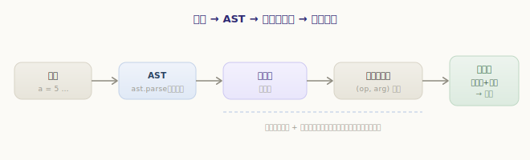
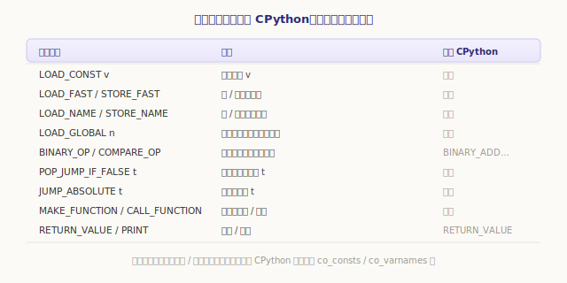
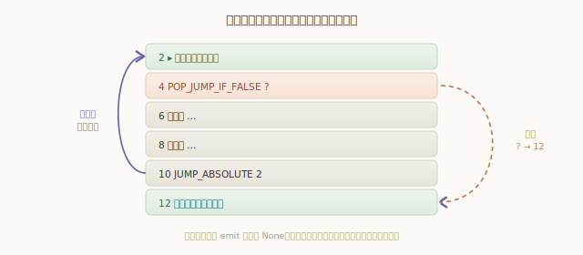
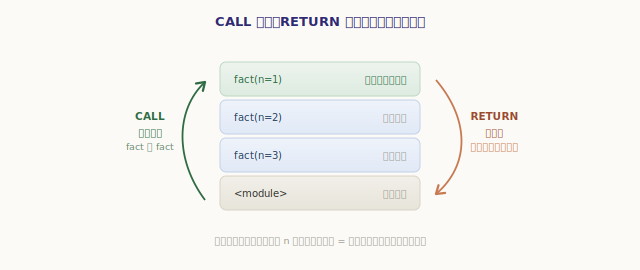

# 动手：用 Python 写一个迷你 Python 虚拟机

读完前面六部分，我们把 CPython 的对象、编译、虚拟机、运行时、内存管理都拆开看了一遍。但「看懂」和「写得出」之间还隔着一层。这一章是全书的**实战 capstone**：我们用大约 300 行 Python，亲手实现一个**迷你 Python 虚拟机**——它能把一小段 Python **编译成字节码**，再用一个**求值循环**逐条执行，连**函数调用与递归**（帧栈）都支持。

更妙的是,**它就在你的浏览器里跑**:页面底部的交互组件通过 WebAssembly（Pyodide）把真正的 Python 运行环境搬进了网页,你写的代码会被我们的迷你虚拟机**单步执行**,求值栈、局部变量、调用栈的每一步变化都看得见。整章没有服务端,纯静态。

## 总览：一条和 CPython 同构的流水线

我们的迷你虚拟机走的是和 CPython **一模一样**的路子，只是每一环都简化到「够教学」的程度：



1. **源码 → AST**：借用 Python 自带的 `ast.parse`，把源码解析成抽象语法树（第三部分讲过 CPython 也是这么干的）；
2. **AST → 玩具字节码**：我们写一个**编译器**遍历 AST，吐出自定义的指令序列；
3. **字节码 → 求值循环**：我们写一个**虚拟机**，用一个大循环 + 帧栈逐条执行指令、操作求值栈；
4. **输出**：`print` 的结果。

唯一「偷懒」的是第 1 步借用了 `ast`——因为词法/语法分析不是本书重点。从 AST 往后的**编译**与**执行**，全是我们自己写的，也正是前几部分的核心。

## 设计指令集：玩具版对照 CPython

先定指令集。我们刻意模仿 CPython 的栈式指令，但只保留最核心的十几条。为了**直观**，玩具字节码把名字和常量**直接内联**在参数里（真实 CPython 用下标去 `co_consts`/`co_varnames` 查表，第三部分见过）：



每条指令就是一个 `(op, arg)` 二元组，承载它的容器是 `Code`——对应 CPython 的 code object：

```python
# minivm.py —— 一段可执行的字节码（模块体，或一个函数体）
class Code:
    def __init__(self, name, params=()):
        self.id = _new_id()
        self.name = name
        self.params = list(params)   # 形参名
        self.instrs = []             # [[op, arg], ...]

    def emit(self, op, arg=None):
        self.instrs.append([op, arg])
        return len(self.instrs) - 1  # 返回这条指令的位置（跳转回填要用）
```

## 编译器：把 AST 翻译成字节码

编译器是一个遍历 AST 的访问器。**表达式**编译成「把值压上求值栈」的指令，**语句**编译成「产生副作用」的指令。先看表达式——这正是第四部分求值栈那一套的逆向（生成端）：

```python
# minivm.py —— 表达式编译（节选）
def compile_expr(self, e):
    if isinstance(e, ast.Constant):
        self.code.emit("LOAD_CONST", e.value)        # 常量 → 压栈
    elif isinstance(e, ast.Name):
        self.load_name(e.id)                          # 变量 → 压栈
    elif isinstance(e, ast.BinOp):
        self.compile_expr(e.left)                     # 先算左
        self.compile_expr(e.right)                    # 再算右
        self.code.emit("BINARY_OP", BINOPS[type(e.op)])  # 弹二压一
    elif isinstance(e, ast.Compare):
        self.compile_expr(e.left)
        self.compile_expr(e.comparators[0])
        self.code.emit("COMPARE_OP", CMPOPS[type(e.ops[0])])
    elif isinstance(e, ast.Call):
        self.compile_call(e)
    ...
```

`a + b * 2` 会被编译成 `LOAD a / LOAD b / LOAD_CONST 2 / BINARY_OP * / BINARY_OP +`——后缀顺序，正好喂给栈式机求值。赋值语句则是「算出值，再存进名字」：

```python
# minivm.py —— 赋值语句
if isinstance(s, ast.Assign):
    self.compile_expr(s.value)                # 算出右边的值（压栈）
    self.store_name(s.targets[0].id)          # 弹栈，存进左边的名字
```

### 控制流：跳转回填

`if` 和 `while` 编译成**条件跳转 + 无条件跳转**（第四部分控制流章的核心）。难点在于：编译 `if` 的条件时，我们还**不知道** else 分支在哪——它的地址要等后面的指令都生成完才确定。办法是先 `emit` 一条**占位**的跳转，记下它的位置，等目标地址确定后再**回填**：



```python
# minivm.py —— 编译 while（跳转回填）
def compile_while(self, s):
    start = len(self.code.instrs)                       # 循环顶部
    self.compile_expr(s.test)                           # 算条件
    jmp_end = self.code.emit("POP_JUMP_IF_FALSE", None) # 占位：条件假→跳出
    self.compile_stmts(s.body)                          # 循环体
    self.code.emit("JUMP_ABSOLUTE", start)              # 往回跳，重来一轮
    self.code.instrs[jmp_end][1] = len(self.code.instrs)  # 回填：循环出口地址
```

注意末尾那行——循环体编译完了，循环出口的地址（`len(self.code.instrs)`）才确定，这时回头把占位的 `None` 改成真实地址。`if/else` 同理，只是回填两处（else 落点 + 汇合点）。

## 函数与帧栈：CALL / RETURN

最有意思的部分来了——**函数**。`def` 编译成「造一个函数对象、存进名字」；调用编译成「压函数、压实参、`CALL_FUNCTION`」：

```python
# minivm.py —— def 与调用
def compile_funcdef(self, s):
    params = [arg.arg for arg in s.args.args]
    fcode = Code(s.name, params)                        # 函数体单独编译成一个 Code
    local = set(params) | assigned_names(s.body)        # 作用域分析：哪些名字是局部
    Compiler(fcode, "function", local).compile_stmts(s.body)
    fcode.emit("LOAD_CONST", None); fcode.emit("RETURN_VALUE")  # 隐式 return None
    self.code.emit("MAKE_FUNCTION", fcode)              # 造函数对象，压栈
    self.store_name(s.name)
```

这里藏着第四部分讲过的**作用域**：函数体里赋值过的名字（含形参）是**局部**，用 `LOAD_FAST`/`STORE_FAST`；其余名字（比如调用别的函数、递归调用自己）是**全局**，用 `LOAD_GLOBAL`——一个迷你版的 LEGB。

执行时，每次 `CALL_FUNCTION` 都**新建一个帧**压入帧栈，`RETURN_VALUE` 则弹出帧、把返回值交还调用者。这正是第四部分「帧与求值循环」的核心——**当前活动的永远是帧栈顶那个帧**：



```python
# minivm.py —— 虚拟机里处理调用与返回（节选）
elif op == "CALL_FUNCTION":
    args = [f.stack.pop() for _ in range(argc)][::-1]   # 弹出实参
    func = f.stack.pop()                                 # 弹出函数对象
    new_locals = dict(zip(func.params, args))            # 形参 ← 实参
    frames.append(Frame(func, new_locals, glob, "function"))  # 压入新帧

elif op == "RETURN_VALUE":
    retval = f.stack.pop()
    frames.pop()                                         # 弹出当前帧
    if frames:
        frames[-1].stack.append(retval)                 # 返回值交还调用者
```

递归（`fact`、`fib`）就这样自然成立——同一个函数的多次调用各有各的帧、各有各的局部变量，在帧栈上层层叠起、又层层退回。

## 虚拟机：一个大循环

把这一切驱动起来的，是那个我们已经无比熟悉的结构——**一个大循环 + 一个大 dispatch**，逐条「取指令 → 前进指针 → 执行」，直到帧栈空：

```python
# minivm.py —— 求值循环骨架（节选）
while frames:
    f = frames[-1]                          # 当前帧 = 帧栈顶
    if f.pc >= len(f.code.instrs):          # 当前帧跑完了
        ... # 函数帧→返回 None；模块帧→整个程序结束
    record(frames, output)                  # 记录这一步的快照（给可视化用）
    op, arg = f.code.instrs[f.pc]
    f.pc += 1                               # 先前进，跳转指令会再改写
    if   op == "LOAD_CONST":   f.stack.append(arg)
    elif op == "LOAD_FAST":    f.stack.append(f.locals[arg])
    elif op == "BINARY_OP":    b = f.stack.pop(); a = f.stack.pop(); f.stack.append(_binop(arg, a, b))
    elif op == "POP_JUMP_IF_FALSE":
        if not _truthy(f.stack.pop()): f.pc = arg
    ... # 其余指令
```

是不是和第四部分 `_PyEval_EvalFrameDefault` 的骨架如出一辙？这就是本书反复强调的：虚拟机的心脏，从来就是「取指令 → 派发 → 操作求值栈 → 再取下一条」。那行 `record(...)` 是我们额外加的——它把每一步的帧栈状态**快照**下来，串成一条轨迹，正是下面交互组件能「单步回放」的原因。

## 跑起来：单步看它执行

下面就是这台迷你虚拟机的**活体**。选一个示例（或自己改代码），点「编译并运行」，然后用「下一步」**单步**走——盯着右边：求值栈怎么压怎么弹、局部变量何时写入、调用栈在递归时怎么一层层叠起又退回。

> 首次点击会从 CDN 加载 Python 运行环境（Pyodide，约数 MB），请稍候片刻；之后即可流畅交互。

<ClientOnly>
  <MiniVM />
</ClientOnly>

建议试试这几件事，把前几部分的知识对应起来：

- 跑「**while 累加**」，单步看 `JUMP_ABSOLUTE` 如何**往回跳**形成循环（对应控制流章）；
- 跑「**递归阶乘**」，看**调用栈**随 `fact(5)→fact(4)→…` 一层层**压起来**，到达基准情形后又一层层**退回**、把返回值交还上一层（对应帧与函数机制章）；
- 跑「**递归 Fibonacci**」，感受同一个函数的不同调用各有独立的帧与局部变量。

## 旁注：看看真实的 CPython 字节码

我们的玩具指令集是简化版。真实 CPython 的字节码可以用标准库 `dis` 直接看——你会发现两者**形神俱似**：

```python
>>> import dis
>>> def f(n):
...     return n * 2
>>> dis.dis(f)
  2           0 LOAD_FAST                0 (n)
              2 LOAD_CONST               1 (2)
              4 BINARY_MULTIPLY
              6 RETURN_VALUE
```

`LOAD_FAST`、`LOAD_CONST`、`RETURN_VALUE`——这些名字我们刚刚都亲手实现过。区别只在于：真实版用**下标**（`0`、`1`）去 `co_varnames`/`co_consts` 查表，而我们为了直观把名字和常量内联了；真实版还有上百条指令、`EXTENDED_ARG`、以及 3.11+ 的内联缓存等优化。但「栈式 + 取指派发」的内核，与你刚跑通的这台迷你虚拟机**完全一致**。

## 小结与扩展

这一章我们用 ~300 行 Python 把全书的主线**亲手走了一遍**：

- **编译**：`ast.parse` 得到 AST，编译器把表达式翻成「压栈」指令、语句翻成「副作用」指令，`if/while` 用**跳转回填**生成条件/无条件跳转；
- **执行**：一个**大循环 + dispatch**逐条执行，操作**求值栈**；
- **函数**：`MAKE_FUNCTION`/`CALL_FUNCTION`/`RETURN_VALUE` + **帧栈**支撑了调用与递归，作用域分析区分 `LOAD_FAST`/`LOAD_GLOBAL`；
- 这套结构与 CPython 的 `compile.c` + `ceval.c` **同构**，只是处处从简。

想继续深入，这些都是很好的练习（难度递增）：

1. **字符串与列表**：让 `LOAD_CONST` 支持字符串，新增 `BUILD_LIST`/`BINARY_SUBSCR`；
2. **`break`/`continue`**：在 `while` 里用跳转实现（回顾控制流章的 block 栈思路）；
3. **`and`/`or` 短路**：编译成条件跳转；
4. **闭包**：让函数能捕获外层局部变量——这要引入 cell 与 `LOAD_DEREF`，正是第四部分「函数机制：闭包」讲的那套；
5. **异常**：`try/except` 与栈展开，对应「异常机制」章。

每一项，回到对应章节都能找到 CPython 的「标准答案」。至此，从读源码到写实现，这趟旅程画上句号——愿你眼中的 Python，已经从一门「会用的语言」，变成了一台「看得见内部齿轮转动的机器」。

---

## 完整源码

上面的片段都摘自同一个文件 `minivm.py`，也正是交互组件里实际运行的那份代码（单一事实来源）。它还带一个命令行入口，把文件下载下来即可**在本地直接运行**：

```console
$ python minivm.py              # 进入交互式 REPL，边敲边执行
迷你 Python 虚拟机 · 交互式 REPL
>>> 1 + 2 * 3
7
>>> def sq(n):
...     return n * n
...
>>> print(sq(9))
81

$ python minivm.py demo.py      # 直接运行一个脚本文件
```

完整源码列在这里：

<<< @/practice/mini-vm/minivm.py{python}
