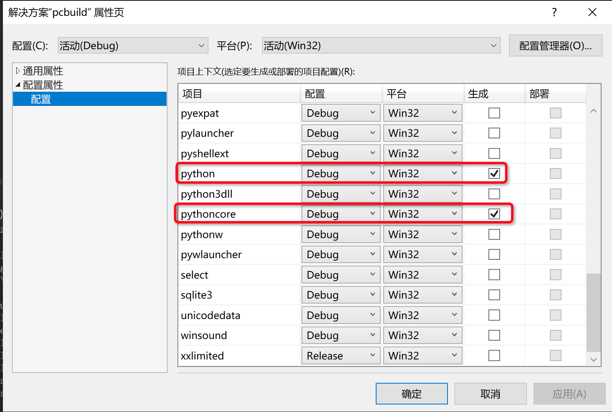

# Windows 环境下编译 Python

在 Windows 环境下编译 Python 可完全通过界面操作，主要分为两个步骤：

1. 环境准备
2. 编译

## 环境准备

在 Python 3.6 及之后的版本可以使用微软的
[Visual Studio 2017](https://visualstudio.microsoft.com/zh-hans/vs/) 进行编译，选择社区版就足够了。

在下载完成后，需要注意安装环节的选项。由于 Python 3.7 所使用的 Windows SDK 的版本为 `10.0.17134.0`，
所以需要选择安装该 SDK，如下图所示：

## 编译

进入 Python 源码根目录，打开 `PCbuild\pcbiuld.sln` 解决方案，而后进行一些设置：

在左侧的解决方案目录的顶端，右键选择“属性”，以打开属性界面（如下图所示）

由于我们只是研究 Python 的核心部分，可以选择不编译标准库和外部依赖，在“配置属性”->“配置”中仅勾选
python 和 pythoncore，然后点击“确定”（如下图所示）。

此外，默认情况下的编译设置是 Debug、32 位，您也可以根据自己的需求调整成 Release 或 64 位。

在左侧的解决方案目录中选择 python，右键选择“生成”，以进行编译：

编译结束后，生成的文件存放在`PCbuild\win32`目录下（如下图所示），打开`python_d`即可打开新生成的 Python 3.7 解释器。

## 更多内容
更多关于在 Windows 上进行编译和开发 Python 的内容见[官方指南](https://devguide.python.org/setup/#windows-compiling)
